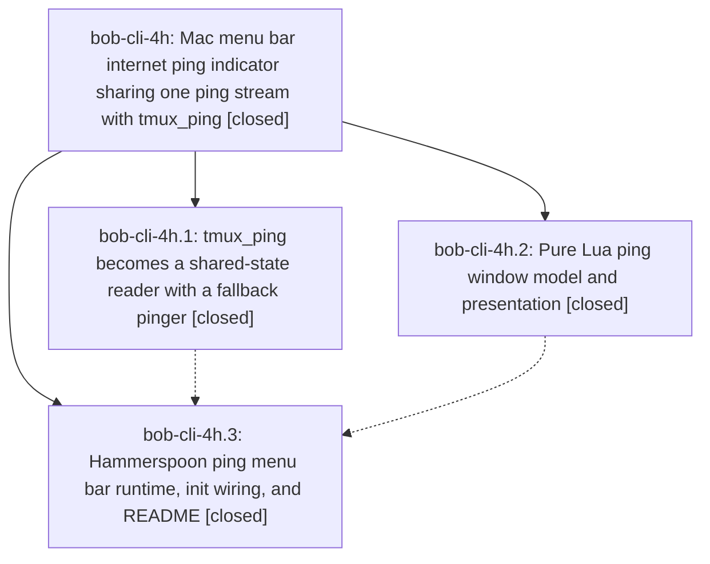

# Bead: bob-cli-4h — Mac menu bar internet ping indicator sharing one ping stream with tmux\_ping

[Bead Pages](../README.md) / bob-cli-4h

**Status:** ✓ closed · **Resolution:** done · **Type:** ▸ plan · **Tier:** epic
**Owner:** `bryanbugyi34@gmail.com` · **Created by:** [bbugyi200.apollo.57](https://github.com/bobs-org/bob-cli--agents/blob/main/sessions/bbugyi200.apollo.57.md) · **Assignee:** `bob-cli-4h.land`
**Created:** 2026-10-05 11:59:42 EDT · **Closed:** 2026-10-05 12:33:23 EDT
**Plan:** [202610/mac\_menu\_bar\_ping\_indicator.md](https://github.com/bobs-org/bob-cli--plans/blob/main/202610/mac_menu_bar_ping_indicator.md)

## Description

The MacBook menu bar shows the same last-20 ping count as the tmux status bar, styled as a sibling of the Pomodoro item, while a single shared ping stream feeds both displays: never more than one ping to 8.8.8.8 every 2 s, and none while the Mac is locked.

## Notes

[2026-10-05T16:33:23Z · bob-cli-4h.land] Verified the epic is complete and integrated.

Children, all closed, notes addressed in the landed chezmoi tree (HEAD e48f04f6 = origin/master):
- bob-cli-4h.1 (331f0729): tmux_ping is a bash 3.2 shared-state reader with a flock fallback pinger. It does not source bugyi.sh, defers while a Hammerspoon heartbeat is under 6s, and renders the shared stale/offline/down/lossy/online tiers. 32/32 tmux_ping tests pass.
- bob-cli-4h.2 (69fe995d): ping_window.lua is hs-free and implements parse/serialize, the 40s gap reset and 20-trim, classification, U+2007 counts, RTT parsing, and the dropdown model. Its constants match tmux_ping.
- bob-cli-4h.3 (e48f04f6): ping_indicator.lua owns the 2s producer, pause-while-locked, heartbeat claims, styled menu-bar title, and lazy dropdown. init.lua calls start() inside xpcall after Pomodoro and before the config watcher. init_spec covers start-once and a throwing start. README has the Internet ping menu bar section.

Re-checked on this tree: busted tests/hammerspoon 105/105, bashunit tests/bash 255/255, bash -n clean, stylua --check clean, prettier --check README clean. shellcheck is not installed. just symvision is not a recipe in this workspace; sase bead epic-symbols bob-cli-4h listed no entries.

Integration: the only commits since the epic was created (2026-10-05 11:59 EDT) are those three stitches. 0f6115a0 is the parent of 69fe995d. The same-day Pomodoro flash change was already on master, and init.lua still installs that runtime before the guarded ping start. Nothing later needs to adopt the shared stream.

Follow-ups: no child note contains PROPOSED FOLLOW-UP, so no task beads were filed. Dropdown rows are plain strings, which ping_indicator_spec asserts and which matches the Pomodoro dropdown; the menu-bar title carries the tier styles. That is the landed behavior, not a separate task.

No parent bead.

## Phases

| Bead | Title | Status | Size | Created | Agents | Commits |
|---|---|---|---|---|---:|---:|
| [bob-cli-4h.1](bob-cli-4h.1.md) | tmux\_ping becomes a shared-state reader with a fallback pinger | ✓ closed | medium | 2026-10-05 | 1 | 1 |
| [bob-cli-4h.2](bob-cli-4h.2.md) | Pure Lua ping window model and presentation | ✓ closed | medium | 2026-10-05 | 1 | 1 |
| [bob-cli-4h.3](bob-cli-4h.3.md) | Hammerspoon ping menu bar runtime, init wiring, and README | ✓ closed | medium | 2026-10-05 | 1 | 1 |

## Lineage

## Agents

| Agent | Bead | Commits |
|---|---|---:|
| [bbugyi200.apollo.bob-cli-4h.1](https://github.com/bobs-org/bob-cli--agents/blob/main/agents/bbugyi200.apollo.bob-cli-4h.1/README.md) | [bob-cli-4h.1](bob-cli-4h.1.md) | 1 |
| [bbugyi200.apollo.bob-cli-4h.2](https://github.com/bobs-org/bob-cli--agents/blob/main/agents/bbugyi200.apollo.bob-cli-4h.2/README.md) | [bob-cli-4h.2](bob-cli-4h.2.md) | 1 |
| [bbugyi200.apollo.bob-cli-4h.3](https://github.com/bobs-org/bob-cli--agents/blob/main/agents/bbugyi200.apollo.bob-cli-4h.3/README.md) | [bob-cli-4h.3](bob-cli-4h.3.md) | 1 |
| [bbugyi200.apollo.bob-cli-4h.land](https://github.com/bobs-org/bob-cli--agents/blob/main/agents/bbugyi200.apollo.bob-cli-4h.land/README.md) | [bob-cli-4h](README.md) | 1 |

## Commits

| Repo | Commit | Subject | Bead | Committed |
|---|---|---|---|---|
| chezmoi | [`chezmoi@69fe995`](https://github.com/bbugyi200/dotfiles/commit/69fe995d423f9d1c21ccc525ad64016ace5d86b0) | feat(hammerspoon): add ping\_window model for ping menubar phase | [bob-cli-4h.2](bob-cli-4h.2.md) | 2026-10-05 12:05:56 EDT |
| chezmoi | [`chezmoi@331f072`](https://github.com/bbugyi200/dotfiles/commit/331f0729f6701e9a341bf5023a1951d0ecbb2522) | feat(tmux): tmux\_ping reads shared ping state with fallback pinger | [bob-cli-4h.1](bob-cli-4h.1.md) | 2026-10-05 12:11:53 EDT |
| chezmoi | [`chezmoi@e48f04f`](https://github.com/bbugyi200/dotfiles/commit/e48f04f6f588f96741232e5a556efedf057d37ee) | feat(ping): Hammerspoon ping menu bar runtime, init wiring, and README | [bob-cli-4h.3](bob-cli-4h.3.md) | 2026-10-05 12:23:00 EDT |
| bob-cli--plans | [`bob-cli--plans@5352e9e`](https://github.com/bobs-org/bob-cli--plans/commit/5352e9edb81d4c6b3101f3a3761a1f999698920e) | docs(plans): mark bob-cli-4h complete | [bob-cli-4h](README.md) | 2026-10-05 12:34:38 EDT |
