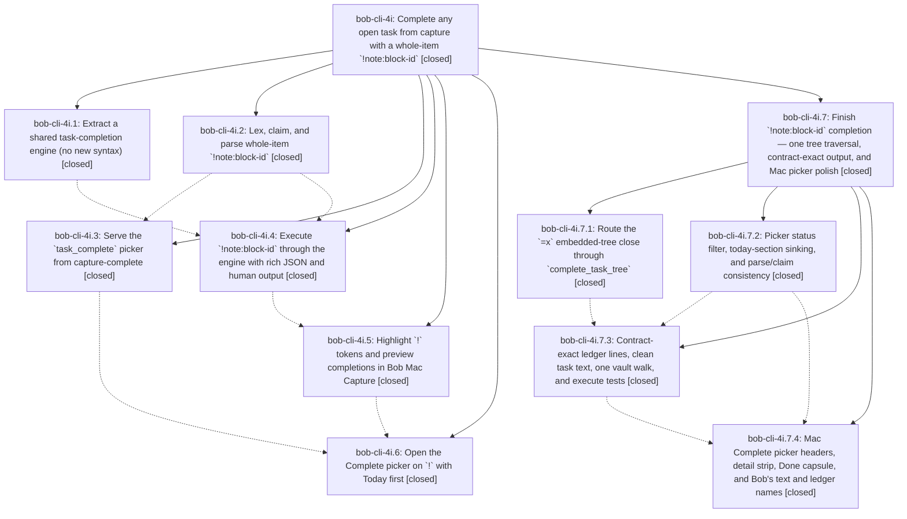

# Bead: bob-cli-4i — Complete any open task from capture with a whole-item \`!note:block-id\`

[Bead Pages](../README.md) / bob-cli-4i

**Status:** ✓ closed · **Resolution:** done · **Type:** ▸ plan · **Tier:** epic
**Owner:** `bryanbugyi34@gmail.com` · **Created by:** [bbugyi200.apollo.5a](https://github.com/bobs-org/bob-cli--agents/blob/main/sessions/bbugyi200.apollo.5a.md) · **Assignee:** `bob-cli-4i.land`
**Created:** 2026-10-05 15:13:23 EDT · **Closed:** 2026-10-05 19:51:17 EDT
**Plan:** [202610/bang\_task\_complete.md](https://github.com/bobs-org/bob-cli--plans/blob/main/202610/bang_task_complete.md)

## Description

A capture item that is exactly `!note:block-id` marks that existing open task Done, exactly as `=x!N` would, but without closing a Pomodoro. In one atomic write it also closes the task's embedded subtasks, retires its Task Links in today's ledger the way `bob task reconcile` would, and unblocks dependents the way Obsidian's Ctrl+Enter does. Bulk works one item per blank-line-separated block. In Bob Mac Capture, typing `!` at the start of an item opens a "Complete" task picker over every open task in the vault. Tasks with Task Links in today's daily note come first, grouped by the Pomodoro they live in. A completion preview shows the struck task, its ledger effect, and the tasks it unblocks before Return writes anything.

## Notes

[2026-10-05T22:06:55Z · bob-cli-4i.land] LAND TRIAGE of PROPOSED FOLLOW-UPs: (1) 4i.1 #1 Rust dedupe flag -> belongs to bob-cli-2l; recorded a note there (reconcile still passes false; enabling it plus the bob-plugins JS fix stays with 2l). (2) completion::kinds every_value_arg_has_a_decision failure (4i.1 #2, 4i.2 #1, 4i.3 #1, 4i.4 #1) -> new task bob-cli-4j (ci, small); caused by 2152202/sase-1g6 highlights --audio, not this epic. (3) clippy deny || true at tests/cli/capture/pomodoro_name.rs:808 (4i.1 #3, 4i.2 #2, 4i.3 #2, 4i.4 #2) -> already owned by active epic bob-cli-28; added a DISCOVERED ISSUE corroboration note there, no new task. (4) capture_pomodoros missing_note_and_missing_section flake (4i.4 #1) -> duplicate of bob-cli-40 (flake) / bob-cli-2e (root cause); +1 recorded on bob-cli-40. It passed in the land run.

[2026-10-05T22:10:07Z · bob-cli-4i.land] LAND VERIFICATION (master fbc4f43; bob-mac-capture 6cc8552): all 6 phases are implemented and wired end to end. cargo fmt --check is clean. cargo test passes (lib 1710/1711, cli 991, parity/gkeep/randomize all green); the only failure is the bob-cli-4j kinds test. Clippy is red only on the bob-cli-28 || true deny. macOS CI run 37377667968 on 6cc8552 is green. No post-epic drift: no non-epic commits since 2026-10-05 19:13Z in bob-cli or bob-mac-capture. epic-symbols: none. The audit found epic-caused gaps that remain epic work, planned as child epic sase_plan_bang_task_complete_finish (parent_bead bob-cli-4i): (1) =x close keeps its own embedded-tree recursion, not rewired through complete_task_tree; (2) Explicit descends through Blocked/X descendants and closes their children; (3) Canceled subtasks are reported as left open; (4) the picker offers custom [>] tasks that execution refuses; (5) human ledger lines miss the contract (struck in NAME, dedupe wording) and JSON lacks entry names; (6) #task is hardcoded and the Mac shows #task in text; (7) recovery walks the vault once per item, and the preimage rechecks are dead code; (8) execute tests are thin (no batch with =x, flag refusals never assert an untouched vault, human output not checked exactly) and the docs worked example and exit codes are wrong; (9) stale capture-parse/capture-complete enumerations in docs/capture.md; (10) single-item parse has no task_complete object, claim order differs from the editor, and today rows do not sink; (11) Mac: filtered Today/All headers hidden, detail strip lacks the transition, no Done capsule, ID prompt shows file name, panel test gaps.

[2026-10-05T23:43:38Z · bob-cli-4i.7.land] POST-CHILD LAND RECHECK (by bob-cli-4i.7.land): read all six original phase scopes and every note plus all four .7 child phases, both linked plans, actual Rust/Mac source and commits, and fetched both base branches. No unrelated post-start drift. Existing eleven gaps are implemented in db1da70 / Mac 4344a54; all 1000 CLI tests pass, lib has only known bob-cli-4j, clippy only known bob-cli-28 deny, Mac CI 37387930052 attempt 2 green. Both epic plans validate and both epic-symbol audits are empty. Remain open for the child closeout: .7 ledger_output explicitly required a real disk-preimage guard, but write_staged_files only stages/backs up/renames and its completion comments misstate rollback as edit protection. A small tale will add the guard and deterministic tests, then close .7 and recheck/close this parent in the same coder turn. Follow-up triage is recorded on .7; new unrelated Mac flake is bob-cli-4k, existing owners unchanged.

[2026-10-05T23:51:17Z · bob-cli-4i.7.land] PARENT CLOSEOUT (coder turn, tale 202610/task_complete_preimage_closeout.md): rechecked parent scope, all descendants, and every note. All 6 phases and child epic bob-cli-4i.7 (just closed normally) are CLOSED. All eleven gaps from landing note #2 are addressed: gaps 1-6 and 8-11 by the .7 phases as verified on db1da70 / Mac 4344a54 (single =x/! traversal, Blocked/X explicit policy, Canceled reporting, picker filter/sinking/claim/parse, contract-exact ledger with entry names, clean configured text, one recovery walk per batch, execute tests, docs, Mac headers/detail/Done capsule/names); gap 7 completes this turn with the real shared disk-preimage guard in commit.rs (validate before staging, after staging, per-target before rename) plus 5 deterministic commit tests, all passing. Verification this turn: fmt clean, 5/5 new tests, CLI 1000/1000, lib 1721 pass with only known bob-cli-4j failure, clippy only known bob-cli-28 deny, no warnings in changed files, just check/symvision absent (bob-cli-3c), Mac CI 37387930052 attempt 2 green on 4344a54 (no Mac change). No drift (workspace master == origin/master, plans clean); sase plan validate passes on both linked plans; sase plan links validate reports 59 errors with none naming bang_task_complete or bob-cli-4i; epic-symbols empty for .7 and parent. Follow-up ownership unchanged (bob-cli-3c, bob-cli-4j, bob-cli-28, bob-cli-2l, bob-cli-40/2e, bob-cli-4k). No plan ancestor above this bead.

## Phases

| Bead | Title | Status | Size | Created | Agents | Commits |
|---|---|---|---|---|---:|---:|
| [bob-cli-4i.1](bob-cli-4i.1.md) | Extract a shared task-completion engine (no new syntax) | ✓ closed | medium | 2026-10-05 | 1 | 1 |
| [bob-cli-4i.2](bob-cli-4i.2.md) | Lex, claim, and parse whole-item \`!note:block-id\` | ✓ closed | medium | 2026-10-05 | 1 | 1 |
| [bob-cli-4i.3](bob-cli-4i.3.md) | Serve the \`task\_complete\` picker from capture-complete | ✓ closed | medium | 2026-10-05 | 1 | 1 |
| [bob-cli-4i.4](bob-cli-4i.4.md) | Execute \`!note:block-id\` through the engine with rich JSON and human output | ✓ closed | medium | 2026-10-05 | 1 | 1 |
| [bob-cli-4i.5](bob-cli-4i.5.md) | Highlight \`!\` tokens and preview completions in Bob Mac Capture | ✓ closed | medium | 2026-10-05 | 1 | 0 |
| [bob-cli-4i.6](bob-cli-4i.6.md) | Open the Complete picker on \`!\` with Today first | ✓ closed | medium | 2026-10-05 | 1 | 0 |

## Lineage

## Agents

| Agent | Bead | Commits |
|---|---|---:|
| [bbugyi200.apollo.bob-cli-4i.1](https://github.com/bobs-org/bob-cli--agents/blob/main/agents/bbugyi200.apollo.bob-cli-4i.1/README.md) | [bob-cli-4i.1](bob-cli-4i.1.md) | 1 |
| [bbugyi200.apollo.bob-cli-4i.2](https://github.com/bobs-org/bob-cli--agents/blob/main/agents/bbugyi200.apollo.bob-cli-4i.2/README.md) | [bob-cli-4i.2](bob-cli-4i.2.md) | 1 |
| [bbugyi200.apollo.bob-cli-4i.3](https://github.com/bobs-org/bob-cli--agents/blob/main/agents/bbugyi200.apollo.bob-cli-4i.3/README.md) | [bob-cli-4i.3](bob-cli-4i.3.md) | 1 |
| [bbugyi200.apollo.bob-cli-4i.4](https://github.com/bobs-org/bob-cli--agents/blob/main/agents/bbugyi200.apollo.bob-cli-4i.4/README.md) | [bob-cli-4i.4](bob-cli-4i.4.md) | 1 |
| [bbugyi200.apollo.bob-cli-4i.5](https://github.com/bobs-org/bob-cli--agents/blob/main/sessions/bbugyi200.apollo.bob-cli-4i.5.md) | [bob-cli-4i.5](bob-cli-4i.5.md) | 0 |
| [bbugyi200.apollo.bob-cli-4i.6](https://github.com/bobs-org/bob-cli--agents/blob/main/sessions/bbugyi200.apollo.bob-cli-4i.6.md) | [bob-cli-4i.6](bob-cli-4i.6.md) | 0 |
| [bbugyi200.apollo.bob-cli-4i.7.1](https://github.com/bobs-org/bob-cli--agents/blob/main/agents/bbugyi200.apollo.bob-cli-4i.7.1/README.md) | [bob-cli-4i.7.1](bob-cli-4i.7.1.md) | 1 |
| [bbugyi200.apollo.bob-cli-4i.7.2](https://github.com/bobs-org/bob-cli--agents/blob/main/agents/bbugyi200.apollo.bob-cli-4i.7.2/README.md) | [bob-cli-4i.7.2](bob-cli-4i.7.2.md) | 1 |
| [bbugyi200.apollo.bob-cli-4i.7.3](https://github.com/bobs-org/bob-cli--agents/blob/main/agents/bbugyi200.apollo.bob-cli-4i.7.3/README.md) | [bob-cli-4i.7.3](bob-cli-4i.7.3.md) | 1 |
| [bbugyi200.apollo.bob-cli-4i.7.4](https://github.com/bobs-org/bob-cli--agents/blob/main/sessions/bbugyi200.apollo.bob-cli-4i.7.4.md) | [bob-cli-4i.7.4](bob-cli-4i.7.4.md) | 0 |
| [bbugyi200.apollo.bob-cli-4i.7.land](https://github.com/bobs-org/bob-cli--agents/blob/main/sessions/bbugyi200.apollo.bob-cli-4i.7.land.md) | [bob-cli-4i.7](bob-cli-4i.7.md) | 1 |
| [bbugyi200.apollo.bob-cli-4i.land](https://github.com/bobs-org/bob-cli--agents/blob/main/sessions/bbugyi200.apollo.bob-cli-4i.land.md) | [bob-cli-4i](README.md) | 0 |

## Commits

| Repo | Commit | Subject | Bead | Committed |
|---|---|---|---|---|
| bob-cli | [`7c8d854`](https://github.com/bobs-org/bob-cli/commit/7c8d854ec408a5afe9e8c6dd29d8e754fb754a06) | feat(task-complete): extract shared task-completion engine | [bob-cli-4i.1](bob-cli-4i.1.md) | 2026-10-05 15:35:46 EDT |
| bob-cli | [`1b6f8bc`](https://github.com/bobs-org/bob-cli/commit/1b6f8bc4396c283e0bf66d95fc504e871bc52d3f) | feat(capture): implement whole-item !note:block-id grammar | [bob-cli-4i.2](bob-cli-4i.2.md) | 2026-10-05 15:38:40 EDT |
| bob-cli | [`40e561f`](https://github.com/bobs-org/bob-cli/commit/40e561f850e17eb431570dff23b79b8015183f8b) | feat(capture): serve the task\_complete picker from capture-complete | [bob-cli-4i.3](bob-cli-4i.3.md) | 2026-10-05 16:06:03 EDT |
| bob-cli | [`fbc4f43`](https://github.com/bobs-org/bob-cli/commit/fbc4f4399cf4aae1130218c9092d172dbf95b683) | feat(capture): execute whole-item !note:block-id completions | [bob-cli-4i.4](bob-cli-4i.4.md) | 2026-10-05 16:07:56 EDT |
| bob-cli | [`3fbfb7b`](https://github.com/bobs-org/bob-cli/commit/3fbfb7b7e5a720b802fec36a9ce87037842f690a) | feat(capture): picker status filter, today sinking, and parse/claim consistency | [bob-cli-4i.7.2](bob-cli-4i.7.2.md) | 2026-10-05 18:23:16 EDT |
| bob-cli | [`e0df2ea`](https://github.com/bobs-org/bob-cli/commit/e0df2ea621555149e48e4c26cbe390952b376ceb) | feat(close): route the =x embedded-tree close through complete\_task\_tree | [bob-cli-4i.7.1](bob-cli-4i.7.1.md) | 2026-10-05 18:29:14 EDT |
| bob-cli | [`db1da70`](https://github.com/bobs-org/bob-cli/commit/db1da70db505d18ff21cd042de583e358ee4e09c) | feat(capture): task-complete strike/move ledger output with struck\_in and dropped | [bob-cli-4i.7.3](bob-cli-4i.7.3.md) | 2026-10-05 18:47:34 EDT |
| bob-cli | [`1d4d9fd`](https://github.com/bobs-org/bob-cli/commit/1d4d9fdc4bc28f3694358bbc39dadae781d8f170) | feat(capture): guard batch commits against stale disk preimages | [bob-cli-4i.7](bob-cli-4i.7.md) | 2026-10-05 19:52:27 EDT |
