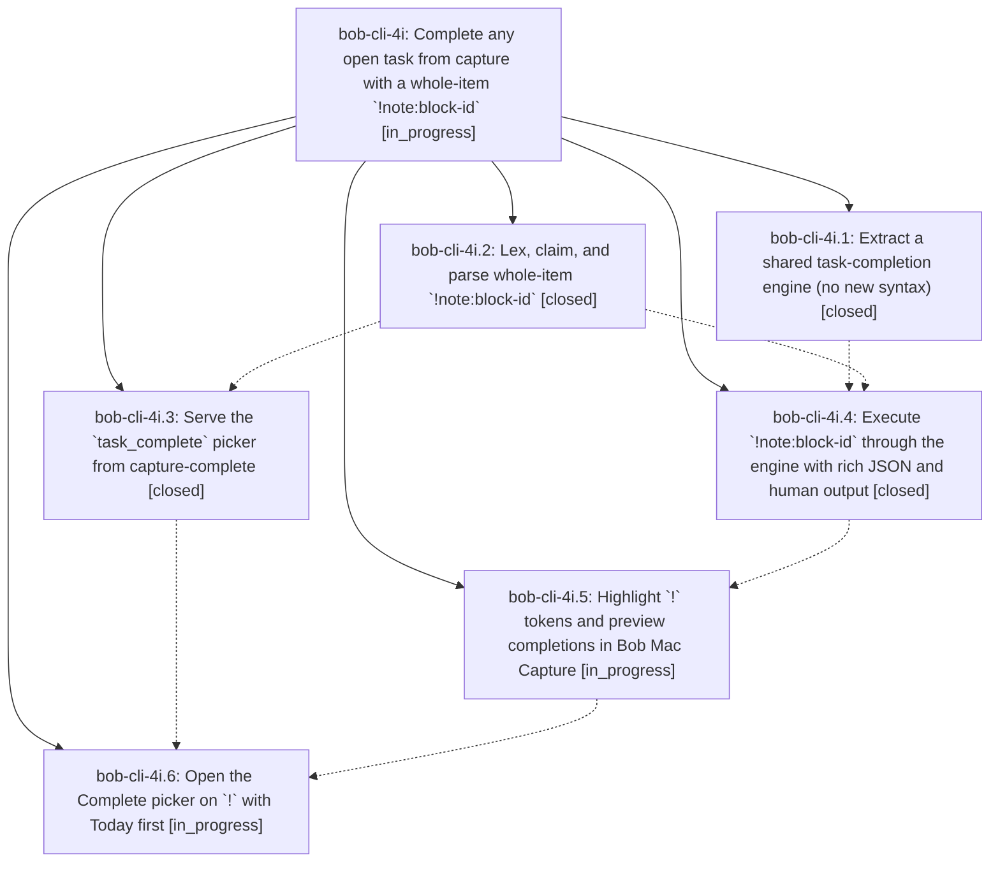

# Bead: bob-cli-4i — Complete any open task from capture with a whole-item \`!note:block-id\`

[Bead Pages](../README.md) / bob-cli-4i

**Status:** ◐ in_progress · **Type:** ▸ plan · **Tier:** epic
**Owner:** `bryanbugyi34@gmail.com` · **Created by:** [bbugyi200.apollo.5a](https://github.com/bobs-org/bob-cli--agents/blob/main/sessions/bbugyi200.apollo.5a.md) · **Assignee:** `bob-cli-4i.land`
**Created:** 2026-10-05 15:13:23 EDT
**Plan:** [202610/bang\_task\_complete.md](https://github.com/bobs-org/bob-cli--plans/blob/main/202610/bang_task_complete.md)

## Description

A capture item that is exactly `!note:block-id` marks that existing open task Done, exactly as `=x!N` would, but without closing a Pomodoro. In one atomic write it also closes the task's embedded subtasks, retires its Task Links in today's ledger the way `bob task reconcile` would, and unblocks dependents the way Obsidian's Ctrl+Enter does. Bulk works one item per blank-line-separated block. In Bob Mac Capture, typing `!` at the start of an item opens a "Complete" task picker over every open task in the vault. Tasks with Task Links in today's daily note come first, grouped by the Pomodoro they live in. A completion preview shows the struck task, its ledger effect, and the tasks it unblocks before Return writes anything.

## Phases

| Bead | Title | Status | Size | Created | Agents | Commits |
|---|---|---|---|---|---:|---:|
| [bob-cli-4i.1](bob-cli-4i.1.md) | Extract a shared task-completion engine (no new syntax) | ✓ closed | medium | 2026-10-05 | 1 | 1 |
| [bob-cli-4i.2](bob-cli-4i.2.md) | Lex, claim, and parse whole-item \`!note:block-id\` | ✓ closed | medium | 2026-10-05 | 1 | 1 |
| [bob-cli-4i.3](bob-cli-4i.3.md) | Serve the \`task\_complete\` picker from capture-complete | ✓ closed | medium | 2026-10-05 | 1 | 1 |
| [bob-cli-4i.4](bob-cli-4i.4.md) | Execute \`!note:block-id\` through the engine with rich JSON and human output | ✓ closed | medium | 2026-10-05 | 1 | 1 |
| [bob-cli-4i.5](bob-cli-4i.5.md) | Highlight \`!\` tokens and preview completions in Bob Mac Capture | ◐ in_progress | medium | 2026-10-05 | 1 | 0 |
| [bob-cli-4i.6](bob-cli-4i.6.md) | Open the Complete picker on \`!\` with Today first | ◐ in_progress | medium | 2026-10-05 | 1 | 0 |

## Lineage

## Agents

| Agent | Bead | Commits |
|---|---|---:|
| [bbugyi200.apollo.bob-cli-4i.1](https://github.com/bobs-org/bob-cli--agents/blob/main/agents/bbugyi200.apollo.bob-cli-4i.1/README.md) | [bob-cli-4i.1](bob-cli-4i.1.md) | 1 |
| [bbugyi200.apollo.bob-cli-4i.2](https://github.com/bobs-org/bob-cli--agents/blob/main/agents/bbugyi200.apollo.bob-cli-4i.2/README.md) | [bob-cli-4i.2](bob-cli-4i.2.md) | 1 |
| [bbugyi200.apollo.bob-cli-4i.3](https://github.com/bobs-org/bob-cli--agents/blob/main/agents/bbugyi200.apollo.bob-cli-4i.3/README.md) | [bob-cli-4i.3](bob-cli-4i.3.md) | 1 |
| [bbugyi200.apollo.bob-cli-4i.4](https://github.com/bobs-org/bob-cli--agents/blob/main/agents/bbugyi200.apollo.bob-cli-4i.4/README.md) | [bob-cli-4i.4](bob-cli-4i.4.md) | 1 |
| [bbugyi200.apollo.bob-cli-4i.5](https://github.com/bobs-org/bob-cli--agents/blob/main/sessions/bbugyi200.apollo.bob-cli-4i.5.md) | [bob-cli-4i.5](bob-cli-4i.5.md) | 0 |
| [bbugyi200.apollo.bob-cli-4i.6](https://github.com/bobs-org/bob-cli--agents/blob/main/agents/bbugyi200.apollo.bob-cli-4i.6/README.md) | [bob-cli-4i.6](bob-cli-4i.6.md) | 0 |
| [bbugyi200.apollo.bob-cli-4i.land](https://github.com/bobs-org/bob-cli--agents/blob/main/agents/bbugyi200.apollo.bob-cli-4i.land/README.md) | [bob-cli-4i](README.md) | 0 |

## Commits

| Repo | Commit | Subject | Bead | Committed |
|---|---|---|---|---|
| bob-cli | [`7c8d854`](https://github.com/bobs-org/bob-cli/commit/7c8d854ec408a5afe9e8c6dd29d8e754fb754a06) | feat(task-complete): extract shared task-completion engine | [bob-cli-4i.1](bob-cli-4i.1.md) | 2026-10-05 15:35:46 EDT |
| bob-cli | [`1b6f8bc`](https://github.com/bobs-org/bob-cli/commit/1b6f8bc4396c283e0bf66d95fc504e871bc52d3f) | feat(capture): implement whole-item !note:block-id grammar | [bob-cli-4i.2](bob-cli-4i.2.md) | 2026-10-05 15:38:40 EDT |
| bob-cli | [`40e561f`](https://github.com/bobs-org/bob-cli/commit/40e561f850e17eb431570dff23b79b8015183f8b) | feat(capture): serve the task\_complete picker from capture-complete | [bob-cli-4i.3](bob-cli-4i.3.md) | 2026-10-05 16:06:03 EDT |
| bob-cli | [`fbc4f43`](https://github.com/bobs-org/bob-cli/commit/fbc4f4399cf4aae1130218c9092d172dbf95b683) | feat(capture): execute whole-item !note:block-id completions | [bob-cli-4i.4](bob-cli-4i.4.md) | 2026-10-05 16:07:56 EDT |
