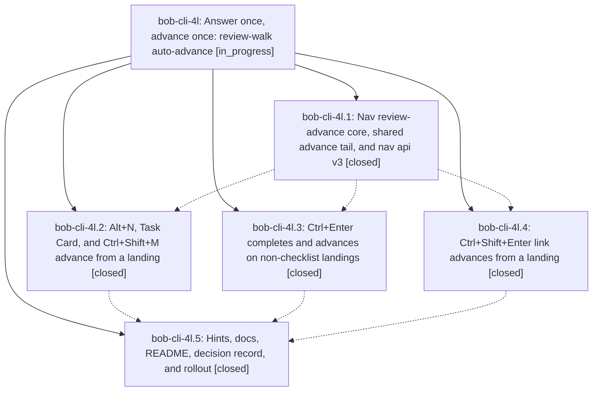

# Bead: bob-cli-4l — Answer once, advance once: review-walk auto-advance

[Bead Pages](../README.md) / bob-cli-4l

**Status:** ◐ in_progress · **Type:** ▸ plan · **Tier:** epic
**Owner:** `bryanbugyi34@gmail.com` · **Created by:** [bbugyi200.apollo.research.0d.linker.w0](https://github.com/bobs-org/bob-cli--agents/blob/main/sessions/bbugyi200.apollo.research.0d.linker.w0.md) · **Assignee:** `bob-cli-4l.land`
**Created:** 2026-10-06 07:01:40 EDT
**Plan:** [202610/review\_walk\_answer\_auto\_advance.md](https://github.com/bobs-org/bob-cli--plans/blob/main/202610/review_walk_answer_auto_advance.md)

## Description

During the `]s` morning review, every gesture that answers the row the walk just landed on moves to the next remaining review item in the same keystroke, and shows one toast that says what you did and where you are now. Today only Ctrl+Alt+F (and the PRE/POST Ctrl+Enter claim) does this. Alt+F stays the one explicit "stay" answer. `]s` stays the skip key. Ordinary daytime use of the same keys does not change.

## Phases

| Bead | Title | Status | Size | Created | Agents | Commits |
|---|---|---|---|---|---:|---:|
| [bob-cli-4l.1](bob-cli-4l.1.md) | Nav review-advance core, shared advance tail, and nav api v3 | ✓ closed | medium | 2026-10-06 | 1 | 1 |
| [bob-cli-4l.2](bob-cli-4l.2.md) | Alt+N, Task Card, and Ctrl+Shift+M advance from a landing | ✓ closed | medium | 2026-10-06 | 1 | 1 |
| [bob-cli-4l.3](bob-cli-4l.3.md) | Ctrl+Enter completes and advances on non-checklist landings | ✓ closed | small | 2026-10-06 | 1 | 1 |
| [bob-cli-4l.4](bob-cli-4l.4.md) | Ctrl+Shift+Enter link advances from a landing | ✓ closed | small | 2026-10-06 | 1 | 1 |
| [bob-cli-4l.5](bob-cli-4l.5.md) | Hints, docs, README, decision record, and rollout | ✓ closed | small | 2026-10-06 | 1 | 1 |

## Lineage

## Agents

| Agent | Bead | Commits |
|---|---|---:|
| [bbugyi200.apollo.bob-cli-4l.1](https://github.com/bobs-org/bob-cli--agents/blob/main/agents/bbugyi200.apollo.bob-cli-4l.1/README.md) | [bob-cli-4l.1](bob-cli-4l.1.md) | 1 |
| [bbugyi200.apollo.bob-cli-4l.2](https://github.com/bobs-org/bob-cli--agents/blob/main/agents/bbugyi200.apollo.bob-cli-4l.2/README.md) | [bob-cli-4l.2](bob-cli-4l.2.md) | 1 |
| [bbugyi200.apollo.bob-cli-4l.3](https://github.com/bobs-org/bob-cli--agents/blob/main/agents/bbugyi200.apollo.bob-cli-4l.3/README.md) | [bob-cli-4l.3](bob-cli-4l.3.md) | 1 |
| [bbugyi200.apollo.bob-cli-4l.4](https://github.com/bobs-org/bob-cli--agents/blob/main/agents/bbugyi200.apollo.bob-cli-4l.4/README.md) | [bob-cli-4l.4](bob-cli-4l.4.md) | 1 |
| [bbugyi200.apollo.bob-cli-4l.5](https://github.com/bobs-org/bob-cli--agents/blob/main/agents/bbugyi200.apollo.bob-cli-4l.5/README.md) | [bob-cli-4l.5](bob-cli-4l.5.md) | 1 |
| [bbugyi200.apollo.bob-cli-4l.land](https://github.com/bobs-org/bob-cli--agents/blob/main/agents/bbugyi200.apollo.bob-cli-4l.land/README.md) | [bob-cli-4l](README.md) | 0 |

## Commits

| Repo | Commit | Subject | Bead | Committed |
|---|---|---|---|---|
| bob-plugins | [`bob-plugins@824ad2a`](https://github.com/bobs-org/bob-plugins/commit/824ad2a5bd514c710244319c75f0e46bda7c2463) | feat(review-walk): nav-core auto-advance, shared tail, nav api v3 (nav 2.5.0) | [bob-cli-4l.1](bob-cli-4l.1.md) | 2026-10-06 07:23:00 EDT |
| bob-plugins | [`bob-plugins@7ff2459`](https://github.com/bobs-org/bob-plugins/commit/7ff24593892197f18b17603a9ae111013406dc5f) | feat(task-status-cycler): continue review walk silently after vim open/done toggle | [bob-cli-4l.3](bob-cli-4l.3.md) | 2026-10-06 07:31:11 EDT |
| bob-plugins | [`bob-plugins@0e0fb98`](https://github.com/bobs-org/bob-plugins/commit/0e0fb980ffe762233f8057f3ca784d913cff9cd6) | feat(block-id-prompt): implement bip-link-today pomodoro link-today flow | [bob-cli-4l.4](bob-cli-4l.4.md) | 2026-10-06 07:32:29 EDT |
| bob-plugins | [`bob-plugins@f100300`](https://github.com/bobs-org/bob-plugins/commit/f100300baac583b00b69516c8a1d073834f75519) | feat(nav): advance review walk from Alt+N, Task Card, and Ctrl+Shift+M landings | [bob-cli-4l.2](bob-cli-4l.2.md) | 2026-10-06 07:42:50 EDT |
| bob-cli | [`756c4fc`](https://github.com/bobs-org/bob-cli/commit/756c4fc74959a644d8b90edab8502aea342320fc) | docs(walk): publish answering-advances-the-walk decision and update review docs | [bob-cli-4l.5](bob-cli-4l.5.md) | 2026-10-06 07:52:22 EDT |
