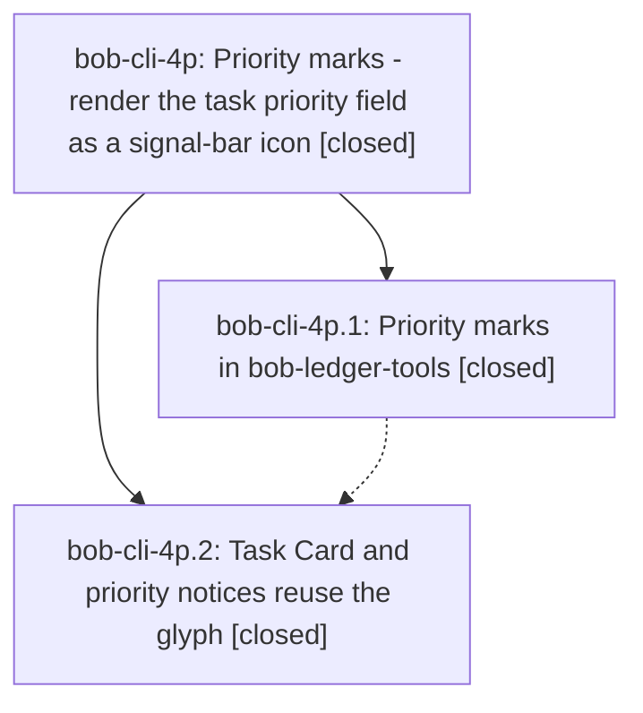

# Bead: bob-cli-4p — Priority marks - render the task priority field as a signal-bar icon

[Bead Pages](../README.md) / bob-cli-4p

**Status:** ✓ closed · **Resolution:** done · **Type:** ▸ plan · **Tier:** epic
**Owner:** `bryanbugyi34@gmail.com` · **Created by:** [bbugyi200.athena.0xf](https://github.com/bobs-org/bob-cli--agents/blob/main/sessions/bbugyi200.athena.0xf.md) · **Assignee:** `bob-cli-4p.land`
**Created:** 2026-10-06 13:50:51 EDT · **Closed:** 2026-10-06 14:36:16 EDT
**Plan:** [202610/priority\_marks.md](https://github.com/bobs-org/bob-cli--plans/blob/main/202610/priority_marks.md)

## Description

In Obsidian, every canonical `[priority:: …]` task field (Live Preview, reading view, embeds, hover previews, Dataview task views, and Tasks query results) is shown as one compact signal-bar glyph that reads the priority at a glance. The stored Markdown never changes, the cursor reveals the raw field for editing, and broken priority fields get a visible repair flag. The Task Card and priority notices use the same glyph, so you learn it where you pick a priority.

## Notes

[2026-10-06T18:36:16Z · bob-cli-4p.land] Verified bob-cli-4p is complete and integrated.

Phase bob-cli-4p.1 (ledger-marks) matches the plan in source. The canonical parser, lenient ladder reader, mark model, and listener-free element are in bob-plugins plugins/bob-ledger-tools/src/135-priority-marks.js. Live Preview (Prec.highest replace, space folding, selection reveal, code exclusion), the rendered-view post-processor at sort order 50, the session toggle, and frozen api.priorityMarks v1 are in 265-plugin-priority-marks.js, installed from 310 and wired in 170 (on by default, onunload clears the body class, namespace added on the v3 api). CSS masks are defined once on body; both glyph hosts, theme hooks, resting on .bob-priority-mark, the repair flag, and reduced motion are in styles.css. docs/projects.md has the authoritative Priority marks contract, PM1–PM17 verbatim, and the live Obsidian checklist marked pending for Bryan, which is the plan's required outcome. Ledger is 1.30.0; the README row and test-layout listing name the suite. priorityMarksRefresh is lazy-ensured, as the phase note recorded, so the freshness surfaces suite keeps one eager StateEffect.define; the toggle still dispatches the effect. Re-ran scripts/test-ledger-tools-priority-marks.cjs: 17/17 pass.

Phase bob-cli-4p.2 (card-glyph) matches the plan. getLedgerPriorityMarksApi returns api.priorityMarks only when version is at least 1 and render is a function. Task Card level chips (the P0 chip has no glyph) and priority notice headers call render with decorative and inheritColor, and fall back to Lucide. Every showPriorityNotice call site and renderTaskCardView pass app. Batch roll notices keep an empty levelValue and the dices icon. Nav is 2.8.0; the manifest and README row describe the reuse. Re-ran that ledger suite together with scripts/test-navigation-task-card-view.cjs and scripts/test-navigation-hotkeys-priority-notice.cjs: 95/95 pass.

Child notes are addressed. Neither child recorded a PROPOSED FOLLOW-UP, so no task bead was filed. One judgment was declined as not leftover work: Tasks-query results do not get a separate resting-ink rule. The contract and the CSS test specify resting through li.task-list-item and .HyperMD-task-line on .bob-priority-mark; Tasks results stay the CSS-only .task-priority host. The live checklist item remains Bryan's.

Integration: git log since 2026-10-06 13:50 EDT on bob-cli and bob-plugins contains only this epic's commits (bob-cli c2aec57 and ce54258; bob-plugins 170353f and 9e69a9d). Nothing later duplicates the mark or needs to adopt it. The epic has no parent_bead. sase bead epic-symbols bob-cli-4p lists no entries.

## Phases

| Bead | Title | Status | Size | Created | Agents | Commits |
|---|---|---|---|---|---:|---:|
| [bob-cli-4p.1](bob-cli-4p.1.md) | Priority marks in bob-ledger-tools | ✓ closed | medium | 2026-10-06 | 1 | 2 |
| [bob-cli-4p.2](bob-cli-4p.2.md) | Task Card and priority notices reuse the glyph | ✓ closed | small | 2026-10-06 | 1 | 2 |

## Lineage

## Agents

| Agent | Bead | Commits |
|---|---|---:|
| [bbugyi200.athena.bob-cli-4p.1](https://github.com/bobs-org/bob-cli--agents/blob/main/agents/bbugyi200.athena.bob-cli-4p.1/README.md) | [bob-cli-4p.1](bob-cli-4p.1.md) | 2 |
| [bbugyi200.athena.bob-cli-4p.2](https://github.com/bobs-org/bob-cli--agents/blob/main/agents/bbugyi200.athena.bob-cli-4p.2/README.md) | [bob-cli-4p.2](bob-cli-4p.2.md) | 2 |
| [bbugyi200.athena.bob-cli-4p.land](https://github.com/bobs-org/bob-cli--agents/blob/main/agents/bbugyi200.athena.bob-cli-4p.land/README.md) | [bob-cli-4p](README.md) | 1 |

## Commits

| Repo | Commit | Subject | Bead | Committed |
|---|---|---|---|---|
| bob-cli | [`c2aec57`](https://github.com/bobs-org/bob-cli/commit/c2aec5703ce28e437881b1ce4633e9a8e706e5c0) | docs(projects): add Priority marks contract with conformance vectors | [bob-cli-4p.1](bob-cli-4p.1.md) | 2026-10-06 14:09:27 EDT |
| bob-plugins | [`bob-plugins@170353f`](https://github.com/bobs-org/bob-plugins/commit/170353fef4e7861e73cfb2524a0afe80a80c288b) | feat(ledger-tools): add priority marks rendering (1.29.3 -\> 1.30.0) | [bob-cli-4p.1](bob-cli-4p.1.md) | 2026-10-06 14:10:14 EDT |
| bob-cli | [`ce54258`](https://github.com/bobs-org/bob-cli/commit/ce54258121bd567344f603311a4792299cd05185) | docs(projects): record Task Card and notice reuse of priority marks | [bob-cli-4p.2](bob-cli-4p.2.md) | 2026-10-06 14:24:41 EDT |
| bob-plugins | [`bob-plugins@9e69a9d`](https://github.com/bobs-org/bob-plugins/commit/9e69a9d4242f30732755aeae2cf6c45c00e5aa75) | feat(nav): reuse shared priority mark in Task Card and notices (2.7.2 -\> 2.8.0) | [bob-cli-4p.2](bob-cli-4p.2.md) | 2026-10-06 14:25:17 EDT |
| bob-cli--plans | [`bob-cli--plans@88c0fb3`](https://github.com/bobs-org/bob-cli--plans/commit/88c0fb37077c191772220420dc6e122cc9c3db1d) | docs(plans): mark the priority marks epic plan done | [bob-cli-4p](README.md) | 2026-10-06 14:37:36 EDT |
