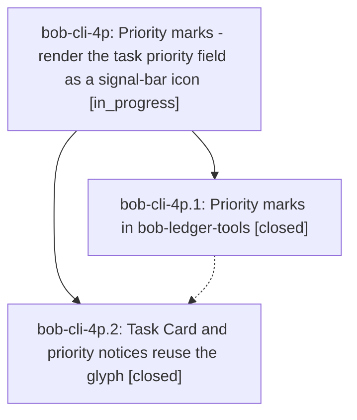

# Bead: bob-cli-4p — Priority marks - render the task priority field as a signal-bar icon

[Bead Pages](../README.md) / bob-cli-4p

**Status:** ◐ in_progress · **Type:** ▸ plan · **Tier:** epic
**Owner:** `bryanbugyi34@gmail.com` · **Created by:** [bbugyi200.athena.0xf](https://github.com/bobs-org/bob-cli--agents/blob/main/sessions/bbugyi200.athena.0xf.md) · **Assignee:** `bob-cli-4p.land`
**Created:** 2026-10-06 13:50:51 EDT
**Plan:** [202610/priority\_marks.md](https://github.com/bobs-org/bob-cli--plans/blob/main/202610/priority_marks.md)

## Description

In Obsidian, every canonical `[priority:: …]` task field (Live Preview, reading view, embeds, hover previews, Dataview task views, and Tasks query results) is shown as one compact signal-bar glyph that reads the priority at a glance. The stored Markdown never changes, the cursor reveals the raw field for editing, and broken priority fields get a visible repair flag. The Task Card and priority notices use the same glyph, so you learn it where you pick a priority.

## Phases

| Bead | Title | Status | Size | Created | Agents | Commits |
|---|---|---|---|---|---:|---:|
| [bob-cli-4p.1](bob-cli-4p.1.md) | Priority marks in bob-ledger-tools | ✓ closed | medium | 2026-10-06 | 1 | 2 |
| [bob-cli-4p.2](bob-cli-4p.2.md) | Task Card and priority notices reuse the glyph | ✓ closed | small | 2026-10-06 | 1 | 2 |

## Lineage

## Agents

| Agent | Bead | Commits |
|---|---|---:|
| [bbugyi200.athena.bob-cli-4p.1](https://github.com/bobs-org/bob-cli--agents/blob/main/agents/bbugyi200.athena.bob-cli-4p.1/README.md) | [bob-cli-4p.1](bob-cli-4p.1.md) | 2 |
| [bbugyi200.athena.bob-cli-4p.2](https://github.com/bobs-org/bob-cli--agents/blob/main/agents/bbugyi200.athena.bob-cli-4p.2/README.md) | [bob-cli-4p.2](bob-cli-4p.2.md) | 2 |
| [bbugyi200.athena.bob-cli-4p.land](https://github.com/bobs-org/bob-cli--agents/blob/main/agents/bbugyi200.athena.bob-cli-4p.land/README.md) | [bob-cli-4p](README.md) | 0 |

## Commits

| Repo | Commit | Subject | Bead | Committed |
|---|---|---|---|---|
| bob-cli | [`c2aec57`](https://github.com/bobs-org/bob-cli/commit/c2aec5703ce28e437881b1ce4633e9a8e706e5c0) | docs(projects): add Priority marks contract with conformance vectors | [bob-cli-4p.1](bob-cli-4p.1.md) | 2026-10-06 14:09:27 EDT |
| bob-plugins | [`bob-plugins@170353f`](https://github.com/bobs-org/bob-plugins/commit/170353fef4e7861e73cfb2524a0afe80a80c288b) | feat(ledger-tools): add priority marks rendering (1.29.3 -\> 1.30.0) | [bob-cli-4p.1](bob-cli-4p.1.md) | 2026-10-06 14:10:14 EDT |
| bob-cli | [`ce54258`](https://github.com/bobs-org/bob-cli/commit/ce54258121bd567344f603311a4792299cd05185) | docs(projects): record Task Card and notice reuse of priority marks | [bob-cli-4p.2](bob-cli-4p.2.md) | 2026-10-06 14:24:41 EDT |
| bob-plugins | [`bob-plugins@9e69a9d`](https://github.com/bobs-org/bob-plugins/commit/9e69a9d4242f30732755aeae2cf6c45c00e5aa75) | feat(nav): reuse shared priority mark in Task Card and notices (2.7.2 -\> 2.8.0) | [bob-cli-4p.2](bob-cli-4p.2.md) | 2026-10-06 14:25:17 EDT |
