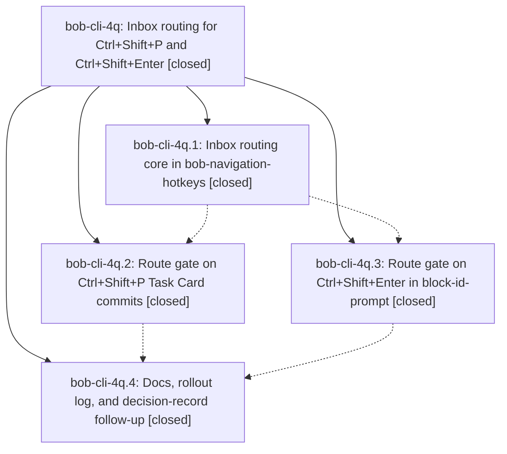

# Bead: bob-cli-4q — Inbox routing for Ctrl+Shift+P and Ctrl+Shift+Enter

[Bead Pages](../README.md) / bob-cli-4q

**Status:** ✓ closed · **Resolution:** done · **Type:** ▸ plan · **Tier:** epic
**Owner:** `bryanbugyi34@gmail.com` · **Created by:** [bbugyi200.athena.0xh](https://github.com/bobs-org/bob-cli--agents/blob/main/sessions/bbugyi200.athena.0xh.md) · **Assignee:** `bob-cli-4q.land`
**Created:** 2026-10-06 14:57:17 EDT · **Closed:** 2026-10-06 16:16:27 EDT
**Plan:** [202610/inbox\_routing.md](https://github.com/bobs-org/bob-cli--plans/blob/main/202610/inbox_routing.md)

## Description

On an open task that lives in an inbox note, every Ctrl+Shift+P Task Card commit and every Ctrl+Shift+Enter toggle first asks where the task goes. Nothing is written until a destination is chosen. The task then lands in its new home with the action applied, and a review-walk landing advances to the next item, so morning triage never needs a separate Ctrl+Shift+M.

## Notes

[2026-10-06T19:57:09Z · bob-cli-4q.land] FOLLOW-UP TRIAGE (all proposals from bob-cli-4q.4): note #1 -> created READY small memory task bob-cli-4t, Record the accepted inbox answer-routing contract; requires the approved decision strand and Area Note sentence, no canonical memory edited. Note #2 completion coverage failure -> independently reproduced exact serial failure highlights create:audio on ade4b8a and +1 existing bob-cli-4j. Note #2 capture_pomodoros parallel-only warning failure -> corroborated existing flake bob-cli-40 with phase attribution and independent isolated pass; no duplicate. Note #2 listen_filter_renders_card_and_encoded_play_link -> 2 exact serial failures under Pandoc 3.1.11.1 at create.rs:1172, unchanged assertion from 99293a5; created READY small CI task bob-cli-4u with Rust evidence file:explicit:2d458871d70000bc005e69af. No proposal declined. Additional infrastructure: just check is absent (+1 bob-cli-3c); related artifact link writes are rejected by fixed operation_id reuse (+1 bob-cli-21), so related contexts for 4t/4n and 4u/4s were recorded as task notes. Active 4s did not cause the pre-existing Pandoc failure. These follow-ups are separately tracked and must not block the inbox-routing landing tale.

[2026-10-06T19:58:27Z · bob-cli-4q.land] LAND AUDIT (not ready to close): Reviewed every note on closed phases bob-cli-4q.1-.4, the approved plan, commits bff5585/3689d34/73cd4b0 in bob-plugins and ade4b8a in bob-cli, actual classifier/modal/move core/Task Card wrappers/toggle writers/review outcomes/API/docs. npm test 1988/1988 and validate 6/6 pass; nav 2.10.0 and block-id-prompt 1.23.0 are deployed with 0 drift; just fmt passes. just check lacks a recipe (bob-cli-3c), no symvision recipe, no --epic-symbol entries, no parent link. Fetched both origins; master matches origin/master and no unrelated commits landed after epic creation or first epic commit, so no post-start drift needs code integration. REMAINING EPIC WORK: real unchanged refresh returns true and still invokes route move; Task Card closure while awaiting the route still invokes its writer (core checks suspend.isAlive only before opening, onClose/unload never cancel the route); toggle source-row drift during the route prompt changes Replacement to Next while linking the old Ship task because rawLine is only checked before the await; cancel after the block-ID prompt leaves reviewOrigin held and the original input modal open; Work summary unlink loses its origin in openPomodoroTaskLink finally before a successful route can advance. The 14-action card matrix uses one fake #route-test writer and a fake move, so it cannot verify real action integration or catch these bugs. Remaining work is bounded to these routing paths plus actual action/count/walk coverage and small docs wording corrections; a medium tale can finish it and close this epic in the same turn without waiting for its own commit/CI. Full audit and reproductions: file:explicit:abd7fc392abec1271c9965a6 (snapshot saved; typed attach failed due to the separately tracked bob-cli-21 corruption).

[2026-10-06T20:16:27Z · bob-cli-4q.land] Verified all four original phase scopes and notes, original route/core/card/toggle/docs commits and actual source, and post-start/post-child drift (476f4ae highlights-only, no integration). Fixed no-op movement, pending-card cancellation, post-route source guards, block-ID/Work-summary cancellation and review-origin handoff. Focused no-op, close/unload cancel, drift, cancel-sentinel, handoff, and no-op-move regressions pass; plugin build/test/validate (1994/1994, 6/6) and just fmt/lint completed; changed plugins deployed and synced (nav 2.10.1, block-id-prompt 1.23.1, 0 drift). Retired or deliberately re-keyed every epic-symbol entry (none). Follow-ups from bob-cli-4q.4: memory proposal -> bob-cli-4t; completion failure -> corroborated bob-cli-4j; warning flake -> corroborated bob-cli-40; Pandoc URI assertion -> bob-cli-4u. No proposal declined. Infrastructure tracked by bob-cli-3c and bob-cli-21; related contexts retained in task notes.

## Phases

| Bead | Title | Status | Size | Created | Agents | Commits |
|---|---|---|---|---|---:|---:|
| [bob-cli-4q.1](bob-cli-4q.1.md) | Inbox routing core in bob-navigation-hotkeys | ✓ closed | medium | 2026-10-06 | 1 | 1 |
| [bob-cli-4q.2](bob-cli-4q.2.md) | Route gate on Ctrl+Shift+P Task Card commits | ✓ closed | medium | 2026-10-06 | 1 | 1 |
| [bob-cli-4q.3](bob-cli-4q.3.md) | Route gate on Ctrl+Shift+Enter in block-id-prompt | ✓ closed | small | 2026-10-06 | 1 | 1 |
| [bob-cli-4q.4](bob-cli-4q.4.md) | Docs, rollout log, and decision-record follow-up | ✓ closed | small | 2026-10-06 | 1 | 1 |

## Lineage

## Agents

| Agent | Bead | Commits |
|---|---|---:|
| [bbugyi200.athena.bob-cli-4q.1](https://github.com/bobs-org/bob-cli--agents/blob/main/agents/bbugyi200.athena.bob-cli-4q.1/README.md) | [bob-cli-4q.1](bob-cli-4q.1.md) | 1 |
| [bbugyi200.athena.bob-cli-4q.2](https://github.com/bobs-org/bob-cli--agents/blob/main/agents/bbugyi200.athena.bob-cli-4q.2/README.md) | [bob-cli-4q.2](bob-cli-4q.2.md) | 1 |
| [bbugyi200.athena.bob-cli-4q.3](https://github.com/bobs-org/bob-cli--agents/blob/main/agents/bbugyi200.athena.bob-cli-4q.3/README.md) | [bob-cli-4q.3](bob-cli-4q.3.md) | 1 |
| [bbugyi200.athena.bob-cli-4q.4](https://github.com/bobs-org/bob-cli--agents/blob/main/agents/bbugyi200.athena.bob-cli-4q.4/README.md) | [bob-cli-4q.4](bob-cli-4q.4.md) | 1 |
| [bbugyi200.athena.bob-cli-4q.land](https://github.com/bobs-org/bob-cli--agents/blob/main/sessions/bbugyi200.athena.bob-cli-4q.land.md) | [bob-cli-4q](README.md) | 1 |

## Commits

| Repo | Commit | Subject | Bead | Committed |
|---|---|---|---|---|
| bob-plugins | [`bob-plugins@bff5585`](https://github.com/bobs-org/bob-plugins/commit/bff5585014d5ea090d1485406840d7beb681d427) | feat(inbox-route): add inbox routing core with picker modal and move commit | [bob-cli-4q.1](bob-cli-4q.1.md) | 2026-10-06 15:18:33 EDT |
| bob-plugins | [`bob-plugins@3689d34`](https://github.com/bobs-org/bob-plugins/commit/3689d347841adc3e7955a39ca89b250079bdba47) | feat(block-id-prompt): gate pomodoro link toggle on inbox route | [bob-cli-4q.3](bob-cli-4q.3.md) | 2026-10-06 15:31:37 EDT |
| bob-plugins | [`bob-plugins@73cd4b0`](https://github.com/bobs-org/bob-plugins/commit/73cd4b0c0cba6cb06a01b5016b670b9a4265ca87) | feat(nav): route Task Card commits on inbox tasks via picker gate | [bob-cli-4q.2](bob-cli-4q.2.md) | 2026-10-06 15:33:43 EDT |
| bob-cli | [`ade4b8a`](https://github.com/bobs-org/bob-cli/commit/ade4b8af2580bad8bba18339180987be1a5c4849) | docs(inbox-routing): add canonical spec and rollout notes | [bob-cli-4q.4](bob-cli-4q.4.md) | 2026-10-06 15:41:38 EDT |
| bob-cli | [`0ca5a13`](https://github.com/bobs-org/bob-cli/commit/0ca5a13a16282c3c93b858c5673db3bafc82c3d6) | docs(inbox-routing): say non-closing Task Card answers route last before writing | [bob-cli-4q](README.md) | 2026-10-06 16:18:16 EDT |
