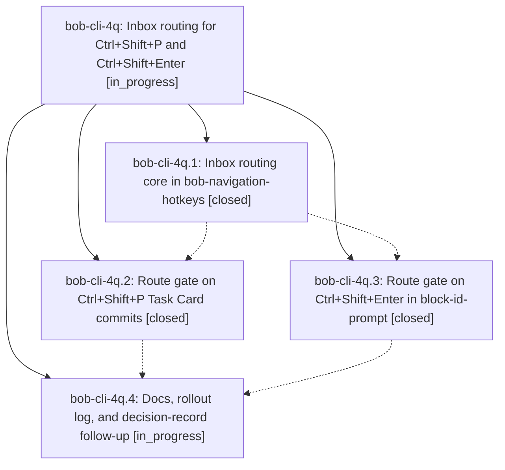

# Bead: bob-cli-4q — Inbox routing for Ctrl+Shift+P and Ctrl+Shift+Enter

[Bead Pages](../README.md) / bob-cli-4q

**Status:** ◐ in_progress · **Type:** ▸ plan · **Tier:** epic
**Owner:** `bryanbugyi34@gmail.com` · **Created by:** [bbugyi200.athena.0xh](https://github.com/bobs-org/bob-cli--agents/blob/main/sessions/bbugyi200.athena.0xh.md) · **Assignee:** `bob-cli-4q.land`
**Created:** 2026-10-06 14:57:17 EDT
**Plan:** [202610/inbox\_routing.md](https://github.com/bobs-org/bob-cli--plans/blob/main/202610/inbox_routing.md)

## Description

On an open task that lives in an inbox note, every Ctrl+Shift+P Task Card commit and every Ctrl+Shift+Enter toggle first asks where the task goes. Nothing is written until a destination is chosen. The task then lands in its new home with the action applied, and a review-walk landing advances to the next item, so morning triage never needs a separate Ctrl+Shift+M.

## Phases

| Bead | Title | Status | Size | Created | Agents | Commits |
|---|---|---|---|---|---:|---:|
| [bob-cli-4q.1](bob-cli-4q.1.md) | Inbox routing core in bob-navigation-hotkeys | ✓ closed | medium | 2026-10-06 | 1 | 1 |
| [bob-cli-4q.2](bob-cli-4q.2.md) | Route gate on Ctrl+Shift+P Task Card commits | ✓ closed | medium | 2026-10-06 | 1 | 1 |
| [bob-cli-4q.3](bob-cli-4q.3.md) | Route gate on Ctrl+Shift+Enter in block-id-prompt | ✓ closed | small | 2026-10-06 | 1 | 1 |
| [bob-cli-4q.4](bob-cli-4q.4.md) | Docs, rollout log, and decision-record follow-up | ◐ in_progress | small | 2026-10-06 | 1 | 0 |

## Lineage

## Agents

| Agent | Bead | Commits |
|---|---|---:|
| [bbugyi200.athena.bob-cli-4q.1](https://github.com/bobs-org/bob-cli--agents/blob/main/agents/bbugyi200.athena.bob-cli-4q.1/README.md) | [bob-cli-4q.1](bob-cli-4q.1.md) | 1 |
| [bbugyi200.athena.bob-cli-4q.2](https://github.com/bobs-org/bob-cli--agents/blob/main/agents/bbugyi200.athena.bob-cli-4q.2/README.md) | [bob-cli-4q.2](bob-cli-4q.2.md) | 1 |
| [bbugyi200.athena.bob-cli-4q.3](https://github.com/bobs-org/bob-cli--agents/blob/main/agents/bbugyi200.athena.bob-cli-4q.3/README.md) | [bob-cli-4q.3](bob-cli-4q.3.md) | 1 |
| [bbugyi200.athena.bob-cli-4q.4](https://github.com/bobs-org/bob-cli--agents/blob/main/agents/bbugyi200.athena.bob-cli-4q.4/README.md) | [bob-cli-4q.4](bob-cli-4q.4.md) | 0 |
| [bbugyi200.athena.bob-cli-4q.land](https://github.com/bobs-org/bob-cli--agents/blob/main/agents/bbugyi200.athena.bob-cli-4q.land/README.md) | [bob-cli-4q](README.md) | 0 |

## Commits

| Repo | Commit | Subject | Bead | Committed |
|---|---|---|---|---|
| bob-plugins | [`bob-plugins@bff5585`](https://github.com/bobs-org/bob-plugins/commit/bff5585014d5ea090d1485406840d7beb681d427) | feat(inbox-route): add inbox routing core with picker modal and move commit | [bob-cli-4q.1](bob-cli-4q.1.md) | 2026-10-06 15:18:33 EDT |
| bob-plugins | [`bob-plugins@3689d34`](https://github.com/bobs-org/bob-plugins/commit/3689d347841adc3e7955a39ca89b250079bdba47) | feat(block-id-prompt): gate pomodoro link toggle on inbox route | [bob-cli-4q.3](bob-cli-4q.3.md) | 2026-10-06 15:31:37 EDT |
| bob-plugins | [`bob-plugins@73cd4b0`](https://github.com/bobs-org/bob-plugins/commit/73cd4b0c0cba6cb06a01b5016b670b9a4265ca87) | feat(nav): route Task Card commits on inbox tasks via picker gate | [bob-cli-4q.2](bob-cli-4q.2.md) | 2026-10-06 15:33:43 EDT |
