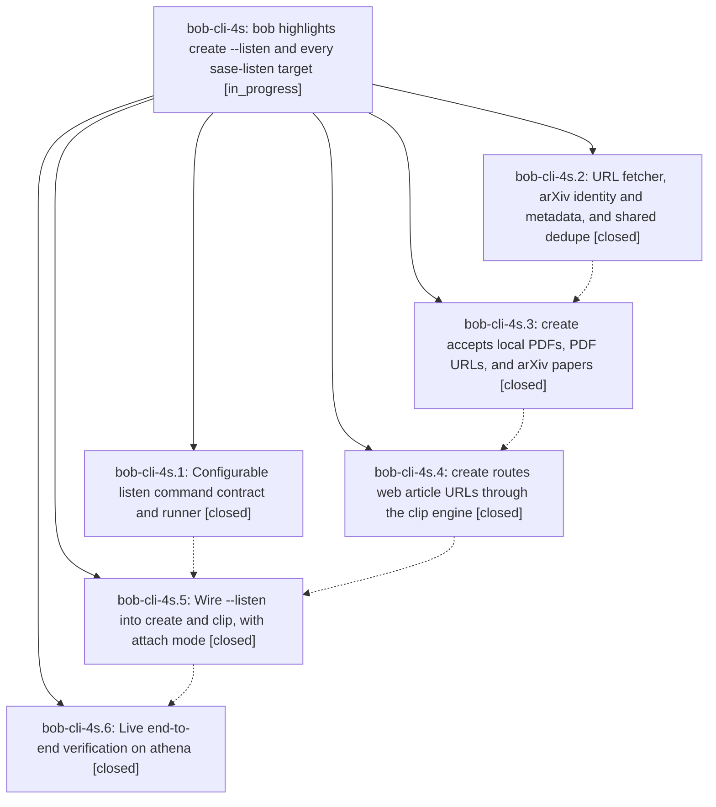

# Bead: bob-cli-4s — bob highlights create --listen and every sase-listen target

[Bead Pages](../README.md) / bob-cli-4s

**Status:** ◐ in_progress · **Type:** ▸ plan · **Tier:** epic
**Owner:** `bryanbugyi34@gmail.com` · **Created by:** [bbugyi200.athena.research.3r.linker.w0](https://github.com/bobs-org/bob-cli--agents/blob/main/sessions/bbugyi200.athena.research.3r.linker.w0.md) · **Assignee:** `bob-cli-4s.land`
**Created:** 2026-10-06 15:45:26 EDT
**Plan:** [202610/highlights\_create\_listen.md](https://github.com/bobs-org/bob-cli--plans/blob/main/202610/highlights_create_listen.md)

## Description

`bob highlights create <TARGET>` accepts every document target that `sase-listen render -e full` accepts (Markdown files, local PDFs, PDF URLs, arXiv paper URLs, and web article URLs) and installs one marker-stamped PDF into the Highlights intake. A PDF is stamped as-is, never re-rendered. `--listen` runs the configured `highlights.listen_command` (Bryan's chezmoi config sets `sase-listen render {target} -e full -o {audio}`) with its output streamed unchanged, and binds the published episode as the PDF's companion audio. `bob highlights scan` then writes a ref note with an audio player. When the target is already captured, `--listen` attaches the new episode to the existing ref note instead. Every article or paper Bryan listens to ends up tracked in his Obsidian ref system. Nothing is ever written to the vault unless every step succeeded.

## Phases

| Bead | Title | Status | Size | Created | Agents | Commits |
|---|---|---|---|---|---:|---:|
| [bob-cli-4s.1](bob-cli-4s.1.md) | Configurable listen command contract and runner | ✓ closed | small | 2026-10-06 | 1 | 1 |
| [bob-cli-4s.2](bob-cli-4s.2.md) | URL fetcher, arXiv identity and metadata, and shared dedupe | ✓ closed | small | 2026-10-06 | 1 | 1 |
| [bob-cli-4s.3](bob-cli-4s.3.md) | create accepts local PDFs, PDF URLs, and arXiv papers | ✓ closed | medium | 2026-10-06 | 1 | 1 |
| [bob-cli-4s.4](bob-cli-4s.4.md) | create routes web article URLs through the clip engine | ✓ closed | small | 2026-10-06 | 1 | 1 |
| [bob-cli-4s.5](bob-cli-4s.5.md) | Wire --listen into create and clip, with attach mode | ✓ closed | medium | 2026-10-06 | 1 | 1 |
| [bob-cli-4s.6](bob-cli-4s.6.md) | Live end-to-end verification on athena | ✓ closed | small | 2026-10-06 | 1 | 1 |

## Lineage

## Agents

| Agent | Bead | Commits |
|---|---|---:|
| [bbugyi200.athena.bob-cli-4s.1](https://github.com/bobs-org/bob-cli--agents/blob/main/agents/bbugyi200.athena.bob-cli-4s.1/README.md) | [bob-cli-4s.1](bob-cli-4s.1.md) | 1 |
| [bbugyi200.athena.bob-cli-4s.2](https://github.com/bobs-org/bob-cli--agents/blob/main/agents/bbugyi200.athena.bob-cli-4s.2/README.md) | [bob-cli-4s.2](bob-cli-4s.2.md) | 1 |
| [bbugyi200.athena.bob-cli-4s.3](https://github.com/bobs-org/bob-cli--agents/blob/main/agents/bbugyi200.athena.bob-cli-4s.3/README.md) | [bob-cli-4s.3](bob-cli-4s.3.md) | 1 |
| [bbugyi200.athena.bob-cli-4s.4](https://github.com/bobs-org/bob-cli--agents/blob/main/agents/bbugyi200.athena.bob-cli-4s.4/README.md) | [bob-cli-4s.4](bob-cli-4s.4.md) | 1 |
| [bbugyi200.athena.bob-cli-4s.5](https://github.com/bobs-org/bob-cli--agents/blob/main/agents/bbugyi200.athena.bob-cli-4s.5/README.md) | [bob-cli-4s.5](bob-cli-4s.5.md) | 1 |
| [bbugyi200.athena.bob-cli-4s.6](https://github.com/bobs-org/bob-cli--agents/blob/main/sessions/bbugyi200.athena.bob-cli-4s.6.md) | [bob-cli-4s.6](bob-cli-4s.6.md) | 1 |
| [bbugyi200.athena.bob-cli-4s.land](https://github.com/bobs-org/bob-cli--agents/blob/main/agents/bbugyi200.athena.bob-cli-4s.land/README.md) | [bob-cli-4s](README.md) | 0 |

## Commits

| Repo | Commit | Subject | Bead | Committed |
|---|---|---|---|---|
| bob-cli | [`476f4ae`](https://github.com/bobs-org/bob-cli/commit/476f4ae1caa1e86c40611336ce9ccac24032e16f) | feat(highlights): add configurable listen command contract and runner | [bob-cli-4s.1](bob-cli-4s.1.md) | 2026-10-06 15:57:05 EDT |
| bob-cli | [`fb77b56`](https://github.com/bobs-org/bob-cli/commit/fb77b56e3b6b20776787ab809631a7a64a777be2) | feat(highlights): add native highlights\_ref fetch, arxiv, clip, and dedupe | [bob-cli-4s.2](bob-cli-4s.2.md) | 2026-10-06 16:06:43 EDT |
| bob-cli | [`fa7c7b0`](https://github.com/bobs-org/bob-cli/commit/fa7c7b002931cface784e19e85778d151754a37a) | feat(highlights): accept markdown, local PDF, PDF URL, and arXiv targets in create | [bob-cli-4s.3](bob-cli-4s.3.md) | 2026-10-06 16:47:07 EDT |
| bob-cli | [`0779e7d`](https://github.com/bobs-org/bob-cli/commit/0779e7d069958c5227fd5fbf746e6b85909e4ac7) | feat(highlights): route create WebArticle targets through clip engine | [bob-cli-4s.4](bob-cli-4s.4.md) | 2026-10-06 17:03:33 EDT |
| bob-cli | [`acceed2`](https://github.com/bobs-org/bob-cli/commit/acceed2b834b2253eb28e3688707c902f81fd0bc) | feat(highlights): add listen and attach modes for create and clip | [bob-cli-4s.5](bob-cli-4s.5.md) | 2026-10-06 17:30:04 EDT |
| bob-cli | [`fe1c05f`](https://github.com/bobs-org/bob-cli/commit/fe1c05f067e8843863fd3ce164e572511063515c) | docs(highlights): record live-verify results for listen attach flow | [bob-cli-4s.6](bob-cli-4s.6.md) | 2026-10-06 18:54:20 EDT |
