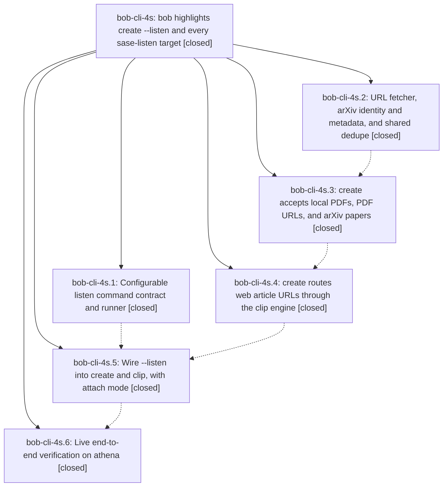

# Bead: bob-cli-4s — bob highlights create --listen and every sase-listen target

[Bead Pages](../README.md) / bob-cli-4s

**Status:** ✓ closed · **Resolution:** done · **Type:** ▸ plan · **Tier:** epic
**Owner:** `bryanbugyi34@gmail.com` · **Created by:** [bbugyi200.athena.research.3r.linker.w0](https://github.com/bobs-org/bob-cli--agents/blob/main/sessions/bbugyi200.athena.research.3r.linker.w0.md) · **Assignee:** `bob-cli-4s.land`
**Created:** 2026-10-06 15:45:26 EDT · **Closed:** 2026-10-06 19:49:16 EDT
**Plan:** [202610/highlights\_create\_listen.md](https://github.com/bobs-org/bob-cli--plans/blob/main/202610/highlights_create_listen.md)

## Description

`bob highlights create <TARGET>` accepts every document target that `sase-listen render -e full` accepts (Markdown files, local PDFs, PDF URLs, arXiv paper URLs, and web article URLs) and installs one marker-stamped PDF into the Highlights intake. A PDF is stamped as-is, never re-rendered. `--listen` runs the configured `highlights.listen_command` (Bryan's chezmoi config sets `sase-listen render {target} -e full -o {audio}`) with its output streamed unchanged, and binds the published episode as the PDF's companion audio. `bob highlights scan` then writes a ref note with an audio player. When the target is already captured, `--listen` attaches the new episode to the existing ref note instead. Every article or paper Bryan listens to ends up tracked in his Obsidian ref system. Nothing is ever written to the vault unless every step succeeded.

## Notes

[2026-10-06T23:16:27Z · bob-cli-4s.land] FOLLOW-UP TRIAGE (bob-cli-4s.land): (A) listen_filter_renders_card_and_encoded_play_link pandoc '&' escaping (4s.1#1, .2#1, .3#2, .4#2, .5#1, .6#2): pre-existing (99293a5), so +1 on bob-cli-4u with land reproduction on fe1c05f. (B) every_value_arg_has_a_decision for highlights create:audio (4s.1#2, .2#2, .3#1, .4#1, .5#1): pre-existing (2152202), so +1 on bob-cli-4j. Confirmed that no arg this epic added is missing a kinds decision. (C) capture_pomodoros missing_note_and_missing_section_are_warning_successes parallel flake (4s.2#2, .4#3): +1 on existing flake bob-cli-40, reproduced again in the land just all run. (D) live full-edition sase-listen TTS stall (4s.6#1): DECLINED as a bob-cli task. The stall is in sase-listen's TTS backend, a different project; the plan puts sase-listen changes out of scope, and there is no bob defect to fix. bob's side was live-verified: a real sase-listen run streamed unchanged under a TTY, the success, attach and scan pairing ran with the real binary and stub audio, and Bryan's next real create -L covers the rest. (E) land-audit finding: clip_url::is_non_global_literal accepts IPv4-mapped IPv6 private literals (pre-existing, 44bfe589). Filed as new bug bob-cli-4v (small, ready); the typed related link was rejected by the pre-existing artifact-link event-store corruption. Evidence log: file:explicit:c9877af17f99137230201106

[2026-10-06T23:19:32Z · bob-cli-4s.land] LAND AUDIT (bob-cli-4s.land, master fe1c05f): Read the epic, all 6 closed phases and their notes, the plan, and commits 476f4ae fb77b56 fa7c7b0 0779e7d acceed2 fe1c05f. just all: fmt and clippy are clean. The lib suite has 1758 passed and 3 failed, all known pre-existing (bob-cli-4j, bob-cli-4u, flake bob-cli-40). cargo test --test cli: 1036/1036 pass. epic-symbols: none. INTEGRATION: the only non-epic commits since the epic started, 0ca5a13 and 16aba77, are docs/memory changes outside highlights, so nothing to integrate. The chezmoi listen_command is applied. REMAINING EPIC WORK, confirmed by code reading and repro:
- create <article URL> -L exits 1, not 130, on interrupt (From<ClipError> drops exit_code).
- PDF/URL/arXiv listen routes stamp after installing audio, so a stamp failure orphans the mp3.
- Attach mode has no post-listen audio re-check, and clip's post-listen dedupe is a no-op.
- The arXiv PDF download ignores HTTP status and content.
- Completion glob *.{md,pdf} matches nothing in bash or zsh (regression from *.md).
- Companion audio beside a source PDF is reported but never copied.
- -N alone embeds the marker id.
- Already-marked PDFs get a second marker.
- curl lacks -q, so ~/.curlrc can inject -L.
- Attach misses with a relative or symlinked vault.
- Spec gaps: the 'to add audio to that capture' hint; an early xlib mkdir; listen hints; attach styling and source line; arXiv provenance and versioned fallbacks; inline fetch hints; doctor curl precedence; a 30 s download cap; whole-file PDF sniff; the Info-title stem check; help order and layout.
- 9 dead-code warnings plus #[allow(dead_code)] stubs.
- Weak listen test assertions.
Planned as lander tale sase_plan_highlights_listen_landing_fixes (medium), whose final step closes this epic. DECLINED as non-epic: the clip_adapter.rs dead_code allowances (44bfe589), and the IPv4-mapped IPv6 private-host bypass (pre-existing, filed as bob-cli-4v).

[2026-10-06T23:49:16Z · bob-cli-4s.land] Land audit: all 6 phases verified against plan 202610/highlights_create_listen.md and commits 476f4ae fb77b56 fa7c7b0 0779e7d acceed2 fe1c05f. No integration needed: only non-epic commits since epic start, 0ca5a13 and 16aba77, are docs/memory outside highlights. Triage recorded in epic note: A->bob-cli-4u, B->bob-cli-4j, C->bob-cli-40, D declined (sase-listen TTS stall, different project), E->new bob-cli-4v. This tale: fixed all 25 landing items (exit-130 preserve, stamp-before-listen with shared helper, attach re-check, clip dedupe re-collect, arXiv 2xx/PDF checks, completion space-split glob plus bash split, companion copy fix, -N id fix, marked-PDF refuse, curl -q first arg, canonical vault helper, collision listen hints, no early mkdir, LISTEN_FAILED hints, attach styling plus source line, arXiv provenance plus versionless fallbacks, separate hint lines, doctor curl precedence, 300s PDF timeout, 1024-byte sniff, source-stem title check, -L before -l plus Targets/Listen/Audio/Output/Examples help, dead-code removal with zero build warnings, strengthened listen tests). Verification: cargo fmt clean, cargo build --lib zero warnings, cargo test --lib 1759 passed with only the 3 known pre-existing failures (bob-cli-4j kinds audio, bob-cli-4u listen filter, bob-cli-40 pomodoro flake), cargo test --test cli 1041/1041 pass (1036 before plus 5 new). epic-symbols: none. just symvision: no such recipe.

## Phases

| Bead | Title | Status | Size | Created | Agents | Commits |
|---|---|---|---|---|---:|---:|
| [bob-cli-4s.1](bob-cli-4s.1.md) | Configurable listen command contract and runner | ✓ closed | small | 2026-10-06 | 1 | 1 |
| [bob-cli-4s.2](bob-cli-4s.2.md) | URL fetcher, arXiv identity and metadata, and shared dedupe | ✓ closed | small | 2026-10-06 | 1 | 1 |
| [bob-cli-4s.3](bob-cli-4s.3.md) | create accepts local PDFs, PDF URLs, and arXiv papers | ✓ closed | medium | 2026-10-06 | 1 | 1 |
| [bob-cli-4s.4](bob-cli-4s.4.md) | create routes web article URLs through the clip engine | ✓ closed | small | 2026-10-06 | 1 | 1 |
| [bob-cli-4s.5](bob-cli-4s.5.md) | Wire --listen into create and clip, with attach mode | ✓ closed | medium | 2026-10-06 | 1 | 1 |
| [bob-cli-4s.6](bob-cli-4s.6.md) | Live end-to-end verification on athena | ✓ closed | small | 2026-10-06 | 1 | 1 |

## Lineage

## Agents

| Agent | Bead | Commits |
|---|---|---:|
| [bbugyi200.athena.bob-cli-4s.1](https://github.com/bobs-org/bob-cli--agents/blob/main/agents/bbugyi200.athena.bob-cli-4s.1/README.md) | [bob-cli-4s.1](bob-cli-4s.1.md) | 1 |
| [bbugyi200.athena.bob-cli-4s.2](https://github.com/bobs-org/bob-cli--agents/blob/main/agents/bbugyi200.athena.bob-cli-4s.2/README.md) | [bob-cli-4s.2](bob-cli-4s.2.md) | 1 |
| [bbugyi200.athena.bob-cli-4s.3](https://github.com/bobs-org/bob-cli--agents/blob/main/agents/bbugyi200.athena.bob-cli-4s.3/README.md) | [bob-cli-4s.3](bob-cli-4s.3.md) | 1 |
| [bbugyi200.athena.bob-cli-4s.4](https://github.com/bobs-org/bob-cli--agents/blob/main/agents/bbugyi200.athena.bob-cli-4s.4/README.md) | [bob-cli-4s.4](bob-cli-4s.4.md) | 1 |
| [bbugyi200.athena.bob-cli-4s.5](https://github.com/bobs-org/bob-cli--agents/blob/main/agents/bbugyi200.athena.bob-cli-4s.5/README.md) | [bob-cli-4s.5](bob-cli-4s.5.md) | 1 |
| [bbugyi200.athena.bob-cli-4s.6](https://github.com/bobs-org/bob-cli--agents/blob/main/sessions/bbugyi200.athena.bob-cli-4s.6.md) | [bob-cli-4s.6](bob-cli-4s.6.md) | 1 |
| [bbugyi200.athena.bob-cli-4s.land](https://github.com/bobs-org/bob-cli--agents/blob/main/sessions/bbugyi200.athena.bob-cli-4s.land.md) | [bob-cli-4s](README.md) | 1 |

## Commits

| Repo | Commit | Subject | Bead | Committed |
|---|---|---|---|---|
| bob-cli | [`476f4ae`](https://github.com/bobs-org/bob-cli/commit/476f4ae1caa1e86c40611336ce9ccac24032e16f) | feat(highlights): add configurable listen command contract and runner | [bob-cli-4s.1](bob-cli-4s.1.md) | 2026-10-06 15:57:05 EDT |
| bob-cli | [`fb77b56`](https://github.com/bobs-org/bob-cli/commit/fb77b56e3b6b20776787ab809631a7a64a777be2) | feat(highlights): add native highlights\_ref fetch, arxiv, clip, and dedupe | [bob-cli-4s.2](bob-cli-4s.2.md) | 2026-10-06 16:06:43 EDT |
| bob-cli | [`fa7c7b0`](https://github.com/bobs-org/bob-cli/commit/fa7c7b002931cface784e19e85778d151754a37a) | feat(highlights): accept markdown, local PDF, PDF URL, and arXiv targets in create | [bob-cli-4s.3](bob-cli-4s.3.md) | 2026-10-06 16:47:07 EDT |
| bob-cli | [`0779e7d`](https://github.com/bobs-org/bob-cli/commit/0779e7d069958c5227fd5fbf746e6b85909e4ac7) | feat(highlights): route create WebArticle targets through clip engine | [bob-cli-4s.4](bob-cli-4s.4.md) | 2026-10-06 17:03:33 EDT |
| bob-cli | [`acceed2`](https://github.com/bobs-org/bob-cli/commit/acceed2b834b2253eb28e3688707c902f81fd0bc) | feat(highlights): add listen and attach modes for create and clip | [bob-cli-4s.5](bob-cli-4s.5.md) | 2026-10-06 17:30:04 EDT |
| bob-cli | [`fe1c05f`](https://github.com/bobs-org/bob-cli/commit/fe1c05f067e8843863fd3ce164e572511063515c) | docs(highlights): record live-verify results for listen attach flow | [bob-cli-4s.6](bob-cli-4s.6.md) | 2026-10-06 18:54:20 EDT |
| bob-cli | [`f5e7c78`](https://github.com/bobs-org/bob-cli/commit/f5e7c782ba6e9663867c59dbbba4612315ff82c7) | feat(highlights): finish bob-cli-4s listen landing fixes | [bob-cli-4s](README.md) | 2026-10-06 19:50:24 EDT |
