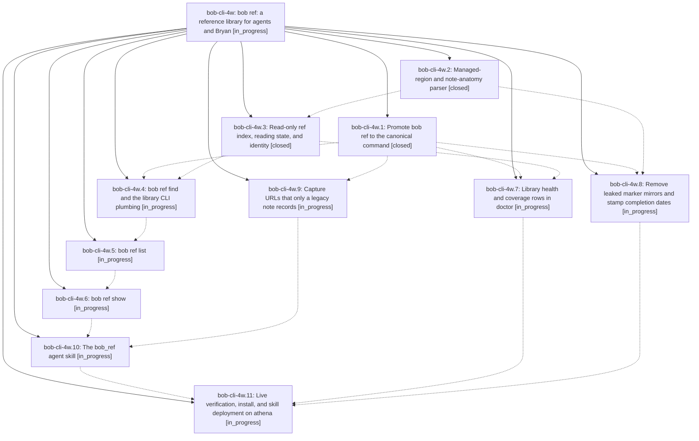

# Bead: bob-cli-4w — bob ref: a reference library for agents and Bryan

[Bead Pages](../README.md) / bob-cli-4w

**Status:** ◐ in_progress · **Type:** ▸ plan · **Tier:** epic
**Owner:** `bryanbugyi34@gmail.com` · **Created by:** [bbugyi200.athena.research.3s.linker.w0](https://github.com/bobs-org/bob-cli--agents/blob/main/sessions/bbugyi200.athena.research.3s.linker.w0.md) · **Assignee:** `bob-cli-4w.land`
**Created:** 2026-10-06 20:15:52 EDT
**Plan:** [202610/bob\_ref\_reference\_library.md](https://github.com/bobs-org/bob-cli--plans/blob/main/202610/bob_ref_reference_library.md)

## Description

`bob ref` is the canonical command for Bob's reference library. `find`, `list`, and `show` answer "is this already in my library, what am I reading or planning to read, what have I finished, and what did I note?" correctly on the real vault. Each answer comes in beautiful human output, Markdown, or versioned JSON, and is honest about coverage. The six Highlights pipeline verbs work unchanged under `bob ref` and under the permanent `bob highlights` and `bob highlights-ref` aliases. Annotations no longer carry the leaked marker mirror, and a URL that only a legacy note records can be captured again. A deployed `bob_ref` skill makes "check the library first" the default step for agents that recommend reading.

## Phases

| Bead | Title | Status | Size | Created | Agents | Commits |
|---|---|---|---|---|---:|---:|
| [bob-cli-4w.1](bob-cli-4w.1.md) | Promote bob ref to the canonical command | ✓ closed | medium | 2026-10-06 | 1 | 1 |
| [bob-cli-4w.10](bob-cli-4w.10.md) | The bob\_ref agent skill | ◐ in_progress | small | 2026-10-06 | 1 | 0 |
| [bob-cli-4w.11](bob-cli-4w.11.md) | Live verification, install, and skill deployment on athena | ◐ in_progress | small | 2026-10-06 | 1 | 0 |
| [bob-cli-4w.2](bob-cli-4w.2.md) | Managed-region and note-anatomy parser | ✓ closed | small | 2026-10-06 | 1 | 1 |
| [bob-cli-4w.3](bob-cli-4w.3.md) | Read-only ref index, reading state, and identity | ✓ closed | medium | 2026-10-06 | 1 | 1 |
| [bob-cli-4w.4](bob-cli-4w.4.md) | bob ref find and the library CLI plumbing | ◐ in_progress | medium | 2026-10-06 | 1 | 0 |
| [bob-cli-4w.5](bob-cli-4w.5.md) | bob ref list | ◐ in_progress | medium | 2026-10-06 | 1 | 0 |
| [bob-cli-4w.6](bob-cli-4w.6.md) | bob ref show | ◐ in_progress | medium | 2026-10-06 | 1 | 0 |
| [bob-cli-4w.7](bob-cli-4w.7.md) | Library health and coverage rows in doctor | ◐ in_progress | small | 2026-10-06 | 1 | 0 |
| [bob-cli-4w.8](bob-cli-4w.8.md) | Remove leaked marker mirrors and stamp completion dates | ◐ in_progress | medium | 2026-10-06 | 1 | 0 |
| [bob-cli-4w.9](bob-cli-4w.9.md) | Capture URLs that only a legacy note records | ◐ in_progress | small | 2026-10-06 | 1 | 0 |

## Lineage

## Agents

| Agent | Bead | Commits |
|---|---|---:|
| [bbugyi200.athena.bob-cli-4w.1](https://github.com/bobs-org/bob-cli--agents/blob/main/agents/bbugyi200.athena.bob-cli-4w.1/README.md) | [bob-cli-4w.1](bob-cli-4w.1.md) | 1 |
| [bbugyi200.athena.bob-cli-4w.10](https://github.com/bobs-org/bob-cli--agents/blob/main/agents/bbugyi200.athena.bob-cli-4w.10/README.md) | [bob-cli-4w.10](bob-cli-4w.10.md) | 0 |
| [bbugyi200.athena.bob-cli-4w.11](https://github.com/bobs-org/bob-cli--agents/blob/main/agents/bbugyi200.athena.bob-cli-4w.11/README.md) | [bob-cli-4w.11](bob-cli-4w.11.md) | 0 |
| [bbugyi200.athena.bob-cli-4w.2](https://github.com/bobs-org/bob-cli--agents/blob/main/agents/bbugyi200.athena.bob-cli-4w.2/README.md) | [bob-cli-4w.2](bob-cli-4w.2.md) | 1 |
| [bbugyi200.athena.bob-cli-4w.3](https://github.com/bobs-org/bob-cli--agents/blob/main/agents/bbugyi200.athena.bob-cli-4w.3/README.md) | [bob-cli-4w.3](bob-cli-4w.3.md) | 1 |
| [bbugyi200.athena.bob-cli-4w.4](https://github.com/bobs-org/bob-cli--agents/blob/main/agents/bbugyi200.athena.bob-cli-4w.4/README.md) | [bob-cli-4w.4](bob-cli-4w.4.md) | 0 |
| [bbugyi200.athena.bob-cli-4w.5](https://github.com/bobs-org/bob-cli--agents/blob/main/agents/bbugyi200.athena.bob-cli-4w.5/README.md) | [bob-cli-4w.5](bob-cli-4w.5.md) | 0 |
| [bbugyi200.athena.bob-cli-4w.6](https://github.com/bobs-org/bob-cli--agents/blob/main/agents/bbugyi200.athena.bob-cli-4w.6/README.md) | [bob-cli-4w.6](bob-cli-4w.6.md) | 0 |
| [bbugyi200.athena.bob-cli-4w.7](https://github.com/bobs-org/bob-cli--agents/blob/main/agents/bbugyi200.athena.bob-cli-4w.7/README.md) | [bob-cli-4w.7](bob-cli-4w.7.md) | 0 |
| [bbugyi200.athena.bob-cli-4w.8](https://github.com/bobs-org/bob-cli--agents/blob/main/agents/bbugyi200.athena.bob-cli-4w.8/README.md) | [bob-cli-4w.8](bob-cli-4w.8.md) | 0 |
| [bbugyi200.athena.bob-cli-4w.9](https://github.com/bobs-org/bob-cli--agents/blob/main/agents/bbugyi200.athena.bob-cli-4w.9/README.md) | [bob-cli-4w.9](bob-cli-4w.9.md) | 0 |
| [bbugyi200.athena.bob-cli-4w.land](https://github.com/bobs-org/bob-cli--agents/blob/main/agents/bbugyi200.athena.bob-cli-4w.land/README.md) | [bob-cli-4w](README.md) | 0 |

## Commits

| Repo | Commit | Subject | Bead | Committed |
|---|---|---|---|---|
| bob-cli | [`ecabc33`](https://github.com/bobs-org/bob-cli/commit/ecabc336ac35611458ce98004a6ece415d7314f2) | feat(highlights\_ref): add read-only managed region parser | [bob-cli-4w.2](bob-cli-4w.2.md) | 2026-10-06 20:48:52 EDT |
| bob-cli | [`42a1792`](https://github.com/bobs-org/bob-cli/commit/42a17926a9ce700634a2ed2ce51228ef4f46e0fd) | feat(ref): promote bob ref to the canonical command | [bob-cli-4w.1](bob-cli-4w.1.md) | 2026-10-06 21:02:53 EDT |
| bob-cli | [`7b60ded`](https://github.com/bobs-org/bob-cli/commit/7b60ded9f056f240f7e0d3db1ae4707a4ab9aab3) | feat(ref-library): add read-only RefRow index module with fixture vault | [bob-cli-4w.3](bob-cli-4w.3.md) | 2026-10-06 21:21:22 EDT |
