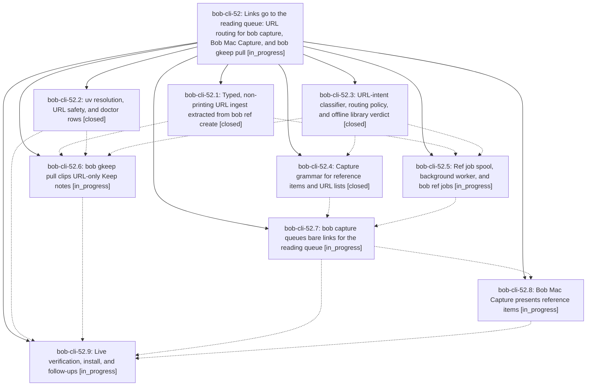

# Bead: bob-cli-52 — Links go to the reading queue: URL routing for bob capture, Bob Mac Capture, and bob gkeep pull

[Bead Pages](../README.md) / bob-cli-52

**Status:** ◐ in_progress · **Type:** ▸ plan · **Tier:** epic
**Owner:** `bryanbugyi34@gmail.com` · **Created by:** [bbugyi200.athena.research.3w.linker.w1](https://github.com/bobs-org/bob-cli--agents/blob/main/sessions/bbugyi200.athena.research.3w.linker.w1.md) · **Assignee:** `bob-cli-52.land`
**Created:** 2026-10-07 08:11:16 EDT
**Plan:** [202610/url\_capture\_ref\_routing.md](https://github.com/bobs-org/bob-cli--plans/blob/main/202610/url_capture_ref_routing.md)

## Description

A bare public link lands in Bob's reading queue instead of becoming an inbox task. This covers a link captured with `bob capture` or Bob Mac Capture, whether alone, in a pasted list, or mixed with ordinary tasks, and a link shared to Google Keep and pulled with `bob gkeep pull`. Every path uses the same ingest engine as `bob ref create`. Capture stays instant, works offline, and never loses a link. The preview says honestly, without touching the network, whether the link is new or already in the library. Submit queues a durable ref job, and a detached background worker clips it. If a clip fails, the link falls back to exactly today's inbox task, plus a ⚠️ reason and a retry command. Keep pull clips inline and archives a note only after a terminal outcome. Bob Mac Capture presents the new reference item beautifully and parses nothing itself. Every path has an opt-out.

## Phases

| Bead | Title | Status | Size | Created | Agents | Commits |
|---|---|---|---|---|---:|---:|
| [bob-cli-52.1](bob-cli-52.1.md) | Typed, non-printing URL ingest extracted from bob ref create | ✓ closed | medium | 2026-10-07 | 1 | 1 |
| [bob-cli-52.2](bob-cli-52.2.md) | uv resolution, URL safety, and doctor rows | ✓ closed | small | 2026-10-07 | 1 | 1 |
| [bob-cli-52.3](bob-cli-52.3.md) | URL-intent classifier, routing policy, and offline library verdict | ✓ closed | small | 2026-10-07 | 1 | 1 |
| [bob-cli-52.4](bob-cli-52.4.md) | Capture grammar for reference items and URL lists | ✓ closed | small | 2026-10-07 | 1 | 1 |
| [bob-cli-52.5](bob-cli-52.5.md) | Ref job spool, background worker, and bob ref jobs | ◐ in_progress | medium | 2026-10-07 | 1 | 0 |
| [bob-cli-52.6](bob-cli-52.6.md) | bob gkeep pull clips URL-only Keep notes | ◐ in_progress | medium | 2026-10-07 | 1 | 0 |
| [bob-cli-52.7](bob-cli-52.7.md) | bob capture queues bare links for the reading queue | ◐ in_progress | medium | 2026-10-07 | 1 | 0 |
| [bob-cli-52.8](bob-cli-52.8.md) | Bob Mac Capture presents reference items | ◐ in_progress | medium | 2026-10-07 | 1 | 0 |
| [bob-cli-52.9](bob-cli-52.9.md) | Live verification, install, and follow-ups | ◐ in_progress | small | 2026-10-07 | 1 | 0 |

## Lineage

## Agents

| Agent | Bead | Commits |
|---|---|---:|
| [bbugyi200.athena.bob-cli-52.1](https://github.com/bobs-org/bob-cli--agents/blob/main/agents/bbugyi200.athena.bob-cli-52.1/README.md) | [bob-cli-52.1](bob-cli-52.1.md) | 1 |
| [bbugyi200.athena.bob-cli-52.2](https://github.com/bobs-org/bob-cli--agents/blob/main/agents/bbugyi200.athena.bob-cli-52.2/README.md) | [bob-cli-52.2](bob-cli-52.2.md) | 1 |
| [bbugyi200.athena.bob-cli-52.3](https://github.com/bobs-org/bob-cli--agents/blob/main/agents/bbugyi200.athena.bob-cli-52.3/README.md) | [bob-cli-52.3](bob-cli-52.3.md) | 1 |
| [bbugyi200.athena.bob-cli-52.4](https://github.com/bobs-org/bob-cli--agents/blob/main/agents/bbugyi200.athena.bob-cli-52.4/README.md) | [bob-cli-52.4](bob-cli-52.4.md) | 1 |
| [bbugyi200.athena.bob-cli-52.5](https://github.com/bobs-org/bob-cli--agents/blob/main/agents/bbugyi200.athena.bob-cli-52.5/README.md) | [bob-cli-52.5](bob-cli-52.5.md) | 0 |
| [bbugyi200.athena.bob-cli-52.6](https://github.com/bobs-org/bob-cli--agents/blob/main/agents/bbugyi200.athena.bob-cli-52.6/README.md) | [bob-cli-52.6](bob-cli-52.6.md) | 0 |
| [bbugyi200.athena.bob-cli-52.7](https://github.com/bobs-org/bob-cli--agents/blob/main/agents/bbugyi200.athena.bob-cli-52.7/README.md) | [bob-cli-52.7](bob-cli-52.7.md) | 0 |
| [bbugyi200.athena.bob-cli-52.8](https://github.com/bobs-org/bob-cli--agents/blob/main/agents/bbugyi200.athena.bob-cli-52.8/README.md) | [bob-cli-52.8](bob-cli-52.8.md) | 0 |
| [bbugyi200.athena.bob-cli-52.9](https://github.com/bobs-org/bob-cli--agents/blob/main/agents/bbugyi200.athena.bob-cli-52.9/README.md) | [bob-cli-52.9](bob-cli-52.9.md) | 0 |
| [bbugyi200.athena.bob-cli-52.land](https://github.com/bobs-org/bob-cli--agents/blob/main/agents/bbugyi200.athena.bob-cli-52.land/README.md) | [bob-cli-52](README.md) | 0 |

## Commits

| Repo | Commit | Subject | Bead | Committed |
|---|---|---|---|---|
| bob-cli | [`3232214`](https://github.com/bobs-org/bob-cli/commit/32322146c23cdd625f1b84b9250bb163f8d34296) | feat(hardening): shared uv resolution, URL safety, and doctor rows | [bob-cli-52.2](bob-cli-52.2.md) | 2026-10-07 08:39:11 EDT |
| bob-cli | [`2eafe60`](https://github.com/bobs-org/bob-cli/commit/2eafe60c505be3852633cb61e1f2cc29db409b17) | feat(ref): add typed non-printing URL ingest for reading queue | [bob-cli-52.1](bob-cli-52.1.md) | 2026-10-07 08:41:05 EDT |
| bob-cli | [`df9d504`](https://github.com/bobs-org/bob-cli/commit/df9d504fb937a9ba80bf7ec51f6d8ead285fac62) | feat(url-routing): add intent classifier, routing policy, and offline library verdict | [bob-cli-52.3](bob-cli-52.3.md) | 2026-10-07 09:01:44 EDT |
| bob-cli | [`98fd8ae`](https://github.com/bobs-org/bob-cli/commit/98fd8ae492c59ed08e843e713e023595246febea) | feat(capture): add reference item grammar with routing-gated Ref kind | [bob-cli-52.4](bob-cli-52.4.md) | 2026-10-07 09:29:14 EDT |
