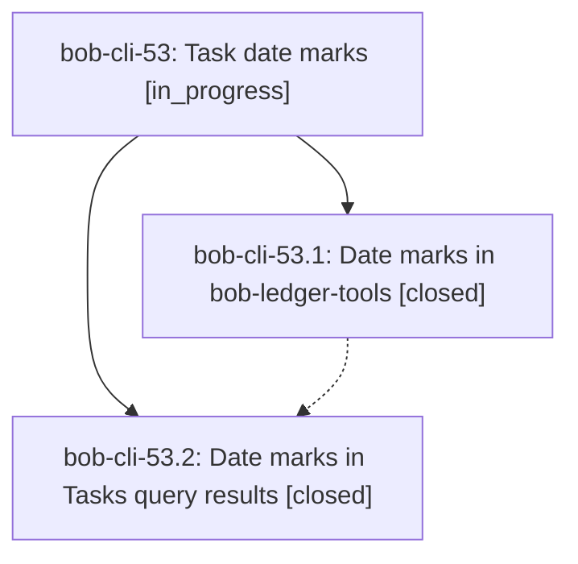

# Bead: bob-cli-53 — Task date marks

[Bead Pages](../README.md) / bob-cli-53

**Status:** ◐ in_progress · **Type:** ▸ plan · **Tier:** epic
**Owner:** `bryanbugyi34@gmail.com` · **Created by:** [bbugyi200.athena.0xq](https://github.com/bobs-org/bob-cli--agents/blob/main/sessions/bbugyi200.athena.0xq.md) · **Assignee:** `bob-cli-53.land`
**Created:** 2026-10-07 08:19:06 EDT
**Plan:** [202610/task\_date\_marks.md](https://github.com/bobs-org/bob-cli--plans/blob/main/202610/task_date_marks.md)

## Description

In Obsidian, every canonical `created`, `scheduled`, `completion`, and `cancelled` task date renders as a small monochrome icon plus a calendar label (`today`, `tomorrow`, `Fri`, `Oct 22`) instead of a `KEY | YYYY-MM-DD` Dataview pill. This works in Live Preview, reading view, embeds, hover previews, Dataview task views, and Tasks query results. The stored Markdown never changes, the cursor still reveals the raw field for editing, and malformed date fields get a visible repair flag.

## Phases

| Bead | Title | Status | Size | Created | Agents | Commits |
|---|---|---|---|---|---:|---:|
| [bob-cli-53.1](bob-cli-53.1.md) | Date marks in bob-ledger-tools | ✓ closed | medium | 2026-10-07 | 1 | 2 |
| [bob-cli-53.2](bob-cli-53.2.md) | Date marks in Tasks query results | ✓ closed | small | 2026-10-07 | 1 | 2 |

## Lineage

## Agents

| Agent | Bead | Commits |
|---|---|---:|
| [bbugyi200.athena.bob-cli-53.1](https://github.com/bobs-org/bob-cli--agents/blob/main/agents/bbugyi200.athena.bob-cli-53.1/README.md) | [bob-cli-53.1](bob-cli-53.1.md) | 2 |
| [bbugyi200.athena.bob-cli-53.2](https://github.com/bobs-org/bob-cli--agents/blob/main/agents/bbugyi200.athena.bob-cli-53.2/README.md) | [bob-cli-53.2](bob-cli-53.2.md) | 2 |
| [bbugyi200.athena.bob-cli-53.land](https://github.com/bobs-org/bob-cli--agents/blob/main/agents/bbugyi200.athena.bob-cli-53.land/README.md) | [bob-cli-53](README.md) | 0 |

## Commits

| Repo | Commit | Subject | Bead | Committed |
|---|---|---|---|---|
| bob-cli | [`67f0cbb`](https://github.com/bobs-org/bob-cli/commit/67f0cbb7b48505f2caa88976fd40ae30de1eda4f) | feat(docs): add task date marks display contract (bob-cli-53.1) | [bob-cli-53.1](bob-cli-53.1.md) | 2026-10-07 08:56:51 EDT |
| bob-plugins | [`bob-plugins@d29034b`](https://github.com/bobs-org/bob-plugins/commit/d29034b42f5db394c05748ca0ffb21ae6ebfb58d) | feat(ledger-tools): render canonical task dates as compact date marks (bob-cli-53.1) | [bob-cli-53.1](bob-cli-53.1.md) | 2026-10-07 08:57:41 EDT |
| bob-cli | [`b5a0258`](https://github.com/bobs-org/bob-cli/commit/b5a0258de16d872bb69eea968f50478f0f6909f6) | docs(date-marks): document Tasks query results date marks (T1-T9) | [bob-cli-53.2](bob-cli-53.2.md) | 2026-10-07 09:12:44 EDT |
| bob-plugins | [`bob-plugins@ced2675`](https://github.com/bobs-org/bob-plugins/commit/ced2675a8d54d550952a28932544df83af4ca6ab) | feat(ledger-tools): decorate Tasks query results with date marks (1.32.0) | [bob-cli-53.2](bob-cli-53.2.md) | 2026-10-07 09:13:33 EDT |
