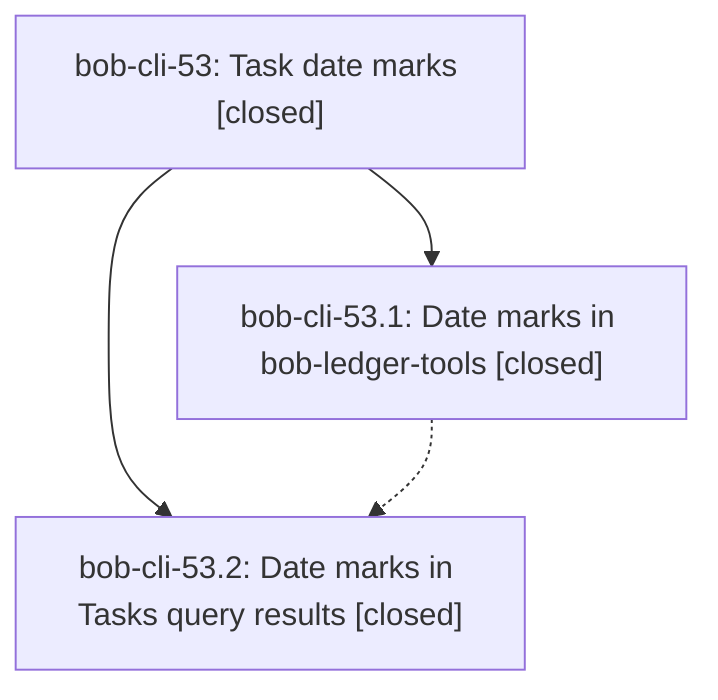

# Bead: bob-cli-53 — Task date marks

[Bead Pages](../README.md) / bob-cli-53

**Status:** ✓ closed · **Resolution:** done · **Type:** ▸ plan · **Tier:** epic
**Owner:** `bryanbugyi34@gmail.com` · **Created by:** [bbugyi200.athena.0xq](https://github.com/bobs-org/bob-cli--agents/blob/main/sessions/bbugyi200.athena.0xq.md) · **Assignee:** `bob-cli-53.land`
**Created:** 2026-10-07 08:19:06 EDT · **Closed:** 2026-10-07 09:35:10 EDT
**Plan:** [202610/task\_date\_marks.md](https://github.com/bobs-org/bob-cli--plans/blob/main/202610/task_date_marks.md)

## Description

In Obsidian, every canonical `created`, `scheduled`, `completion`, and `cancelled` task date renders as a small monochrome icon plus a calendar label (`today`, `tomorrow`, `Fri`, `Oct 22`) instead of a `KEY | YYYY-MM-DD` Dataview pill. This works in Live Preview, reading view, embeds, hover previews, Dataview task views, and Tasks query results. The stored Markdown never changes, the cursor still reveals the raw field for editing, and malformed date fields get a visible repair flag.

## Notes

[2026-10-07T13:24:08Z · bob-cli-53.land] LANDING VERIFY: Reviewed the epic (no prior epic notes), bob-cli-53.1 note #1, bob-cli-53.2 note #1, approved plan:202610/task_date_marks.md, primary commits 67f0cbb/b5a0258, and linked bob-plugins commits d29034b/ced2675 with source, tests, lifecycle wiring, CSS, and docs. Both children are closed. Current date-mark suites pass 46/46, build:check passes, validate passes 6/6, and bob plugins list --no-pull against the audited linked checkout confirms bob-ledger-tools 1.32.0 enabled and byte-identical in the vault (all six plugins synced). Installed Tasks 8.4.0 confirms the documented row, completion marker, date hosts, and click/contextmenu listeners. Live Obsidian verification remains pending for Bryan, explicitly permitted by the approved Done when criteria. Integration audit: fetched primary origin/master and inspected every non-epic commit since epic creation at 2026-10-07 08:19:06 EDT (3232214 uv/URL hardening, 2eafe60 URL ingest, df9d504 URL routing); none changes Obsidian rendering or should consume the display-only dateMarks API. Linked plugin origin/master has no non-epic commits during this interval. No integration edits required. No parent_bead is currently linked; epic-symbols reports no entries.

[2026-10-07T13:24:14Z · bob-cli-53.land] DISCOVERED ISSUE: Tasks full-mode dates never decorate in a real browser. In bob-plugins plugins/bob-ledger-tools/src/267-plugin-date-marks-tasks.js, decorateTasksResultDates calls (li.childNodes || []).slice(); real DOM childNodes is a NodeList with no slice method. The caught exception returns 0 before scanning hosts. Headless Chrome against this exact fragment reported nodeListSlice undefined, decorated 0, marks 0. A NodeList-like reproduction using the phase test fixture also returns 0 with no data-bob-date-mark flag while the unchanged array control returns 1. Existing tests hide the defect by representing childNodes as arrays. This is unfinished bob-cli-53.2 work, not a separate task. Also reproduced: queue a complete row with manualScheduler, call toggleDateMarks to turn marks off, drain its queued frame; one mark is still appended with dateMarksEnabled false. runTasksResultDateMarkFrame lacks a disabled guard, and onunload leaves dateMarksEnabled/Tasks queue active. Repair real DOM traversal and late frame shutdown, add regression coverage, deploy, and perform epic closeout in one tale coder turn.

[2026-10-07T13:24:19Z · bob-cli-53.land] FOLLOW-UP TRIAGE before remaining-work tale: Read every note on bob-cli-53.1 and bob-cli-53.2; neither contains any PROPOSED FOLLOW-UP entry. There are no proposed distinct non-epic follow-ups to corroborate, attach, create, or decline. The NodeList traversal failure and queued-frame toggle/teardown issue are caused by this epic and stay in its remaining scope. No task beads were created. Verification limitation: the current bob-cli justfile has no check recipe (just check exits 1 with recipe missing), and no symvision recipe; bob-plugins has no justfile. Use the plugin build/test/validate gates and record this command availability; do not run just check-full or add unrelated infrastructure work.

[2026-10-07T13:35:10Z · bob-cli-53.land] Repaired Tasks date marks and landed epic: 267 uses Array.from(li.childNodes) for real NodeList traversal and runTasksResultDateMarkFrame drops its queue when marks are disabled; 170 onunload disables marks and clears Tasks queue/pending/dedup; fixture childNodes is NodeList-like without array methods with T10 direct+queued Fri/idempotent/native-span checks and T11 toggle-off, T12 pending-retry+disable, T13 unload shutdown plus re-enable checks. Tests: tasks 16/16, date-mark focused 50/50, npm test 2044/2044, validate 6/6, build:check pass; new T10-T13 fail on old code (10 fail). Deployed bob-ledger-tools 1.32.1 via plugins sync, list confirms synced/enabled/drift 0. Integration: primary 98fd8ae capture Ref grammar (Rust only) and bob-plugins 881b9ad block-id-prompt (other plugin) have no dateMarks overlap, no edits. Follow-up triage finished: neither child has PROPOSED FOLLOW-UP, no beads created. just check and just symvision have no recipes in either repo; used plugin gates, did not run just check-full. Live Obsidian/iOS checklist remains pending for Bryan per Done when.

## Phases

| Bead | Title | Status | Size | Created | Agents | Commits |
|---|---|---|---|---|---:|---:|
| [bob-cli-53.1](bob-cli-53.1.md) | Date marks in bob-ledger-tools | ✓ closed | medium | 2026-10-07 | 1 | 2 |
| [bob-cli-53.2](bob-cli-53.2.md) | Date marks in Tasks query results | ✓ closed | small | 2026-10-07 | 1 | 2 |

## Lineage

## Agents

| Agent | Bead | Commits |
|---|---|---:|
| [bbugyi200.athena.bob-cli-53.1](https://github.com/bobs-org/bob-cli--agents/blob/main/agents/bbugyi200.athena.bob-cli-53.1/README.md) | [bob-cli-53.1](bob-cli-53.1.md) | 2 |
| [bbugyi200.athena.bob-cli-53.2](https://github.com/bobs-org/bob-cli--agents/blob/main/agents/bbugyi200.athena.bob-cli-53.2/README.md) | [bob-cli-53.2](bob-cli-53.2.md) | 2 |
| [bbugyi200.athena.bob-cli-53.land](https://github.com/bobs-org/bob-cli--agents/blob/main/sessions/bbugyi200.athena.bob-cli-53.land.md) | [bob-cli-53](README.md) | 3 |

## Commits

| Repo | Commit | Subject | Bead | Committed |
|---|---|---|---|---|
| bob-cli | [`67f0cbb`](https://github.com/bobs-org/bob-cli/commit/67f0cbb7b48505f2caa88976fd40ae30de1eda4f) | feat(docs): add task date marks display contract (bob-cli-53.1) | [bob-cli-53.1](bob-cli-53.1.md) | 2026-10-07 08:56:51 EDT |
| bob-plugins | [`bob-plugins@d29034b`](https://github.com/bobs-org/bob-plugins/commit/d29034b42f5db394c05748ca0ffb21ae6ebfb58d) | feat(ledger-tools): render canonical task dates as compact date marks (bob-cli-53.1) | [bob-cli-53.1](bob-cli-53.1.md) | 2026-10-07 08:57:41 EDT |
| bob-cli | [`b5a0258`](https://github.com/bobs-org/bob-cli/commit/b5a0258de16d872bb69eea968f50478f0f6909f6) | docs(date-marks): document Tasks query results date marks (T1-T9) | [bob-cli-53.2](bob-cli-53.2.md) | 2026-10-07 09:12:44 EDT |
| bob-plugins | [`bob-plugins@ced2675`](https://github.com/bobs-org/bob-plugins/commit/ced2675a8d54d550952a28932544df83af4ca6ab) | feat(ledger-tools): decorate Tasks query results with date marks (1.32.0) | [bob-cli-53.2](bob-cli-53.2.md) | 2026-10-07 09:13:33 EDT |
| bob-cli | [`bed1e5d`](https://github.com/bobs-org/bob-cli/commit/bed1e5d681897016405155098cfab7373468e1b3) | docs(date-marks): describe Tasks-result shutdown guarantee | [bob-cli-53](README.md) | 2026-10-07 09:37:31 EDT |
| bob-plugins | [`bob-plugins@344bfca`](https://github.com/bobs-org/bob-plugins/commit/344bfcaea975f95c0d1bd073573990bdb6460ff2) | fix(ledger-tools): repair Tasks date-mark traversal and queued-frame shutdown | [bob-cli-53](README.md) | 2026-10-07 09:38:12 EDT |
| bob-cli--plans | [`bob-cli--plans@01431e8`](https://github.com/bobs-org/bob-cli--plans/commit/01431e8c66867ee7f85aaa479f6fff1380ef9566) | docs(plans): mark task date marks plan done | [bob-cli-53](README.md) | 2026-10-07 09:38:47 EDT |
