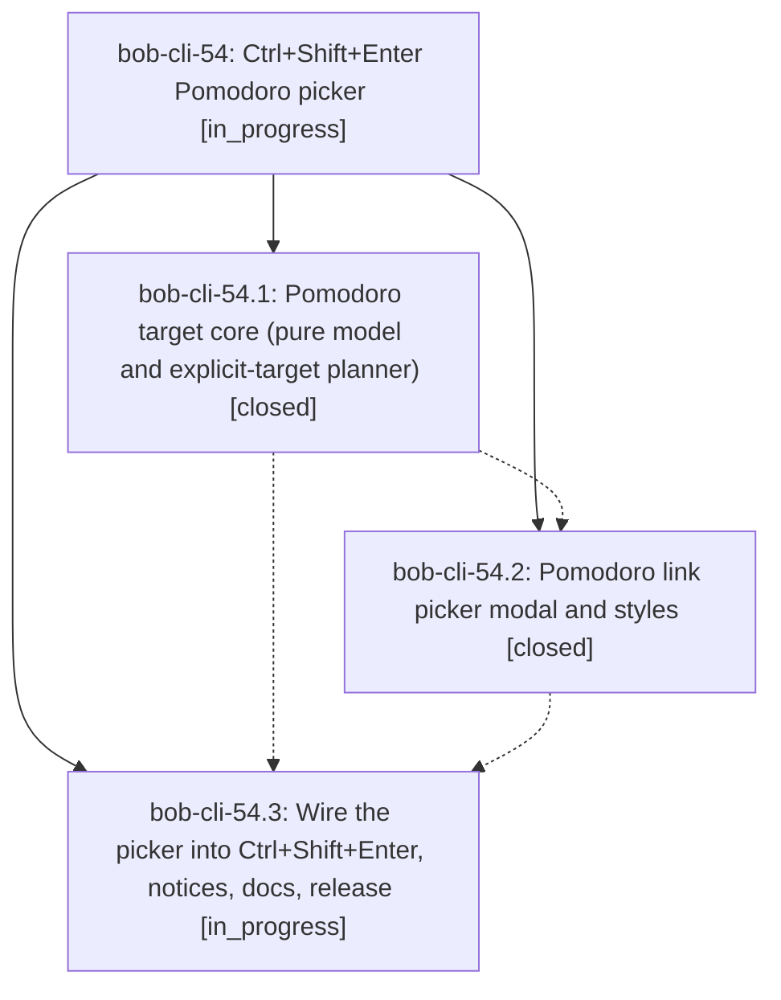

# Bead: bob-cli-54 — Ctrl+Shift+Enter Pomodoro picker

[Bead Pages](../README.md) / bob-cli-54

**Status:** ◐ in_progress · **Type:** ▸ plan · **Tier:** epic
**Owner:** `bryanbugyi34@gmail.com` · **Created by:** [bbugyi200.apollo.5h](https://github.com/bobs-org/bob-cli--agents/blob/main/agents/bbugyi200.apollo.5h/README.md) · **Assignee:** `bob-cli-54.land`
**Created:** 2026-10-07 09:22:15 EDT
**Plan:** [202610/ctrl\_shift\_enter\_pomodoro\_picker.md](https://github.com/bobs-org/bob-cli--plans/blob/main/202610/ctrl_shift_enter_pomodoro_picker.md)

## Description

Ctrl+Shift+Enter on an unlinked task asks which of today's Pomodoros to link it into: Enter takes the current/first future Pomodoro, typing filters, and a new name creates a Pomodoro with bob capture's rules, in a reliable, stale-safe, and polished picker.

## Phases

| Bead | Title | Status | Size | Created | Agents | Commits |
|---|---|---|---|---|---:|---:|
| [bob-cli-54.1](bob-cli-54.1.md) | Pomodoro target core (pure model and explicit-target planner) | ✓ closed | medium | 2026-10-07 | 1 | 1 |
| [bob-cli-54.2](bob-cli-54.2.md) | Pomodoro link picker modal and styles | ✓ closed | medium | 2026-10-07 | 1 | 1 |
| [bob-cli-54.3](bob-cli-54.3.md) | Wire the picker into Ctrl+Shift+Enter, notices, docs, release | ◐ in_progress | medium | 2026-10-07 | 1 | 0 |

## Lineage

## Agents

| Agent | Bead | Commits |
|---|---|---:|
| [bbugyi200.apollo.bob-cli-54.1](https://github.com/bobs-org/bob-cli--agents/blob/main/agents/bbugyi200.apollo.bob-cli-54.1/README.md) | [bob-cli-54.1](bob-cli-54.1.md) | 1 |
| [bbugyi200.apollo.bob-cli-54.2](https://github.com/bobs-org/bob-cli--agents/blob/main/agents/bbugyi200.apollo.bob-cli-54.2/README.md) | [bob-cli-54.2](bob-cli-54.2.md) | 1 |
| [bbugyi200.apollo.bob-cli-54.3](https://github.com/bobs-org/bob-cli--agents/blob/main/agents/bbugyi200.apollo.bob-cli-54.3/README.md) | [bob-cli-54.3](bob-cli-54.3.md) | 0 |
| [bbugyi200.apollo.bob-cli-54.land](https://github.com/bobs-org/bob-cli--agents/blob/main/agents/bbugyi200.apollo.bob-cli-54.land/README.md) | [bob-cli-54](README.md) | 0 |

## Commits

| Repo | Commit | Subject | Bead | Committed |
|---|---|---|---|---|
| bob-plugins | [`bob-plugins@881b9ad`](https://github.com/bobs-org/bob-plugins/commit/881b9adb5f6cfb8760fbc68b6459aab11d01e301) | feat(block-id-prompt): add explicit pomodoro link target planning | [bob-cli-54.1](bob-cli-54.1.md) | 2026-10-07 09:33:48 EDT |
| bob-plugins | [`bob-plugins@c4b42a0`](https://github.com/bobs-org/bob-plugins/commit/c4b42a03729ae14d7b76c9c5cc713ff067de8b4f) | feat(block-id-prompt): add promise-based Link to today picker modal | [bob-cli-54.2](bob-cli-54.2.md) | 2026-10-07 09:45:01 EDT |
