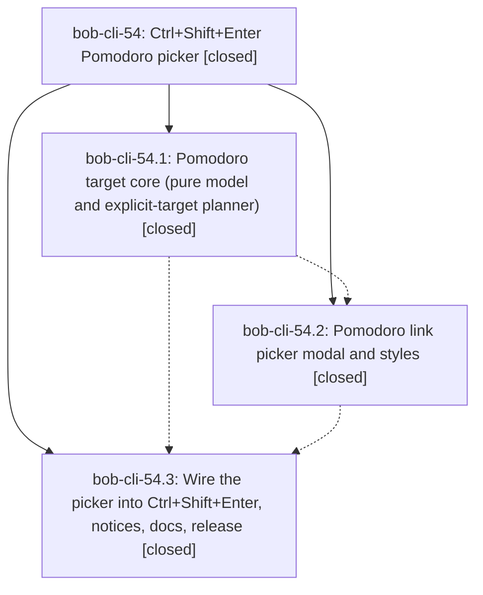

# Bead: bob-cli-54 — Ctrl+Shift+Enter Pomodoro picker

[Bead Pages](../README.md) / bob-cli-54

**Status:** ✓ closed · **Resolution:** done · **Type:** ▸ plan · **Tier:** epic
**Owner:** `bryanbugyi34@gmail.com` · **Created by:** [bbugyi200.apollo.5h](https://github.com/bobs-org/bob-cli--agents/blob/main/agents/bbugyi200.apollo.5h/README.md) · **Assignee:** `bob-cli-54.land`
**Created:** 2026-10-07 09:22:15 EDT · **Closed:** 2026-10-07 10:34:12 EDT
**Plan:** [202610/ctrl\_shift\_enter\_pomodoro\_picker.md](https://github.com/bobs-org/bob-cli--plans/blob/main/202610/ctrl_shift_enter_pomodoro_picker.md)

## Description

Ctrl+Shift+Enter on an unlinked task asks which of today's Pomodoros to link it into: Enter takes the current/first future Pomodoro, typing filters, and a new name creates a Pomodoro with bob capture's rules, in a reliable, stale-safe, and polished picker.

## Notes

[2026-10-07T14:26:32Z · bob-cli-54.land] Follow-up triage before the landing tale. Reviewed notes on bob-cli-54.1, bob-cli-54.2, and bob-cli-54.3: none contain a PROPOSED FOLLOW-UP entry, so nothing was corroborated or filed from a child note.

Declined filing the plan's out-of-scope list as task beads. Those items (relocate an already-linked task from the picker, a picker-free command or setting, and showing completed Pomodoros, renaming entries, or starting a session) are the approved plan's exclusions, not defects this epic caused and not discovered work. Filing them would start a wish list.

Remaining work is caused by this epic and stays on it: readPlanBudgetMeter copies an overall over status onto both per-cap flags, so the create-row theme badge turns red when only the link cap is exceeded; exact-name checks compare the raw stored name to the canonical query, so a mixed-case open name can still offer a duplicate create; #N ranking uses query.includes, so #10 also matches Pomodoro #1. A small tale will fix those three and then close this epic.

[2026-10-07T14:34:12Z · bob-cli-54.land] Verified phases bob-cli-54.1, bob-cli-54.2, and bob-cli-54.3 against source and commits 881b9ad, c4b42a0, and d0680d1 in bob-plugins plus 9c825ca docs in bob-cli. The pure target model, Link to today modal, Ctrl+Shift+Enter wiring, destination notices, version 1.24.0, and docs match the epic plan. Fifty-seven picker tests passed before these parity fixes; npm test, npm run validate, and bob plugins sync passed after them. No child note had a PROPOSED FOLLOW-UP. The plan's out-of-scope items were not filed. Commits after the epic started outside its own commits (ledger date-mark repair, date-marks docs, gkeep pull, capture ref grammar, and the tickler freshness rename) do not touch the picker and needed no integration edit. Landed three parity fixes: per-cap meter over flags stay independent, exact canonical names suppress duplicate creates including mixed-case stored names, and a #N query no longer matches a shorter position. epic-symbols clean.

## Phases

| Bead | Title | Status | Size | Created | Agents | Commits |
|---|---|---|---|---|---:|---:|
| [bob-cli-54.1](bob-cli-54.1.md) | Pomodoro target core (pure model and explicit-target planner) | ✓ closed | medium | 2026-10-07 | 1 | 1 |
| [bob-cli-54.2](bob-cli-54.2.md) | Pomodoro link picker modal and styles | ✓ closed | medium | 2026-10-07 | 1 | 1 |
| [bob-cli-54.3](bob-cli-54.3.md) | Wire the picker into Ctrl+Shift+Enter, notices, docs, release | ✓ closed | medium | 2026-10-07 | 1 | 2 |

## Lineage

## Agents

| Agent | Bead | Commits |
|---|---|---:|
| [bbugyi200.apollo.bob-cli-54.1](https://github.com/bobs-org/bob-cli--agents/blob/main/agents/bbugyi200.apollo.bob-cli-54.1/README.md) | [bob-cli-54.1](bob-cli-54.1.md) | 1 |
| [bbugyi200.apollo.bob-cli-54.2](https://github.com/bobs-org/bob-cli--agents/blob/main/agents/bbugyi200.apollo.bob-cli-54.2/README.md) | [bob-cli-54.2](bob-cli-54.2.md) | 1 |
| [bbugyi200.apollo.bob-cli-54.3](https://github.com/bobs-org/bob-cli--agents/blob/main/agents/bbugyi200.apollo.bob-cli-54.3/README.md) | [bob-cli-54.3](bob-cli-54.3.md) | 2 |
| [bbugyi200.apollo.bob-cli-54.land](https://github.com/bobs-org/bob-cli--agents/blob/main/sessions/bbugyi200.apollo.bob-cli-54.land.md) | [bob-cli-54](README.md) | 2 |

## Commits

| Repo | Commit | Subject | Bead | Committed |
|---|---|---|---|---|
| bob-plugins | [`bob-plugins@881b9ad`](https://github.com/bobs-org/bob-plugins/commit/881b9adb5f6cfb8760fbc68b6459aab11d01e301) | feat(block-id-prompt): add explicit pomodoro link target planning | [bob-cli-54.1](bob-cli-54.1.md) | 2026-10-07 09:33:48 EDT |
| bob-plugins | [`bob-plugins@c4b42a0`](https://github.com/bobs-org/bob-plugins/commit/c4b42a03729ae14d7b76c9c5cc713ff067de8b4f) | feat(block-id-prompt): add promise-based Link to today picker modal | [bob-cli-54.2](bob-cli-54.2.md) | 2026-10-07 09:45:01 EDT |
| bob-cli | [`9c825ca`](https://github.com/bobs-org/bob-cli/commit/9c825cacdf8e4713fe6f40241504026df5dd8f46) | docs(plan): link-to-today picker docs for Ctrl+Shift+Enter | [bob-cli-54.3](bob-cli-54.3.md) | 2026-10-07 10:04:30 EDT |
| bob-plugins | [`bob-plugins@d0680d1`](https://github.com/bobs-org/bob-plugins/commit/d0680d179a4cff1c1485f314c12dff82b42f108a) | feat(block-id-prompt): wire Link to today picker into Ctrl+Shift+Enter | [bob-cli-54.3](bob-cli-54.3.md) | 2026-10-07 10:05:17 EDT |
| bob-plugins | [`bob-plugins@361996b`](https://github.com/bobs-org/bob-plugins/commit/361996b005815eeab4e2645bfac3cd16d368adb6) | fix(block-id-prompt): keep per-cap meter flags independent, match exact canonical names, bound #N positions | [bob-cli-54](README.md) | 2026-10-07 10:38:08 EDT |
| bob-cli--plans | [`bob-cli--plans@1b09a2f`](https://github.com/bobs-org/bob-cli--plans/commit/1b09a2fa8c2bee72c39a4c6024a18df460e16eef) | docs(plans): mark pomodoro picker epic plan done | [bob-cli-54](README.md) | 2026-10-07 10:38:48 EDT |
