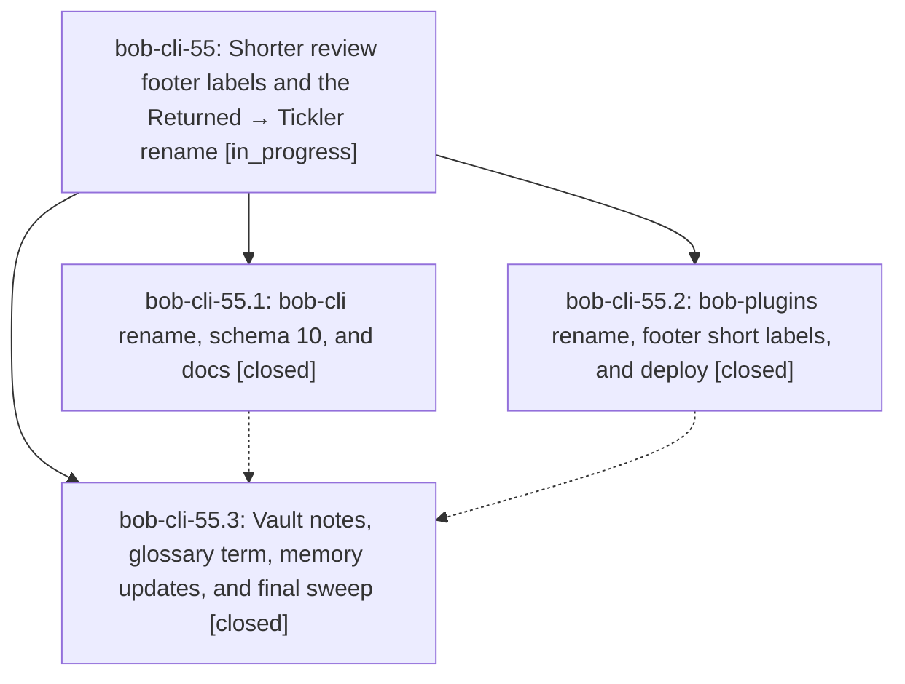

# Bead: bob-cli-55 — Shorter review footer labels and the Returned → Tickler rename

[Bead Pages](../README.md) / bob-cli-55

**Status:** ◐ in_progress · **Type:** ▸ plan · **Tier:** epic
**Owner:** `bryanbugyi34@gmail.com` · **Created by:** [bbugyi200.apollo.5i](https://github.com/bobs-org/bob-cli--agents/blob/main/sessions/bbugyi200.apollo.5i.md) · **Assignee:** `bob-cli-55.land`
**Created:** 2026-10-07 09:55:36 EDT
**Plan:** [202610/review\_footer\_short\_labels\_tickler.md](https://github.com/bobs-org/bob-cli--plans/blob/main/202610/review_footer_short_labels_tickler.md)

## Description

The morning GTD review footer shows WIP, TICKS, and REFS instead of PENDING, RETURNED, and REFERENCES; the Returned walk tier is renamed Tickler across bob-cli, bob-plugins, the Bob vault, and SASE memory; and a new glossary term defines the review footer.

## Phases

| Bead | Title | Status | Size | Created | Agents | Commits |
|---|---|---|---|---|---:|---:|
| [bob-cli-55.1](bob-cli-55.1.md) | bob-cli rename, schema 10, and docs | ✓ closed | medium | 2026-10-07 | 1 | 1 |
| [bob-cli-55.2](bob-cli-55.2.md) | bob-plugins rename, footer short labels, and deploy | ✓ closed | medium | 2026-10-07 | 1 | 1 |
| [bob-cli-55.3](bob-cli-55.3.md) | Vault notes, glossary term, memory updates, and final sweep | ✓ closed | small | 2026-10-07 | 1 | 1 |

## Lineage

## Agents

| Agent | Bead | Commits |
|---|---|---:|
| [bbugyi200.apollo.bob-cli-55.1](https://github.com/bobs-org/bob-cli--agents/blob/main/agents/bbugyi200.apollo.bob-cli-55.1/README.md) | [bob-cli-55.1](bob-cli-55.1.md) | 1 |
| [bbugyi200.apollo.bob-cli-55.2](https://github.com/bobs-org/bob-cli--agents/blob/main/agents/bbugyi200.apollo.bob-cli-55.2/README.md) | [bob-cli-55.2](bob-cli-55.2.md) | 1 |
| [bbugyi200.apollo.bob-cli-55.3](https://github.com/bobs-org/bob-cli--agents/blob/main/agents/bbugyi200.apollo.bob-cli-55.3/README.md) | [bob-cli-55.3](bob-cli-55.3.md) | 1 |
| [bbugyi200.apollo.bob-cli-55.land](https://github.com/bobs-org/bob-cli--agents/blob/main/agents/bbugyi200.apollo.bob-cli-55.land/README.md) | [bob-cli-55](README.md) | 0 |

## Commits

| Repo | Commit | Subject | Bead | Committed |
|---|---|---|---|---|
| bob-plugins | [`bob-plugins@cf0053c`](https://github.com/bobs-org/bob-plugins/commit/cf0053ca7851862cacc992b56a08be34fcf36af4) | feat(freshness): rename returned tier to tickler with footer abbreviations | [bob-cli-55.2](bob-cli-55.2.md) | 2026-10-07 10:08:00 EDT |
| bob-cli | [`e5d12ca`](https://github.com/bobs-org/bob-cli/commit/e5d12ca4407baca64a859f89402d2d245dea5582) | feat(freshness): rename Returned walk tier to Tickler, schema 10 | [bob-cli-55.1](bob-cli-55.1.md) | 2026-10-07 10:08:58 EDT |
| bob-cli | [`092e098`](https://github.com/bobs-org/bob-cli/commit/092e09811da83c7447bb101fd734b5d8f1c9edb5) | docs(memory): rename RETURNED lane to TICKLER and add review-footer term | [bob-cli-55.3](bob-cli-55.3.md) | 2026-10-07 10:15:48 EDT |
