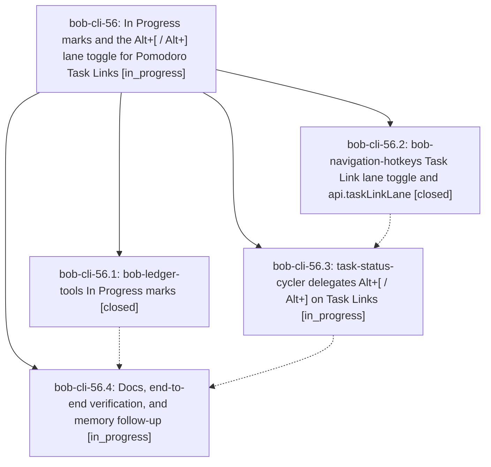

# Bead: bob-cli-56 — In Progress marks and the Alt+\[ / Alt+\] lane toggle for Pomodoro Task Links

[Bead Pages](../README.md) / bob-cli-56

**Status:** ◐ in_progress · **Type:** ▸ plan · **Tier:** epic
**Owner:** `bryanbugyi34@gmail.com` · **Created by:** [bbugyi200.apollo.5j](https://github.com/bobs-org/bob-cli--agents/blob/main/sessions/bbugyi200.apollo.5j.md) · **Assignee:** `bob-cli-56.land`
**Created:** 2026-10-07 10:18:28 EDT
**Plan:** [202610/in\_progress\_task\_link\_marks.md](https://github.com/bobs-org/bob-cli--plans/blob/main/202610/in_progress_task_link_marks.md)

## Description

In today's daily note, every Task Link under an open Pomodoro whose task is In Progress `[/]` shows a rendered amber half-ring mark (Next shows none), and Alt+[ / Alt+] on any Pomodoro Task Link toggles its task between Next and In Progress, offering an optional Work Log entry when it goes back to Next. Nothing new is ever written into the daily note.

## Phases

| Bead | Title | Status | Size | Created | Agents | Commits |
|---|---|---|---|---|---:|---:|
| [bob-cli-56.1](bob-cli-56.1.md) | bob-ledger-tools In Progress marks | ✓ closed | medium | 2026-10-07 | 1 | 1 |
| [bob-cli-56.2](bob-cli-56.2.md) | bob-navigation-hotkeys Task Link lane toggle and api.taskLinkLane | ✓ closed | medium | 2026-10-07 | 1 | 1 |
| [bob-cli-56.3](bob-cli-56.3.md) | task-status-cycler delegates Alt+\[ / Alt+\] on Task Links | ◐ in_progress | small | 2026-10-07 | 1 | 0 |
| [bob-cli-56.4](bob-cli-56.4.md) | Docs, end-to-end verification, and memory follow-up | ◐ in_progress | small | 2026-10-07 | 1 | 0 |

## Lineage

## Agents

| Agent | Bead | Commits |
|---|---|---:|
| [bbugyi200.apollo.bob-cli-56.1](https://github.com/bobs-org/bob-cli--agents/blob/main/agents/bbugyi200.apollo.bob-cli-56.1/README.md) | [bob-cli-56.1](bob-cli-56.1.md) | 1 |
| [bbugyi200.apollo.bob-cli-56.2](https://github.com/bobs-org/bob-cli--agents/blob/main/agents/bbugyi200.apollo.bob-cli-56.2/README.md) | [bob-cli-56.2](bob-cli-56.2.md) | 1 |
| [bbugyi200.apollo.bob-cli-56.3](https://github.com/bobs-org/bob-cli--agents/blob/main/agents/bbugyi200.apollo.bob-cli-56.3/README.md) | [bob-cli-56.3](bob-cli-56.3.md) | 0 |
| [bbugyi200.apollo.bob-cli-56.4](https://github.com/bobs-org/bob-cli--agents/blob/main/agents/bbugyi200.apollo.bob-cli-56.4/README.md) | [bob-cli-56.4](bob-cli-56.4.md) | 0 |
| [bbugyi200.apollo.bob-cli-56.land](https://github.com/bobs-org/bob-cli--agents/blob/main/agents/bbugyi200.apollo.bob-cli-56.land/README.md) | [bob-cli-56](README.md) | 0 |

## Commits

| Repo | Commit | Subject | Bead | Committed |
|---|---|---|---|---|
| bob-plugins | [`bob-plugins@7ea2dc8`](https://github.com/bobs-org/bob-plugins/commit/7ea2dc8e8fc20284050832cd6993d64e382af735) | feat(ledger-tools): render In Progress half-ring marks on Pomodoro Task Links (bob-cli-56.1) | [bob-cli-56.1](bob-cli-56.1.md) | 2026-10-07 10:36:55 EDT |
| bob-plugins | [`bob-plugins@936fec4`](https://github.com/bobs-org/bob-plugins/commit/936fec4621fb6c2c846247be3fb3e23bb7cd2d45) | feat(nav): Pomodoro Task Link Next/In Progress lane toggle with api.taskLinkLane v1 | [bob-cli-56.2](bob-cli-56.2.md) | 2026-10-07 10:42:34 EDT |
