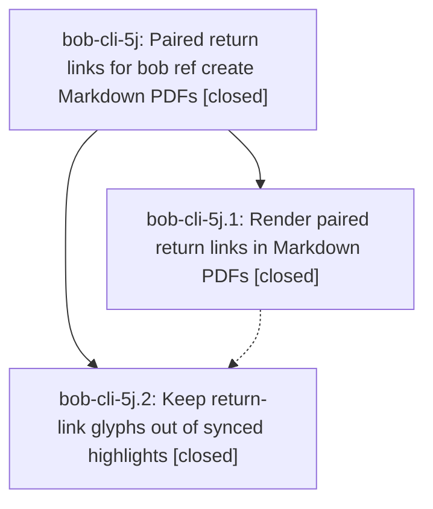

# Bead: bob-cli-5j — Paired return links for bob ref create Markdown PDFs

[Bead Pages](../README.md) / bob-cli-5j

**Status:** ✓ closed · **Resolution:** done · **Type:** ▸ plan · **Tier:** epic
**Owner:** `bryanbugyi34@gmail.com` · **Created by:** [bbugyi200.athena.research.3x.linker.w0](https://github.com/bobs-org/bob-cli--agents/blob/main/sessions/bbugyi200.athena.research.3x.linker.w0.md) · **Assignee:** `bob-cli-5j.land`
**Created:** 2026-10-07 14:27:22 EDT · **Closed:** 2026-10-07 16:57:10 EDT
**Plan:** [202610/ref\_create\_return\_links.md](https://github.com/bobs-org/bob-cli--plans/blob/main/202610/ref_create_return_links.md)

<!-- sase:links:start -->

## Links

| Relation | Artifact | Why |
| --- | --- | --- |
| implemented-by | [plan:202610/ref_create_return_links.md][1] | derived from the plan's `bead_id:` frontmatter field |
| related | file:explicit:6820361e338367179bec63c4 | attached via sase artifact create --bead |

[1]: https://github.com/bobs-org/bob-cli--plans/blob/main/202610/ref_create_return_links.md

<!-- sase:links:end -->

## Description

Every same-document link in a Markdown PDF rendered by `bob ref create` carries a small raised letter tag, and its target shows a matching `↩ p. N` return pill that jumps back to the passage the reader left. Link targets resolve robustly, dead links are visible instead of silent, and the tags and pills never leak into highlights synced into the vault.

## Notes

[2026-10-07T20:23:57Z · bob-cli-5j.land] FOLLOW-UP TRIAGE (before remaining-work tale): Reviewed all four PROPOSED FOLLOW-UP entries with /sase_new_task, searched all statuses and swept tasks created this week, and reviewed active epics. bob-cli-5j.1 #1 matches closed bob-cli-4u; #2 matches closed bob-cli-4j. Both are fixed by a5bb9ae, their tests pass on bb66952, and supplementary resolution evidence was added to each; new tasks declined as already resolved. bob-cli-5j.1 #3 and bob-cli-5j.2 #1 are the same DISPLAY/xclip test defect, independently reproduced on bb66952. Active bob-cli-5k phase .3 explicitly owns the clipboard-isolation fix; recorded a DISCOVERED ISSUE on bob-cli-5k because reported 3cbef27 and the just check recipe are absent from fetched master. No distinct new follow-up task is warranted. Device checks in the original plan remain conditional checks for Bryan, with no observed failure to justify speculative beads.

[2026-10-07T20:27:41Z · bob-cli-5j.land] LAND AUDIT: Reviewed every note on closed phases bob-cli-5j.1/.2, approved plan plan:202610/ref_create_return_links.md, epic commits d4fab34 and 6fb936d, and actual filter/macros/render/report/marker/sync code and tests. Fetched origin/master twice: bb66952. Non-epic drift since epic creation is a5bb9ae, c9b17c9, d08df0e and bb66952; audio completion and Pandoc fixes remain intact, env reads use bob_env, plugin/install changes are independent, and typed compose_marker callers preserve earlier ingest routes (65 create CLI tests pass). Existing targeted gates pass: 23 return_links lib tests, 10 create lib tests including stamped XeLaTeX destinations/pages, 65 create CLI tests, completion coverage and 3 cleanup/sidecar tests. epic-symbols is empty; just check has no recipe (owned by bob-cli-5k.3/3c), no check-full run. REMAINING EPIC WORK, independently reproduced: scanner partially strips a whitespace-prefixed multiglyph run; capability indexing misses a heading inside DefinitionList and an inline Image description; Cite metadata generates a return pill to an anchor that never renders. Also the PDF placement fixture never targets its Near bottom heading, and dry-run marker documentation is missing. Detailed reproductions and verification: file:explicit:6820361e338367179bec63c4. Plan only these bounded gaps as a medium tale, with same-turn epic closeout as its final step. Current epic has no parent_bead.

[2026-10-07T20:57:10Z · bob-cli-5j.land] Landed remaining epic defects per 202610/ref_return_links_landing.md. Scope verified: paired return tags/pills, robust resolution, dead-link plain text, sync glyph stripping, precise marker stamping. Post-start integration: still on bb66952 base; non-epic drift a5bb9ae (audio/completion, Pandoc ampersands), c9b17c9 (thread-local env), d08df0e (install hint), bb66952 (foreign plugin guard) all intact; bob_env reads and both Pandoc ampersand forms preserved; typed compose_marker callers preserve ingest routes. Fixes: (1) return_links.lua capability scan now mirrors the tagging walker at every nesting depth (DefinitionLists, table body cells, Divs/figures/footnotes, inline containers/Notes, Image descriptions); Spans in headings/captions/image descriptions/head-foot rows stay non-capable; pills never enter heading text/TOC/bookmarks; Cite now decorates visible content only, ignoring prefix/suffix metadata without double-count. (2) text.rs strip_tag_runs consumes maximal runs, deciding from the char before run start (tag after space/newline/tab survives whole; ranking+run strips; leading run strips; pill fragments unchanged). (3) Acceptance: XeLaTeX fixture now links to Near bottom landing (36 paired, 8 targets); stamped PDF checks pass (destinations/GoTo resolve, pill page/tag agreement, outlines clean, heading+row+first cell same page, wrapped 21-pill row and inline Span pills render); docs state dry runs preview the planned marker without return_links, added only after an actual paired render. Verification: 27 return_links lib, 10 create lib incl XeLaTeX, 65 create CLI, sidecar/cleanup suites pass; cargo fmt --check and clippy pass; full cargo test: 1907 lib ok, 1164 CLI ok except known xclip DISPLAY failure (capture_url_with_markers_or_flags_stays_a_task, Can't open display localhost:10.0) owned by 5k.3; just check has no recipe (owned by 5k.3/3c) so used native equivalents; just symvision unavailable. Follow-up triage carried: 5j.1 #1 matches closed 4u and #2 matches closed 4j, both fixed by a5bb9ae with passing tests, no new tasks; 5j.1 #3 and 5j.2 #1 are the same DISPLAY/xclip defect owned by active 5k.3 (DISCOVERED ISSUE on 5k; reported 3cbef27 and check recipe absent from master), no new task; conditional Mac/iPad device checks have no observed failure, no speculative tasks.

## Phases

| Bead | Title | Status | Size | Created | Agents | Commits |
|---|---|---|---|---|---:|---:|
| [bob-cli-5j.1](bob-cli-5j.1.md) | Render paired return links in Markdown PDFs | ✓ closed | medium | 2026-10-07 | 1 | 1 |
| [bob-cli-5j.2](bob-cli-5j.2.md) | Keep return-link glyphs out of synced highlights | ✓ closed | medium | 2026-10-07 | 1 | 1 |

## Lineage

## Agents

| Agent | Bead | Commits |
|---|---|---:|
| [bbugyi200.athena.bob-cli-5j.1](https://github.com/bobs-org/bob-cli--agents/blob/main/agents/bbugyi200.athena.bob-cli-5j.1/README.md) | [bob-cli-5j.1](bob-cli-5j.1.md) | 1 |
| [bbugyi200.athena.bob-cli-5j.2](https://github.com/bobs-org/bob-cli--agents/blob/main/agents/bbugyi200.athena.bob-cli-5j.2/README.md) | [bob-cli-5j.2](bob-cli-5j.2.md) | 1 |
| [bbugyi200.athena.bob-cli-5j.land](https://github.com/bobs-org/bob-cli--agents/blob/main/sessions/bbugyi200.athena.bob-cli-5j.land.md) | [bob-cli-5j](README.md) | 1 |

## Commits

| Repo | Commit | Subject | Bead | Committed |
|---|---|---|---|---|
| bob-cli | [`d4fab34`](https://github.com/bobs-org/bob-cli/commit/d4fab34ab6c4b2911624f849a95e9adfba48f101) | feat(highlights): render paired return links in Markdown PDFs | [bob-cli-5j.1](bob-cli-5j.1.md) | 2026-10-07 15:42:33 EDT |
| bob-cli | [`6fb936d`](https://github.com/bobs-org/bob-cli/commit/6fb936d71dc0a79e59f3566b1e23c60938b9d0db) | feat(highlights): keep return-link glyphs out of synced highlights | [bob-cli-5j.2](bob-cli-5j.2.md) | 2026-10-07 16:07:53 EDT |
| bob-cli | [`39915c5`](https://github.com/bobs-org/bob-cli/commit/39915c5c96cf1d640bd0feae2cffd6d4a18911c1) | feat(highlights): finish paired return links and land bob-cli-5j | [bob-cli-5j](README.md) | 2026-10-07 16:59:02 EDT |
