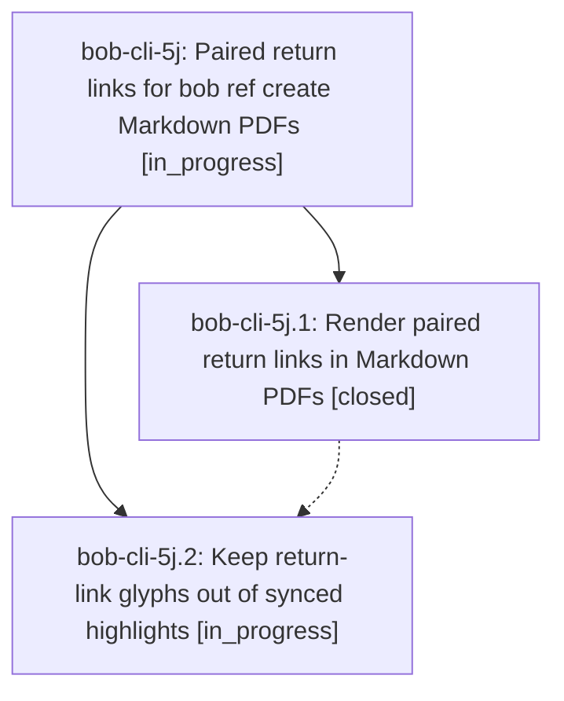

# Bead: bob-cli-5j — Paired return links for bob ref create Markdown PDFs

[Bead Pages](../README.md) / bob-cli-5j

**Status:** ◐ in_progress · **Type:** ▸ plan · **Tier:** epic
**Owner:** `bryanbugyi34@gmail.com` · **Created by:** [bbugyi200.athena.research.3x.linker.w0](https://github.com/bobs-org/bob-cli--agents/blob/main/sessions/bbugyi200.athena.research.3x.linker.w0.md) · **Assignee:** `bob-cli-5j.land`
**Created:** 2026-10-07 14:27:22 EDT
**Plan:** [202610/ref\_create\_return\_links.md](https://github.com/bobs-org/bob-cli--plans/blob/main/202610/ref_create_return_links.md)

<!-- sase:links:start -->

## Links

| Relation | Artifact | Why |
| --- | --- | --- |
| implemented-by | [plan:202610/ref_create_return_links.md][1] | derived from the plan's `bead_id:` frontmatter field |

[1]: https://github.com/bobs-org/bob-cli--plans/blob/main/202610/ref_create_return_links.md

<!-- sase:links:end -->

## Description

Every same-document link in a Markdown PDF rendered by `bob ref create` carries a small raised letter tag, and its target shows a matching `↩ p. N` return pill that jumps back to the passage the reader left. Link targets resolve robustly, dead links are visible instead of silent, and the tags and pills never leak into highlights synced into the vault.

## Phases

| Bead | Title | Status | Size | Created | Agents | Commits |
|---|---|---|---|---|---:|---:|
| [bob-cli-5j.1](bob-cli-5j.1.md) | Render paired return links in Markdown PDFs | ✓ closed | medium | 2026-10-07 | 1 | 1 |
| [bob-cli-5j.2](bob-cli-5j.2.md) | Keep return-link glyphs out of synced highlights | ◐ in_progress | medium | 2026-10-07 | 1 | 0 |

## Lineage

## Agents

| Agent | Bead | Commits |
|---|---|---:|
| [bbugyi200.athena.bob-cli-5j.1](https://github.com/bobs-org/bob-cli--agents/blob/main/agents/bbugyi200.athena.bob-cli-5j.1/README.md) | [bob-cli-5j.1](bob-cli-5j.1.md) | 1 |
| [bbugyi200.athena.bob-cli-5j.2](https://github.com/bobs-org/bob-cli--agents/blob/main/agents/bbugyi200.athena.bob-cli-5j.2/README.md) | [bob-cli-5j.2](bob-cli-5j.2.md) | 0 |
| [bbugyi200.athena.bob-cli-5j.land](https://github.com/bobs-org/bob-cli--agents/blob/main/agents/bbugyi200.athena.bob-cli-5j.land/README.md) | [bob-cli-5j](README.md) | 0 |

## Commits

| Repo | Commit | Subject | Bead | Committed |
|---|---|---|---|---|
| bob-cli | [`d4fab34`](https://github.com/bobs-org/bob-cli/commit/d4fab34ab6c4b2911624f849a95e9adfba48f101) | feat(highlights): render paired return links in Markdown PDFs | [bob-cli-5j.1](bob-cli-5j.1.md) | 2026-10-07 15:42:33 EDT |
