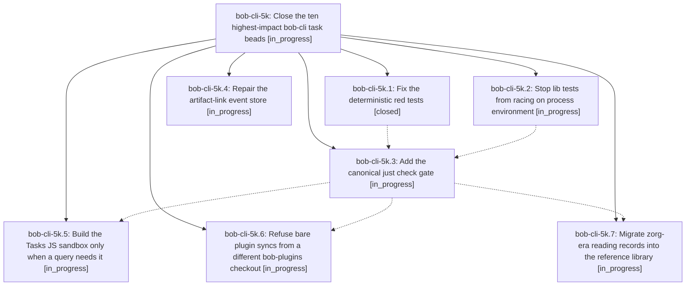

# Bead: bob-cli-5k — Close the ten highest-impact bob-cli task beads

[Bead Pages](../README.md) / bob-cli-5k

**Status:** ◐ in_progress · **Type:** ▸ plan · **Tier:** epic
**Owner:** `bryanbugyi34@gmail.com` · **Created by:** [bbugyi200.athena.0y2](https://github.com/bobs-org/bob-cli--agents/blob/main/sessions/bbugyi200.athena.0y2.md) · **Assignee:** `bob-cli-5k.land`
**Created:** 2026-10-07 14:38:40 EDT
**Plan:** [202610/close\_top\_ten\_impact\_beads.md](https://github.com/bobs-org/bob-cli--plans/blob/main/202610/close_top_ten_impact_beads.md)

## Description

Every bead in the 48-hour impact ranking (bob-cli-4j, 2e, 21, 33, 59, 4m, 4x, 4r, 4u, 3c) is implemented, verified on the final master tree, and closed before this epic lands. As a result, master's test gate is honest and green: `just check` runs every test binary and passes twice in a row on athena. The artifact-link store accepts writes again. Native Tasks queries no longer fail on the 2 s sandbox deadline. A bare plugin sync can no longer roll back the vault. The zorg-era reading records are in the reference library.

## Phases

| Bead | Title | Status | Size | Created | Agents | Commits |
|---|---|---|---|---|---:|---:|
| [bob-cli-5k.1](bob-cli-5k.1.md) | Fix the deterministic red tests | ✓ closed | small | 2026-10-07 | 1 | 1 |
| [bob-cli-5k.2](bob-cli-5k.2.md) | Stop lib tests from racing on process environment | ◐ in_progress | medium | 2026-10-07 | 1 | 0 |
| [bob-cli-5k.3](bob-cli-5k.3.md) | Add the canonical just check gate | ◐ in_progress | small | 2026-10-07 | 1 | 0 |
| [bob-cli-5k.4](bob-cli-5k.4.md) | Repair the artifact-link event store | ◐ in_progress | large | 2026-10-07 | 1 | 0 |
| [bob-cli-5k.5](bob-cli-5k.5.md) | Build the Tasks JS sandbox only when a query needs it | ◐ in_progress | medium | 2026-10-07 | 1 | 0 |
| [bob-cli-5k.6](bob-cli-5k.6.md) | Refuse bare plugin syncs from a different bob-plugins checkout | ◐ in_progress | small | 2026-10-07 | 1 | 0 |
| [bob-cli-5k.7](bob-cli-5k.7.md) | Migrate zorg-era reading records into the reference library | ◐ in_progress | xlarge | 2026-10-07 | 1 | 0 |

## Lineage

## Agents

| Agent | Bead | Commits |
|---|---|---:|
| [bbugyi200.athena.bob-cli-5k.1](https://github.com/bobs-org/bob-cli--agents/blob/main/agents/bbugyi200.athena.bob-cli-5k.1/README.md) | [bob-cli-5k.1](bob-cli-5k.1.md) | 1 |
| [bbugyi200.athena.bob-cli-5k.2](https://github.com/bobs-org/bob-cli--agents/blob/main/agents/bbugyi200.athena.bob-cli-5k.2/README.md) | [bob-cli-5k.2](bob-cli-5k.2.md) | 0 |
| [bbugyi200.athena.bob-cli-5k.3](https://github.com/bobs-org/bob-cli--agents/blob/main/agents/bbugyi200.athena.bob-cli-5k.3/README.md) | [bob-cli-5k.3](bob-cli-5k.3.md) | 0 |
| [bbugyi200.athena.bob-cli-5k.4](https://github.com/bobs-org/bob-cli--agents/blob/main/agents/bbugyi200.athena.bob-cli-5k.4/README.md) | [bob-cli-5k.4](bob-cli-5k.4.md) | 0 |
| [bbugyi200.athena.bob-cli-5k.5](https://github.com/bobs-org/bob-cli--agents/blob/main/agents/bbugyi200.athena.bob-cli-5k.5/README.md) | [bob-cli-5k.5](bob-cli-5k.5.md) | 0 |
| [bbugyi200.athena.bob-cli-5k.6](https://github.com/bobs-org/bob-cli--agents/blob/main/agents/bbugyi200.athena.bob-cli-5k.6/README.md) | [bob-cli-5k.6](bob-cli-5k.6.md) | 0 |
| [bbugyi200.athena.bob-cli-5k.7](https://github.com/bobs-org/bob-cli--agents/blob/main/agents/bbugyi200.athena.bob-cli-5k.7/README.md) | [bob-cli-5k.7](bob-cli-5k.7.md) | 0 |
| [bbugyi200.athena.bob-cli-5k.land](https://github.com/bobs-org/bob-cli--agents/blob/main/agents/bbugyi200.athena.bob-cli-5k.land/README.md) | [bob-cli-5k](README.md) | 0 |

## Commits

| Repo | Commit | Subject | Bead | Committed |
|---|---|---|---|---|
| bob-cli | [`a5bb9ae`](https://github.com/bobs-org/bob-cli/commit/a5bb9aeb350d0de12299580f151cee122318257d) | fix(red-tests): resolve owned check failures for 4j, 5i, 4u | [bob-cli-5k.1](bob-cli-5k.1.md) | 2026-10-07 15:01:58 EDT |
