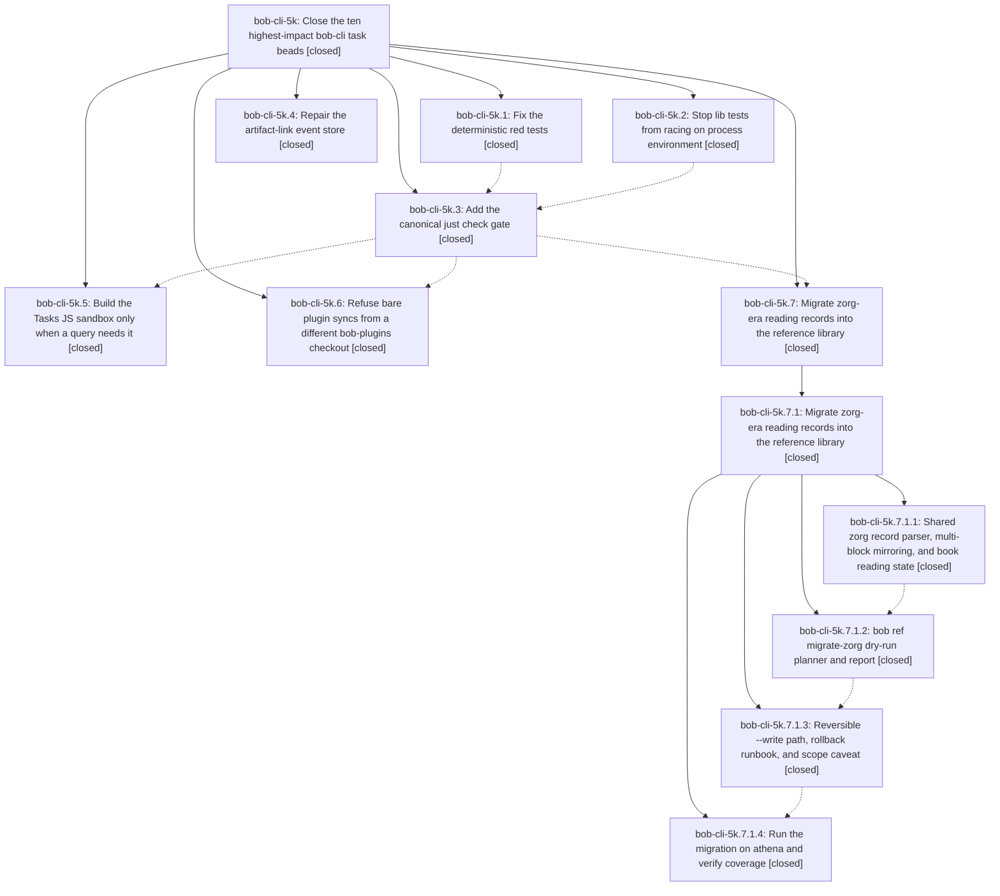

# Bead: bob-cli-5k — Close the ten highest-impact bob-cli task beads

[Bead Pages](../README.md) / bob-cli-5k

**Status:** ✓ closed · **Resolution:** done · **Type:** ▸ plan · **Tier:** epic
**Owner:** `bryanbugyi34@gmail.com` · **Created by:** [bbugyi200.athena.0y2](https://github.com/bobs-org/bob-cli--agents/blob/main/sessions/bbugyi200.athena.0y2.md) · **Assignee:** `bob-cli-5k.land`
**Created:** 2026-10-07 14:38:40 EDT · **Closed:** 2026-10-07 22:03:45 EDT
**Plan:** [202610/close\_top\_ten\_impact\_beads.md](https://github.com/bobs-org/bob-cli--plans/blob/main/202610/close_top_ten_impact_beads.md)

<!-- sase:links:start -->

## Links

| Relation | Artifact | Why |
| --- | --- | --- |
| implemented-by | [plan:202610/close_top_ten_impact_beads.md][1] | derived from the plan's `bead_id:` frontmatter field |

_Plus 1 automatic references — see [Referenced By](#referenced-by)._

[1]: https://github.com/bobs-org/bob-cli--plans/blob/main/202610/close_top_ten_impact_beads.md

<!-- sase:links:end -->

## Description

Every bead in the 48-hour impact ranking (bob-cli-4j, 2e, 21, 33, 59, 4m, 4x, 4r, 4u, 3c) is implemented, verified on the final master tree, and closed before this epic lands. As a result, master's test gate is honest and green: `just check` runs every test binary and passes twice in a row on athena. The artifact-link store accepts writes again. Native Tasks queries no longer fail on the 2 s sandbox deadline. A bare plugin sync can no longer roll back the vault. The zorg-era reading records are in the reference library.

## Notes

[2026-10-07T20:23:53Z · bob-cli-5j.land] DISCOVERED ISSUE: bob-cli-5j landing independently reproduces the headless clipboard proposals from bob-cli-5j.1 note #3 and bob-cli-5j.2 note #1 on fetched master/origin/master bb66952. cargo test --test cli capture::r#ref::capture_url_with_markers_or_flags_stays_a_task -- --exact fails because xclip cannot open localhost:10.0. The shared CLI builder still inherits DISPLAY and has no clipboard stub. Your closed phase bob-cli-5k.3 explicitly owns this remediation and the check gate, and reports commit 3cbef27, but that object is absent in this clone after git fetch and just check still reports no recipe. Reconcile phase completion with landed code before your epic closes; this lander creates no duplicate task and leaves this unrelated infrastructure issue in your existing scope.

[2026-10-08T01:37:13Z · bob-cli-5k.land] FOLLOW-UP TRIAGE (bob-cli-5k.land, 2026-10-07):
(1) bob-cli-5k.2 #1 (ETXTBSY fake-curl): filed bob-cli-5l (flake, small). The lib test stub writers in fetch.rs, listen.rs and kick.rs still fs::write in place. bob-cli-o fixed the same fork/writable-fd race for the tests/cli helpers only.
(2) bob-cli-5k.4 #1 (one bad event pair blocks every write): filed bob-cli-5m (bug, large, sase).
(3) bob-cli-5k.4 #2 (plan propose consumes scratch plan before the links: inlet): filed bob-cli-5n (bug, medium, sase).
(4) bob-cli-5k.4 #3 (drain the outbox): declined as a separate task. The outbox fell from 12,931 to 1,040 lines and the doctor's pending gap from +9505 to +504, which meets plan section 6.2.4 'reduced or explained'. The landing tale's cutover resume re-checks the residue and files a task only if it persists.
(5) bob-cli-5k.5--2 #2/#3 (just check load flakes): the bash readline, wikilinks_return_nothing_quickly and completion::vault tests were authored by active epic bob-cli-3j, so they were recorded as a DISCOVERED ISSUE on bob-cli-3j (note #8), with no task. capture_with_kick_returns_before_the_clip_finishes has no owner and no prior bead, so filed bob-cli-5o (flake, large).
(6) bob-cli-5k.6 #1 (scrub DISPLAY in the CLI harness): declined as already resolved by bob-cli-5k.3 (cc9bd5f: shared builder env_remove DISPLAY/WAYLAND_DISPLAY/TMUX plus a clipboard stub). 'DISPLAY=:99 cargo test --test cli capture_url_with_markers' passes on 74c2afc.
(7) Epic note #1 (bob-cli-5j.land: 3cbef27 missing, no just check): resolved. 3cbef27 was the pre-rebase sha of cc9bd5f, which is on master, and just check exists and passes.
(8) Landing observation: the bob-plugins stage-ranker 16 ms perf test failed (32.79 ms at load ~82). Recorded as +1 on bob-cli-3w (out of scope per plan section 11).
The nested bob-cli-5k.7.1 follow-ups were already triaged by its lander. Typed link writes work: 'sase artifact link add bead:bob-cli-5l related bead:bob-cli-o' and four others wrote and read back.

[2026-10-08T01:37:33Z · bob-cli-5k.land] LANDING VERIFICATION so far (bob-cli-5k.land, athena, master 74c2afc = origin/master, load ~76-82, pandoc 3.1.11.1):
- All 13 audited beads are CLOSED with verification notes: 4j, 2e, 21, 33, 59, 4m, 4x, 4r, 4u, 3c, 5i, 5c are done, and 40 is superseded. Nested epic 5k.7.1 is closed.
- just check passed twice in a row: 1945 lib, 1180 cli, every other binary green.
- 4j kinds, 4u listen, and 5i snapshot exact tests pass, and 'bob ref clip --help' renders create help.
- cargo test --lib passed 5 runs in a row (1945/1945). 'rg env::(set_var|remove_var) src' matches only the facility's TZ pin.
- 'DISPLAY=:99 cargo test --test cli capture_url_with_markers' passes, and 20 plugins:: CLI tests pass.
- Live installed bob: 'bob freshness list -f json -l 1' took 1324/1285/1274 ms and 'bob plan -f json' took 484/481/472 ms, all exit 0 (research baseline ~5.5 s).
- bob ref doctor reports annotations: ok and coverage: ok.
- bob-plugins npm test: the walk-identity tests pass; the sole failure is the bob-cli-3w perf flake.
- Integration: the non-epic commits d08df0e, d4fab34, 6fb936d, 39915c5 and 73f9cc4 add no raw env reads, set_var calls, eager sandbox construction or ambient-DISPLAY tests, and duplicate nothing.
REMAINING EPIC WORK, planned as a landing tale:
(a) The bob-plugins AGENTS.md rule commit 856afc9 (5k.6) never reached bob-plugins origin/master.
(b) Tasks sandbox (5k.5) gaps: no construction-counter test, no injected tiny-expression-budget init test, and init timeouts still read 'JavaScript error while initializing ...: Error: interrupted' rather than saying they timed out.
(c) The clippy disallowed_methods ban is warn-level, so just check passes with a new set_var.
(d) TestEnvGuard nested restore turns an outer unset override into a real-env fallthrough, and an outer drop leaves a stale override.
(e) The plugins guard matches origin by substring (bob-plugins--x is a false positive).
(f) sase artifact doctor exits 1: the artifact-link cutover markers are partial for roles plans and research. Resume with 'sase artifact link import-indexes --apply fleet-capable-65bfe92269a7'. No --epic-symbol entries; no parent bead.

[2026-10-08T02:03:45Z · bob-cli-5k.land] LANDING TALE DONE (bob-cli-5k.land successor, 2026-10-07, athena). Landing audit facts (epic note #3): 13 beads closed (4j, 2e, 21, 33, 59, 4m, 4x, 4r, 4u, 3c, 5i, 5c done; 40 superseded); just check 2x green at 1945 lib / 1180 cli; lib 5x green; live bob freshness ~1.3s and plan ~0.48s; ref doctor annotations ok, coverage ok; walk-identity npm tests pass; integration clean. Triage outcomes (epic note #2): filed bob-cli-5l, 5m, 5n, 5o; bob-cli-3j note #8; +1 on bob-cli-3w; DISPLAY scrub and 3cbef27 declined as resolved; outbox residue declined. Tale fixes, commit 8dcb5f0: injectable Tasks sandbox budgets (init scales, expression 2s) with timeout messages naming budget and task count, thread-local construction counter, zero/one-sandbox regression tests; set_var/remove_var ban denied via Cargo.toml lints (probe: temp set_var fails clippy naming disallowed_methods, clean tree exits 0); TestEnvGuard saves/restores exact map entries with reverse-order drop plus PATH nested tests; plugins origin matcher requires exact bobs-org/bob-plugins with unit tests, tightened foreign-refusal assertion, new lookalike-origin CLI test; parity busy-loop test now asserts timed out after 2s. bob-plugins AGENTS.md bare-sync rule committed as cf3e5d1 (docs: bare bob plugins sync refuses from a SASE worktree). Artifact doctor now exits 0 (was 1): preview named plans+research, token fleet-capable-65bfe92269a7, 59 unique rows, applied clean; remaining non-none rows are link-event backlog delta +504, cutover incomplete/partial markers, and the informational missing-source list; bead:bob-cli-5l still links bob-cli-o and bob-cli-5k.2. Final just check 2x consecutive green: 1956 lib, 1181 cli, every other binary. Two load flakes on the way (zsh first-tab, kick ETXTBSY) passed in isolation and were corroborated on bob-cli-3j and bob-cli-5l.

## Phases

| Bead | Title | Status | Size | Created | Agents | Commits |
|---|---|---|---|---|---:|---:|
| [bob-cli-5k.1](bob-cli-5k.1.md) | Fix the deterministic red tests | ✓ closed | small | 2026-10-07 | 1 | 1 |
| [bob-cli-5k.2](bob-cli-5k.2.md) | Stop lib tests from racing on process environment | ✓ closed | medium | 2026-10-07 | 1 | 1 |
| [bob-cli-5k.3](bob-cli-5k.3.md) | Add the canonical just check gate | ✓ closed | small | 2026-10-07 | 1 | 0 |
| [bob-cli-5k.4](bob-cli-5k.4.md) | Repair the artifact-link event store | ✓ closed | large | 2026-10-07 | 1 | 1 |
| [bob-cli-5k.5](bob-cli-5k.5.md) | Build the Tasks JS sandbox only when a query needs it | ✓ closed | medium | 2026-10-07 | 1 | 1 |
| [bob-cli-5k.6](bob-cli-5k.6.md) | Refuse bare plugin syncs from a different bob-plugins checkout | ✓ closed | small | 2026-10-07 | 1 | 1 |
| [bob-cli-5k.7](bob-cli-5k.7.md) | Migrate zorg-era reading records into the reference library | ✓ closed | xlarge | 2026-10-07 | 1 | 0 |

## Lineage

## Agents

| Agent | Bead | Commits |
|---|---|---:|
| [bbugyi200.athena.bob-cli-5k.1](https://github.com/bobs-org/bob-cli--agents/blob/main/agents/bbugyi200.athena.bob-cli-5k.1/README.md) | [bob-cli-5k.1](bob-cli-5k.1.md) | 1 |
| [bbugyi200.athena.bob-cli-5k.2](https://github.com/bobs-org/bob-cli--agents/blob/main/agents/bbugyi200.athena.bob-cli-5k.2/README.md) | [bob-cli-5k.2](bob-cli-5k.2.md) | 1 |
| [bbugyi200.athena.bob-cli-5k.3](https://github.com/bobs-org/bob-cli--agents/blob/main/agents/bbugyi200.athena.bob-cli-5k.3/README.md) | [bob-cli-5k.3](bob-cli-5k.3.md) | 0 |
| [bbugyi200.athena.bob-cli-5k.4](https://github.com/bobs-org/bob-cli--agents/blob/main/sessions/bbugyi200.athena.bob-cli-5k.4.md) | [bob-cli-5k.4](bob-cli-5k.4.md) | 1 |
| [bbugyi200.athena.bob-cli-5k.5](https://github.com/bobs-org/bob-cli--agents/blob/main/sessions/bbugyi200.athena.bob-cli-5k.5.md) | [bob-cli-5k.5](bob-cli-5k.5.md) | 1 |
| [bbugyi200.athena.bob-cli-5k.6](https://github.com/bobs-org/bob-cli--agents/blob/main/agents/bbugyi200.athena.bob-cli-5k.6/README.md) | [bob-cli-5k.6](bob-cli-5k.6.md) | 1 |
| [bbugyi200.athena.bob-cli-5k.7](https://github.com/bobs-org/bob-cli--agents/blob/main/sessions/bbugyi200.athena.bob-cli-5k.7.md) | [bob-cli-5k.7](bob-cli-5k.7.md) | 0 |
| [bbugyi200.athena.bob-cli-5k.7.1.1](https://github.com/bobs-org/bob-cli--agents/blob/main/agents/bbugyi200.athena.bob-cli-5k.7.1.1/README.md) | [bob-cli-5k.7.1.1](bob-cli-5k.7.1.1.md) | 1 |
| [bbugyi200.athena.bob-cli-5k.7.1.2](https://github.com/bobs-org/bob-cli--agents/blob/main/agents/bbugyi200.athena.bob-cli-5k.7.1.2/README.md) | [bob-cli-5k.7.1.2](bob-cli-5k.7.1.2.md) | 1 |
| [bbugyi200.athena.bob-cli-5k.7.1.3](https://github.com/bobs-org/bob-cli--agents/blob/main/agents/bbugyi200.athena.bob-cli-5k.7.1.3/README.md) | [bob-cli-5k.7.1.3](bob-cli-5k.7.1.3.md) | 1 |
| [bbugyi200.athena.bob-cli-5k.7.1.4](https://github.com/bobs-org/bob-cli--agents/blob/main/agents/bbugyi200.athena.bob-cli-5k.7.1.4/README.md) | [bob-cli-5k.7.1.4](bob-cli-5k.7.1.4.md) | 0 |
| [bbugyi200.athena.bob-cli-5k.7.1.land](https://github.com/bobs-org/bob-cli--agents/blob/main/agents/bbugyi200.athena.bob-cli-5k.7.1.land/README.md) | [bob-cli-5k.7.1](bob-cli-5k.7.1.md) | 1 |
| [bbugyi200.athena.bob-cli-5k.land](https://github.com/bobs-org/bob-cli--agents/blob/main/sessions/bbugyi200.athena.bob-cli-5k.land.md) | [bob-cli-5k](README.md) | 1 |

## Commits

| Repo | Commit | Subject | Bead | Committed |
|---|---|---|---|---|
| bob-cli | [`a5bb9ae`](https://github.com/bobs-org/bob-cli/commit/a5bb9aeb350d0de12299580f151cee122318257d) | fix(red-tests): resolve owned check failures for 4j, 5i, 4u | [bob-cli-5k.1](bob-cli-5k.1.md) | 2026-10-07 15:01:58 EDT |
| bob-cli--plans | [`bob-cli--plans@81b3f88`](https://github.com/bobs-org/bob-cli--plans/commit/81b3f880841807b1d5a00d54de05888ca2c12813) | fix(artifact-links): drop replayed derived link events that reused operation ids | [bob-cli-5k.4](bob-cli-5k.4.md) | 2026-10-07 15:12:14 EDT |
| bob-cli | [`c9b17c9`](https://github.com/bobs-org/bob-cli/commit/c9b17c96fb66af96e110b1d111f52380e1c8b601) | test(env): add crate-wide thread-local test-env facility | [bob-cli-5k.2](bob-cli-5k.2.md) | 2026-10-07 15:27:55 EDT |
| bob-cli | [`bb66952`](https://github.com/bobs-org/bob-cli/commit/bb669522e38f2bf5652125225d1b24e1d83987d8) | feat(plugins): refuse bare sync from a foreign bob-plugins checkout | [bob-cli-5k.6](bob-cli-5k.6.md) | 2026-10-07 16:09:02 EDT |
| bob-cli | [`db6bcdb`](https://github.com/bobs-org/bob-cli/commit/db6bcdb871e6179247ae3d34fed1d7d68290446c) | feat(ref-library): add ZorgRecord coverage parser with source-aware provenance mirroring | [bob-cli-5k.7.1.1](bob-cli-5k.7.1.1.md) | 2026-10-07 16:48:49 EDT |
| bob-cli | [`577866d`](https://github.com/bobs-org/bob-cli/commit/577866d085ae7ea198a6745fca073154728c14dd) | feat(dataview): build Tasks JS sandbox only when query needs JavaScript | [bob-cli-5k.5](bob-cli-5k.5.md) | 2026-10-07 17:43:16 EDT |
| bob-cli | [`937722b`](https://github.com/bobs-org/bob-cli/commit/937722b5506b4095737fa90b67ffbde04edf0178) | feat(ref-library): add bob ref migrate-zorg dry-run planner | [bob-cli-5k.7.1.2](bob-cli-5k.7.1.2.md) | 2026-10-07 18:47:04 EDT |
| bob-cli | [`74c2afc`](https://github.com/bobs-org/bob-cli/commit/74c2afc82785b10a7a54a58ab36fb53cb128ee44) | feat(ref-library): add reversible bob ref migrate-zorg --write path | [bob-cli-5k.7.1.3](bob-cli-5k.7.1.3.md) | 2026-10-07 20:09:29 EDT |
| bob-cli--plans | [`bob-cli--plans@174c6dc`](https://github.com/bobs-org/bob-cli--plans/commit/174c6dcc44e513ee3d74660e68cfa31281ea2e62) | docs(plans): mark zorg\_ref\_migration done | [bob-cli-5k.7.1](bob-cli-5k.7.1.md) | 2026-10-07 20:46:45 EDT |
| bob-cli--plans | [`bob-cli--plans@194091e`](https://github.com/bobs-org/bob-cli--plans/commit/194091e1c7cadaf2552119ab3bffcf050e2025c1) | docs(plans): mark close\_top\_ten\_impact\_beads plan done | [bob-cli-5k](README.md) | 2026-10-07 22:23:23 EDT |

<!-- sase:referenced-by:start -->

## Referenced By

| Relation | Artifact | Why | Uses |
| --- | --- | --- | ---: |
| read-by | [agent:bob-cli-5k.7.1.land][1] | Confirm the containing epic stayed open for its land agent | 2 |

[1]: https://github.com/bobs-org/bob-cli--agents/blob/main/agents/bbugyi200.athena.bob-cli-5k.7.1.land/README.md

<!-- sase:referenced-by:end -->
