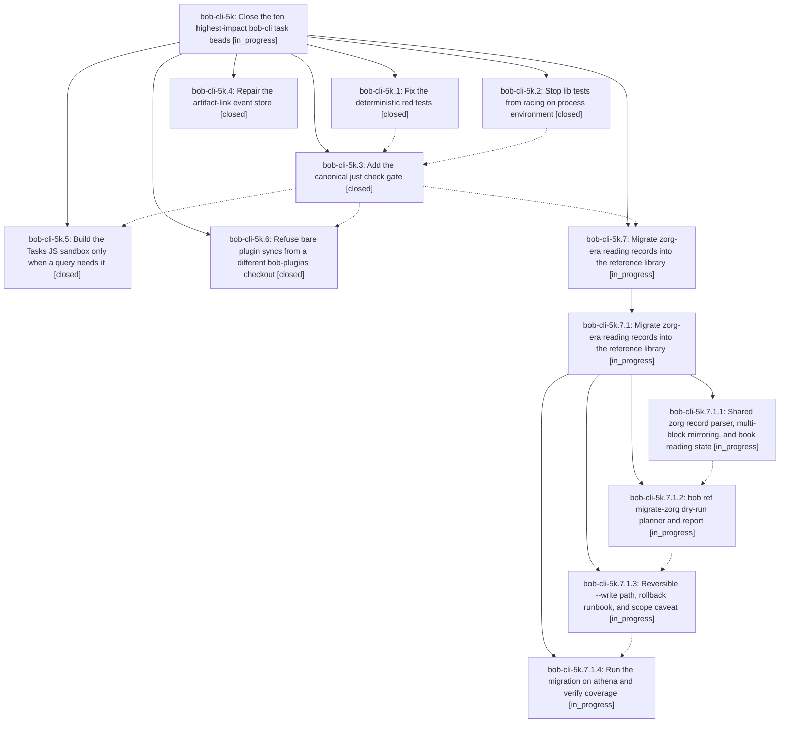

# Bead: bob-cli-5k — Close the ten highest-impact bob-cli task beads

[Bead Pages](../README.md) / bob-cli-5k

**Status:** ◐ in_progress · **Type:** ▸ plan · **Tier:** epic
**Owner:** `bryanbugyi34@gmail.com` · **Created by:** [bbugyi200.athena.0y2](https://github.com/bobs-org/bob-cli--agents/blob/main/sessions/bbugyi200.athena.0y2.md) · **Assignee:** `bob-cli-5k.land`
**Created:** 2026-10-07 14:38:40 EDT
**Plan:** [202610/close\_top\_ten\_impact\_beads.md](https://github.com/bobs-org/bob-cli--plans/blob/main/202610/close_top_ten_impact_beads.md)

<!-- sase:links:start -->

## Links

| Relation | Artifact | Why |
| --- | --- | --- |
| implemented-by | [plan:202610/close_top_ten_impact_beads.md][1] | derived from the plan's `bead_id:` frontmatter field |

[1]: https://github.com/bobs-org/bob-cli--plans/blob/main/202610/close_top_ten_impact_beads.md

<!-- sase:links:end -->

## Description

Every bead in the 48-hour impact ranking (bob-cli-4j, 2e, 21, 33, 59, 4m, 4x, 4r, 4u, 3c) is implemented, verified on the final master tree, and closed before this epic lands. As a result, master's test gate is honest and green: `just check` runs every test binary and passes twice in a row on athena. The artifact-link store accepts writes again. Native Tasks queries no longer fail on the 2 s sandbox deadline. A bare plugin sync can no longer roll back the vault. The zorg-era reading records are in the reference library.

## Notes

[2026-10-07T20:23:53Z · bob-cli-5j.land] DISCOVERED ISSUE: bob-cli-5j landing independently reproduces the headless clipboard proposals from bob-cli-5j.1 note #3 and bob-cli-5j.2 note #1 on fetched master/origin/master bb66952. cargo test --test cli capture::r#ref::capture_url_with_markers_or_flags_stays_a_task -- --exact fails because xclip cannot open localhost:10.0. The shared CLI builder still inherits DISPLAY and has no clipboard stub. Your closed phase bob-cli-5k.3 explicitly owns this remediation and the check gate, and reports commit 3cbef27, but that object is absent in this clone after git fetch and just check still reports no recipe. Reconcile phase completion with landed code before your epic closes; this lander creates no duplicate task and leaves this unrelated infrastructure issue in your existing scope.

## Phases

| Bead | Title | Status | Size | Created | Agents | Commits |
|---|---|---|---|---|---:|---:|
| [bob-cli-5k.1](bob-cli-5k.1.md) | Fix the deterministic red tests | ✓ closed | small | 2026-10-07 | 1 | 1 |
| [bob-cli-5k.2](bob-cli-5k.2.md) | Stop lib tests from racing on process environment | ✓ closed | medium | 2026-10-07 | 1 | 1 |
| [bob-cli-5k.3](bob-cli-5k.3.md) | Add the canonical just check gate | ✓ closed | small | 2026-10-07 | 1 | 0 |
| [bob-cli-5k.4](bob-cli-5k.4.md) | Repair the artifact-link event store | ✓ closed | large | 2026-10-07 | 1 | 1 |
| [bob-cli-5k.5](bob-cli-5k.5.md) | Build the Tasks JS sandbox only when a query needs it | ✓ closed | medium | 2026-10-07 | 1 | 1 |
| [bob-cli-5k.6](bob-cli-5k.6.md) | Refuse bare plugin syncs from a different bob-plugins checkout | ✓ closed | small | 2026-10-07 | 1 | 1 |
| [bob-cli-5k.7](bob-cli-5k.7.md) | Migrate zorg-era reading records into the reference library | ◐ in_progress | xlarge | 2026-10-07 | 1 | 0 |

## Lineage

## Agents

| Agent | Bead | Commits |
|---|---|---:|
| [bbugyi200.athena.bob-cli-5k.1](https://github.com/bobs-org/bob-cli--agents/blob/main/agents/bbugyi200.athena.bob-cli-5k.1/README.md) | [bob-cli-5k.1](bob-cli-5k.1.md) | 1 |
| [bbugyi200.athena.bob-cli-5k.2](https://github.com/bobs-org/bob-cli--agents/blob/main/agents/bbugyi200.athena.bob-cli-5k.2/README.md) | [bob-cli-5k.2](bob-cli-5k.2.md) | 1 |
| [bbugyi200.athena.bob-cli-5k.3](https://github.com/bobs-org/bob-cli--agents/blob/main/agents/bbugyi200.athena.bob-cli-5k.3/README.md) | [bob-cli-5k.3](bob-cli-5k.3.md) | 0 |
| [bbugyi200.athena.bob-cli-5k.4](https://github.com/bobs-org/bob-cli--agents/blob/main/sessions/bbugyi200.athena.bob-cli-5k.4.md) | [bob-cli-5k.4](bob-cli-5k.4.md) | 1 |
| [bbugyi200.athena.bob-cli-5k.5](https://github.com/bobs-org/bob-cli--agents/blob/main/sessions/bbugyi200.athena.bob-cli-5k.5.md) | [bob-cli-5k.5](bob-cli-5k.5.md) | 1 |
| [bbugyi200.athena.bob-cli-5k.6](https://github.com/bobs-org/bob-cli--agents/blob/main/agents/bbugyi200.athena.bob-cli-5k.6/README.md) | [bob-cli-5k.6](bob-cli-5k.6.md) | 1 |
| [bbugyi200.athena.bob-cli-5k.7](https://github.com/bobs-org/bob-cli--agents/blob/main/sessions/bbugyi200.athena.bob-cli-5k.7.md) | [bob-cli-5k.7](bob-cli-5k.7.md) | 0 |
| [bbugyi200.athena.bob-cli-5k.7.1.1](https://github.com/bobs-org/bob-cli--agents/blob/main/agents/bbugyi200.athena.bob-cli-5k.7.1.1/README.md) | [bob-cli-5k.7.1.1](bob-cli-5k.7.1.1.md) | 1 |
| [bbugyi200.athena.bob-cli-5k.7.1.2](https://github.com/bobs-org/bob-cli--agents/blob/main/agents/bbugyi200.athena.bob-cli-5k.7.1.2/README.md) | [bob-cli-5k.7.1.2](bob-cli-5k.7.1.2.md) | 0 |
| [bbugyi200.athena.bob-cli-5k.7.1.3](https://github.com/bobs-org/bob-cli--agents/blob/main/agents/bbugyi200.athena.bob-cli-5k.7.1.3/README.md) | [bob-cli-5k.7.1.3](bob-cli-5k.7.1.3.md) | 0 |
| [bbugyi200.athena.bob-cli-5k.7.1.4](https://github.com/bobs-org/bob-cli--agents/blob/main/agents/bbugyi200.athena.bob-cli-5k.7.1.4/README.md) | [bob-cli-5k.7.1.4](bob-cli-5k.7.1.4.md) | 0 |
| [bbugyi200.athena.bob-cli-5k.7.1.land](https://github.com/bobs-org/bob-cli--agents/blob/main/agents/bbugyi200.athena.bob-cli-5k.7.1.land/README.md) | [bob-cli-5k.7.1](bob-cli-5k.7.1.md) | 0 |
| [bbugyi200.athena.bob-cli-5k.land](https://github.com/bobs-org/bob-cli--agents/blob/main/agents/bbugyi200.athena.bob-cli-5k.land/README.md) | [bob-cli-5k](README.md) | 0 |

## Commits

| Repo | Commit | Subject | Bead | Committed |
|---|---|---|---|---|
| bob-cli | [`a5bb9ae`](https://github.com/bobs-org/bob-cli/commit/a5bb9aeb350d0de12299580f151cee122318257d) | fix(red-tests): resolve owned check failures for 4j, 5i, 4u | [bob-cli-5k.1](bob-cli-5k.1.md) | 2026-10-07 15:01:58 EDT |
| bob-cli--plans | [`bob-cli--plans@81b3f88`](https://github.com/bobs-org/bob-cli--plans/commit/81b3f880841807b1d5a00d54de05888ca2c12813) | fix(artifact-links): drop replayed derived link events that reused operation ids | [bob-cli-5k.4](bob-cli-5k.4.md) | 2026-10-07 15:12:14 EDT |
| bob-cli | [`c9b17c9`](https://github.com/bobs-org/bob-cli/commit/c9b17c96fb66af96e110b1d111f52380e1c8b601) | test(env): add crate-wide thread-local test-env facility | [bob-cli-5k.2](bob-cli-5k.2.md) | 2026-10-07 15:27:55 EDT |
| bob-cli | [`bb66952`](https://github.com/bobs-org/bob-cli/commit/bb669522e38f2bf5652125225d1b24e1d83987d8) | feat(plugins): refuse bare sync from a foreign bob-plugins checkout | [bob-cli-5k.6](bob-cli-5k.6.md) | 2026-10-07 16:09:02 EDT |
| bob-cli | [`db6bcdb`](https://github.com/bobs-org/bob-cli/commit/db6bcdb871e6179247ae3d34fed1d7d68290446c) | feat(ref-library): add ZorgRecord coverage parser with source-aware provenance mirroring | [bob-cli-5k.7.1.1](bob-cli-5k.7.1.1.md) | 2026-10-07 16:48:49 EDT |
| bob-cli | [`577866d`](https://github.com/bobs-org/bob-cli/commit/577866d085ae7ea198a6745fca073154728c14dd) | feat(dataview): build Tasks JS sandbox only when query needs JavaScript | [bob-cli-5k.5](bob-cli-5k.5.md) | 2026-10-07 17:43:16 EDT |
