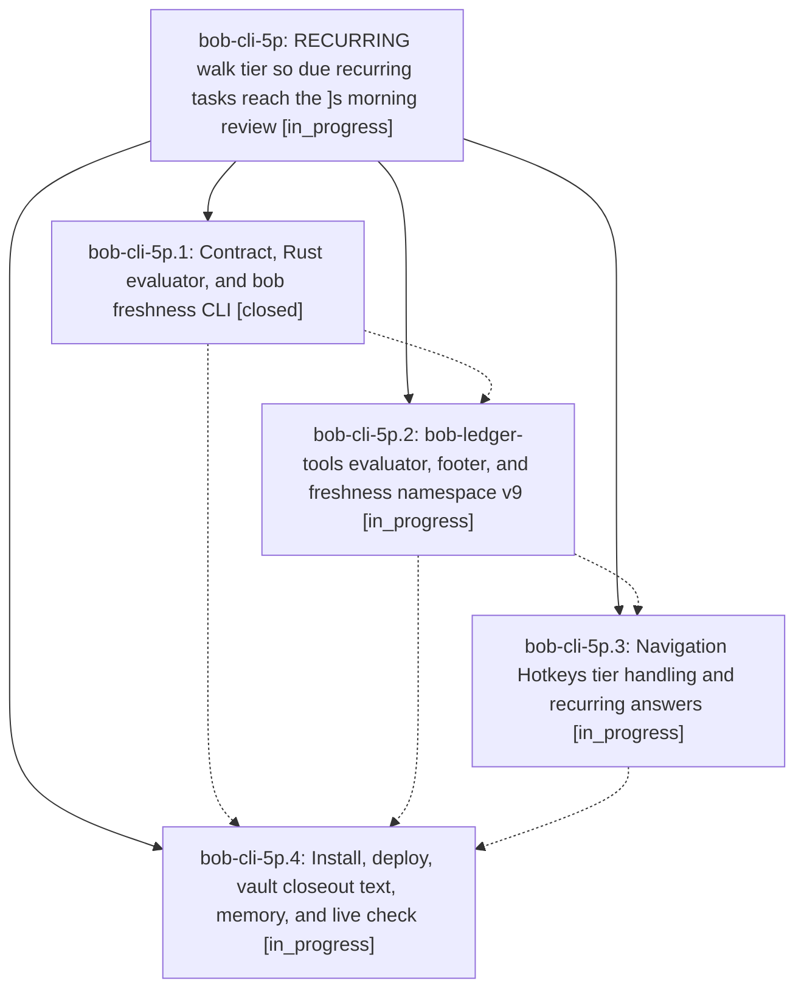

# Bead: bob-cli-5p — RECURRING walk tier so due recurring tasks reach the \]s morning review

[Bead Pages](../README.md) / bob-cli-5p

**Status:** ◐ in_progress · **Type:** ▸ plan · **Tier:** epic
**Owner:** `bryanbugyi34@gmail.com` · **Created by:** [bbugyi200.athena.0yb](https://github.com/bobs-org/bob-cli--agents/blob/main/sessions/bbugyi200.athena.0yb.md) · **Assignee:** `bob-cli-5p.land`
**Created:** 2026-10-08 11:03:15 EDT
**Plan:** [202610/recurring\_review\_tier.md](https://github.com/bobs-org/bob-cli--plans/blob/main/202610/recurring_review_tier.md)

## Description

Every open, visible, non-checklist recurring task whose occurrence date has arrived walks in a new RECURRING commitment tier of the ]s review (CLI, ledger footer, and nav notices alike), is never stamped, and leaves the walk only when it is completed, rescheduled past today, linked to Today, or cancelled through Obsidian Tasks, with no change to stamps, buckets, chips, READY, the ready cap, or PRE/POST checklist rows.

## Phases

| Bead | Title | Status | Size | Created | Agents | Commits |
|---|---|---|---|---|---:|---:|
| [bob-cli-5p.1](bob-cli-5p.1.md) | Contract, Rust evaluator, and bob freshness CLI | ✓ closed | medium | 2026-10-08 | 1 | 1 |
| [bob-cli-5p.2](bob-cli-5p.2.md) | bob-ledger-tools evaluator, footer, and freshness namespace v9 | ◐ in_progress | medium | 2026-10-08 | 1 | 0 |
| [bob-cli-5p.3](bob-cli-5p.3.md) | Navigation Hotkeys tier handling and recurring answers | ◐ in_progress | medium | 2026-10-08 | 1 | 0 |
| [bob-cli-5p.4](bob-cli-5p.4.md) | Install, deploy, vault closeout text, memory, and live check | ◐ in_progress | small | 2026-10-08 | 1 | 0 |

## Lineage

## Agents

| Agent | Bead | Commits |
|---|---|---:|
| [bbugyi200.athena.bob-cli-5p.1](https://github.com/bobs-org/bob-cli--agents/blob/main/agents/bbugyi200.athena.bob-cli-5p.1/README.md) | [bob-cli-5p.1](bob-cli-5p.1.md) | 1 |
| [bbugyi200.athena.bob-cli-5p.2](https://github.com/bobs-org/bob-cli--agents/blob/main/agents/bbugyi200.athena.bob-cli-5p.2/README.md) | [bob-cli-5p.2](bob-cli-5p.2.md) | 0 |
| [bbugyi200.athena.bob-cli-5p.3](https://github.com/bobs-org/bob-cli--agents/blob/main/agents/bbugyi200.athena.bob-cli-5p.3/README.md) | [bob-cli-5p.3](bob-cli-5p.3.md) | 0 |
| [bbugyi200.athena.bob-cli-5p.4](https://github.com/bobs-org/bob-cli--agents/blob/main/agents/bbugyi200.athena.bob-cli-5p.4/README.md) | [bob-cli-5p.4](bob-cli-5p.4.md) | 0 |
| [bbugyi200.athena.bob-cli-5p.land](https://github.com/bobs-org/bob-cli--agents/blob/main/agents/bbugyi200.athena.bob-cli-5p.land/README.md) | [bob-cli-5p](README.md) | 0 |

## Commits

| Repo | Commit | Subject | Bead | Committed |
|---|---|---|---|---|
| bob-cli | [`56a5e68`](https://github.com/bobs-org/bob-cli/commit/56a5e68811203a90e2b774fb9ad20dcdfd27ba07) | feat(freshness): add RECURRING walk tier for due recurring tasks | [bob-cli-5p.1](bob-cli-5p.1.md) | 2026-10-08 11:23:29 EDT |
