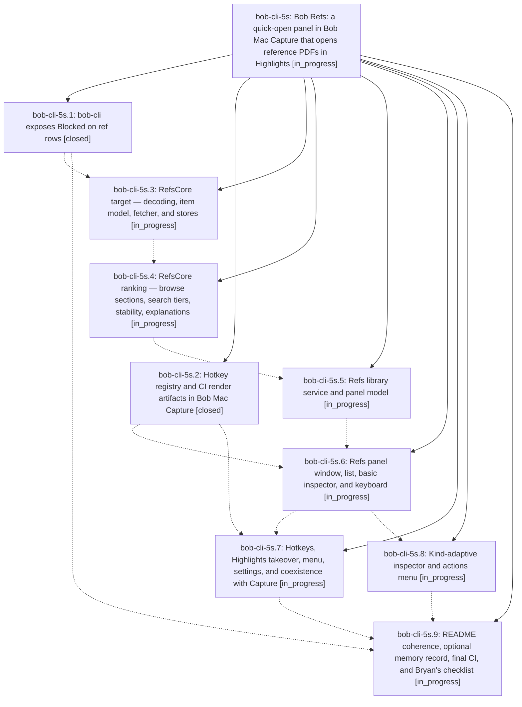

# Bead: bob-cli-5s — Bob Refs: a quick-open panel in Bob Mac Capture that opens reference PDFs in Highlights

[Bead Pages](../README.md) / bob-cli-5s

**Status:** ◐ in_progress · **Type:** ▸ plan · **Tier:** epic
**Owner:** `bryanbugyi34@gmail.com` · **Created by:** [bbugyi200.apollo.5z](https://github.com/bobs-org/bob-cli--agents/blob/main/sessions/bbugyi200.apollo.5z.md) · **Assignee:** `bob-cli-5s.land`
**Created:** 2026-10-08 19:32:40 EDT
**Plan:** [202610/bob\_refs\_panel.md](https://github.com/bobs-org/bob-cli--plans/blob/main/202610/bob_refs_panel.md)

<!-- sase:links:start -->

## Links

| Relation | Artifact | Why |
| --- | --- | --- |
| implemented-by | [plan:202610/bob_refs_panel.md][1] | derived from the plan's `bead_id:` frontmatter field |

_Plus 1 automatic references — see [Referenced By](#referenced-by)._

[1]: https://github.com/bobs-org/bob-cli--plans/blob/main/202610/bob_refs_panel.md

<!-- sase:links:end -->

## Description

One keystroke (⌃⇧⌘R anywhere, or the Open… key while Highlights is frontmost) shows a prewarmed glass panel listing every PDF-backed reference note from `bob ref list`, with kind and reading state on every row, the working set first when the query is empty, tiered relevance when it is not, rows that never move under the cursor, and a kind-adaptive inspector. Return opens the original PDF in Highlights and changes nothing in the vault.

## Phases

| Bead | Title | Status | Size | Created | Agents | Commits |
|---|---|---|---|---|---:|---:|
| [bob-cli-5s.1](bob-cli-5s.1.md) | bob-cli exposes Blocked on ref rows | ✓ closed | small | 2026-10-08 | 1 | 1 |
| [bob-cli-5s.2](bob-cli-5s.2.md) | Hotkey registry and CI render artifacts in Bob Mac Capture | ✓ closed | small | 2026-10-08 | 1 | 0 |
| [bob-cli-5s.3](bob-cli-5s.3.md) | RefsCore target — decoding, item model, fetcher, and stores | ◐ in_progress | medium | 2026-10-08 | 1 | 0 |
| [bob-cli-5s.4](bob-cli-5s.4.md) | RefsCore ranking — browse sections, search tiers, stability, explanations | ◐ in_progress | medium | 2026-10-08 | 1 | 0 |
| [bob-cli-5s.5](bob-cli-5s.5.md) | Refs library service and panel model | ◐ in_progress | medium | 2026-10-08 | 1 | 0 |
| [bob-cli-5s.6](bob-cli-5s.6.md) | Refs panel window, list, basic inspector, and keyboard | ◐ in_progress | medium | 2026-10-08 | 1 | 0 |
| [bob-cli-5s.7](bob-cli-5s.7.md) | Hotkeys, Highlights takeover, menu, settings, and coexistence with Capture | ◐ in_progress | medium | 2026-10-08 | 1 | 0 |
| [bob-cli-5s.8](bob-cli-5s.8.md) | Kind-adaptive inspector and actions menu | ◐ in_progress | medium | 2026-10-08 | 1 | 0 |
| [bob-cli-5s.9](bob-cli-5s.9.md) | README coherence, optional memory record, final CI, and Bryan's checklist | ◐ in_progress | small | 2026-10-08 | 1 | 0 |

## Lineage

## Agents

| Agent | Bead | Commits |
|---|---|---:|
| [bbugyi200.apollo.bob-cli-5s.1](https://github.com/bobs-org/bob-cli--agents/blob/main/agents/bbugyi200.apollo.bob-cli-5s.1/README.md) | [bob-cli-5s.1](bob-cli-5s.1.md) | 1 |
| [bbugyi200.apollo.bob-cli-5s.2](https://github.com/bobs-org/bob-cli--agents/blob/main/sessions/bbugyi200.apollo.bob-cli-5s.2.md) | [bob-cli-5s.2](bob-cli-5s.2.md) | 0 |
| [bbugyi200.apollo.bob-cli-5s.3](https://github.com/bobs-org/bob-cli--agents/blob/main/agents/bbugyi200.apollo.bob-cli-5s.3/README.md) | [bob-cli-5s.3](bob-cli-5s.3.md) | 0 |
| [bbugyi200.apollo.bob-cli-5s.4](https://github.com/bobs-org/bob-cli--agents/blob/main/agents/bbugyi200.apollo.bob-cli-5s.4/README.md) | [bob-cli-5s.4](bob-cli-5s.4.md) | 0 |
| [bbugyi200.apollo.bob-cli-5s.5](https://github.com/bobs-org/bob-cli--agents/blob/main/agents/bbugyi200.apollo.bob-cli-5s.5/README.md) | [bob-cli-5s.5](bob-cli-5s.5.md) | 0 |
| [bbugyi200.apollo.bob-cli-5s.6](https://github.com/bobs-org/bob-cli--agents/blob/main/agents/bbugyi200.apollo.bob-cli-5s.6/README.md) | [bob-cli-5s.6](bob-cli-5s.6.md) | 0 |
| [bbugyi200.apollo.bob-cli-5s.7](https://github.com/bobs-org/bob-cli--agents/blob/main/agents/bbugyi200.apollo.bob-cli-5s.7/README.md) | [bob-cli-5s.7](bob-cli-5s.7.md) | 0 |
| [bbugyi200.apollo.bob-cli-5s.8](https://github.com/bobs-org/bob-cli--agents/blob/main/agents/bbugyi200.apollo.bob-cli-5s.8/README.md) | [bob-cli-5s.8](bob-cli-5s.8.md) | 0 |
| [bbugyi200.apollo.bob-cli-5s.9](https://github.com/bobs-org/bob-cli--agents/blob/main/agents/bbugyi200.apollo.bob-cli-5s.9/README.md) | [bob-cli-5s.9](bob-cli-5s.9.md) | 0 |
| [bbugyi200.apollo.bob-cli-5s.land](https://github.com/bobs-org/bob-cli--agents/blob/main/agents/bbugyi200.apollo.bob-cli-5s.land/README.md) | [bob-cli-5s](README.md) | 0 |

## Commits

| Repo | Commit | Subject | Bead | Committed |
|---|---|---|---|---|
| bob-cli | [`4c9cdbe`](https://github.com/bobs-org/bob-cli/commit/4c9cdbe583770f6fa487be18af6615f259e3bf01) | feat(refs): expose Blocked as always-present boolean on ref rows | [bob-cli-5s.1](bob-cli-5s.1.md) | 2026-10-08 20:18:06 EDT |

<!-- sase:referenced-by:start -->

## Referenced By

| Relation | Artifact | Why | Uses |
| --- | --- | --- | ---: |
| read-by | [agent:bob-cli-5s.2][1] | Need epic scope for phase work | 1 |

[1]: https://github.com/bobs-org/bob-cli--agents/blob/main/sessions/bbugyi200.apollo.bob-cli-5s.2.md

<!-- sase:referenced-by:end -->
