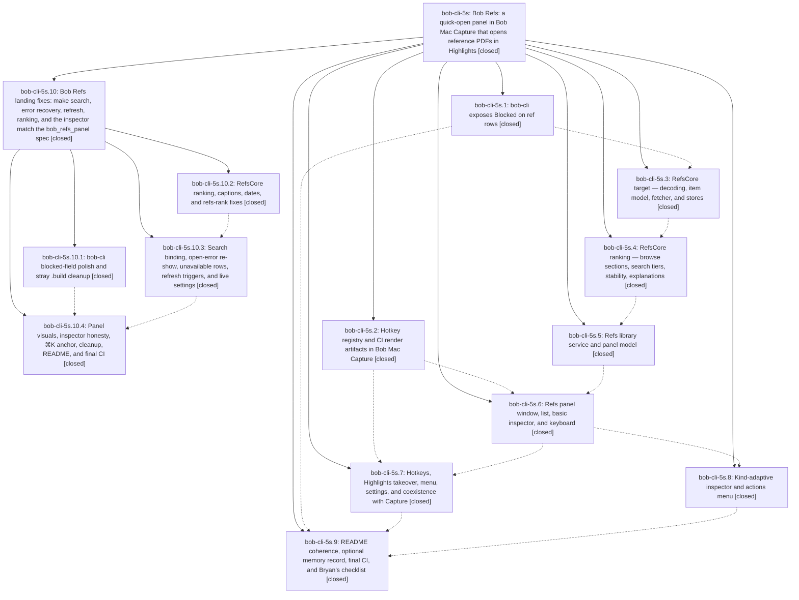

# Bead: bob-cli-5s — Bob Refs: a quick-open panel in Bob Mac Capture that opens reference PDFs in Highlights

[Bead Pages](../README.md) / bob-cli-5s

**Status:** ✓ closed · **Resolution:** done · **Type:** ▸ plan · **Tier:** epic
**Owner:** `bryanbugyi34@gmail.com` · **Created by:** `bbugyi200.apollo.5z` · **Assignee:** `bob-cli-5s.land`
**Created:** 2026-10-08 19:32:40 EDT · **Closed:** 2026-10-09 11:57:41 EDT
**Plan:** [202610/bob\_refs\_panel.md](https://github.com/bobs-org/bob-cli--plans/blob/main/202610/bob_refs_panel.md)

<!-- sase:links:start -->

## Links

| Relation | Artifact | Why |
| --- | --- | --- |
| implemented-by | [plan:202610/bob_refs_panel.md][1] | derived from the plan's `bead_id:` frontmatter field |

_Plus 6 automatic references — see [Referenced By](#referenced-by)._

[1]: https://github.com/bobs-org/bob-cli--plans/blob/main/202610/bob_refs_panel.md

<!-- sase:links:end -->

## Description

One keystroke (⌃⇧⌘R anywhere, or the Open… key while Highlights is frontmost) shows a prewarmed glass panel listing every PDF-backed reference note from `bob ref list`, with kind and reading state on every row, the working set first when the query is empty, tiered relevance when it is not, rows that never move under the cursor, and a kind-adaptive inspector. Return opens the original PDF in Highlights and changes nothing in the vault.

## Notes

[2026-10-09T11:55:30Z · bob-cli-5s.land] LAND TRIAGE (bob-cli-5s.land): PROPOSED FOLLOW-UP outcomes. (1) refs-panel thin-client decisions record (5s.1 #2, 5s.2 #1, 5s.3 #2, 5s.4 #1, 5s.5 #1, 5s.6 #1, 5s.7 #1, 5s.8 #1, 5s.9 #1): filed as memory task bob-cli-5u (ready; Bryan accepts or cancels; refs_decision_memory=no kept the epic from editing memory). (2) 9 return_links filter_* lib failures (5s.1 #1, 5s.9 #2): reproduced on b6ba7c3 with pandoc 3.1.3 (tests pin \hyperref[id], pandoc 3.1.3 emits \protect\hyperlink{id}); not epic-caused (bob-cli-5j code); filed as ci task bob-cli-5t, related to bob-cli-4u. (3) fakeBob live-preview waitUntil flakes in CapturePanelModelTests (5s.2 #2/#4, 5s.6 #2): semantic duplicate of bob-cli-4k (twin StartPending test, same wait class); +1 recorded there. (4) 5s.4 #2 'run Swift build/tests/CI': declined, superseded by 5s.4 #4 and green CI on every later phase (2016864 run 37919892089). (5) 5s.6 #3 ImageRenderer fixture limits: declined as a task, guidance only and already applied by 5s.8; the child closeout plan keeps the workarounds. (6) 5s.7 #2 master CI red on inspector compile errors: declined, resolved by d1689b3/f5f6178 and green runs 37918351904/37919892089. (7) 5s.8 #2 anchor the Cmd-K menu below the selected row: caused by the epic (spec section 10 requires 'popped up below the selected row; when the row frame is unknown, at the list's center'), so it is remaining epic work in the child plan, not a task.

[2026-10-09T11:59:12Z · bob-cli-5s.land] LAND AUDIT (bob-cli-5s.land, before child plan): Read all 9 closed phases and notes, the plan, and every epic commit (bob-cli 4c9cdbe, a4c69ff, b6ba7c3; bob-mac-capture 65ab7ee..2016864). macOS CI green at 2016864 (run 37919892089); no --epic-symbol entries. Drift: no non-epic commits landed in bob-cli or bob-mac-capture since the epic started, so nothing to integrate. Remaining epic-caused work, confirmed in source: (1) CRITICAL: RefsSearchBar onTextChange drops the typed string, so model.query stays empty and search does not work; (2) the open-error re-show calls show() -> prepareForPresentation(), wiping query and pendingOpen, so Try Again and Open in Default App do nothing, and it bypasses BobPanelCoordinator; (3) the wake observer is on NotificationCenter.default instead of NSWorkspace's center; (4) Today is not refreshed on every open; the -g pass runs inside refs-list, so a git failure discards the snapshot; (5) AppDelegate @Published sinks re-read the old value, so the ⌃⇧⌘R toggle is inverted; (6) section 5.5 unavailable rows are dropped instead of dimmed (README claims dimmed); (7) 2-char word prefixes never reach T1; ranker uses UTC days; Ready sorts by last-opened, not added desc; git dates not marked approximate; (8) the 3 s intrinsics timeout cannot fire; the Cmd-K menu is anchored at the mouse, not the selected row; content well, Reduce Transparency base, and per-show scale-in are missing; inspector honesty violations ('Unknown date', 'Added Added', '0 open'); (9) dead symbols, refs-piece debug renders, README gaps; (10) bob-cli: a4c69ff committed stray .build/ Swift cache files, blocked key order, missing several-trackers test, docs/ref.md client/additive notes. Planned as child epic sase_plan_bob_refs_land_fixes.md (phases cli-blocked-polish, refs-core-fixes, refs-model-fixes, refs-ui-fixes).

[2026-10-09T15:57:41Z · bob-cli-5s.10.land] RECHECK after child bob-cli-5s.10. Phases 5s.1-5s.9 were already closed; their follow-ups were triaged in note #1 (bob-cli-5u, bob-cli-5t, bob-cli-4k +1, and the declined items). Note #2's ten spec gaps are the child epic, now closed, including the stale-refresh argv race its landing tale fixed by waiting for the git-date lane in testRefreshIfStale. highlights_open_key remains cmdO. refs_decision_memory=no stands; the memory record is task bob-cli-5u, not an edit made here. No --epic-symbol entries. No non-epic drift to integrate. Parent plan marked done.

## Phases

| Bead | Title | Status | Size | Created | Agents | Commits |
|---|---|---|---|---|---:|---:|
| [bob-cli-5s.1](bob-cli-5s.1.md) | bob-cli exposes Blocked on ref rows | ✓ closed | small | 2026-10-08 | 1 | 1 |
| [bob-cli-5s.2](bob-cli-5s.2.md) | Hotkey registry and CI render artifacts in Bob Mac Capture | ✓ closed | small | 2026-10-08 | 1 | 2 |
| [bob-cli-5s.3](bob-cli-5s.3.md) | RefsCore target — decoding, item model, fetcher, and stores | ✓ closed | medium | 2026-10-08 | 1 | 2 |
| [bob-cli-5s.4](bob-cli-5s.4.md) | RefsCore ranking — browse sections, search tiers, stability, explanations | ✓ closed | medium | 2026-10-08 | 1 | 2 |
| [bob-cli-5s.5](bob-cli-5s.5.md) | Refs library service and panel model | ✓ closed | medium | 2026-10-08 | 1 | 6 |
| [bob-cli-5s.6](bob-cli-5s.6.md) | Refs panel window, list, basic inspector, and keyboard | ✓ closed | medium | 2026-10-08 | 0 | 0 |
| [bob-cli-5s.7](bob-cli-5s.7.md) | Hotkeys, Highlights takeover, menu, settings, and coexistence with Capture | ✓ closed | medium | 2026-10-08 | 1 | 2 |
| [bob-cli-5s.8](bob-cli-5s.8.md) | Kind-adaptive inspector and actions menu | ✓ closed | medium | 2026-10-08 | 1 | 5 |
| [bob-cli-5s.9](bob-cli-5s.9.md) | README coherence, optional memory record, final CI, and Bryan's checklist | ✓ closed | small | 2026-10-08 | 1 | 1 |

## Lineage

## Agents

| Agent | Bead | Commits |
|---|---|---:|
| [bbugyi200.apollo.bob-cli-5s.1](https://github.com/bobs-org/bob-cli--agents/blob/main/agents/bbugyi200.apollo.bob-cli-5s.1/README.md) | [bob-cli-5s.1](bob-cli-5s.1.md) | 1 |
| [bbugyi200.apollo.bob-cli-5s.10.1](https://github.com/bobs-org/bob-cli--agents/blob/main/agents/bbugyi200.apollo.bob-cli-5s.10.1/README.md) | [bob-cli-5s.10.1](bob-cli-5s.10.1.md) | 1 |
| [bbugyi200.apollo.bob-cli-5s.10.2](https://github.com/bobs-org/bob-cli--agents/blob/main/agents/bbugyi200.apollo.bob-cli-5s.10.2/README.md) | [bob-cli-5s.10.2](bob-cli-5s.10.2.md) | 1 |
| [bbugyi200.apollo.bob-cli-5s.2](https://github.com/bobs-org/bob-cli--agents/blob/main/agents/bbugyi200.apollo.bob-cli-5s.2/README.md) | [bob-cli-5s.2](bob-cli-5s.2.md) | 2 |
| [bbugyi200.apollo.bob-cli-5s.3](https://github.com/bobs-org/bob-cli--agents/blob/main/agents/bbugyi200.apollo.bob-cli-5s.3/README.md) | [bob-cli-5s.3](bob-cli-5s.3.md) | 2 |
| [bbugyi200.apollo.bob-cli-5s.4](https://github.com/bobs-org/bob-cli--agents/blob/main/agents/bbugyi200.apollo.bob-cli-5s.4/README.md) | [bob-cli-5s.4](bob-cli-5s.4.md) | 2 |
| [bbugyi200.apollo.bob-cli-5s.5](https://github.com/bobs-org/bob-cli--agents/blob/main/agents/bbugyi200.apollo.bob-cli-5s.5/README.md) | [bob-cli-5s.5](bob-cli-5s.5.md) | 6 |
| [bbugyi200.apollo.bob-cli-5s.7](https://github.com/bobs-org/bob-cli--agents/blob/main/agents/bbugyi200.apollo.bob-cli-5s.7/README.md) | [bob-cli-5s.7](bob-cli-5s.7.md) | 2 |
| [bbugyi200.apollo.bob-cli-5s.8](https://github.com/bobs-org/bob-cli--agents/blob/main/agents/bbugyi200.apollo.bob-cli-5s.8/README.md) | [bob-cli-5s.8](bob-cli-5s.8.md) | 5 |
| [bbugyi200.apollo.bob-cli-5s.9](https://github.com/bobs-org/bob-cli--agents/blob/main/agents/bbugyi200.apollo.bob-cli-5s.9/README.md) | [bob-cli-5s.9](bob-cli-5s.9.md) | 1 |
| [bbugyi200.athena.bob-cli-5s.10.3](https://github.com/bobs-org/bob-cli--agents/blob/main/agents/bbugyi200.athena.bob-cli-5s.10.3/README.md) | [bob-cli-5s.10.3](bob-cli-5s.10.3.md) | 5 |
| [bbugyi200.athena.bob-cli-5s.10.4](https://github.com/bobs-org/bob-cli--agents/blob/main/agents/bbugyi200.athena.bob-cli-5s.10.4/README.md) | [bob-cli-5s.10.4](bob-cli-5s.10.4.md) | 3 |
| [bbugyi200.athena.bob-cli-5s.10.land](https://github.com/bobs-org/bob-cli--agents/blob/main/sessions/bbugyi200.athena.bob-cli-5s.10.land.md) | [bob-cli-5s.10](bob-cli-5s.10.md) | 2 |

## Commits

| Repo | Commit | Subject | Bead | Committed |
|---|---|---|---|---|
| bob-mac-capture | [`bob-mac-capture@65ab7ee`](https://github.com/bobs-org/bob-mac-capture/commit/65ab7ee77ad04a7d4dcd1d8bd211fd568c3b26c7) | refactor(hotkeys): route every hotkey through HotKeyRegistry | [bob-cli-5s.2](bob-cli-5s.2.md) | 2026-10-08 19:53:46 EDT |
| bob-mac-capture | [`bob-mac-capture@eea838b`](https://github.com/bobs-org/bob-mac-capture/commit/eea838b27db37701e1a78144f4c5c62529153797) | fix(tests): isolate RenderFixtureWriter.write on the main actor | [bob-cli-5s.2](bob-cli-5s.2.md) | 2026-10-08 19:58:08 EDT |
| bob-cli | [`4c9cdbe`](https://github.com/bobs-org/bob-cli/commit/4c9cdbe583770f6fa487be18af6615f259e3bf01) | feat(refs): expose Blocked as always-present boolean on ref rows | [bob-cli-5s.1](bob-cli-5s.1.md) | 2026-10-08 20:18:06 EDT |
| bob-mac-capture | [`bob-mac-capture@e3f918d`](https://github.com/bobs-org/bob-mac-capture/commit/e3f918d757f39133a1e31781f153219615ee37d0) | feat(refs): add RefsCore decoding, model, fetcher, and stores | [bob-cli-5s.3](bob-cli-5s.3.md) | 2026-10-08 21:35:34 EDT |
| bob-mac-capture | [`bob-mac-capture@3937b0f`](https://github.com/bobs-org/bob-mac-capture/commit/3937b0f4ce496e216b1abf1f30ec4699781a4156) | fix(refs): pin open-log append test clock so prune keeps fixtures | [bob-cli-5s.3](bob-cli-5s.3.md) | 2026-10-08 21:49:13 EDT |
| bob-cli | [`a4c69ff`](https://github.com/bobs-org/bob-cli/commit/a4c69ff8964d85d4340682af9e4a11d8253eb049) | chore(build): record Swift build cache from RefsCore verification | [bob-cli-5s.4](bob-cli-5s.4.md) | 2026-10-09 01:19:19 EDT |
| bob-mac-capture | [`bob-mac-capture@3e784b4`](https://github.com/bobs-org/bob-mac-capture/commit/3e784b45d9b871097477880f5cdc65353c347b7b) | feat(refs): add RefsCore ranking, captions, selection, refs-rank CLI and golden tests | [bob-cli-5s.4](bob-cli-5s.4.md) | 2026-10-09 01:21:12 EDT |
| bob-mac-capture | [`bob-mac-capture@d013a7f`](https://github.com/bobs-org/bob-mac-capture/commit/d013a7f0a110502e8609e4c943d8cbc5606e8efa) | feat(refs): add RefsLibrary refresh service and RefsPanelModel | [bob-cli-5s.5](bob-cli-5s.5.md) | 2026-10-09 01:49:51 EDT |
| bob-mac-capture | [`bob-mac-capture@f720ce3`](https://github.com/bobs-org/bob-mac-capture/commit/f720ce3a78e523623d5a5e18efbdf3de1683ea32) | fix(refs): correct Spotlight overlay use and missing imports | [bob-cli-5s.5](bob-cli-5s.5.md) | 2026-10-09 01:54:50 EDT |
| bob-mac-capture | [`bob-mac-capture@f6af6db`](https://github.com/bobs-org/bob-mac-capture/commit/f6af6db45553116ec727869654c246babe699131) | fix(refs): widen test Harness to fileprivate so panel tests compile | [bob-cli-5s.5](bob-cli-5s.5.md) | 2026-10-09 02:03:41 EDT |
| bob-mac-capture | [`bob-mac-capture@47ea15d`](https://github.com/bobs-org/bob-mac-capture/commit/47ea15d821eda5371c2968dfe33ca9b60f3cdc7a) | fix(refs): repair refs-panel-model tests that never triggered a refresh | [bob-cli-5s.5](bob-cli-5s.5.md) | 2026-10-09 02:50:21 EDT |
| bob-mac-capture | [`bob-mac-capture@ebe2d56`](https://github.com/bobs-org/bob-mac-capture/commit/ebe2d56fd8a3cab1ab0a5cb79d2960e66c349a09) | fix(refs): keep vanished-row flags across publishes and harden lane races | [bob-cli-5s.5](bob-cli-5s.5.md) | 2026-10-09 03:03:45 EDT |
| bob-mac-capture | [`bob-mac-capture@75770a0`](https://github.com/bobs-org/bob-mac-capture/commit/75770a09cfc5b88e4738c807f9216ced2579d98a) | fix(refs): relax ranking perf guard to 10s for debug CI builds | [bob-cli-5s.5](bob-cli-5s.5.md) | 2026-10-09 03:18:13 EDT |
| bob-mac-capture | [`bob-mac-capture@3aabee1`](https://github.com/bobs-org/bob-mac-capture/commit/3aabee1c536d4fd7610d97422065674e0ed0c984) | feat(refs): wire entry points — hotkeys, Highlights takeover, menu, settings | [bob-cli-5s.7](bob-cli-5s.7.md) | 2026-10-09 06:06:36 EDT |
| bob-mac-capture | [`bob-mac-capture@64c1333`](https://github.com/bobs-org/bob-mac-capture/commit/64c1333a8092c226d5c7ecf81623f8472024c5e3) | feat(refs): add kind-adaptive inspector and ⌘K actions menu | [bob-cli-5s.8](bob-cli-5s.8.md) | 2026-10-09 06:07:05 EDT |
| bob-mac-capture | [`bob-mac-capture@e4934c9`](https://github.com/bobs-org/bob-mac-capture/commit/e4934c97a705ac669b93227fff2f65f8f8155217) | fix(refs): import CaptureCore in RefsInspector for SchemaVersioned | [bob-cli-5s.8](bob-cli-5s.8.md) | 2026-10-09 06:09:14 EDT |
| bob-mac-capture | [`bob-mac-capture@e1d696e`](https://github.com/bobs-org/bob-mac-capture/commit/e1d696e3730a56a3e759c3880d5a7cb0febab68d) | fix(refs): repair entry-points build — coordinator names, Sendable path | [bob-cli-5s.7](bob-cli-5s.7.md) | 2026-10-09 06:12:57 EDT |
| bob-mac-capture | [`bob-mac-capture@d1689b3`](https://github.com/bobs-org/bob-mac-capture/commit/d1689b310472ae2c59f3c05e63cecf046af300cb) | fix(refs): resolve loader shadowing and async-let use | [bob-cli-5s.8](bob-cli-5s.8.md) | 2026-10-09 06:21:30 EDT |
| bob-mac-capture | [`bob-mac-capture@f5f6178`](https://github.com/bobs-org/bob-mac-capture/commit/f5f61785edffb9b49df8271688f9d6456b545100) | fix(refs): initialize listing through a local in panel model init | [bob-cli-5s.8](bob-cli-5s.8.md) | 2026-10-09 06:33:36 EDT |
| bob-mac-capture | [`bob-mac-capture@2016864`](https://github.com/bobs-org/bob-mac-capture/commit/2016864dbf518f9f1d048bd16cc8972831bda8ba) | fix(refs): pin the inspector quote bar to the text height | [bob-cli-5s.8](bob-cli-5s.8.md) | 2026-10-09 06:48:48 EDT |
| bob-cli | [`b6ba7c3`](https://github.com/bobs-org/bob-cli/commit/b6ba7c3387675e9723e416acbbc0c08543137ca0) | docs(readme): document blocked display-only overlay field | [bob-cli-5s.9](bob-cli-5s.9.md) | 2026-10-09 07:25:33 EDT |
| bob-cli | [`b566ba4`](https://github.com/bobs-org/bob-cli/commit/b566ba4431b97df6405a75babe9d17899bae7eea) | fix(refs): polish blocked field, drop stray .build, finish ref.md contract | [bob-cli-5s.10.1](bob-cli-5s.10.1.md) | 2026-10-09 08:37:58 EDT |
| bob-mac-capture | [`bob-mac-capture@3a5fd4a`](https://github.com/bobs-org/bob-mac-capture/commit/3a5fd4afa7c569157c5eab963e1c2a9209ebfff9) | fix(refs): ranking, captions, dates, and refs-rank core fixes | [bob-cli-5s.10.2](bob-cli-5s.10.2.md) | 2026-10-09 08:51:44 EDT |
| bob-mac-capture | [`bob-mac-capture@85720a2`](https://github.com/bobs-org/bob-mac-capture/commit/85720a2810ceae383e413e13c366be822d422ec6) | fix(refs): search binding, error re-show, refresh lanes, live settings | [bob-cli-5s.10.3](bob-cli-5s.10.3.md) | 2026-10-09 09:19:28 EDT |
| bob-mac-capture | [`bob-mac-capture@9c46702`](https://github.com/bobs-org/bob-mac-capture/commit/9c46702b0d6ed13a6ef3e9499396cdb64ca35442) | fix(refs): hoist multiline calls out of caption interpolations | [bob-cli-5s.10.3](bob-cli-5s.10.3.md) | 2026-10-09 09:32:47 EDT |
| bob-mac-capture | [`bob-mac-capture@cf0c8b1`](https://github.com/bobs-org/bob-mac-capture/commit/cf0c8b16e11d7eab78205f333ea5a295c49aaac1) | fix(refs): last-known title cache and test compile fixes | [bob-cli-5s.10.3](bob-cli-5s.10.3.md) | 2026-10-09 09:36:57 EDT |
| bob-mac-capture | [`bob-mac-capture@4dcd5f0`](https://github.com/bobs-org/bob-mac-capture/commit/4dcd5f0bed0867abb0b27be108f04143e657e490) | fix(refs): settle the git lane before the wake-test baseline | [bob-cli-5s.10.3](bob-cli-5s.10.3.md) | 2026-10-09 09:43:30 EDT |
| bob-mac-capture | [`bob-mac-capture@9979d36`](https://github.com/bobs-org/bob-mac-capture/commit/9979d36b37fa92c8d3402bc91a829e8b14fe10f0) | fix(refs): wait for the git-lane invocation in its test | [bob-cli-5s.10.3](bob-cli-5s.10.3.md) | 2026-10-09 09:54:42 EDT |
| bob-mac-capture | [`bob-mac-capture@3f66470`](https://github.com/bobs-org/bob-mac-capture/commit/3f66470cb95016826e35c91e79e4138cf6a94b7f) | fix(refs): panel visuals, inspector honesty, ⌘K anchor, and closeout | [bob-cli-5s.10.4](bob-cli-5s.10.4.md) | 2026-10-09 10:49:15 EDT |
| bob-mac-capture | [`bob-mac-capture@649e0b9`](https://github.com/bobs-org/bob-mac-capture/commit/649e0b9bc733fbed365debe3ed773b14f00cb42e) | fix(refs): force the Reduce Transparency render through a view knob | [bob-cli-5s.10.4](bob-cli-5s.10.4.md) | 2026-10-09 10:52:30 EDT |
| bob-mac-capture | [`bob-mac-capture@d5fcac0`](https://github.com/bobs-org/bob-mac-capture/commit/d5fcac0d07b872dc633f5ebb201a6cc56a36d875) | fix(refs): race the intrinsics timeout on a continuation | [bob-cli-5s.10.4](bob-cli-5s.10.4.md) | 2026-10-09 11:09:46 EDT |
| bob-mac-capture | [`bob-mac-capture@a87859f`](https://github.com/bobs-org/bob-mac-capture/commit/a87859f251b10346b60051ff713291bd71cb8f78) | fix(refs): settle the git-date lane in testRefreshIfStale before the argv baseline | [bob-cli-5s.10](bob-cli-5s.10.md) | 2026-10-09 12:20:14 EDT |
| bob-cli--plans | [`bob-cli--plans@a31d44f`](https://github.com/bobs-org/bob-cli--plans/commit/a31d44f0bf47dd85758baf7f33bc08be932a61f4) | docs(plans): mark bob-cli-5s, bob-cli-5s.10, and stale-race tale plans done | [bob-cli-5s.10](bob-cli-5s.10.md) | 2026-10-09 12:21:22 EDT |

<!-- sase:referenced-by:start -->

## Referenced By

| Relation | Artifact | Why | Uses |
| --- | --- | --- | ---: |
| read-by | [agent:bob-cli-5s.2][1] | Need epic scope for phase work | 1 |
| read-by | [agent:bob-cli-5s.3][2] | epic context for phase worker | 1 |
| read-by | [agent:bob-cli-5s.4][3] | Need epic scope for phase work | 2 |
| read-by | [agent:bob-cli-5s.7][4] | find inspector phase bead id for follow-up citation | 1 |
| read-by | [agent:bob-cli-5s.8][5] | Need epic status and prior phase progress for inspector work | 1 |
| read-by | [agent:bob-cli-5s.9][6] | epic scope for closeout | 1 |

[1]: https://github.com/bobs-org/bob-cli--agents/blob/main/agents/bbugyi200.athena.bob-cli-5s.2/README.md
[2]: https://github.com/bobs-org/bob-cli--agents/blob/main/agents/bbugyi200.athena.bob-cli-5s.3/README.md
[3]: https://github.com/bobs-org/bob-cli--agents/blob/main/agents/bbugyi200.athena.bob-cli-5s.4/README.md
[4]: https://github.com/bobs-org/bob-cli--agents/blob/main/agents/bbugyi200.athena.bob-cli-5s.7/README.md
[5]: https://github.com/bobs-org/bob-cli--agents/blob/main/agents/bbugyi200.athena.bob-cli-5s.8/README.md
[6]: https://github.com/bobs-org/bob-cli--agents/blob/main/agents/bbugyi200.athena.bob-cli-5s.9/README.md

<!-- sase:referenced-by:end -->
