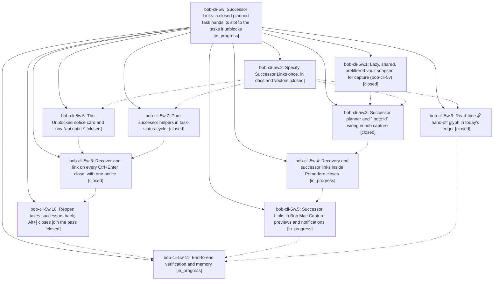

# Bead: bob-cli-5w — Successor Links: a closed planned task hands its slot to the tasks it unblocks

[Bead Pages](../README.md) / bob-cli-5w

**Status:** ◐ in_progress · **Type:** ▸ plan · **Tier:** epic
**Owner:** `bryanbugyi34@gmail.com` · **Created by:** [bbugyi200.apollo.research.0p.linker.w0](https://github.com/bobs-org/bob-cli--agents/blob/main/sessions/bbugyi200.apollo.research.0p.linker.w0.md) · **Assignee:** `bob-cli-5w.land`
**Created:** 2026-10-09 11:54:15 EDT
**Plan:** [202610/successor\_links.md](https://github.com/bobs-org/bob-cli--plans/blob/main/202610/successor_links.md)

<!-- sase:links:start -->

## Links

| Relation | Artifact | Why |
| --- | --- | --- |
| implemented-by | [plan:202610/successor_links.md][1] | derived from the plan's `bead_id:` frontmatter field |

_Plus 6 automatic references — see [Referenced By](#referenced-by)._

[1]: https://github.com/bobs-org/bob-cli--plans/blob/main/202610/successor_links.md

<!-- sase:links:end -->

## Description

When a Bob close gesture completes a task planned in today's ledger, every direct dependent that this close fully unblocked is linked into the predecessor's slot and becomes Next in the same write. Bob close gestures are Obsidian Ctrl+Enter, `bob capture` `!note:id`, and the `=x…` / `=!` Pomodoro closes. The slot is right after the predecessor's Task Link, or the same-name continuation when the whole session closed. One grouped notice says what was linked, where, and why: a card in Obsidian, the live preview plus one notification line in Bob Mac Capture, and rows in the CLI. Capture gets faster, not slower: on apollo, plain and `=x` previews take ≤ 40 ms, and closing a real prerequisite takes ≤ 70 ms.

## Phases

| Bead | Title | Status | Size | Created | Agents | Commits |
|---|---|---|---|---|---:|---:|
| [bob-cli-5w.1](bob-cli-5w.1.md) | Lazy, shared, prefiltered vault snapshot for capture (bob-cli-5v) | ✓ closed | medium | 2026-10-09 | 1 | 1 |
| [bob-cli-5w.10](bob-cli-5w.10.md) | Reopen takes successors back; Alt+\] closes join the pass | ✓ closed | medium | 2026-10-09 | 1 | 1 |
| [bob-cli-5w.11](bob-cli-5w.11.md) | End-to-end verification and memory | ◐ in_progress | small | 2026-10-09 | 1 | 0 |
| [bob-cli-5w.2](bob-cli-5w.2.md) | Specify Successor Links once, in docs and vectors | ✓ closed | medium | 2026-10-09 | 1 | 1 |
| [bob-cli-5w.3](bob-cli-5w.3.md) | Successor planner and \`!note:id\` wiring in bob capture | ✓ closed | medium | 2026-10-09 | 1 | 1 |
| [bob-cli-5w.4](bob-cli-5w.4.md) | Recovery and successor links inside Pomodoro closes | ◐ in_progress | medium | 2026-10-09 | 1 | 0 |
| [bob-cli-5w.5](bob-cli-5w.5.md) | Successor Links in Bob Mac Capture previews and notifications | ◐ in_progress | medium | 2026-10-09 | 1 | 0 |
| [bob-cli-5w.6](bob-cli-5w.6.md) | The Unblocked notice card and nav \`api.notice\` | ✓ closed | medium | 2026-10-09 | 1 | 1 |
| [bob-cli-5w.7](bob-cli-5w.7.md) | Pure successor helpers in task-status-cycler | ✓ closed | medium | 2026-10-09 | 1 | 1 |
| [bob-cli-5w.8](bob-cli-5w.8.md) | Recover-and-link on every Ctrl+Enter close, with one notice | ✓ closed | medium | 2026-10-09 | 1 | 1 |
| [bob-cli-5w.9](bob-cli-5w.9.md) | Read-time 🔓 hand-off glyph in today's ledger | ✓ closed | small | 2026-10-09 | 1 | 1 |

## Lineage

## Agents

| Agent | Bead | Commits |
|---|---|---:|
| [bbugyi200.apollo.bob-cli-5w.1](https://github.com/bobs-org/bob-cli--agents/blob/main/agents/bbugyi200.apollo.bob-cli-5w.1/README.md) | [bob-cli-5w.1](bob-cli-5w.1.md) | 1 |
| [bbugyi200.apollo.bob-cli-5w.10](https://github.com/bobs-org/bob-cli--agents/blob/main/agents/bbugyi200.apollo.bob-cli-5w.10/README.md) | [bob-cli-5w.10](bob-cli-5w.10.md) | 1 |
| [bbugyi200.apollo.bob-cli-5w.11](https://github.com/bobs-org/bob-cli--agents/blob/main/agents/bbugyi200.apollo.bob-cli-5w.11/README.md) | [bob-cli-5w.11](bob-cli-5w.11.md) | 0 |
| [bbugyi200.apollo.bob-cli-5w.2](https://github.com/bobs-org/bob-cli--agents/blob/main/agents/bbugyi200.apollo.bob-cli-5w.2/README.md) | [bob-cli-5w.2](bob-cli-5w.2.md) | 1 |
| [bbugyi200.apollo.bob-cli-5w.3](https://github.com/bobs-org/bob-cli--agents/blob/main/agents/bbugyi200.apollo.bob-cli-5w.3/README.md) | [bob-cli-5w.3](bob-cli-5w.3.md) | 1 |
| [bbugyi200.apollo.bob-cli-5w.4](https://github.com/bobs-org/bob-cli--agents/blob/main/agents/bbugyi200.apollo.bob-cli-5w.4/README.md) | [bob-cli-5w.4](bob-cli-5w.4.md) | 0 |
| [bbugyi200.apollo.bob-cli-5w.5](https://github.com/bobs-org/bob-cli--agents/blob/main/agents/bbugyi200.apollo.bob-cli-5w.5/README.md) | [bob-cli-5w.5](bob-cli-5w.5.md) | 0 |
| [bbugyi200.apollo.bob-cli-5w.6](https://github.com/bobs-org/bob-cli--agents/blob/main/agents/bbugyi200.apollo.bob-cli-5w.6/README.md) | [bob-cli-5w.6](bob-cli-5w.6.md) | 1 |
| [bbugyi200.apollo.bob-cli-5w.7](https://github.com/bobs-org/bob-cli--agents/blob/main/agents/bbugyi200.apollo.bob-cli-5w.7/README.md) | [bob-cli-5w.7](bob-cli-5w.7.md) | 1 |
| [bbugyi200.apollo.bob-cli-5w.8](https://github.com/bobs-org/bob-cli--agents/blob/main/agents/bbugyi200.apollo.bob-cli-5w.8/README.md) | [bob-cli-5w.8](bob-cli-5w.8.md) | 1 |
| [bbugyi200.apollo.bob-cli-5w.9](https://github.com/bobs-org/bob-cli--agents/blob/main/agents/bbugyi200.apollo.bob-cli-5w.9/README.md) | [bob-cli-5w.9](bob-cli-5w.9.md) | 1 |
| [bbugyi200.apollo.bob-cli-5w.land](https://github.com/bobs-org/bob-cli--agents/blob/main/agents/bbugyi200.apollo.bob-cli-5w.land/README.md) | [bob-cli-5w](README.md) | 0 |

## Commits

| Repo | Commit | Subject | Bead | Committed |
|---|---|---|---|---|
| bob-cli | [`16df9b6`](https://github.com/bobs-org/bob-cli/commit/16df9b6a63161023f1acb1a828fe8af4d1cfa886) | feat(deps): add Successor Links contract docs and vectors | [bob-cli-5w.2](bob-cli-5w.2.md) | 2026-10-09 12:21:19 EDT |
| bob-cli | [`e190a7d`](https://github.com/bobs-org/bob-cli/commit/e190a7dc84e74ff2e58abae96405edc0be4727c9) | perf(capture): lazy vault snapshot for capture batches | [bob-cli-5w.1](bob-cli-5w.1.md) | 2026-10-09 12:24:26 EDT |
| bob-plugins | [`bob-plugins@aff37aa`](https://github.com/bobs-org/bob-plugins/commit/aff37aabe48815166905723b9739a495aa4e1bb9) | feat(bob-navigation-hotkeys): add unblocked-notice fragment with api.notice v1 | [bob-cli-5w.6](bob-cli-5w.6.md) | 2026-10-09 12:34:26 EDT |
| bob-plugins | [`bob-plugins@a06b403`](https://github.com/bobs-org/bob-plugins/commit/a06b403d80c0695bce9ed4a44b858916aea8a0b4) | feat(ledger-tools): read-time unblocked hand-off glyph in today's ledger | [bob-cli-5w.9](bob-cli-5w.9.md) | 2026-10-09 12:44:27 EDT |
| bob-plugins | [`bob-plugins@fa0631f`](https://github.com/bobs-org/bob-plugins/commit/fa0631f56e1ab4e690d644ef8dac9ff1fafbd6d0) | feat(task-status-cycler): add pure successor-link helpers and vector tests | [bob-cli-5w.7](bob-cli-5w.7.md) | 2026-10-09 12:49:09 EDT |
| bob-plugins | [`bob-plugins@e8b3584`](https://github.com/bobs-org/bob-plugins/commit/e8b3584bdb1144c82f84a6f0da74d96d9a8de6fb) | feat(task-status-cycler): recover-and-link successors on every Ctrl+Enter close with one notice | [bob-cli-5w.8](bob-cli-5w.8.md) | 2026-10-09 13:18:35 EDT |
| bob-cli | [`eb6fa0d`](https://github.com/bobs-org/bob-cli/commit/eb6fa0d712475f350d44aa757d8b3092b66611c6) | feat(task-complete): add successor planner and wire into !note:id unblocking | [bob-cli-5w.3](bob-cli-5w.3.md) | 2026-10-09 13:32:35 EDT |
| bob-cli | [`08da012`](https://github.com/bobs-org/bob-cli/commit/08da0125d9fca0d6f05f5598b35deed1a57de62e) | docs(hooks): option-bracket closes join the successor pass; same-day reopen takes links back | [bob-cli-5w.10](bob-cli-5w.10.md) | 2026-10-09 13:39:01 EDT |

<!-- sase:referenced-by:start -->

## Referenced By

| Relation | Artifact | Why | Uses |
| --- | --- | --- | ---: |
| read-by | [agent:bob-cli-5w.1][1] | epic context for phase | 1 |
| read-by | [agent:bob-cli-5w.2][2] | epic context for phase | 1 |
| read-by | [agent:bob-cli-5w.6][3] | Need epic scope and decisions | 1 |
| read-by | [agent:bob-cli-5w.7][4] | epic context for phase | 1 |
| read-by | [agent:bob-cli-5w.8][5] | epic context | 1 |
| read-by | [agent:bob-cli-5w.9][6] | epic context for phase | 1 |

[1]: https://github.com/bobs-org/bob-cli--agents/blob/main/agents/bbugyi200.apollo.bob-cli-5w.1/README.md
[2]: https://github.com/bobs-org/bob-cli--agents/blob/main/agents/bbugyi200.apollo.bob-cli-5w.2/README.md
[3]: https://github.com/bobs-org/bob-cli--agents/blob/main/agents/bbugyi200.apollo.bob-cli-5w.6/README.md
[4]: https://github.com/bobs-org/bob-cli--agents/blob/main/agents/bbugyi200.apollo.bob-cli-5w.7/README.md
[5]: https://github.com/bobs-org/bob-cli--agents/blob/main/agents/bbugyi200.apollo.bob-cli-5w.8/README.md
[6]: https://github.com/bobs-org/bob-cli--agents/blob/main/agents/bbugyi200.apollo.bob-cli-5w.9/README.md

<!-- sase:referenced-by:end -->
