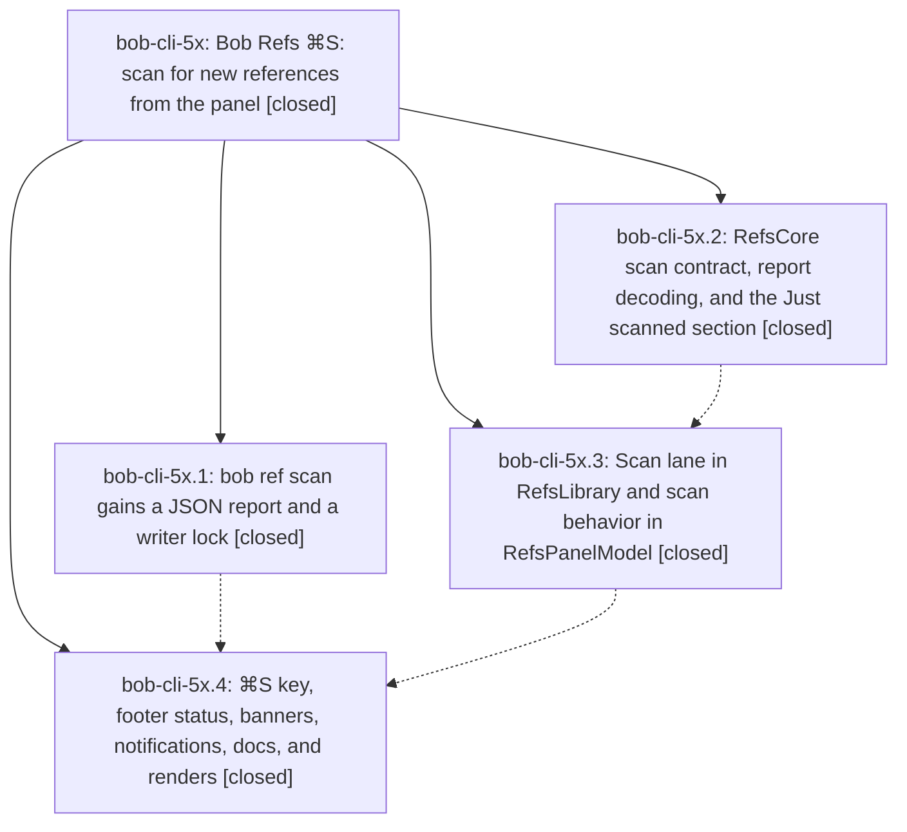

# Bead: bob-cli-5x — Bob Refs ⌘S: scan for new references from the panel

[Bead Pages](../README.md) / bob-cli-5x

**Status:** ✓ closed · **Resolution:** done · **Type:** ▸ plan · **Tier:** epic
**Owner:** `bryanbugyi34@gmail.com` · **Created by:** [bbugyi200.athena.0z1](https://github.com/bobs-org/bob-cli--agents/blob/main/sessions/bbugyi200.athena.0z1.md) · **Assignee:** `bob-cli-5x.land`
**Created:** 2026-10-09 12:26:28 EDT · **Closed:** 2026-10-09 14:53:37 EDT
**Plan:** [202610/bob\_refs\_scan\_keymap.md](https://github.com/bobs-org/bob-cli--plans/blob/main/202610/bob_refs_scan_keymap.md)

<!-- sase:links:start -->

## Links

| Relation | Artifact | Why |
| --- | --- | --- |
| implemented-by | [plan:202610/bob_refs_scan_keymap.md][1] | derived from the plan's `bead_id:` frontmatter field |
| related | file:explicit:1d014ee19d2c86caa490cd53 | attached via sase artifact create --bead |
| related | file:explicit:c6560e48933887da529d30d2 | attached via sase artifact create --bead |

_Plus 4 automatic references — see [Referenced By](#referenced-by)._

[1]: https://github.com/bobs-org/bob-cli--plans/blob/main/202610/bob_refs_scan_keymap.md

<!-- sase:links:end -->

## Description

Pressing ⌘S in the Bob Refs panel runs `bob ref scan -w` in the background, reports exactly which references the scan added, and puts those references at the top of the panel, selected. The panel stays usable, the scan survives the panel hiding, and every outcome (added, nothing new, partial, failed) is reported calmly and honestly.

## Notes

[2026-10-09T18:43:30Z · bob-cli-5x.land] LAND AUDIT: Read the epic and all four closed phase beads, every child note, and plan:202610/bob_refs_scan_keymap.md. Verified bob-cli commit 7fe88b7 and Mac commits 6d98f23/fec4293/fe27cd4/37b914c/d808c6d against actual source: schema-1 report and coded failures, both scan-mode writer locks, 300-second independent scan lane, deferred watcher plus fresh post-scan snapshot, Just scanned ordering/window, selection and search preservation, Cmd+S/menu/footer/banner/controller/notification wiring, synthetic fixtures, docs, and the phase-4 render-test coverage and recorded 16-image light/dark review. No epic DECISIONS overrides exist; thin-client and sticky-lane decisions are honored, opening remains read-only, and the required bob-cli-5u bookkeeping note is present. Reviewed non-epic bob-cli commits since 7fe88b7 (freshness/ref-task identity and mark docs, Successor Links, task_link_count, and == grammar/execution/completion) and Mac drift 8c10d52 (close-comma assist, optional parse lane, capture-pomodoros, shared fake-bob and AppDelegate); no feature conflict or duplicate scan integration found. Both origin/master refs match audited HEADs (bob-cli 02029a7, Mac 8c10d52). just check passed: formatting, clippy, and all 16 test binaries/doctests, 3418 tests total. Scratch Linux Swift selected Refs and BobProcessClient tests: 218 passed, zero failures; fake-bob bash syntax valid. Mac CI core/service green; UI lint/build and render upload green, with only the independently confirmed pre-existing refresh-order timeout. The same Refs test subsequently passed on 8c10d52; that newer CI failure belongs to active bob-cli-60.2 and is being fixed there. No epic-symbol entries; neither checkout defines just symvision. FOLLOW-UP TRIAGE: Sole PROPOSED FOLLOW-UP is bob-cli-5x.4 note #2, accepted as distinct pre-existing flake task bob-cli-61, size large because root cause still needs confirmation, now ready and linked back to the proposing phase, with audited fail/pass excerpts file:explicit:c6560e48933887da529d30d2. Searched all-status matching tasks, swept last-week tasks, and inspected active epics; no semantic duplicate or causally responsible active epic found. No proposals declined. REMAINING EPIC WORK: JSON intake currently includes standalone audio moves (synthetic CLI reproduction file:explicit:1d014ee19d2c86caa490cd53); execute_xlib_intake_counting increments only after companions, omitting an already moved PDF if a companion fails; Swift scan fixtures sort keys alphabetically rather than matching the required raw wire order. A medium tale will fix only these gaps and perform final verification and closeout itself. Parent-link reread confirms bob-cli-5x has no parent bead. Real-Mac intake/notification clicks/capture-draft retention/dirty-note retry/concurrent cron/pre-scan SSH smoke checks remain Bryan manual verification, not claimed tested here.

[2026-10-09T18:53:37Z · bob-cli-5x.land] LAND: Audited bob-cli 02029a7 / mac 8c10d52; just check green (fmt, clippy, all tests); Linux Swift Refs+BobProcessClient evidence from audit (218 pass) reused, fixture-only change needs no render rerun. Fixes: JSON intake now PDF-only via is_pdf_path filter (success/partial/dry-run/hard-failure); execute_xlib_intake_counting counts main rename immediately so companion failure still reports PDF (top-level units preserved); Swift refs-scan-*.json reordered to wire contract with ordered-parse check. Drift since audit (bob-cli 999816c pomodoro swap, mac f4a36e3 successor preview) unrelated to scan, no integration needed. Follow-up bob-cli-61 flake accepted, none declined; newer 8c10d52 close-comma failure owned by bob-cli-60.2. Manual Mac smoke (real intake, rescan, hide+notification, capture-draft retention, dirty retry, concurrent scan, SSH pull) left for Bryan.

## Phases

| Bead | Title | Status | Size | Created | Agents | Commits |
|---|---|---|---|---|---:|---:|
| [bob-cli-5x.1](bob-cli-5x.1.md) | bob ref scan gains a JSON report and a writer lock | ✓ closed | medium | 2026-10-09 | 1 | 1 |
| [bob-cli-5x.2](bob-cli-5x.2.md) | RefsCore scan contract, report decoding, and the Just scanned section | ✓ closed | medium | 2026-10-09 | 1 | 3 |
| [bob-cli-5x.3](bob-cli-5x.3.md) | Scan lane in RefsLibrary and scan behavior in RefsPanelModel | ✓ closed | medium | 2026-10-09 | 1 | 1 |
| [bob-cli-5x.4](bob-cli-5x.4.md) | ⌘S key, footer status, banners, notifications, docs, and renders | ✓ closed | medium | 2026-10-09 | 1 | 1 |

## Lineage

## Agents

| Agent | Bead | Commits |
|---|---|---:|
| [bbugyi200.athena.bob-cli-5x.1](https://github.com/bobs-org/bob-cli--agents/blob/main/agents/bbugyi200.athena.bob-cli-5x.1/README.md) | [bob-cli-5x.1](bob-cli-5x.1.md) | 1 |
| [bbugyi200.athena.bob-cli-5x.2](https://github.com/bobs-org/bob-cli--agents/blob/main/sessions/bbugyi200.athena.bob-cli-5x.2.md) | [bob-cli-5x.2](bob-cli-5x.2.md) | 3 |
| [bbugyi200.athena.bob-cli-5x.3](https://github.com/bobs-org/bob-cli--agents/blob/main/sessions/bbugyi200.athena.bob-cli-5x.3.md) | [bob-cli-5x.3](bob-cli-5x.3.md) | 1 |
| [bbugyi200.athena.bob-cli-5x.4](https://github.com/bobs-org/bob-cli--agents/blob/main/sessions/bbugyi200.athena.bob-cli-5x.4.md) | [bob-cli-5x.4](bob-cli-5x.4.md) | 1 |
| [bbugyi200.athena.bob-cli-5x.land](https://github.com/bobs-org/bob-cli--agents/blob/main/sessions/bbugyi200.athena.bob-cli-5x.land.md) | [bob-cli-5x](README.md) | 1 |

## Commits

| Repo | Commit | Subject | Bead | Committed |
|---|---|---|---|---|
| bob-mac-capture | [`bob-mac-capture@6d98f23`](https://github.com/bobs-org/bob-mac-capture/commit/6d98f2303855dc97244560def21636792dcbe4c0) | feat(refs): add the scan report contract and Just scanned section | [bob-cli-5x.2](bob-cli-5x.2.md) | 2026-10-09 12:46:10 EDT |
| bob-cli | [`7fe88b7`](https://github.com/bobs-org/bob-cli/commit/7fe88b72f4d32df7e4bdf1af1a22a038cfd314a4) | feat(refs): add JSON scan report and writer lock to bob ref scan | [bob-cli-5x.1](bob-cli-5x.1.md) | 2026-10-09 12:50:42 EDT |
| bob-mac-capture | [`bob-mac-capture@fec4293`](https://github.com/bobs-org/bob-mac-capture/commit/fec42932669bf6fac7f564371cab4009e2f8a93a) | fix(capture): break up primaryActionTitle chain for Swift type-checker | [bob-cli-5x.2](bob-cli-5x.2.md) | 2026-10-09 12:56:46 EDT |
| bob-mac-capture | [`bob-mac-capture@fe27cd4`](https://github.com/bobs-org/bob-mac-capture/commit/fe27cd4a19d50c2d70915ccb8f985d33e7436155) | fix(capture): sync close-hint tests with note-free reset wording | [bob-cli-5x.2](bob-cli-5x.2.md) | 2026-10-09 13:07:49 EDT |
| bob-mac-capture | [`bob-mac-capture@37b914c`](https://github.com/bobs-org/bob-mac-capture/commit/37b914c4b76a6e737e0fd52dced390f5578894d9) | feat(refs): add the scan lane and panel scan behavior | [bob-cli-5x.3](bob-cli-5x.3.md) | 2026-10-09 13:41:16 EDT |
| bob-mac-capture | [`bob-mac-capture@d808c6d`](https://github.com/bobs-org/bob-mac-capture/commit/d808c6d50390c605359784a506197336145da0e1) | feat(refs): route ⌘S scan, footer status, banners, and hidden-panel notifications | [bob-cli-5x.4](bob-cli-5x.4.md) | 2026-10-09 14:12:35 EDT |
| bob-cli | [`e9a0ee1`](https://github.com/bobs-org/bob-cli/commit/e9a0ee1e8b6a19832e6a30e298dcd9541e511999) | feat(refs): finish scan intake contract with PDF-only JSON and completed-move reporting | [bob-cli-5x](README.md) | 2026-10-09 15:03:49 EDT |

<!-- sase:referenced-by:start -->

## Referenced By

| Relation | Artifact | Why | Uses |
| --- | --- | --- | ---: |
| read-by | [agent:bob-cli-5x.1][1] | epic decisions and scope | 1 |
| read-by | [agent:bob-cli-5x.2][2] | Need epic DECISIONS and scope | 1 |
| read-by | [agent:bob-cli-5x.3][3] | Need epic decisions | 1 |
| read-by | [agent:bob-cli-5x.4][4] | Need epic decisions for phase work | 1 |

[1]: https://github.com/bobs-org/bob-cli--agents/blob/main/agents/bbugyi200.athena.bob-cli-5x.1/README.md
[2]: https://github.com/bobs-org/bob-cli--agents/blob/main/sessions/bbugyi200.athena.bob-cli-5x.2.md
[3]: https://github.com/bobs-org/bob-cli--agents/blob/main/sessions/bbugyi200.athena.bob-cli-5x.3.md
[4]: https://github.com/bobs-org/bob-cli--agents/blob/main/sessions/bbugyi200.athena.bob-cli-5x.4.md

<!-- sase:referenced-by:end -->
