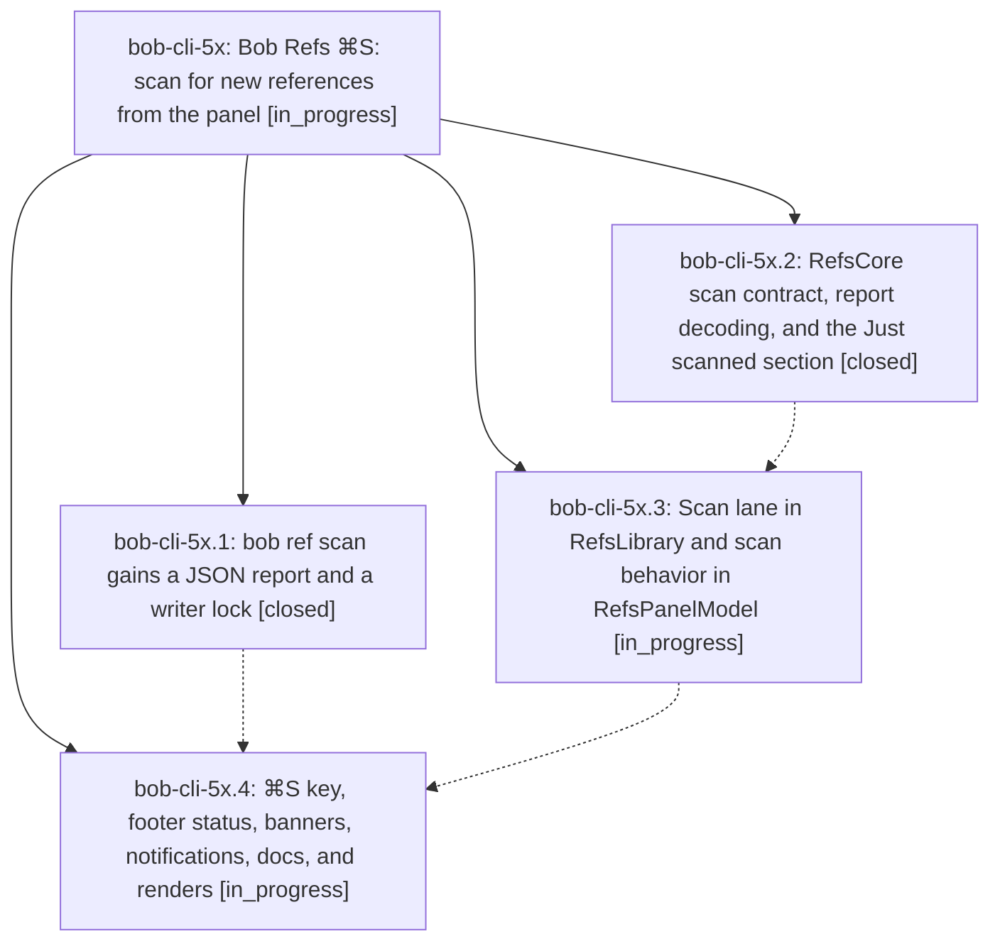

# Bead: bob-cli-5x — Bob Refs ⌘S: scan for new references from the panel

[Bead Pages](../README.md) / bob-cli-5x

**Status:** ◐ in_progress · **Type:** ▸ plan · **Tier:** epic
**Owner:** `bryanbugyi34@gmail.com` · **Created by:** [bbugyi200.athena.0z1](https://github.com/bobs-org/bob-cli--agents/blob/main/sessions/bbugyi200.athena.0z1.md) · **Assignee:** `bob-cli-5x.land`
**Created:** 2026-10-09 12:26:28 EDT
**Plan:** [202610/bob\_refs\_scan\_keymap.md](https://github.com/bobs-org/bob-cli--plans/blob/main/202610/bob_refs_scan_keymap.md)

<!-- sase:links:start -->

## Links

| Relation | Artifact | Why |
| --- | --- | --- |
| implemented-by | [plan:202610/bob_refs_scan_keymap.md][1] | derived from the plan's `bead_id:` frontmatter field |

_Plus 2 automatic references — see [Referenced By](#referenced-by)._

[1]: https://github.com/bobs-org/bob-cli--plans/blob/main/202610/bob_refs_scan_keymap.md

<!-- sase:links:end -->

## Description

Pressing ⌘S in the Bob Refs panel runs `bob ref scan -w` in the background, reports exactly which references the scan added, and puts those references at the top of the panel, selected. The panel stays usable, the scan survives the panel hiding, and every outcome (added, nothing new, partial, failed) is reported calmly and honestly.

## Phases

| Bead | Title | Status | Size | Created | Agents | Commits |
|---|---|---|---|---|---:|---:|
| [bob-cli-5x.1](bob-cli-5x.1.md) | bob ref scan gains a JSON report and a writer lock | ✓ closed | medium | 2026-10-09 | 1 | 1 |
| [bob-cli-5x.2](bob-cli-5x.2.md) | RefsCore scan contract, report decoding, and the Just scanned section | ✓ closed | medium | 2026-10-09 | 1 | 3 |
| [bob-cli-5x.3](bob-cli-5x.3.md) | Scan lane in RefsLibrary and scan behavior in RefsPanelModel | ◐ in_progress | medium | 2026-10-09 | 1 | 1 |
| [bob-cli-5x.4](bob-cli-5x.4.md) | ⌘S key, footer status, banners, notifications, docs, and renders | ◐ in_progress | medium | 2026-10-09 | 1 | 0 |

## Lineage

## Agents

| Agent | Bead | Commits |
|---|---|---:|
| [bbugyi200.athena.bob-cli-5x.1](https://github.com/bobs-org/bob-cli--agents/blob/main/agents/bbugyi200.athena.bob-cli-5x.1/README.md) | [bob-cli-5x.1](bob-cli-5x.1.md) | 1 |
| [bbugyi200.athena.bob-cli-5x.2](https://github.com/bobs-org/bob-cli--agents/blob/main/sessions/bbugyi200.athena.bob-cli-5x.2.md) | [bob-cli-5x.2](bob-cli-5x.2.md) | 3 |
| [bbugyi200.athena.bob-cli-5x.3](https://github.com/bobs-org/bob-cli--agents/blob/main/agents/bbugyi200.athena.bob-cli-5x.3/README.md) | [bob-cli-5x.3](bob-cli-5x.3.md) | 1 |
| [bbugyi200.athena.bob-cli-5x.4](https://github.com/bobs-org/bob-cli--agents/blob/main/agents/bbugyi200.athena.bob-cli-5x.4/README.md) | [bob-cli-5x.4](bob-cli-5x.4.md) | 0 |
| [bbugyi200.athena.bob-cli-5x.land](https://github.com/bobs-org/bob-cli--agents/blob/main/agents/bbugyi200.athena.bob-cli-5x.land/README.md) | [bob-cli-5x](README.md) | 0 |

## Commits

| Repo | Commit | Subject | Bead | Committed |
|---|---|---|---|---|
| bob-mac-capture | [`bob-mac-capture@6d98f23`](https://github.com/bobs-org/bob-mac-capture/commit/6d98f2303855dc97244560def21636792dcbe4c0) | feat(refs): add the scan report contract and Just scanned section | [bob-cli-5x.2](bob-cli-5x.2.md) | 2026-10-09 12:46:10 EDT |
| bob-cli | [`7fe88b7`](https://github.com/bobs-org/bob-cli/commit/7fe88b72f4d32df7e4bdf1af1a22a038cfd314a4) | feat(refs): add JSON scan report and writer lock to bob ref scan | [bob-cli-5x.1](bob-cli-5x.1.md) | 2026-10-09 12:50:42 EDT |
| bob-mac-capture | [`bob-mac-capture@fec4293`](https://github.com/bobs-org/bob-mac-capture/commit/fec42932669bf6fac7f564371cab4009e2f8a93a) | fix(capture): break up primaryActionTitle chain for Swift type-checker | [bob-cli-5x.2](bob-cli-5x.2.md) | 2026-10-09 12:56:46 EDT |
| bob-mac-capture | [`bob-mac-capture@fe27cd4`](https://github.com/bobs-org/bob-mac-capture/commit/fe27cd4a19d50c2d70915ccb8f985d33e7436155) | fix(capture): sync close-hint tests with note-free reset wording | [bob-cli-5x.2](bob-cli-5x.2.md) | 2026-10-09 13:07:49 EDT |
| bob-mac-capture | [`bob-mac-capture@37b914c`](https://github.com/bobs-org/bob-mac-capture/commit/37b914c4b76a6e737e0fd52dced390f5578894d9) | feat(refs): add the scan lane and panel scan behavior | [bob-cli-5x.3](bob-cli-5x.3.md) | 2026-10-09 13:41:16 EDT |

<!-- sase:referenced-by:start -->

## Referenced By

| Relation | Artifact | Why | Uses |
| --- | --- | --- | ---: |
| read-by | [agent:bob-cli-5x.1][1] | epic decisions and scope | 1 |
| read-by | [agent:bob-cli-5x.2][2] | Need epic DECISIONS and scope | 1 |

[1]: https://github.com/bobs-org/bob-cli--agents/blob/main/agents/bbugyi200.athena.bob-cli-5x.1/README.md
[2]: https://github.com/bobs-org/bob-cli--agents/blob/main/sessions/bbugyi200.athena.bob-cli-5x.2.md

<!-- sase:referenced-by:end -->
