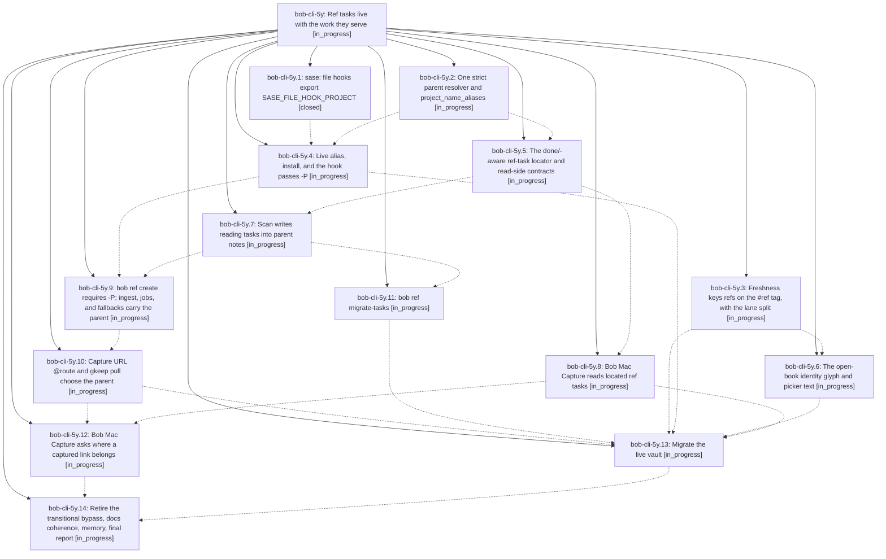

# Bead: bob-cli-5y — Ref tasks live with the work they serve

[Bead Pages](../README.md) / bob-cli-5y

**Status:** ◐ in_progress · **Type:** ▸ plan · **Tier:** epic
**Owner:** `bryanbugyi34@gmail.com` · **Created by:** [bbugyi200.athena.0z0](https://github.com/bobs-org/bob-cli--agents/blob/main/sessions/bbugyi200.athena.0z0.md) · **Assignee:** `bob-cli-5y.land`
**Created:** 2026-10-09 12:29:34 EDT
**Plan:** [202610/ref\_tasks\_live\_with\_parent.md](https://github.com/bobs-org/bob-cli--plans/blob/main/202610/ref_tasks_live_with_parent.md)

## Description

Every open reference has exactly one ordinary reading task, `#task #ref` with a unique `^ref-<slug>` block ID, in the `## Tasks` section of a real area, project, or inbox note, and that note is the reference's parent. Capture paths ask for, or receive, the parent. A done/-aware locator keeps ref-note status in sync wherever the task moves or is archived. The `#hide` and residence special cases are gone, and the 29 open refs are migrated without losing a field, link, or dependency.

## Phases

| Bead | Title | Status | Size | Created | Agents | Commits |
|---|---|---|---|---|---:|---:|
| [bob-cli-5y.1](bob-cli-5y.1.md) | sase: file hooks export SASE\_FILE\_HOOK\_PROJECT | ✓ closed | small | 2026-10-09 | 1 | 0 |
| [bob-cli-5y.10](bob-cli-5y.10.md) | Capture URL @route and gkeep pull choose the parent | ◐ in_progress | large | 2026-10-09 | 1 | 0 |
| [bob-cli-5y.11](bob-cli-5y.11.md) | bob ref migrate-tasks | ◐ in_progress | large | 2026-10-09 | 1 | 0 |
| [bob-cli-5y.12](bob-cli-5y.12.md) | Bob Mac Capture asks where a captured link belongs | ◐ in_progress | medium | 2026-10-09 | 1 | 0 |
| [bob-cli-5y.13](bob-cli-5y.13.md) | Migrate the live vault | ◐ in_progress | medium | 2026-10-09 | 1 | 0 |
| [bob-cli-5y.14](bob-cli-5y.14.md) | Retire the transitional bypass, docs coherence, memory, final report | ◐ in_progress | medium | 2026-10-09 | 1 | 0 |
| [bob-cli-5y.2](bob-cli-5y.2.md) | One strict parent resolver and project\_name\_aliases | ◐ in_progress | medium | 2026-10-09 | 1 | 0 |
| [bob-cli-5y.3](bob-cli-5y.3.md) | Freshness keys refs on the #ref tag, with the lane split | ◐ in_progress | medium | 2026-10-09 | 1 | 0 |
| [bob-cli-5y.4](bob-cli-5y.4.md) | Live alias, install, and the hook passes -P | ◐ in_progress | small | 2026-10-09 | 1 | 0 |
| [bob-cli-5y.5](bob-cli-5y.5.md) | The done/-aware ref-task locator and read-side contracts | ◐ in_progress | large | 2026-10-09 | 1 | 0 |
| [bob-cli-5y.6](bob-cli-5y.6.md) | The open-book identity glyph and picker text | ◐ in_progress | medium | 2026-10-09 | 1 | 0 |
| [bob-cli-5y.7](bob-cli-5y.7.md) | Scan writes reading tasks into parent notes | ◐ in_progress | large | 2026-10-09 | 1 | 0 |
| [bob-cli-5y.8](bob-cli-5y.8.md) | Bob Mac Capture reads located ref tasks | ◐ in_progress | medium | 2026-10-09 | 1 | 0 |
| [bob-cli-5y.9](bob-cli-5y.9.md) | bob ref create requires -P; ingest, jobs, and fallbacks carry the parent | ◐ in_progress | medium | 2026-10-09 | 1 | 0 |

## Lineage

## Agents

| Agent | Bead | Commits |
|---|---|---:|
| [bbugyi200.athena.bob-cli-5y.1](https://github.com/bobs-org/bob-cli--agents/blob/main/agents/bbugyi200.athena.bob-cli-5y.1/README.md) | [bob-cli-5y.1](bob-cli-5y.1.md) | 0 |
| [bbugyi200.athena.bob-cli-5y.10](https://github.com/bobs-org/bob-cli--agents/blob/main/agents/bbugyi200.athena.bob-cli-5y.10/README.md) | [bob-cli-5y.10](bob-cli-5y.10.md) | 0 |
| [bbugyi200.athena.bob-cli-5y.11](https://github.com/bobs-org/bob-cli--agents/blob/main/agents/bbugyi200.athena.bob-cli-5y.11/README.md) | [bob-cli-5y.11](bob-cli-5y.11.md) | 0 |
| [bbugyi200.athena.bob-cli-5y.12](https://github.com/bobs-org/bob-cli--agents/blob/main/agents/bbugyi200.athena.bob-cli-5y.12/README.md) | [bob-cli-5y.12](bob-cli-5y.12.md) | 0 |
| [bbugyi200.athena.bob-cli-5y.13](https://github.com/bobs-org/bob-cli--agents/blob/main/agents/bbugyi200.athena.bob-cli-5y.13/README.md) | [bob-cli-5y.13](bob-cli-5y.13.md) | 0 |
| [bbugyi200.athena.bob-cli-5y.14](https://github.com/bobs-org/bob-cli--agents/blob/main/agents/bbugyi200.athena.bob-cli-5y.14/README.md) | [bob-cli-5y.14](bob-cli-5y.14.md) | 0 |
| [bbugyi200.athena.bob-cli-5y.2](https://github.com/bobs-org/bob-cli--agents/blob/main/agents/bbugyi200.athena.bob-cli-5y.2/README.md) | [bob-cli-5y.2](bob-cli-5y.2.md) | 0 |
| [bbugyi200.athena.bob-cli-5y.3](https://github.com/bobs-org/bob-cli--agents/blob/main/agents/bbugyi200.athena.bob-cli-5y.3/README.md) | [bob-cli-5y.3](bob-cli-5y.3.md) | 0 |
| [bbugyi200.athena.bob-cli-5y.4](https://github.com/bobs-org/bob-cli--agents/blob/main/agents/bbugyi200.athena.bob-cli-5y.4/README.md) | [bob-cli-5y.4](bob-cli-5y.4.md) | 0 |
| [bbugyi200.athena.bob-cli-5y.5](https://github.com/bobs-org/bob-cli--agents/blob/main/agents/bbugyi200.athena.bob-cli-5y.5/README.md) | [bob-cli-5y.5](bob-cli-5y.5.md) | 0 |
| [bbugyi200.athena.bob-cli-5y.6](https://github.com/bobs-org/bob-cli--agents/blob/main/agents/bbugyi200.athena.bob-cli-5y.6/README.md) | [bob-cli-5y.6](bob-cli-5y.6.md) | 0 |
| [bbugyi200.athena.bob-cli-5y.7](https://github.com/bobs-org/bob-cli--agents/blob/main/agents/bbugyi200.athena.bob-cli-5y.7/README.md) | [bob-cli-5y.7](bob-cli-5y.7.md) | 0 |
| [bbugyi200.athena.bob-cli-5y.8](https://github.com/bobs-org/bob-cli--agents/blob/main/agents/bbugyi200.athena.bob-cli-5y.8/README.md) | [bob-cli-5y.8](bob-cli-5y.8.md) | 0 |
| [bbugyi200.athena.bob-cli-5y.9](https://github.com/bobs-org/bob-cli--agents/blob/main/agents/bbugyi200.athena.bob-cli-5y.9/README.md) | [bob-cli-5y.9](bob-cli-5y.9.md) | 0 |
| [bbugyi200.athena.bob-cli-5y.land](https://github.com/bobs-org/bob-cli--agents/blob/main/agents/bbugyi200.athena.bob-cli-5y.land/README.md) | [bob-cli-5y](README.md) | 0 |
