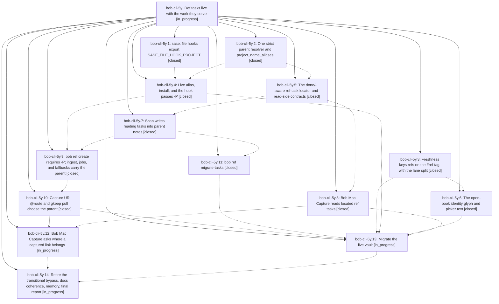

# Bead: bob-cli-5y — Ref tasks live with the work they serve

[Bead Pages](../README.md) / bob-cli-5y

**Status:** ◐ in_progress · **Type:** ▸ plan · **Tier:** epic
**Owner:** `bryanbugyi34@gmail.com` · **Created by:** [bbugyi200.athena.0z0](https://github.com/bobs-org/bob-cli--agents/blob/main/sessions/bbugyi200.athena.0z0.md) · **Assignee:** `bob-cli-5y.land`
**Created:** 2026-10-09 12:29:34 EDT
**Plan:** [202610/ref\_tasks\_live\_with\_parent.md](https://github.com/bobs-org/bob-cli--plans/blob/main/202610/ref_tasks_live_with_parent.md)

<!-- sase:links:start -->

## Links

| Relation | Artifact | Why |
| --- | --- | --- |
| implemented-by | [plan:202610/ref_tasks_live_with_parent.md][1] | derived from the plan's `bead_id:` frontmatter field |

_Plus 5 automatic references — see [Referenced By](#referenced-by)._

[1]: https://github.com/bobs-org/bob-cli--plans/blob/main/202610/ref_tasks_live_with_parent.md

<!-- sase:links:end -->

## Description

Every open reference has exactly one ordinary reading task, `#task #ref` with a unique `^ref-<slug>` block ID, in the `## Tasks` section of a real area, project, or inbox note, and that note is the reference's parent. Capture paths ask for, or receive, the parent. A done/-aware locator keeps ref-note status in sync wherever the task moves or is archived. The `#hide` and residence special cases are gone, and the 29 open refs are migrated without losing a field, link, or dependency.

## Notes

[2026-10-09T19:38:06Z · bob-cli-5z.land] DISCOVERED ISSUE: tests/cli/ref_library/tasks.rs doctor_reports_ref_tasks_and_parents_rows (added by 9041927, phase bob-cli-5y.5) fails deterministically on apollo at bob-cli master e9a0ee1: `bob ref doctor --no-hooks` exits 1 with 'result: failed' because 'library_dir: fail (<vault>/lib)' and 'xlib_dir: fail (<vault>/xlib)' -- tests/fixtures/ref_tasks/vault has no lib/ or xlib/ directories (git does not track empty dirs, so a checkout that had them locally would pass). Likely fix: create lib/ and xlib/ in fixture_vault() (or commit .gitkeep files), keeping the ref tasks/parents assertions. Found by bob-cli-5z.land while running just check (1272 passed, 1 failed in --test cli); not caused by bob-cli-5z.

[2026-10-09T19:51:02Z · bob-cli-5w.land] DISCOVERED ISSUE: bob-cli-5w.11 note #5 proposed README version-table repair. Landing source audit confirms a0a417a (bob-cli-5y.6) bumped manifests without updating the README rows: ledger-tools 1.37.0 -> 1.38.0, navigation-hotkeys 2.15.1 -> 2.16.0, block-id-prompt 1.24.0 -> 1.25.0. These stale rows are caused by this active epic, so it owns reconciliation; no separate task created.

## Phases

| Bead | Title | Status | Size | Created | Agents | Commits |
|---|---|---|---|---|---:|---:|
| [bob-cli-5y.1](bob-cli-5y.1.md) | sase: file hooks export SASE\_FILE\_HOOK\_PROJECT | ✓ closed | small | 2026-10-09 | 1 | 0 |
| [bob-cli-5y.10](bob-cli-5y.10.md) | Capture URL @route and gkeep pull choose the parent | ✓ closed | large | 2026-10-09 | 1 | 1 |
| [bob-cli-5y.11](bob-cli-5y.11.md) | bob ref migrate-tasks | ✓ closed | large | 2026-10-09 | 1 | 1 |
| [bob-cli-5y.12](bob-cli-5y.12.md) | Bob Mac Capture asks where a captured link belongs | ◐ in_progress | medium | 2026-10-09 | 1 | 0 |
| [bob-cli-5y.13](bob-cli-5y.13.md) | Migrate the live vault | ◐ in_progress | medium | 2026-10-09 | 1 | 0 |
| [bob-cli-5y.14](bob-cli-5y.14.md) | Retire the transitional bypass, docs coherence, memory, final report | ◐ in_progress | medium | 2026-10-09 | 1 | 0 |
| [bob-cli-5y.2](bob-cli-5y.2.md) | One strict parent resolver and project\_name\_aliases | ✓ closed | medium | 2026-10-09 | 1 | 1 |
| [bob-cli-5y.3](bob-cli-5y.3.md) | Freshness keys refs on the #ref tag, with the lane split | ✓ closed | medium | 2026-10-09 | 1 | 1 |
| [bob-cli-5y.4](bob-cli-5y.4.md) | Live alias, install, and the hook passes -P | ✓ closed | small | 2026-10-09 | 1 | 0 |
| [bob-cli-5y.5](bob-cli-5y.5.md) | The done/-aware ref-task locator and read-side contracts | ✓ closed | large | 2026-10-09 | 1 | 0 |
| [bob-cli-5y.6](bob-cli-5y.6.md) | The open-book identity glyph and picker text | ✓ closed | medium | 2026-10-09 | 1 | 1 |
| [bob-cli-5y.7](bob-cli-5y.7.md) | Scan writes reading tasks into parent notes | ✓ closed | large | 2026-10-09 | 1 | 1 |
| [bob-cli-5y.8](bob-cli-5y.8.md) | Bob Mac Capture reads located ref tasks | ✓ closed | medium | 2026-10-09 | 1 | 0 |
| [bob-cli-5y.9](bob-cli-5y.9.md) | bob ref create requires -P; ingest, jobs, and fallbacks carry the parent | ✓ closed | medium | 2026-10-09 | 1 | 1 |

## Lineage

## Agents

| Agent | Bead | Commits |
|---|---|---:|
| [bbugyi200.athena.bob-cli-5y.1](https://github.com/bobs-org/bob-cli--agents/blob/main/agents/bbugyi200.athena.bob-cli-5y.1/README.md) | [bob-cli-5y.1](bob-cli-5y.1.md) | 0 |
| [bbugyi200.athena.bob-cli-5y.10](https://github.com/bobs-org/bob-cli--agents/blob/main/sessions/bbugyi200.athena.bob-cli-5y.10.md) | [bob-cli-5y.10](bob-cli-5y.10.md) | 1 |
| [bbugyi200.athena.bob-cli-5y.11](https://github.com/bobs-org/bob-cli--agents/blob/main/sessions/bbugyi200.athena.bob-cli-5y.11.md) | [bob-cli-5y.11](bob-cli-5y.11.md) | 1 |
| [bbugyi200.athena.bob-cli-5y.12](https://github.com/bobs-org/bob-cli--agents/blob/main/agents/bbugyi200.athena.bob-cli-5y.12/README.md) | [bob-cli-5y.12](bob-cli-5y.12.md) | 0 |
| [bbugyi200.athena.bob-cli-5y.13](https://github.com/bobs-org/bob-cli--agents/blob/main/agents/bbugyi200.athena.bob-cli-5y.13/README.md) | [bob-cli-5y.13](bob-cli-5y.13.md) | 0 |
| [bbugyi200.athena.bob-cli-5y.14](https://github.com/bobs-org/bob-cli--agents/blob/main/agents/bbugyi200.athena.bob-cli-5y.14/README.md) | [bob-cli-5y.14](bob-cli-5y.14.md) | 0 |
| [bbugyi200.athena.bob-cli-5y.2](https://github.com/bobs-org/bob-cli--agents/blob/main/agents/bbugyi200.athena.bob-cli-5y.2/README.md) | [bob-cli-5y.2](bob-cli-5y.2.md) | 1 |
| [bbugyi200.athena.bob-cli-5y.3](https://github.com/bobs-org/bob-cli--agents/blob/main/agents/bbugyi200.athena.bob-cli-5y.3/README.md) | [bob-cli-5y.3](bob-cli-5y.3.md) | 1 |
| [bbugyi200.athena.bob-cli-5y.4](https://github.com/bobs-org/bob-cli--agents/blob/main/agents/bbugyi200.athena.bob-cli-5y.4/README.md) | [bob-cli-5y.4](bob-cli-5y.4.md) | 0 |
| [bbugyi200.athena.bob-cli-5y.5](https://github.com/bobs-org/bob-cli--agents/blob/main/agents/bbugyi200.athena.bob-cli-5y.5/README.md) | [bob-cli-5y.5](bob-cli-5y.5.md) | 0 |
| [bbugyi200.athena.bob-cli-5y.6](https://github.com/bobs-org/bob-cli--agents/blob/main/agents/bbugyi200.athena.bob-cli-5y.6/README.md) | [bob-cli-5y.6](bob-cli-5y.6.md) | 1 |
| [bbugyi200.athena.bob-cli-5y.7](https://github.com/bobs-org/bob-cli--agents/blob/main/sessions/bbugyi200.athena.bob-cli-5y.7.md) | [bob-cli-5y.7](bob-cli-5y.7.md) | 1 |
| [bbugyi200.athena.bob-cli-5y.8](https://github.com/bobs-org/bob-cli--agents/blob/main/agents/bbugyi200.athena.bob-cli-5y.8/README.md) | [bob-cli-5y.8](bob-cli-5y.8.md) | 0 |
| [bbugyi200.athena.bob-cli-5y.9](https://github.com/bobs-org/bob-cli--agents/blob/main/agents/bbugyi200.athena.bob-cli-5y.9/README.md) | [bob-cli-5y.9](bob-cli-5y.9.md) | 1 |
| [bbugyi200.athena.bob-cli-5y.land](https://github.com/bobs-org/bob-cli--agents/blob/main/agents/bbugyi200.athena.bob-cli-5y.land/README.md) | [bob-cli-5y](README.md) | 0 |

## Commits

| Repo | Commit | Subject | Bead | Committed |
|---|---|---|---|---|
| bob-cli | [`e0ba61b`](https://github.com/bobs-org/bob-cli/commit/e0ba61b78306c8c98091555001a01c8502b75ef6) | feat(parent-notes): shared parent resolver with project aliases for capture targets and highlights-ref create | [bob-cli-5y.2](bob-cli-5y.2.md) | 2026-10-09 12:49:29 EDT |
| bob-cli | [`e04c421`](https://github.com/bobs-org/bob-cli/commit/e04c42156c22ea8ed24091249176f3d124517b93) | feat(freshness): re-key ref review identity to the #ref tag with the lane split | [bob-cli-5y.3](bob-cli-5y.3.md) | 2026-10-09 12:57:31 EDT |
| bob-cli | [`5f845db`](https://github.com/bobs-org/bob-cli/commit/5f845dbb18e5c6b6fe91b669c9cbf96c37090f92) | docs(task-marks): specify the #task #ref open-book glyph and picker text | [bob-cli-5y.6](bob-cli-5y.6.md) | 2026-10-09 13:20:14 EDT |
| bob-cli | [`4016229`](https://github.com/bobs-org/bob-cli/commit/40162297a54caf743a177d85266a41e8bfe1a838) | feat(ref-tasks): add shared v2 reading-task rendering and guarded insertion | [bob-cli-5y.7](bob-cli-5y.7.md) | 2026-10-09 15:19:22 EDT |
| bob-cli | [`e6aa7a4`](https://github.com/bobs-org/bob-cli/commit/e6aa7a491c4fcf504e02edf774442d934a7f5494) | feat(ref): require -P parent for bob ref create end to end | [bob-cli-5y.9](bob-cli-5y.9.md) | 2026-10-09 19:40:19 EDT |
| bob-cli | [`8905153`](https://github.com/bobs-org/bob-cli/commit/89051533fbf1820e8aa89c6355cac883d6621ded) | feat(ref): add bob ref migrate-tasks dry-run-first migration | [bob-cli-5y.11](bob-cli-5y.11.md) | 2026-10-09 19:55:18 EDT |
| bob-cli | [`091eda9`](https://github.com/bobs-org/bob-cli/commit/091eda911b985e0c69e5d20982c9d7275fd61b2e) | feat(capture-gkeep): URL @route and gkeep pull choose the reference parent | [bob-cli-5y.10](bob-cli-5y.10.md) | 2026-10-09 21:07:04 EDT |

<!-- sase:referenced-by:start -->

## Referenced By

| Relation | Artifact | Why | Uses |
| --- | --- | --- | ---: |
| read-by | [agent:bob-cli-5y.3][1] | epic context for phase | 1 |
| read-by | [agent:bob-cli-5y.4][2] | Need epic plan details for hook-config phase | 1 |
| read-by | [agent:bob-cli-5y.9][3] | epic scope and decisions | 1 |
| read-by | [agent:bob-cli-5z.land][4] | Check whether the ref-tasks doctor CLI test failure from commit 9041927 is causally tied to this active epic | 2 |
| read-by | [agent:bob-cli-62.land--1][5] | Confirm outer epic stays open per landing plan | 1 |

[1]: https://github.com/bobs-org/bob-cli--agents/blob/main/agents/bbugyi200.athena.bob-cli-5y.3/README.md
[2]: https://github.com/bobs-org/bob-cli--agents/blob/main/agents/bbugyi200.athena.bob-cli-5y.4/README.md
[3]: https://github.com/bobs-org/bob-cli--agents/blob/main/agents/bbugyi200.athena.bob-cli-5y.9/README.md
[4]: https://github.com/bobs-org/bob-cli--agents/blob/main/agents/bbugyi200.athena.bob-cli-5z.land/README.md
[5]: https://github.com/bobs-org/bob-cli--agents/blob/main/sessions/bbugyi200.athena.bob-cli-62.land.md

<!-- sase:referenced-by:end -->
