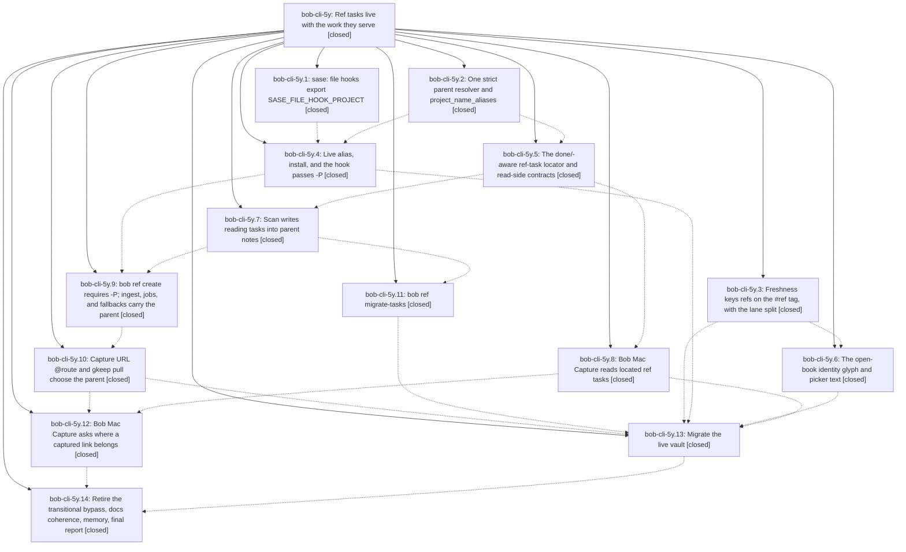

# Bead: bob-cli-5y — Ref tasks live with the work they serve

[Bead Pages](../README.md) / bob-cli-5y

**Status:** ✓ closed · **Resolution:** done · **Type:** ▸ plan · **Tier:** epic
**Owner:** `bryanbugyi34@gmail.com` · **Created by:** [bbugyi200.athena.0z0](https://github.com/bobs-org/bob-cli--agents/blob/main/sessions/bbugyi200.athena.0z0.md) · **Assignee:** `bob-cli-5y.land`
**Created:** 2026-10-09 12:29:34 EDT · **Closed:** 2026-10-09 22:51:11 EDT
**Plan:** [202610/ref\_tasks\_live\_with\_parent.md](https://github.com/bobs-org/bob-cli--plans/blob/main/202610/ref_tasks_live_with_parent.md)

<!-- sase:links:start -->

## Links

| Relation | Artifact | Why |
| --- | --- | --- |
| implemented-by | [plan:202610/ref_tasks_live_with_parent.md][1] | derived from the plan's `bead_id:` frontmatter field |

_Plus 5 automatic references — see [Referenced By](#referenced-by)._

[1]: https://github.com/bobs-org/bob-cli--plans/blob/main/202610/ref_tasks_live_with_parent.md

<!-- sase:links:end -->

## Description

Every open reference has exactly one ordinary reading task, `#task #ref` with a unique `^ref-<slug>` block ID, in the `## Tasks` section of a real area, project, or inbox note, and that note is the reference's parent. Capture paths ask for, or receive, the parent. A done/-aware locator keeps ref-note status in sync wherever the task moves or is archived. The `#hide` and residence special cases are gone, and the 29 open refs are migrated without losing a field, link, or dependency.

## Notes

[2026-10-09T19:38:06Z · bob-cli-5z.land] DISCOVERED ISSUE: tests/cli/ref_library/tasks.rs doctor_reports_ref_tasks_and_parents_rows (added by 9041927, phase bob-cli-5y.5) fails deterministically on apollo at bob-cli master e9a0ee1: `bob ref doctor --no-hooks` exits 1 with 'result: failed' because 'library_dir: fail (<vault>/lib)' and 'xlib_dir: fail (<vault>/xlib)' -- tests/fixtures/ref_tasks/vault has no lib/ or xlib/ directories (git does not track empty dirs, so a checkout that had them locally would pass). Likely fix: create lib/ and xlib/ in fixture_vault() (or commit .gitkeep files), keeping the ref tasks/parents assertions. Found by bob-cli-5z.land while running just check (1272 passed, 1 failed in --test cli); not caused by bob-cli-5z.

[2026-10-09T19:51:02Z · bob-cli-5w.land] DISCOVERED ISSUE: bob-cli-5w.11 note #5 proposed README version-table repair. Landing source audit confirms a0a417a (bob-cli-5y.6) bumped manifests without updating the README rows: ledger-tools 1.37.0 -> 1.38.0, navigation-hotkeys 2.15.1 -> 2.16.0, block-id-prompt 1.24.0 -> 1.25.0. These stale rows are caused by this active epic, so it owns reconciliation; no separate task created.

[2026-10-10T02:42:08Z · bob-cli-5y.land] LANDING TRIAGE (bob-cli-5y.land): PROPOSED FOLLOW-UP outcomes. decisions strand ref-tasks-live-with-their-parent (every phase) -> bob-cli-6d (memory, related 51/5d). Glossary reference-task/reference-note/area-note (every phase) -> bob-cli-6c (memory, related 4n/4t). Roll-decay picker-single clock failures (5y.3 #3, 5y.6 #3) -> duplicate of bob-cli-5r, +1 recorded (reproduced on bob-plugins fa3d427). Stale sase_core_rs wire red just check (5y.1 #3) -> declined: environmental and resolved, later phases ran just check green. Mac CI red at CapturePanelView.swift:2449 (5y.8 #3) -> declined: fixed upstream, bob-mac-capture CI green at 3d36a02 and on the final epic commit f51cdc1 (run 38015188801). Mac-side bob install unconfirmed (5y.13 #3) -> no bead: a Bryan action, since agents never install on the Mac and the Mac is offline (Tailscale), recorded for the close note; vault origin is still at migration commit 9253886, so no old-bob scan has run since. athena ~/.ssh/config dangling symlink breaks vault-sync (5y.13 #4) -> bob-cli-6e (bug). cancel_dropped_wrapper_refs note (5y.10--1 #3) -> declined: not a memory decision; the =no branch is correctly a no-op. gkeep re-pull parent display (5y.10--1 #5) -> bob-cli-6i. ledger-tools hidden-^ref bypass parity (5y.14 #3) -> epic work, caused by this epic, planned in the landing tale. Plan closeout step 5 follow-ups that 5y.14 never recorded: sole status authority -> bob-cli-6f; alias-aware ordinary @route capture -> bob-cli-6g (repro: 'fix the thing @bob-cli' would create bob-cli.md); post-scan reading-task notification -> bob-cli-6h (also covers the missing reading-task fields in the parallel bob-cli-5x scan JSON). Epic note #1 (doctor fixture lib/xlib) -> resolved in b1512d6. Epic note #2 (README version rows) -> rows now match the manifests; the stale freshness-namespace README text is fixed in the landing tale. Integration: the idle agenda (active epic bob-cli-66) drops task_kind for ref tasks -> DISCOVERED ISSUE note on bob-cli-66; context notes added to bob-cli-5d and bob-cli-51, whose proposed decision records predate this epic's contract.

[2026-10-10T02:51:11Z · bob-cli-5y.land] Landing verified. Phases 5y.1-5y.14 all closed; each child note reviewed and addressed. Code checked against the plan: resolve_parent/project_name_aliases (parent_notes.rs), RefTaskIndex locator plus task object and doctor rows, v2 births/managed embed/cross-file sync (bob-cli-62), -P required with DEFAULT_PARENT/INGEST_PARENT deleted, URL @route and gkeep -P/prompt, migrate-tasks, #ref freshness identity with the Ready/lane split, the open-book glyph and picker text, Mac task decode and File under (bob-mac-capture CI green at f51cdc1, run 38015188801), SASE_FILE_HOOK_PROJECT live in the sase runner, and the chezmoi hook passing -P. Live vault: bob ref doctor reports ref tasks ok (32 live, 0 archived, 0 open v1) and parents ok; migrate-tasks dry run has 0 open ref tasks; no open #task #ref line carries #hide. Landing tale: bob-ledger-tools dropped the exact-^ref #hide bypass to match Rust f315c58 (ledger 1.39.0, namespace v10; tracking/recurring vectors updated; npm test passes with only the 2 known bob-cli-5r roll-decay failures; bob plugins sync ok); README ledger row and API paragraph name namespace v10/refTagIdentity and the open-book mark; docs/freshness.md changelog names ledger 1.39.0; just check passes. Integration: the parallel idle agenda (bob-cli-66) drops task_kind for ref tasks, recorded as a DISCOVERED ISSUE on bob-cli-66; the parallel bob-cli-5x scan JSON has no reading-task fields, folded into bob-cli-6h; context notes added to bob-cli-5d and bob-cli-51. Follow-ups: bob-cli-6c, 6d (memory), 6e (athena ssh config bug), 6f, 6g, 6h, 6i (features); bob-cli-5r +1; the rest declined with reasons in the LANDING TRIAGE note. For Bryan: (1) run just install-all on the Mac before its next highlights scan (Mac offline, unverified; the vault origin is still at migration commit 9253886); (2) live-migration used evidence-derived parents instead of the plan table for 7 refs, so refile with Ctrl+Shift+M if you prefer the table: databricks_omnigent_job_fit sase_blog_0 (table: job), global_just_recipe_completion bob (dev), understanding_is_the_new_bottleneck sase (dev), toobig_split_beyond_python sase (sase_toobig_symvision), agent_image_generation_toolset sase (sase_art), sase_task_bead_48h_impact_rating sase (sase_better_tasks), agent_instructions_budgeted_router sase (sase_memory); (3) athena vault-sync cannot reach origin until bob-cli-6e is fixed.

## Phases

| Bead | Title | Status | Size | Created | Agents | Commits |
|---|---|---|---|---|---:|---:|
| [bob-cli-5y.1](bob-cli-5y.1.md) | sase: file hooks export SASE\_FILE\_HOOK\_PROJECT | ✓ closed | small | 2026-10-09 | 1 | 0 |
| [bob-cli-5y.10](bob-cli-5y.10.md) | Capture URL @route and gkeep pull choose the parent | ✓ closed | large | 2026-10-09 | 1 | 1 |
| [bob-cli-5y.11](bob-cli-5y.11.md) | bob ref migrate-tasks | ✓ closed | large | 2026-10-09 | 1 | 1 |
| [bob-cli-5y.12](bob-cli-5y.12.md) | Bob Mac Capture asks where a captured link belongs | ✓ closed | medium | 2026-10-09 | 1 | 1 |
| [bob-cli-5y.13](bob-cli-5y.13.md) | Migrate the live vault | ✓ closed | medium | 2026-10-09 | 1 | 0 |
| [bob-cli-5y.14](bob-cli-5y.14.md) | Retire the transitional bypass, docs coherence, memory, final report | ✓ closed | medium | 2026-10-09 | 1 | 1 |
| [bob-cli-5y.2](bob-cli-5y.2.md) | One strict parent resolver and project\_name\_aliases | ✓ closed | medium | 2026-10-09 | 1 | 1 |
| [bob-cli-5y.3](bob-cli-5y.3.md) | Freshness keys refs on the #ref tag, with the lane split | ✓ closed | medium | 2026-10-09 | 1 | 2 |
| [bob-cli-5y.4](bob-cli-5y.4.md) | Live alias, install, and the hook passes -P | ✓ closed | small | 2026-10-09 | 1 | 0 |
| [bob-cli-5y.5](bob-cli-5y.5.md) | The done/-aware ref-task locator and read-side contracts | ✓ closed | large | 2026-10-09 | 1 | 0 |
| [bob-cli-5y.6](bob-cli-5y.6.md) | The open-book identity glyph and picker text | ✓ closed | medium | 2026-10-09 | 1 | 2 |
| [bob-cli-5y.7](bob-cli-5y.7.md) | Scan writes reading tasks into parent notes | ✓ closed | large | 2026-10-09 | 1 | 1 |
| [bob-cli-5y.8](bob-cli-5y.8.md) | Bob Mac Capture reads located ref tasks | ✓ closed | medium | 2026-10-09 | 1 | 1 |
| [bob-cli-5y.9](bob-cli-5y.9.md) | bob ref create requires -P; ingest, jobs, and fallbacks carry the parent | ✓ closed | medium | 2026-10-09 | 1 | 1 |

## Lineage

## Agents

| Agent | Bead | Commits |
|---|---|---:|
| [bbugyi200.athena.bob-cli-5y.1](https://github.com/bobs-org/bob-cli--agents/blob/main/agents/bbugyi200.athena.bob-cli-5y.1/README.md) | [bob-cli-5y.1](bob-cli-5y.1.md) | 0 |
| [bbugyi200.athena.bob-cli-5y.10](https://github.com/bobs-org/bob-cli--agents/blob/main/sessions/bbugyi200.athena.bob-cli-5y.10.md) | [bob-cli-5y.10](bob-cli-5y.10.md) | 1 |
| [bbugyi200.athena.bob-cli-5y.11](https://github.com/bobs-org/bob-cli--agents/blob/main/sessions/bbugyi200.athena.bob-cli-5y.11.md) | [bob-cli-5y.11](bob-cli-5y.11.md) | 1 |
| [bbugyi200.athena.bob-cli-5y.12](https://github.com/bobs-org/bob-cli--agents/blob/main/sessions/bbugyi200.athena.bob-cli-5y.12.md) | [bob-cli-5y.12](bob-cli-5y.12.md) | 1 |
| [bbugyi200.athena.bob-cli-5y.13](https://github.com/bobs-org/bob-cli--agents/blob/main/agents/bbugyi200.athena.bob-cli-5y.13/README.md) | [bob-cli-5y.13](bob-cli-5y.13.md) | 0 |
| [bbugyi200.athena.bob-cli-5y.14](https://github.com/bobs-org/bob-cli--agents/blob/main/agents/bbugyi200.athena.bob-cli-5y.14/README.md) | [bob-cli-5y.14](bob-cli-5y.14.md) | 1 |
| [bbugyi200.athena.bob-cli-5y.2](https://github.com/bobs-org/bob-cli--agents/blob/main/agents/bbugyi200.athena.bob-cli-5y.2/README.md) | [bob-cli-5y.2](bob-cli-5y.2.md) | 1 |
| [bbugyi200.athena.bob-cli-5y.3](https://github.com/bobs-org/bob-cli--agents/blob/main/agents/bbugyi200.athena.bob-cli-5y.3/README.md) | [bob-cli-5y.3](bob-cli-5y.3.md) | 2 |
| [bbugyi200.athena.bob-cli-5y.4](https://github.com/bobs-org/bob-cli--agents/blob/main/agents/bbugyi200.athena.bob-cli-5y.4/README.md) | [bob-cli-5y.4](bob-cli-5y.4.md) | 0 |
| [bbugyi200.athena.bob-cli-5y.5](https://github.com/bobs-org/bob-cli--agents/blob/main/agents/bbugyi200.athena.bob-cli-5y.5/README.md) | [bob-cli-5y.5](bob-cli-5y.5.md) | 0 |
| [bbugyi200.athena.bob-cli-5y.6](https://github.com/bobs-org/bob-cli--agents/blob/main/agents/bbugyi200.athena.bob-cli-5y.6/README.md) | [bob-cli-5y.6](bob-cli-5y.6.md) | 2 |
| [bbugyi200.athena.bob-cli-5y.7](https://github.com/bobs-org/bob-cli--agents/blob/main/sessions/bbugyi200.athena.bob-cli-5y.7.md) | [bob-cli-5y.7](bob-cli-5y.7.md) | 1 |
| [bbugyi200.athena.bob-cli-5y.8](https://github.com/bobs-org/bob-cli--agents/blob/main/agents/bbugyi200.athena.bob-cli-5y.8/README.md) | [bob-cli-5y.8](bob-cli-5y.8.md) | 1 |
| [bbugyi200.athena.bob-cli-5y.9](https://github.com/bobs-org/bob-cli--agents/blob/main/agents/bbugyi200.athena.bob-cli-5y.9/README.md) | [bob-cli-5y.9](bob-cli-5y.9.md) | 1 |
| [bbugyi200.athena.bob-cli-5y.land](https://github.com/bobs-org/bob-cli--agents/blob/main/sessions/bbugyi200.athena.bob-cli-5y.land.md) | [bob-cli-5y](README.md) | 1 |

## Commits

| Repo | Commit | Subject | Bead | Committed |
|---|---|---|---|---|
| bob-cli | [`e0ba61b`](https://github.com/bobs-org/bob-cli/commit/e0ba61b78306c8c98091555001a01c8502b75ef6) | feat(parent-notes): shared parent resolver with project aliases for capture targets and highlights-ref create | [bob-cli-5y.2](bob-cli-5y.2.md) | 2026-10-09 12:49:29 EDT |
| bob-cli | [`e04c421`](https://github.com/bobs-org/bob-cli/commit/e04c42156c22ea8ed24091249176f3d124517b93) | feat(freshness): re-key ref review identity to the #ref tag with the lane split | [bob-cli-5y.3](bob-cli-5y.3.md) | 2026-10-09 12:57:31 EDT |
| bob-plugins | [`bob-plugins@947615d`](https://github.com/bobs-org/bob-plugins/commit/947615d8e28871f7144dc859d1f740dcbcc10189) | feat(ledger-tools): mirror the #ref tag identity with the Ready/lane split | [bob-cli-5y.3](bob-cli-5y.3.md) | 2026-10-09 12:58:23 EDT |
| bob-cli | [`5f845db`](https://github.com/bobs-org/bob-cli/commit/5f845dbb18e5c6b6fe91b669c9cbf96c37090f92) | docs(task-marks): specify the #task #ref open-book glyph and picker text | [bob-cli-5y.6](bob-cli-5y.6.md) | 2026-10-09 13:20:14 EDT |
| bob-plugins | [`bob-plugins@a0a417a`](https://github.com/bobs-org/bob-plugins/commit/a0a417a0b44c769858a57db0f4b7325a9d89166b) | feat(ref-glyph): render #task #ref pairs as one open-book mark with book picker text | [bob-cli-5y.6](bob-cli-5y.6.md) | 2026-10-09 13:23:25 EDT |
| bob-mac-capture | [`bob-mac-capture@aa47c1f`](https://github.com/bobs-org/bob-mac-capture/commit/aa47c1f3a9d15e84cab295a46a241816661409be) | feat(refs): read located ref tasks (mac-refs-v2) | [bob-cli-5y.8](bob-cli-5y.8.md) | 2026-10-09 15:14:26 EDT |
| bob-cli | [`4016229`](https://github.com/bobs-org/bob-cli/commit/40162297a54caf743a177d85266a41e8bfe1a838) | feat(ref-tasks): add shared v2 reading-task rendering and guarded insertion | [bob-cli-5y.7](bob-cli-5y.7.md) | 2026-10-09 15:19:22 EDT |
| bob-cli | [`e6aa7a4`](https://github.com/bobs-org/bob-cli/commit/e6aa7a491c4fcf504e02edf774442d934a7f5494) | feat(ref): require -P parent for bob ref create end to end | [bob-cli-5y.9](bob-cli-5y.9.md) | 2026-10-09 19:40:19 EDT |
| bob-cli | [`8905153`](https://github.com/bobs-org/bob-cli/commit/89051533fbf1820e8aa89c6355cac883d6621ded) | feat(ref): add bob ref migrate-tasks dry-run-first migration | [bob-cli-5y.11](bob-cli-5y.11.md) | 2026-10-09 19:55:18 EDT |
| bob-cli | [`091eda9`](https://github.com/bobs-org/bob-cli/commit/091eda911b985e0c69e5d20982c9d7275fd61b2e) | feat(capture-gkeep): URL @route and gkeep pull choose the reference parent | [bob-cli-5y.10](bob-cli-5y.10.md) | 2026-10-09 21:07:04 EDT |
| bob-mac-capture | [`bob-mac-capture@f51cdc1`](https://github.com/bobs-org/bob-mac-capture/commit/f51cdc18dc35253ced7fa0542999e4544550eb35) | feat(capture-ref): ask where a captured link belongs with File under picker | [bob-cli-5y.12](bob-cli-5y.12.md) | 2026-10-09 21:57:55 EDT |
| bob-cli | [`f315c58`](https://github.com/bobs-org/bob-cli/commit/f315c58c70dfe16fadb6052457250e670efe3c28) | feat(freshness): remove hidden ^ref review bypass and close out post-closeout contract | [bob-cli-5y.14](bob-cli-5y.14.md) | 2026-10-09 22:16:25 EDT |
| bob-cli | [`57a2900`](https://github.com/bobs-org/bob-cli/commit/57a2900450418052ff8931cfc72e1afcd45891e0) | fix(ob): harden lock\_wait\_behavior against fork-inherited fd flake | [bob-cli-5y](README.md) | 2026-10-09 23:17:11 EDT |

<!-- sase:referenced-by:start -->

## Referenced By

| Relation | Artifact | Why | Uses |
| --- | --- | --- | ---: |
| read-by | [agent:bob-cli-5y.3][1] | epic context for phase | 1 |
| read-by | [agent:bob-cli-5y.4][2] | Need epic plan details for hook-config phase | 1 |
| read-by | [agent:bob-cli-5y.9][3] | epic scope and decisions | 1 |
| read-by | [agent:bob-cli-5z.land][4] | Check whether the ref-tasks doctor CLI test failure from commit 9041927 is causally tied to this active epic | 2 |
| read-by | [agent:bob-cli-62.land--1][5] | Confirm outer epic stays open per landing plan | 1 |

[1]: https://github.com/bobs-org/bob-cli--agents/blob/main/agents/bbugyi200.athena.bob-cli-5y.3/README.md
[2]: https://github.com/bobs-org/bob-cli--agents/blob/main/agents/bbugyi200.athena.bob-cli-5y.4/README.md
[3]: https://github.com/bobs-org/bob-cli--agents/blob/main/agents/bbugyi200.athena.bob-cli-5y.9/README.md
[4]: https://github.com/bobs-org/bob-cli--agents/blob/main/agents/bbugyi200.athena.bob-cli-5z.land/README.md
[5]: https://github.com/bobs-org/bob-cli--agents/blob/main/sessions/bbugyi200.athena.bob-cli-62.land.md

<!-- sase:referenced-by:end -->
