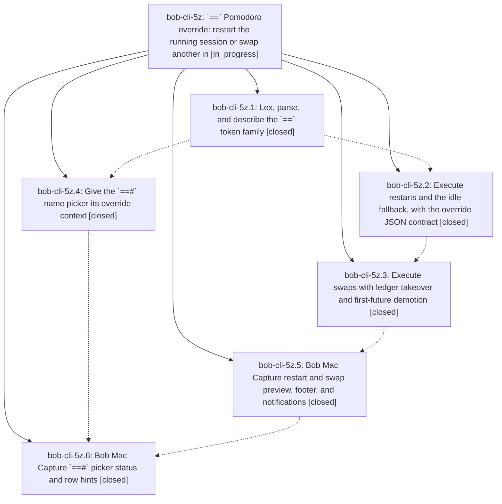

# Bead: bob-cli-5z — \`==\` Pomodoro override: restart the running session or swap another in

[Bead Pages](../README.md) / bob-cli-5z

**Status:** ◐ in_progress · **Type:** ▸ plan · **Tier:** epic
**Owner:** `bryanbugyi34@gmail.com` · **Created by:** [bbugyi200.apollo.61.w1.w0](https://github.com/bobs-org/bob-cli--agents/blob/main/sessions/bbugyi200.apollo.61.w1.w0.md) · **Assignee:** `bob-cli-5z.land`
**Created:** 2026-10-09 13:24:48 EDT
**Plan:** [202610/pomodoro\_override.md](https://github.com/bobs-org/bob-cli--plans/blob/main/202610/pomodoro_override.md)

<!-- sase:links:start -->

## Links

| Relation | Artifact | Why |
| --- | --- | --- |
| implemented-by | [plan:202610/pomodoro_override.md][1] | derived from the plan's `bead_id:` frontmatter field |

_Plus 4 automatic references — see [Referenced By](#referenced-by)._

[1]: https://github.com/bobs-org/bob-cli--plans/blob/main/202610/pomodoro_override.md

<!-- sase:links:end -->

## Description

`bob capture` and Bob Mac Capture accept `==`, the override twin of every whole-item `=` start: `==<X>` restarts the running Pomodoro with fresh `se<X>` timing, and `==[<X>]#name` swaps a different Pomodoro in as the running one (taking over the running session ledger unless a timing is given) while the old one returns, intact, to first future. Every path is atomic, dry-run exact, byte-preserving, and explained in both the CLI and the Mac preview.

## Notes

[2026-10-09T19:04:20Z · bryanbugyi34@gmail.com] The bob-mac-capture app is no longer building on my macbook (bob-cli-5z.5 caused this I think). See 🔒 bob\_mac\_capture\_install\_error.txt for context.

## Attachments

- 🔒 bob\_mac\_capture\_install\_error.txt · text/plain · 8.25293 KiB (private attachment)

## Phases

| Bead | Title | Status | Size | Created | Agents | Commits |
|---|---|---|---|---|---:|---:|
| [bob-cli-5z.1](bob-cli-5z.1.md) | Lex, parse, and describe the \`==\` token family | ✓ closed | medium | 2026-10-09 | 1 | 1 |
| [bob-cli-5z.2](bob-cli-5z.2.md) | Execute restarts and the idle fallback, with the override JSON contract | ✓ closed | medium | 2026-10-09 | 1 | 1 |
| [bob-cli-5z.3](bob-cli-5z.3.md) | Execute swaps with ledger takeover and first-future demotion | ✓ closed | medium | 2026-10-09 | 1 | 1 |
| [bob-cli-5z.4](bob-cli-5z.4.md) | Give the \`==#\` name picker its override context | ✓ closed | small | 2026-10-09 | 1 | 1 |
| [bob-cli-5z.5](bob-cli-5z.5.md) | Bob Mac Capture restart and swap preview, footer, and notifications | ✓ closed | medium | 2026-10-09 | 1 | 0 |
| [bob-cli-5z.6](bob-cli-5z.6.md) | Bob Mac Capture \`==#\` picker status and row hints | ✓ closed | small | 2026-10-09 | 1 | 0 |

## Lineage

## Agents

| Agent | Bead | Commits |
|---|---|---:|
| [bbugyi200.apollo.bob-cli-5z.1](https://github.com/bobs-org/bob-cli--agents/blob/main/agents/bbugyi200.apollo.bob-cli-5z.1/README.md) | [bob-cli-5z.1](bob-cli-5z.1.md) | 1 |
| [bbugyi200.apollo.bob-cli-5z.2](https://github.com/bobs-org/bob-cli--agents/blob/main/agents/bbugyi200.apollo.bob-cli-5z.2/README.md) | [bob-cli-5z.2](bob-cli-5z.2.md) | 1 |
| [bbugyi200.apollo.bob-cli-5z.3](https://github.com/bobs-org/bob-cli--agents/blob/main/agents/bbugyi200.apollo.bob-cli-5z.3/README.md) | [bob-cli-5z.3](bob-cli-5z.3.md) | 1 |
| [bbugyi200.apollo.bob-cli-5z.4](https://github.com/bobs-org/bob-cli--agents/blob/main/agents/bbugyi200.apollo.bob-cli-5z.4/README.md) | [bob-cli-5z.4](bob-cli-5z.4.md) | 1 |
| [bbugyi200.apollo.bob-cli-5z.5](https://github.com/bobs-org/bob-cli--agents/blob/main/agents/bbugyi200.apollo.bob-cli-5z.5/README.md) | [bob-cli-5z.5](bob-cli-5z.5.md) | 0 |
| [bbugyi200.apollo.bob-cli-5z.6](https://github.com/bobs-org/bob-cli--agents/blob/main/agents/bbugyi200.apollo.bob-cli-5z.6/README.md) | [bob-cli-5z.6](bob-cli-5z.6.md) | 0 |
| [bbugyi200.apollo.bob-cli-5z.land](https://github.com/bobs-org/bob-cli--agents/blob/main/agents/bbugyi200.apollo.bob-cli-5z.land/README.md) | [bob-cli-5z](README.md) | 0 |

## Commits

| Repo | Commit | Subject | Bead | Committed |
|---|---|---|---|---|
| bob-cli | [`90214f1`](https://github.com/bobs-org/bob-cli/commit/90214f13815ee31ec5f5e8418b1ef06373e3553d) | feat(capture): lex, parse, and describe the == Pomodoro override token family | [bob-cli-5z.1](bob-cli-5z.1.md) | 2026-10-09 13:51:27 EDT |
| bob-cli | [`1a7914b`](https://github.com/bobs-org/bob-cli/commit/1a7914b9d5ca31d842195f2b2a56d7d1252a2370) | feat(complete): give the ==# name picker its override context | [bob-cli-5z.4](bob-cli-5z.4.md) | 2026-10-09 14:07:08 EDT |
| bob-cli | [`36df8b8`](https://github.com/bobs-org/bob-cli/commit/36df8b8afed540db39962472d83a153e5c3dbfb9) | feat(capture): execute == restarts with idle fallback and override JSON contract | [bob-cli-5z.2](bob-cli-5z.2.md) | 2026-10-09 14:15:02 EDT |
| bob-cli | [`999816c`](https://github.com/bobs-org/bob-cli/commit/999816cd77b1600fcefe961862cf3fccc878c9ce) | feat(capture): implement pomodoro swap execution with named override | [bob-cli-5z.3](bob-cli-5z.3.md) | 2026-10-09 14:43:16 EDT |

<!-- sase:referenced-by:start -->

## Referenced By

| Relation | Artifact | Why | Uses |
| --- | --- | --- | ---: |
| read-by | [agent:bob-cli-5z.2][1] | Need epic context for restart phase | 1 |
| read-by | [agent:bob-cli-5z.3][2] | epic scope decisions | 1 |
| read-by | [agent:bob-cli-5z.4][3] | epic status for phase ordering | 1 |
| read-by | [agent:bob-cli-5z.5][4] | Need epic DECISIONS and scope for phase 5z.5 | 1 |

[1]: https://github.com/bobs-org/bob-cli--agents/blob/main/agents/bbugyi200.apollo.bob-cli-5z.2/README.md
[2]: https://github.com/bobs-org/bob-cli--agents/blob/main/agents/bbugyi200.apollo.bob-cli-5z.3/README.md
[3]: https://github.com/bobs-org/bob-cli--agents/blob/main/agents/bbugyi200.apollo.bob-cli-5z.4/README.md
[4]: https://github.com/bobs-org/bob-cli--agents/blob/main/agents/bbugyi200.apollo.bob-cli-5z.5/README.md

<!-- sase:referenced-by:end -->
