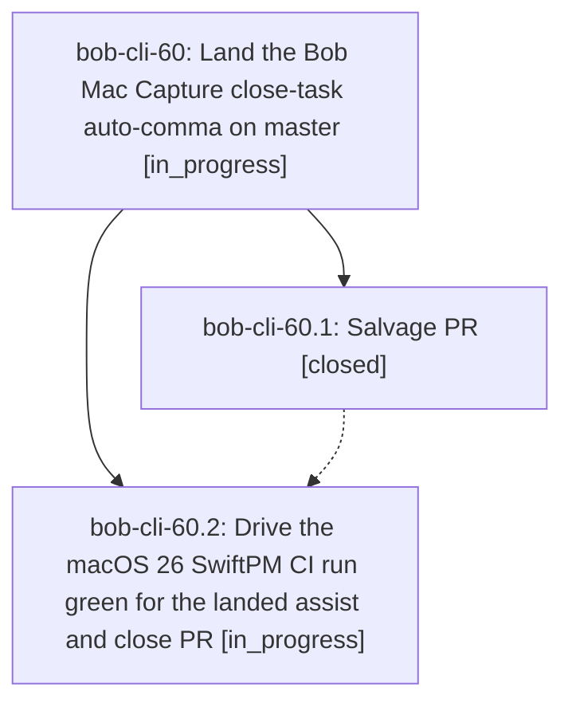

# Bead: bob-cli-60 — Land the Bob Mac Capture close-task auto-comma on master

[Bead Pages](../README.md) / bob-cli-60

**Status:** ◐ in_progress · **Type:** ▸ plan · **Tier:** epic
**Owner:** `bryanbugyi34@gmail.com` · **Created by:** [bbugyi200.apollo.61.w1.f0](https://github.com/bobs-org/bob-cli--agents/blob/main/sessions/bbugyi200.apollo.61.w1.f0.md) · **Assignee:** `bob-cli-60.land`
**Created:** 2026-10-09 14:20:00 EDT
**Plan:** [202610/mac\_capture\_auto\_comma\_land.md](https://github.com/bobs-org/bob-cli--plans/blob/main/202610/mac_capture_auto_comma_land.md)

<!-- sase:links:start -->

## Links

| Relation | Artifact | Why |
| --- | --- | --- |
| implemented-by | [plan:202610/mac_capture_auto_comma_land.md][1] | derived from the plan's `bead_id:` frontmatter field |

[1]: https://github.com/bobs-org/bob-cli--plans/blob/main/202610/mac_capture_auto_comma_land.md

<!-- sase:links:end -->

## Description

Bob Mac Capture's master carries a compiling, CI-green close-task auto-comma (typing `=x12` in a sub-10-link Pomodoro shows `=x1,2`), salvaged from the failed PR #4, and PR #4 is closed as superseded.

## Phases

| Bead | Title | Status | Size | Created | Agents | Commits |
|---|---|---|---|---|---:|---:|
| [bob-cli-60.1](bob-cli-60.1.md) | Salvage PR | ✓ closed | medium | 2026-10-09 | 1 | 0 |
| [bob-cli-60.2](bob-cli-60.2.md) | Drive the macOS 26 SwiftPM CI run green for the landed assist and close PR | ◐ in_progress | small | 2026-10-09 | 1 | 0 |

## Lineage

## Agents

| Agent | Bead | Commits |
|---|---|---:|
| [bbugyi200.apollo.bob-cli-60.1](https://github.com/bobs-org/bob-cli--agents/blob/main/agents/bbugyi200.apollo.bob-cli-60.1/README.md) | [bob-cli-60.1](bob-cli-60.1.md) | 0 |
| [bbugyi200.apollo.bob-cli-60.2](https://github.com/bobs-org/bob-cli--agents/blob/main/agents/bbugyi200.apollo.bob-cli-60.2/README.md) | [bob-cli-60.2](bob-cli-60.2.md) | 0 |
| [bbugyi200.apollo.bob-cli-60.land](https://github.com/bobs-org/bob-cli--agents/blob/main/agents/bbugyi200.apollo.bob-cli-60.land/README.md) | [bob-cli-60](README.md) | 0 |
