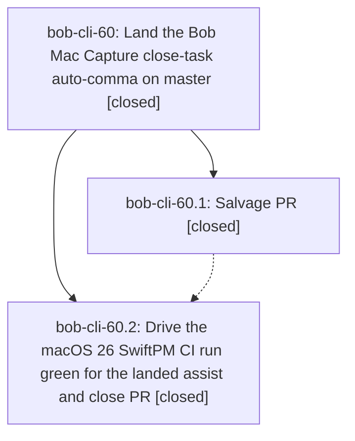

# Bead: bob-cli-60 — Land the Bob Mac Capture close-task auto-comma on master

[Bead Pages](../README.md) / bob-cli-60

**Status:** ✓ closed · **Resolution:** done · **Type:** ▸ plan · **Tier:** epic
**Owner:** `bryanbugyi34@gmail.com` · **Created by:** [bbugyi200.apollo.61.w1.f0](https://github.com/bobs-org/bob-cli--agents/blob/main/sessions/bbugyi200.apollo.61.w1.f0.md) · **Assignee:** `bob-cli-60.land`
**Created:** 2026-10-09 14:20:00 EDT · **Closed:** 2026-10-09 17:34:35 EDT
**Plan:** [202610/mac\_capture\_auto\_comma\_land.md](https://github.com/bobs-org/bob-cli--plans/blob/main/202610/mac_capture_auto_comma_land.md)

<!-- sase:links:start -->

## Links

| Relation | Artifact | Why |
| --- | --- | --- |
| implemented-by | [plan:202610/mac_capture_auto_comma_land.md][1] | derived from the plan's `bead_id:` frontmatter field |

_Plus 1 automatic references — see [Referenced By](#referenced-by)._

[1]: https://github.com/bobs-org/bob-cli--plans/blob/main/202610/mac_capture_auto_comma_land.md

<!-- sase:links:end -->

## Description

Bob Mac Capture's master carries a compiling, CI-green close-task auto-comma (typing `=x12` in a sub-10-link Pomodoro shows `=x1,2`), salvaged from the failed PR #4, and PR #4 is closed as superseded.

## Notes

[2026-10-09T18:34:21Z · bryanbugyi34@gmail.com] When the user hits Backspace to delete an index that they typed, which caused a comma to get auto-generated, that comma should be removed. The epic lander agent should make sure to implement that.

[2026-10-09T19:38:11Z · bob-cli-5z.land] DISCOVERED ISSUE (from bob-cli-5z.land): bob-mac-capture CI runs for 6fc7b00, 0f2f40c, 0cebe63 and aa47c1f all failed at the Build step on CapturePanelView.swift:2449 (a statement-only switch inside the @ViewBuilder startPreviewItem, introduced by bob-cli-5z.5), so none of them reached the Test step and none could show this epic's assist test going green. bob-cli-5z.land fixes that build error in its landing commit. Independently, CaptureCloseTaskCommaTests.testKeyDrivenAssistParseServesCommaEdit (from 8c10d52, bob-cli-60.1) still fails deterministically: CI runs 37973573511 (8c10d52) and 37975602555 (f4a36e3) failed with 'Condition not met before timeout' at line 403 and XCTAssertEqual nil != Optional(",2") at line 415, and bob-cli-5z.land reproduced the same two assertions on aa47c1f + the build fix (MacBook, Swift 6.3.2, a local XCTest stand-in harness: 752 passed, 1 failed, 7 skipped in BobMacCaptureTests; that test is the only failure).

[2026-10-09T19:50:58Z · bob-cli-5w.land] DISCOVERED ISSUE: Follow-up triage from bob-cli-5w.5 note #3 and .11 note #6 corroborates testKeyDrivenAssistParseServesCommaEdit timeout/nil-vs-comma on base 8c10d52 run 37973573511 and successor f4a36e3 run 37975602555. This is the same test-order defect already owned by bob-cli-60.2 notes #1/#2, not successor code. No duplicate task created; successor-specific Swift suites passed in that run.

[2026-10-09T21:21:18Z · bob-cli-60.land] LAND AUDIT: Read the epic linked plan, original approved auto-comma contract, both children and every note (60.1 #1; 60.2 #1-#5); no child PROPOSED FOLLOW-UP entries. Reviewed Mac feature commit 8c10d52, test repair f949417, helper/models/transport/router/controller/refresh/SwiftUI binding/fake-bob/tests/docs and bob-cli count commit 5601235 with shared number_task_links and CLI parity coverage. Verified origin/master is f949417 and contains 8c10d52; macOS CI 37990648063 attempt 2 is green through lint/build/test/bundle/launch/install, PR #4 closed at 21:15:09Z and its remote branch is absent. Epic notes #2/#3 deterministic assist failure is fixed by f949417; concurrent build failure fixed by ee19240. Thin-client decision honored: app filters bob spans and reads additive tolerant JSON; no recorded frontmatter DECISIONS. Historical phase 60.2 note #3 used a raw push after six host-finalizer failures, deviating from the plan transport rules; its source/test result is verified, and the remaining-work coder must use the host finalizer, not repeat this workaround. Reviewed all post-8c10d52 Mac commits (f4a36e3, 6fc7b00, 0f2f40c, 0cebe63, aa47c1f, ee19240, 1c161d4, bc10188; excluding own f949417) and bob-cli changes since creation including successor repairs 9b44dc6, overrides 999816c/4cc1281, and ref-sync work. No conflicting or duplicate assist; controller/router/process/helper unchanged by later commits, model edits are presentation-only; task_link_count still uses the exact shared close lineup. Remaining epic work: note #1 Backspace cleanup is absent (perform(.deleteBackward) only deletes empty bullet rows; assisted =x1,2 Backspace leaves =x1,). Also feature-caused count-client race: refresh captures the old client/generation, setProcessClient(nil) clears count without bumping generation, then the old success can restore a count. A medium tale will implement provenance-aware comma/index deletion and client-generation invalidation, regression coverage, and close this epic in the same coding turn. epic-symbols reports no entries; no parent bead.

[2026-10-09T21:21:22Z · bob-cli-60.land] FOLLOW-UP TRIAGE before remaining-work tale: Every child note reviewed; zero literal PROPOSED FOLLOW-UP entries. Distinct pre-existing Refs timeout from bob-cli-60.2 #4/#5 duplicates bob-cli-61; /sase_new_task search, last-week flake sweep, candidate read, and active-epic scope sweep found no credible epic cause. Added +1 to bob-cli-61 identifying 60.2 #4/#5. Independently checked CI 37990648063 on identical f949417: attempt 1 testRefreshReordersFromNewDataKeepingSelection failed at RefsPanelModelTests.swift:825 after 5.849s; attempt 2 passed in 0.081s. No duplicate task. Assist test-order reports (epic #2/#3, child 60.2 #1/#2) are resolved epic-caused work, not new tasks. Concurrent ViewBuilder compile report is resolved by bob-cli-5z landing ee19240, no new task. Backspace and stale-client count remain this epic work, no follow-up task. No proposals declined beyond avoiding those resolved/duplicate reports.

[2026-10-09T21:34:35Z · bob-cli-60.land] Closeout: Backspace provenance and client lifecycle done. Audit: Mac 8c10d52 salvaged feature, f949417 repaired key-driven test order, tip f949417, CI 37990648063 attempt2 green on macOS 26 SwiftPM, PR 4 closed 2026-10-09T21:15:09Z with branch deleted. Later commits f4a36e3 6fc7b00 0cebe63 0f2f40c aa47c1f ee19240 1c161d4 bc10188 preserve assist router controller transport count span contracts, model edits presentation only. bob-cli 5601235 task_link_count uses shared number_task_links with CLI parity. Re-fetched origin master, still f949417, no drift. Implemented: CaptureCloseTaskCommaProvenance in CaptureCore with UTF-16 record consume reconcile, model records only accepted insertions, Backspace helper before empty-bullet deletes intact recorded comma digit as one native insertText with caret before comma, manual pasted commas stay native. Reconcile shifts unaffected pairs and drops overlapped or non intact entries, cleared on wholesale discard submit stash restore. Count generation bumps on client change with client identity guard, non-nil replacement refetches, assist parse generation guards old callbacks. Checks: git diff check clean, bash -n fake-bob clean, cargo test lib pomodoro_close 81 passed, cargo test cli capture_pomodoro 96 passed. just check shows 9 highlights return_links plus 1 ref doctor failures unrelated to epic with clean tree. No Swift toolchain on Linux so Mac build tests not run, careful Swift5 MainActor UTF-16 native undo formatting review done, post-finalizer CI will cover new code. Thin client honored: Bob spans authorize insertion, additive tolerant decode, no Swift grammar. Follow-up: no PROPOSED FOLLOW-UP in children, Refs timeout duplicates bob-cli-61 with plus1, assist order fixed by f949417, ViewBuilder fixed by ee19240, Backspace and stale count were epic work.

## Phases

| Bead | Title | Status | Size | Created | Agents | Commits |
|---|---|---|---|---|---:|---:|
| [bob-cli-60.1](bob-cli-60.1.md) | Salvage PR | ✓ closed | medium | 2026-10-09 | 1 | 0 |
| [bob-cli-60.2](bob-cli-60.2.md) | Drive the macOS 26 SwiftPM CI run green for the landed assist and close PR | ✓ closed | small | 2026-10-09 | 1 | 0 |

## Lineage

## Agents

| Agent | Bead | Commits |
|---|---|---:|
| [bbugyi200.apollo.bob-cli-60.1](https://github.com/bobs-org/bob-cli--agents/blob/main/agents/bbugyi200.apollo.bob-cli-60.1/README.md) | [bob-cli-60.1](bob-cli-60.1.md) | 0 |
| [bbugyi200.apollo.bob-cli-60.2](https://github.com/bobs-org/bob-cli--agents/blob/main/sessions/bbugyi200.apollo.bob-cli-60.2.md) | [bob-cli-60.2](bob-cli-60.2.md) | 0 |
| [bbugyi200.apollo.bob-cli-60.land](https://github.com/bobs-org/bob-cli--agents/blob/main/sessions/bbugyi200.apollo.bob-cli-60.land.md) | [bob-cli-60](README.md) | 0 |

<!-- sase:referenced-by:start -->

## Referenced By

| Relation | Artifact | Why | Uses |
| --- | --- | --- | ---: |
| read-by | [agent:bob-cli-5z.land][1] | Check whether the CaptureCloseTaskCommaTests CI failure from 8c10d52 (bob-cli-60.1) is already recorded on this active epic | 1 |

[1]: https://github.com/bobs-org/bob-cli--agents/blob/main/agents/bbugyi200.apollo.bob-cli-5z.land/README.md

<!-- sase:referenced-by:end -->
