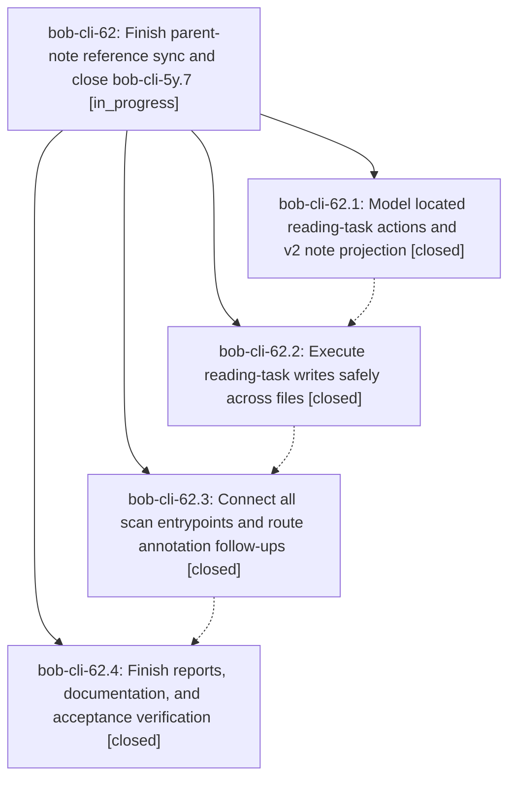

# Bead: bob-cli-62 — Finish parent-note reference sync and close bob-cli-5y.7

[Bead Pages](../README.md) / bob-cli-62

**Status:** ◐ in_progress · **Type:** ▸ plan · **Tier:** epic
**Owner:** `bryanbugyi34@gmail.com` · **Created by:** [bbugyi200.athena.0z7](https://github.com/bobs-org/bob-cli--agents/blob/main/sessions/bbugyi200.athena.0z7.md) · **Assignee:** `bob-cli-62.land`
**Created:** 2026-10-09 15:45:02 EDT
**Plan:** [202610/finish\_ref\_sync\_parent\_tasks.md](https://github.com/bobs-org/bob-cli--plans/blob/main/202610/finish_ref_sync_parent_tasks.md)

<!-- sase:links:start -->

## Links

| Relation | Artifact | Why |
| --- | --- | --- |
| implemented-by | [plan:202610/finish_ref_sync_parent_tasks.md][1] | derived from the plan's `bead_id:` frontmatter field |

_Plus 2 automatic references — see [Referenced By](#referenced-by)._

[1]: https://github.com/bobs-org/bob-cli--plans/blob/main/202610/finish_ref_sync_parent_tasks.md

<!-- sase:links:end -->

## Description

Complete the remaining ref-sync-v2 work on bob-cli-5y.7, verify safe births, cross-file status sync, residence projection, archived reopens, and annotation routing, then close that phase with concrete verification evidence.

## Phases

| Bead | Title | Status | Size | Created | Agents | Commits |
|---|---|---|---|---|---:|---:|
| [bob-cli-62.1](bob-cli-62.1.md) | Model located reading-task actions and v2 note projection | ✓ closed | medium | 2026-10-09 | 1 | 1 |
| [bob-cli-62.2](bob-cli-62.2.md) | Execute reading-task writes safely across files | ✓ closed | medium | 2026-10-09 | 1 | 1 |
| [bob-cli-62.3](bob-cli-62.3.md) | Connect all scan entrypoints and route annotation follow-ups | ✓ closed | medium | 2026-10-09 | 1 | 1 |
| [bob-cli-62.4](bob-cli-62.4.md) | Finish reports, documentation, and acceptance verification | ✓ closed | medium | 2026-10-09 | 1 | 1 |

## Lineage

## Agents

| Agent | Bead | Commits |
|---|---|---:|
| [bbugyi200.athena.bob-cli-62.1](https://github.com/bobs-org/bob-cli--agents/blob/main/agents/bbugyi200.athena.bob-cli-62.1/README.md) | [bob-cli-62.1](bob-cli-62.1.md) | 1 |
| [bbugyi200.athena.bob-cli-62.2](https://github.com/bobs-org/bob-cli--agents/blob/main/agents/bbugyi200.athena.bob-cli-62.2/README.md) | [bob-cli-62.2](bob-cli-62.2.md) | 1 |
| [bbugyi200.athena.bob-cli-62.3](https://github.com/bobs-org/bob-cli--agents/blob/main/sessions/bbugyi200.athena.bob-cli-62.3.md) | [bob-cli-62.3](bob-cli-62.3.md) | 1 |
| [bbugyi200.athena.bob-cli-62.4](https://github.com/bobs-org/bob-cli--agents/blob/main/sessions/bbugyi200.athena.bob-cli-62.4.md) | [bob-cli-62.4](bob-cli-62.4.md) | 1 |
| [bbugyi200.athena.bob-cli-62.land](https://github.com/bobs-org/bob-cli--agents/blob/main/agents/bbugyi200.athena.bob-cli-62.land/README.md) | [bob-cli-62](README.md) | 0 |

## Commits

| Repo | Commit | Subject | Bead | Committed |
|---|---|---|---|---|
| bob-cli | [`8c938cf`](https://github.com/bobs-org/bob-cli/commit/8c938cfb2a126e2bc92185f7d278153b2ef7dfab) | feat(highlights-ref): add vault-free v2 reading-plan seam | [bob-cli-62.1](bob-cli-62.1.md) | 2026-10-09 16:11:07 EDT |
| bob-cli | [`4bfacc3`](https://github.com/bobs-org/bob-cli/commit/4bfacc320cab9995a09351a56ce2ab434da4d6a8) | feat(highlights-ref): execute v2 reading-task writes with guarded cross-file edits | [bob-cli-62.2](bob-cli-62.2.md) | 2026-10-09 16:33:06 EDT |
| bob-cli | [`b1512d6`](https://github.com/bobs-org/bob-cli/commit/b1512d64a76bd2a6bf9096afa0e080aef02a1e21) | feat(highlights-ref): connect scan entrypoints with shared locator index and residence follow-ups | [bob-cli-62.3](bob-cli-62.3.md) | 2026-10-09 17:41:43 EDT |
| bob-cli | [`61e5c47`](https://github.com/bobs-org/bob-cli/commit/61e5c47e511192d91b5a424da904424cb1aadc84) | docs(ref-sync): finish reports, documentation, and acceptance verification | [bob-cli-62.4](bob-cli-62.4.md) | 2026-10-09 18:26:59 EDT |

<!-- sase:referenced-by:start -->

## Referenced By

| Relation | Artifact | Why | Uses |
| --- | --- | --- | ---: |
| read-by | [agent:bob-cli-62.1][1] | Need epic decisions and plan | 1 |
| read-by | [agent:bob-cli-62.2][2] | parent epic scope and DECISIONS | 1 |

[1]: https://github.com/bobs-org/bob-cli--agents/blob/main/agents/bbugyi200.athena.bob-cli-62.1/README.md
[2]: https://github.com/bobs-org/bob-cli--agents/blob/main/agents/bbugyi200.athena.bob-cli-62.2/README.md

<!-- sase:referenced-by:end -->
