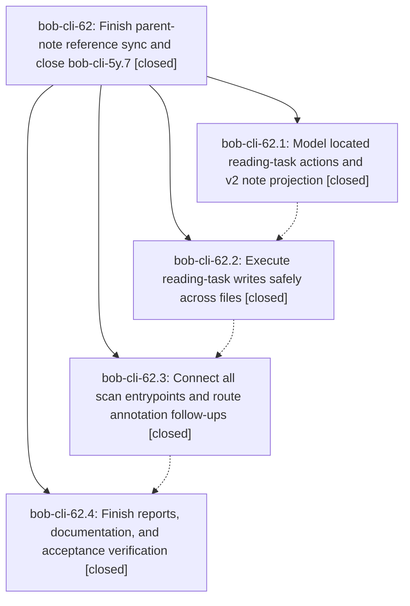

# Bead: bob-cli-62 — Finish parent-note reference sync and close bob-cli-5y.7

[Bead Pages](../README.md) / bob-cli-62

**Status:** ✓ closed · **Resolution:** done · **Type:** ▸ plan · **Tier:** epic
**Owner:** `bryanbugyi34@gmail.com` · **Created by:** [bbugyi200.athena.0z7](https://github.com/bobs-org/bob-cli--agents/blob/main/sessions/bbugyi200.athena.0z7.md) · **Assignee:** `bob-cli-62.land`
**Created:** 2026-10-09 15:45:02 EDT · **Closed:** 2026-10-09 19:02:19 EDT
**Plan:** [202610/finish\_ref\_sync\_parent\_tasks.md](https://github.com/bobs-org/bob-cli--plans/blob/main/202610/finish_ref_sync_parent_tasks.md)

<!-- sase:links:start -->

## Links

| Relation | Artifact | Why |
| --- | --- | --- |
| implemented-by | [plan:202610/finish_ref_sync_parent_tasks.md][1] | derived from the plan's `bead_id:` frontmatter field |

_Plus 3 automatic references — see [Referenced By](#referenced-by)._

[1]: https://github.com/bobs-org/bob-cli--plans/blob/main/202610/finish_ref_sync_parent_tasks.md

<!-- sase:links:end -->

## Description

Complete the remaining ref-sync-v2 work on bob-cli-5y.7, verify safe births, cross-file status sync, residence projection, archived reopens, and annotation routing, then close that phase with concrete verification evidence.

## Notes

[2026-10-09T22:38:49Z · bob-cli-62.land] LAND AUDIT (HEAD 61e5c47): Audited-read bob-cli-62, every child 62.1-.4 and every note, original phase bob-cli-5y.7, and plans finish_ref_sync_parent_tasks/ref_tasks_live_with_parent/ref_sync_parent_tasks. Reviewed all four epic commits 8c938cf/4bfacc3/b1512d6/61e5c47 and the actual planner/executor/guards/inserter/editor/locator/anatomy/reports/JSON paths and acceptance tests. DECISIONS honored: no memory edits, no wrapper cancellation, no live-vault/linked-product writes. All four children are closed, but epic acceptance is incomplete. Source blockers: (1) plan_pdf_sync_v2 sets marker_write_needed=false whenever write_pdf is absent and omits v1's needed-write refusal. A task/frontmatter status gesture can advance the note/base without updating the marker; the next scan treats the stale marker as a new change and undoes the gesture. (2) annotation intake's before-signal boolean is computed after task status was applied, losing final wip-to-read/abandoned follow-ups. (3) ReadingTaskPlan.refuse_status_parent_writes is never consumed; ambiguous/archive-open candidates can still write marker/frontmatter status or birth an invented embed. reading_diagnostics is stored but not surfaced. (4) Routed v2 defaults still enter dirty-target veto and execute_routed_intents uses atomic_write without a capture preimage check/retry. It adds run_state dedup keys before the write succeeds, starving later PDFs after destination failure. (5) execute_pdf_sync_v2 changes the reading destination before ref-note preflight, and checks an authorized PDF preimage only after destination writes. (6) ref_tasks/edit.rs does not strip quote prefixes before flipping; its splice_line normalizes every line ending. A rustc micro-repro using the exact checked-in functions (nonterminal stamp stub only) returned quoted_checkbox_edit=None for '> - [ ] #task #ref [[ref/x|X]] ^ref-x'; a mixed-LF/CRLF edit returned unrelated_line_endings_preserved=false. (7) reopen v2_residence prefers the old archived residence over the new insertion route, misrouting follow-ups when a terminal source forces an inbox reopen. (8) audio's managed-slot helper is test-only/unwired; existing v2 late audio uses the legacy Highlights anchor. find_managed_embed/heal/dirty-guard strip any block embed before the first H2, risking authored embeds outside the actual H1 slot. The v2 region replacement also swallows malformed-region errors. Required executable coverage is missing for archive-moved annotation dedup, real executor task/ref/PDF preimage failures and late-ref-failure adoption; the similarly named helper tests never execute_pdf_sync. These are epic repair work, not unrelated tasks. One bounded medium tale can repair the existing seams and complete closeout; do not close the epic yet. Current-HEAD cargo/just checks have not been rerun in this audit; 62.4's 3596-pass just check is prior worker evidence only.

[2026-10-09T22:38:52Z · bob-cli-62.land] FOLLOW-UP TRIAGE COMPLETE before the repair tale: 62.1 note #2, 62.2 note #2 and 62.3 note #1 propose the same missing-lib doctor fixture defect. Declined a new task: b1512d6 creates vault/lib in doctor_reports_ref_tasks_and_parents_rows, matching 62.3 note #3; 62.4's prior full gate passed. /sase_new_task recorded use, searched CI then all task types, swept the last week's tasks and active epics; no duplicate task exists, and owning outer epic 5y's note #1 already records the original defect. Do not reopen a resolved issue without a current reproduction. 62.4 note #1 proposes archive-move [h::] dedup coverage: declined a separate task because verify-ref-sync item 3 explicitly requires it; include it in the repair tale and eventual close note. Original phase 5y.7's two skipped-memory proposals remain there for the containing epic's landing; this completion plan expressly forbids duplicating or implementing them. No new follow-up beads were created.

[2026-10-09T22:38:56Z · bob-cli-62.land] INTEGRATION AUDIT: First epic commit is 8c938cf, with 4cc1281 as its parent. The only non-62 commits on master/origin/master afterward are 9b44dc6 (5w successor capture repairs) and 6562b71 (66.1 resolved Pomodoro agenda). Reviewed their actual patches/callers: both operate on ordinary task marks/links and arbitrary block IDs, so v2 #task #ref rows belong in those paths without new special cases. In particular Next/terminal task gestures from capture must survive the restored PDF opt-in policy rather than being silently reverted by scan. The repair tale should verify one reference-task agenda/close integration fixture. No separate PR base divergence exists (master and origin/master both 61e5c47). Shared insert_ref_task(&Path, &Path, &str, &[String]) -> Result<InsertedRefTask, String> remains compatible for 5y.9/5y.11; the compatible preferred-ID variant is additive. epic-symbols for 62 and 5y.7 both currently empty. bob-cli-62 JSON parent_id is null; its approved plan explicitly still requires closing original phase bob-cli-5y.7 after 62. The tale must perform both closes, mark finish_ref_sync_parent_tasks.md done, and leave containing epic 5y and its plan status alone. No commit/CI/push dependency may precede the same-turn closeout.

[2026-10-09T23:02:19Z · bob-cli-62.land--1] Land closeout for approved plan plan:202610/finish_ref_sync_parent_tasks.md with landing repairs plan:202610/ref_sync_landing_repairs.md Sec1-4. Source review: land audit at HEAD 61e5c47 reviewed epic commits 8c938cf/4bfacc3/b1512d6/61e5c47 plus planner/executor/guards/inserter/editor/locator/anatomy/reports/JSON paths; integration audit of non-62 commits 9b44dc6 (successors) and 6562b71 (agenda) confirmed ordinary parsing with no #ref special case, v2 rows belong in those paths. Repairs implemented (dirty over 61e5c47): Sec1 v2 opt-in refusal restored (semantic parent-free vs hint), annotation intake uses pre-signal WIP, refuse_status_parent_writes fails per-PDF with diagnostics, reading_diagnostic lines in human/single-PDF/verbose reports; Sec2 guard exempts v2-default-only destinations, routed writes via StagedTextFile with 3-attempt preimage retries and post-success dedup commit, pre-write validation before any v2 write, quoted tasks via locator convention and byte-preserving splice_line; Sec3 reopen uses new Insert route, audio via maybe_insert_audio_embed_after_managed, find_managed_embed restricted to H1 slot, healed path propagates region errors, dead-code allows removed; Sec4 docs/highlights-ref-sync.md updated plus new tests (quoted/nested/mixed edits, embed slot, archive-move dedup, opt-in settle/rerun, ambiguity bytes-unchanged, dirty-parent exemption). Verification: monitor eqt68nqb920y just check COMPLETED exit 0 on 2026-10-09T22:58Z (2m36s); focused gates before it: cargo test --lib ref_tasks 38 passed, --lib highlights_ref 303 passed, --test cli highlights scan_integration 29 passed, doctor_reports_ref_tasks_and_parents_rows passed, pomodoros_agenda 9 passed. Follow-ups: 62.1n2/62.2n2/62.3n1 doctor-fixture defect already resolved by 62.3--1 (vault/lib creation, gate green); 62.4n1 archive-move dedup covered by new scan_integration test in repairs; 5y.7n1-n2 memory follow-ups left for outer epic per plan. epic-symbols empty for 62 and 5y.7; just symvision recipe absent.

## Phases

| Bead | Title | Status | Size | Created | Agents | Commits |
|---|---|---|---|---|---:|---:|
| [bob-cli-62.1](bob-cli-62.1.md) | Model located reading-task actions and v2 note projection | ✓ closed | medium | 2026-10-09 | 1 | 1 |
| [bob-cli-62.2](bob-cli-62.2.md) | Execute reading-task writes safely across files | ✓ closed | medium | 2026-10-09 | 1 | 1 |
| [bob-cli-62.3](bob-cli-62.3.md) | Connect all scan entrypoints and route annotation follow-ups | ✓ closed | medium | 2026-10-09 | 1 | 1 |
| [bob-cli-62.4](bob-cli-62.4.md) | Finish reports, documentation, and acceptance verification | ✓ closed | medium | 2026-10-09 | 1 | 1 |

## Lineage

## Agents

| Agent | Bead | Commits |
|---|---|---:|
| [bbugyi200.athena.bob-cli-62.1](https://github.com/bobs-org/bob-cli--agents/blob/main/agents/bbugyi200.athena.bob-cli-62.1/README.md) | [bob-cli-62.1](bob-cli-62.1.md) | 1 |
| [bbugyi200.athena.bob-cli-62.2](https://github.com/bobs-org/bob-cli--agents/blob/main/agents/bbugyi200.athena.bob-cli-62.2/README.md) | [bob-cli-62.2](bob-cli-62.2.md) | 1 |
| [bbugyi200.athena.bob-cli-62.3](https://github.com/bobs-org/bob-cli--agents/blob/main/sessions/bbugyi200.athena.bob-cli-62.3.md) | [bob-cli-62.3](bob-cli-62.3.md) | 1 |
| [bbugyi200.athena.bob-cli-62.4](https://github.com/bobs-org/bob-cli--agents/blob/main/sessions/bbugyi200.athena.bob-cli-62.4.md) | [bob-cli-62.4](bob-cli-62.4.md) | 1 |
| [bbugyi200.athena.bob-cli-62.land](https://github.com/bobs-org/bob-cli--agents/blob/main/sessions/bbugyi200.athena.bob-cli-62.land.md) | [bob-cli-62](README.md) | 2 |

## Commits

| Repo | Commit | Subject | Bead | Committed |
|---|---|---|---|---|
| bob-cli | [`8c938cf`](https://github.com/bobs-org/bob-cli/commit/8c938cfb2a126e2bc92185f7d278153b2ef7dfab) | feat(highlights-ref): add vault-free v2 reading-plan seam | [bob-cli-62.1](bob-cli-62.1.md) | 2026-10-09 16:11:07 EDT |
| bob-cli | [`4bfacc3`](https://github.com/bobs-org/bob-cli/commit/4bfacc320cab9995a09351a56ce2ab434da4d6a8) | feat(highlights-ref): execute v2 reading-task writes with guarded cross-file edits | [bob-cli-62.2](bob-cli-62.2.md) | 2026-10-09 16:33:06 EDT |
| bob-cli | [`b1512d6`](https://github.com/bobs-org/bob-cli/commit/b1512d64a76bd2a6bf9096afa0e080aef02a1e21) | feat(highlights-ref): connect scan entrypoints with shared locator index and residence follow-ups | [bob-cli-62.3](bob-cli-62.3.md) | 2026-10-09 17:41:43 EDT |
| bob-cli | [`61e5c47`](https://github.com/bobs-org/bob-cli/commit/61e5c47e511192d91b5a424da904424cb1aadc84) | docs(ref-sync): finish reports, documentation, and acceptance verification | [bob-cli-62.4](bob-cli-62.4.md) | 2026-10-09 18:26:59 EDT |
| bob-cli | [`7e838c8`](https://github.com/bobs-org/bob-cli/commit/7e838c80fe5761cc606a1a39280f90e20040b327) | fix(ref-sync): repair v2 acceptance seams and land bob-cli-62 | [bob-cli-62](README.md) | 2026-10-09 19:04:55 EDT |
| bob-cli--plans | [`bob-cli--plans@4394c51`](https://github.com/bobs-org/bob-cli--plans/commit/4394c515f90c0c3876e212764adc00f5ea2754bd) | chore(plans): mark finish\_ref\_sync\_parent\_tasks.md done after bob-cli-62 landing | [bob-cli-62](README.md) | 2026-10-09 19:05:50 EDT |

<!-- sase:referenced-by:start -->

## Referenced By

| Relation | Artifact | Why | Uses |
| --- | --- | --- | ---: |
| read-by | [agent:bob-cli-62.1][1] | Need epic decisions and plan | 1 |
| read-by | [agent:bob-cli-62.2][2] | parent epic scope and DECISIONS | 1 |
| read-by | [agent:bob-cli-62.4--1][3] | check epic land status | 1 |

[1]: https://github.com/bobs-org/bob-cli--agents/blob/main/agents/bbugyi200.athena.bob-cli-62.1/README.md
[2]: https://github.com/bobs-org/bob-cli--agents/blob/main/agents/bbugyi200.athena.bob-cli-62.2/README.md
[3]: https://github.com/bobs-org/bob-cli--agents/blob/main/sessions/bbugyi200.athena.bob-cli-62.4.md

<!-- sase:referenced-by:end -->
