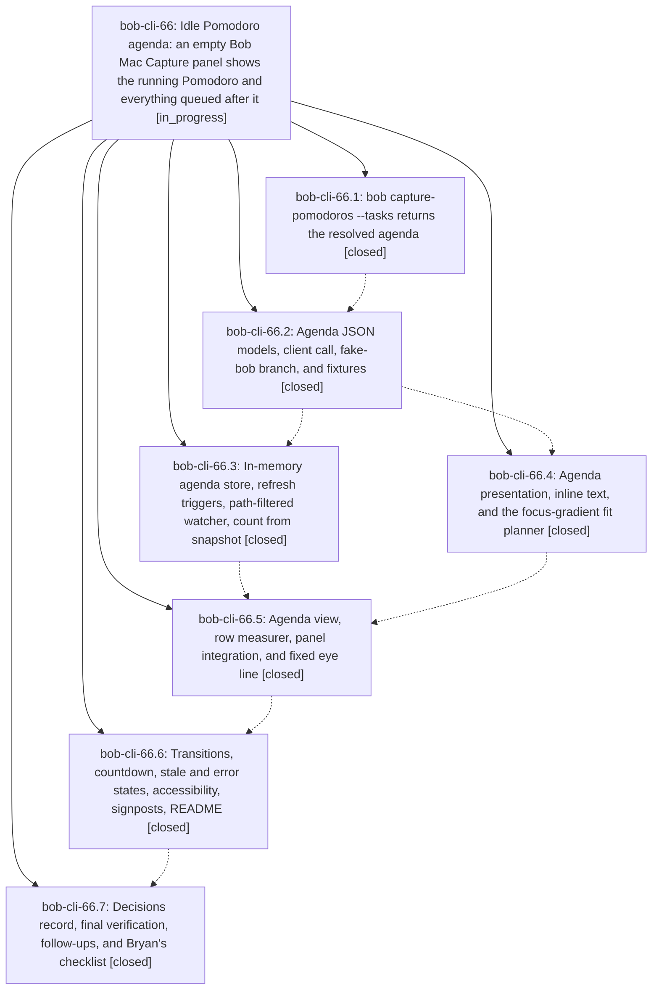

# Bead: bob-cli-66 — Idle Pomodoro agenda: an empty Bob Mac Capture panel shows the running Pomodoro and everything queued after it

[Bead Pages](../README.md) / bob-cli-66

**Status:** ◐ in_progress · **Type:** ▸ plan · **Tier:** epic
**Owner:** `bryanbugyi34@gmail.com` · **Created by:** [bbugyi200.athena.research.48.linker.w0](https://github.com/bobs-org/bob-cli--agents/blob/main/sessions/bbugyi200.athena.research.48.linker.w0.md) · **Assignee:** `bob-cli-66.land`
**Created:** 2026-10-09 17:42:22 EDT
**Plan:** [202610/idle\_capture\_pomodoro\_agenda.md](https://github.com/bobs-org/bob-cli--plans/blob/main/202610/idle_capture_pomodoro_agenda.md)

<!-- sase:links:start -->

## Links

| Relation | Artifact | Why |
| --- | --- | --- |
| implemented-by | [plan:202610/idle_capture_pomodoro_agenda.md][1] | derived from the plan's `bead_id:` frontmatter field |

_Plus 1 automatic references — see [Referenced By](#referenced-by)._

[1]: https://github.com/bobs-org/bob-cli--plans/blob/main/202610/idle_capture_pomodoro_agenda.md

<!-- sase:links:end -->

## Description

When the capture panel opens with an empty draft, it already shows today's agenda, painted from memory in the first frame: the running Pomodoro and every future Pomodoro, each with its linked tasks at the most detail that fits below a fixed eye line without scrolling. The `=x` and `=` numbers match the ones bob will use. Detail folds per Pomodoro, farthest first: logs, then one-line tasks, then one row per Pomodoro, then a name strip. bob owns every fact; the app owns caching, fitting, and pixels.

## Notes

[2026-10-10T02:08:50Z · bob-cli-66.land] LAND TRIAGE (bob-cli-66.land): PROPOSED FOLLOW-UP outcomes. bob-cli-66.5 #2 (macOS CI timing flakes): +1 on existing bob-cli-61 (RefsPanelModelTests refresh-reorder) and bob-cli-4k (StartPending preview timeout), using CI run 38010286522 same-SHA c4dc4b6 attempts; new flake task bob-cli-67 for RefsLibraryTests.testTriggersDuringRefreshRunExactlyOneFollowUp (attempt 1 failed 5!=4, attempts 2-3 passed). bob-cli-66.5 #3 (decisions record not written): declined, already addressed by bob-cli-66.7 (strand idle-capture-shows-ledger-agenda, commit 817fd2b). bob-cli-66.7 #1-#4: new feature tasks bob-cli-68 (row click opens Obsidian), bob-cli-69 (Option full-detail scroll), bob-cli-6a (Cmd+1..9 insert), bob-cli-6b (plan-budget capsules). bob-cli-66.7 #5 (sources[] stat fingerprints): declined, because the plan makes it conditional on Mac signposts showing that unfiltered refreshes cost something, no such evidence exists, and a speculative task would be wish-list work. No active epic was causally related to any proposal.

[2026-10-10T02:10:35Z · bob-cli-66.land] LAND VERIFICATION (bob-cli-66.land): all 7 phases closed. Commits: bob-cli 6562b71 and 817fd2b; bob-mac-capture febd4dd..f8c9c28, CI 38012589878 green. bob-cli just check is green. epic-symbols is empty. Integration: bob-cli commits 61e5c47..091eda9 (ref-sync, ref create, migrate-tasks, gkeep @route) do not touch the agenda; 091eda9 edits docs/capture.md but not the --tasks section. bob-mac-capture f51cdc1 (bob-cli-5y.12 File-under picker) rides completionVisible, so it already hides the agenda and releases the dim-hold; only a rebase is needed. The source audit found epic-caused bugs that block close. Mac, high: the CapturePanelModel $snapshot sink re-plans from the store's old value (@Published emits in willSet), so the agenda renders the previous snapshot; status-only changes (stale, unsupported) never re-plan; placePanelAtEyeLine sets only y and keeps origin.x=0 from makePanel, so the panel opens at the left edge, and the eye line is not where center() puts it. Mac, medium: the count is not restored on an unchanged refresh after a failure; the Settings diagnostic lags one change behind (willSet); observeBobSettings uses combineLatest+dropFirst, so it needs both settings to change; the filter's directory rule uses OR'd batch flags, so .git dir events count; a '+0 lines' chip appears; headerWithNotesChip draws the time/countdown inside the notes chip. bob-cli: starts_at/ends_at are omitted instead of null; the human header is missing its second separator; a nested log marker inherits its parent's log kind; completed_summary ignores the pomodoro_adjust duration helper. Remaining work goes to a tale plan.

[2026-10-10T02:38:55Z · bob-cli-5y.land] DISCOVERED ISSUE (from bob-cli-5y.land integration review): the idle agenda drops reference-reading identity. Since bob-cli-5y moved every open ref task into root area/project notes as '#task #ref [[ref/...|Title]] ^ref-<slug>' lines (live vault: 32 in sase.md, bob.md, sase_memory.md, sase_goals.md, sase_blog_0.md, sase_agent_history.md), Bryan links them from Pomodoros, so they appear in 'bob capture-pomodoros --tasks'. src/native/capture_pomodoros_agenda.rs resolve_item builds AgendaItem from note_tasks::NoteTask, which already carries task_kind: Some("ref") (added 9041927, before 66.1's 6562b71), but AgendaItem never serializes it and its text comes from clean_description, which strips the #ref after #task. Result: agenda rows show the bare article title with no book glyph, while every other Mac picker draws SF Symbol book for task_kind == "ref" (bob-cli-5y §7, CompletionRowContent.swift). Suggested fix: additive optional task_kind on AgendaItem (skip when None; schema stays 1) plus a book symbol on Mac agenda task rows. Not a correctness bug; recorded here because 66 owns the agenda surface and is still landing.

## Phases

| Bead | Title | Status | Size | Created | Agents | Commits |
|---|---|---|---|---|---:|---:|
| [bob-cli-66.1](bob-cli-66.1.md) | bob capture-pomodoros --tasks returns the resolved agenda | ✓ closed | medium | 2026-10-09 | 1 | 1 |
| [bob-cli-66.2](bob-cli-66.2.md) | Agenda JSON models, client call, fake-bob branch, and fixtures | ✓ closed | small | 2026-10-09 | 1 | 1 |
| [bob-cli-66.3](bob-cli-66.3.md) | In-memory agenda store, refresh triggers, path-filtered watcher, count from snapshot | ✓ closed | medium | 2026-10-09 | 1 | 2 |
| [bob-cli-66.4](bob-cli-66.4.md) | Agenda presentation, inline text, and the focus-gradient fit planner | ✓ closed | medium | 2026-10-09 | 1 | 1 |
| [bob-cli-66.5](bob-cli-66.5.md) | Agenda view, row measurer, panel integration, and fixed eye line | ✓ closed | medium | 2026-10-09 | 1 | 4 |
| [bob-cli-66.6](bob-cli-66.6.md) | Transitions, countdown, stale and error states, accessibility, signposts, README | ✓ closed | medium | 2026-10-09 | 1 | 1 |
| [bob-cli-66.7](bob-cli-66.7.md) | Decisions record, final verification, follow-ups, and Bryan's checklist | ✓ closed | small | 2026-10-09 | 1 | 1 |

## Lineage

## Agents

| Agent | Bead | Commits |
|---|---|---:|
| [bbugyi200.athena.bob-cli-66.1](https://github.com/bobs-org/bob-cli--agents/blob/main/agents/bbugyi200.athena.bob-cli-66.1/README.md) | [bob-cli-66.1](bob-cli-66.1.md) | 1 |
| [bbugyi200.athena.bob-cli-66.2](https://github.com/bobs-org/bob-cli--agents/blob/main/sessions/bbugyi200.athena.bob-cli-66.2.md) | [bob-cli-66.2](bob-cli-66.2.md) | 1 |
| [bbugyi200.athena.bob-cli-66.3](https://github.com/bobs-org/bob-cli--agents/blob/main/sessions/bbugyi200.athena.bob-cli-66.3.md) | [bob-cli-66.3](bob-cli-66.3.md) | 2 |
| [bbugyi200.athena.bob-cli-66.4](https://github.com/bobs-org/bob-cli--agents/blob/main/agents/bbugyi200.athena.bob-cli-66.4/README.md) | [bob-cli-66.4](bob-cli-66.4.md) | 1 |
| [bbugyi200.athena.bob-cli-66.5](https://github.com/bobs-org/bob-cli--agents/blob/main/sessions/bbugyi200.athena.bob-cli-66.5.md) | [bob-cli-66.5](bob-cli-66.5.md) | 4 |
| [bbugyi200.athena.bob-cli-66.6](https://github.com/bobs-org/bob-cli--agents/blob/main/sessions/bbugyi200.athena.bob-cli-66.6.md) | [bob-cli-66.6](bob-cli-66.6.md) | 1 |
| [bbugyi200.athena.bob-cli-66.7](https://github.com/bobs-org/bob-cli--agents/blob/main/agents/bbugyi200.athena.bob-cli-66.7/README.md) | [bob-cli-66.7](bob-cli-66.7.md) | 1 |
| [bbugyi200.athena.bob-cli-66.land](https://github.com/bobs-org/bob-cli--agents/blob/main/sessions/bbugyi200.athena.bob-cli-66.land.md) | [bob-cli-66](README.md) | 3 |

## Commits

| Repo | Commit | Subject | Bead | Committed |
|---|---|---|---|---|
| bob-cli | [`6562b71`](https://github.com/bobs-org/bob-cli/commit/6562b71410672b9a32c790cd8215152d3fbe7eec) | feat(agenda): add -t/--tasks resolved agenda to bob capture-pomodoros | [bob-cli-66.1](bob-cli-66.1.md) | 2026-10-09 18:23:54 EDT |
| bob-mac-capture | [`bob-mac-capture@febd4dd`](https://github.com/bobs-org/bob-mac-capture/commit/febd4dde8c2956118e18dc3c35cd6c717fbd9583) | feat(agenda): JSON models, agenda client call, fake-bob branch, fixtures | [bob-cli-66.2](bob-cli-66.2.md) | 2026-10-09 18:36:55 EDT |
| bob-mac-capture | [`bob-mac-capture@dc70507`](https://github.com/bobs-org/bob-mac-capture/commit/dc7050734e1f23402ee4dcdd412320abc743ec5b) | feat(agenda): presentation, inline text, layout, and fit planner | [bob-cli-66.4](bob-cli-66.4.md) | 2026-10-09 19:15:16 EDT |
| bob-mac-capture | [`bob-mac-capture@aaa2d9b`](https://github.com/bobs-org/bob-mac-capture/commit/aaa2d9bba8164fd075c7d3ff958383afb862bfc4) | feat(agenda): in-memory store, refresh triggers, filtered watcher, count | [bob-cli-66.3](bob-cli-66.3.md) | 2026-10-09 19:15:41 EDT |
| bob-mac-capture | [`bob-mac-capture@3d36a02`](https://github.com/bobs-org/bob-mac-capture/commit/3d36a023e0de319c5eea21ae206e71797eef975c) | fix(capture): avoid dynamic Self capture in FSEventStream callback | [bob-cli-66.3](bob-cli-66.3.md) | 2026-10-09 19:26:34 EDT |
| bob-mac-capture | [`bob-mac-capture@27c0c2d`](https://github.com/bobs-org/bob-mac-capture/commit/27c0c2d15c721385b7f50805fca22ba75ff44dc9) | feat(agenda): agenda view, row measurer, panel integration, fixed eye line | [bob-cli-66.5](bob-cli-66.5.md) | 2026-10-09 20:03:55 EDT |
| bob-mac-capture | [`bob-mac-capture@c71fe51`](https://github.com/bobs-org/bob-mac-capture/commit/c71fe512c8994dd9bd11e4e1f7483ba95f890c70) | fix(agenda): repair mac-agenda-view CI build errors | [bob-cli-66.5](bob-cli-66.5.md) | 2026-10-09 20:15:26 EDT |
| bob-mac-capture | [`bob-mac-capture@c27359f`](https://github.com/bobs-org/bob-mac-capture/commit/c27359ff8e0da4dab3572f752937c08c0c5e20b6) | fix(agenda): repair mac-agenda-view CI test failures | [bob-cli-66.5](bob-cli-66.5.md) | 2026-10-09 20:34:32 EDT |
| bob-mac-capture | [`bob-mac-capture@c4dc4b6`](https://github.com/bobs-org/bob-mac-capture/commit/c4dc4b63062733f73678e33f65c2dc7011a4a025) | fix(agenda): qualify width helper as Self.width in height resolver | [bob-cli-66.5](bob-cli-66.5.md) | 2026-10-09 20:43:40 EDT |
| bob-mac-capture | [`bob-mac-capture@f8c9c28`](https://github.com/bobs-org/bob-mac-capture/commit/f8c9c28ce4a7ac1d4b08ba2a07dfde4df4ab9e27) | feat(agenda): transitions, countdown, states, accessibility, signposts, README | [bob-cli-66.6](bob-cli-66.6.md) | 2026-10-09 21:17:12 EDT |
| bob-cli | [`817fd2b`](https://github.com/bobs-org/bob-cli/commit/817fd2b47b1b8d7314ee8e9528193ef0f58b387d) | docs(decisions): record idle agenda caching, folding, and eye-line policy | [bob-cli-66.7](bob-cli-66.7.md) | 2026-10-09 21:38:35 EDT |
| bob-mac-capture | [`bob-mac-capture@06b2bda`](https://github.com/bobs-org/bob-mac-capture/commit/06b2bda06be5670c74871b66ceabf42ed6415328) | fix(agenda): repair idle agenda landing bugs B1-B9 | [bob-cli-66](README.md) | 2026-10-09 22:32:43 EDT |
| bob-mac-capture | [`bob-mac-capture@6a1b6ff`](https://github.com/bobs-org/bob-mac-capture/commit/6a1b6ffdd1ccee1fe397e4a8c074e6eb9ae2a689) | fix(agenda): repair store-driven model planning against CI failures | [bob-cli-66](README.md) | 2026-10-09 22:53:17 EDT |
| bob-mac-capture | [`bob-mac-capture@ce42822`](https://github.com/bobs-org/bob-mac-capture/commit/ce42822bb056964f2820af6d3433bcd2a8503922) | test(agenda): repair settle-hook and eye-line tests against CI failures | [bob-cli-66](README.md) | 2026-10-09 23:13:58 EDT |

<!-- sase:referenced-by:start -->

## Referenced By

| Relation | Artifact | Why | Uses |
| --- | --- | --- | ---: |
| read-by | [agent:bob-cli-66.7][1] | closeout needs epic context | 1 |

[1]: https://github.com/bobs-org/bob-cli--agents/blob/main/agents/bbugyi200.athena.bob-cli-66.7/README.md

<!-- sase:referenced-by:end -->
