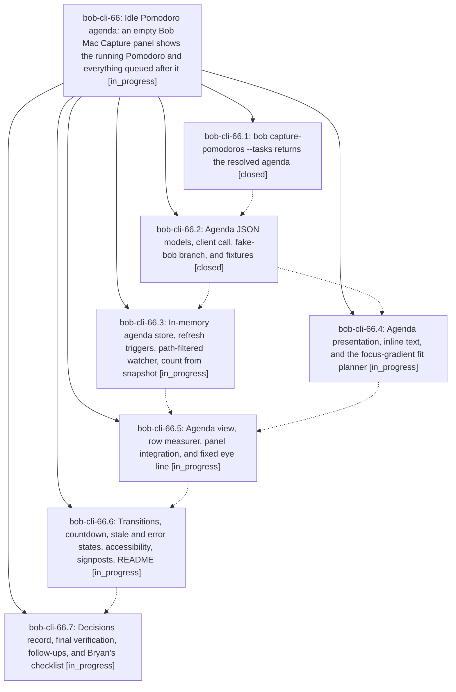

# Bead: bob-cli-66 — Idle Pomodoro agenda: an empty Bob Mac Capture panel shows the running Pomodoro and everything queued after it

[Bead Pages](../README.md) / bob-cli-66

**Status:** ◐ in_progress · **Type:** ▸ plan · **Tier:** epic
**Owner:** `bryanbugyi34@gmail.com` · **Created by:** [bbugyi200.athena.research.48.linker.w0](https://github.com/bobs-org/bob-cli--agents/blob/main/sessions/bbugyi200.athena.research.48.linker.w0.md) · **Assignee:** `bob-cli-66.land`
**Created:** 2026-10-09 17:42:22 EDT
**Plan:** [202610/idle\_capture\_pomodoro\_agenda.md](https://github.com/bobs-org/bob-cli--plans/blob/main/202610/idle_capture_pomodoro_agenda.md)

<!-- sase:links:start -->

## Links

| Relation | Artifact | Why |
| --- | --- | --- |
| implemented-by | [plan:202610/idle_capture_pomodoro_agenda.md][1] | derived from the plan's `bead_id:` frontmatter field |

[1]: https://github.com/bobs-org/bob-cli--plans/blob/main/202610/idle_capture_pomodoro_agenda.md

<!-- sase:links:end -->

## Description

When the capture panel opens with an empty draft, it already shows today's agenda, painted from memory in the first frame: the running Pomodoro and every future Pomodoro, each with its linked tasks at the most detail that fits below a fixed eye line without scrolling. The `=x` and `=` numbers match the ones bob will use. Detail folds per Pomodoro, farthest first: logs, then one-line tasks, then one row per Pomodoro, then a name strip. bob owns every fact; the app owns caching, fitting, and pixels.

## Phases

| Bead | Title | Status | Size | Created | Agents | Commits |
|---|---|---|---|---|---:|---:|
| [bob-cli-66.1](bob-cli-66.1.md) | bob capture-pomodoros --tasks returns the resolved agenda | ✓ closed | medium | 2026-10-09 | 1 | 1 |
| [bob-cli-66.2](bob-cli-66.2.md) | Agenda JSON models, client call, fake-bob branch, and fixtures | ✓ closed | small | 2026-10-09 | 1 | 1 |
| [bob-cli-66.3](bob-cli-66.3.md) | In-memory agenda store, refresh triggers, path-filtered watcher, count from snapshot | ◐ in_progress | medium | 2026-10-09 | 1 | 1 |
| [bob-cli-66.4](bob-cli-66.4.md) | Agenda presentation, inline text, and the focus-gradient fit planner | ◐ in_progress | medium | 2026-10-09 | 1 | 1 |
| [bob-cli-66.5](bob-cli-66.5.md) | Agenda view, row measurer, panel integration, and fixed eye line | ◐ in_progress | medium | 2026-10-09 | 1 | 0 |
| [bob-cli-66.6](bob-cli-66.6.md) | Transitions, countdown, stale and error states, accessibility, signposts, README | ◐ in_progress | medium | 2026-10-09 | 1 | 0 |
| [bob-cli-66.7](bob-cli-66.7.md) | Decisions record, final verification, follow-ups, and Bryan's checklist | ◐ in_progress | small | 2026-10-09 | 1 | 0 |

## Lineage

## Agents

| Agent | Bead | Commits |
|---|---|---:|
| [bbugyi200.athena.bob-cli-66.1](https://github.com/bobs-org/bob-cli--agents/blob/main/agents/bbugyi200.athena.bob-cli-66.1/README.md) | [bob-cli-66.1](bob-cli-66.1.md) | 1 |
| [bbugyi200.athena.bob-cli-66.2](https://github.com/bobs-org/bob-cli--agents/blob/main/sessions/bbugyi200.athena.bob-cli-66.2.md) | [bob-cli-66.2](bob-cli-66.2.md) | 1 |
| [bbugyi200.athena.bob-cli-66.3](https://github.com/bobs-org/bob-cli--agents/blob/main/agents/bbugyi200.athena.bob-cli-66.3/README.md) | [bob-cli-66.3](bob-cli-66.3.md) | 1 |
| [bbugyi200.athena.bob-cli-66.4](https://github.com/bobs-org/bob-cli--agents/blob/main/agents/bbugyi200.athena.bob-cli-66.4/README.md) | [bob-cli-66.4](bob-cli-66.4.md) | 1 |
| [bbugyi200.athena.bob-cli-66.5](https://github.com/bobs-org/bob-cli--agents/blob/main/agents/bbugyi200.athena.bob-cli-66.5/README.md) | [bob-cli-66.5](bob-cli-66.5.md) | 0 |
| [bbugyi200.athena.bob-cli-66.6](https://github.com/bobs-org/bob-cli--agents/blob/main/agents/bbugyi200.athena.bob-cli-66.6/README.md) | [bob-cli-66.6](bob-cli-66.6.md) | 0 |
| [bbugyi200.athena.bob-cli-66.7](https://github.com/bobs-org/bob-cli--agents/blob/main/agents/bbugyi200.athena.bob-cli-66.7/README.md) | [bob-cli-66.7](bob-cli-66.7.md) | 0 |
| [bbugyi200.athena.bob-cli-66.land](https://github.com/bobs-org/bob-cli--agents/blob/main/agents/bbugyi200.athena.bob-cli-66.land/README.md) | [bob-cli-66](README.md) | 0 |

## Commits

| Repo | Commit | Subject | Bead | Committed |
|---|---|---|---|---|
| bob-cli | [`6562b71`](https://github.com/bobs-org/bob-cli/commit/6562b71410672b9a32c790cd8215152d3fbe7eec) | feat(agenda): add -t/--tasks resolved agenda to bob capture-pomodoros | [bob-cli-66.1](bob-cli-66.1.md) | 2026-10-09 18:23:54 EDT |
| bob-mac-capture | [`bob-mac-capture@febd4dd`](https://github.com/bobs-org/bob-mac-capture/commit/febd4dde8c2956118e18dc3c35cd6c717fbd9583) | feat(agenda): JSON models, agenda client call, fake-bob branch, fixtures | [bob-cli-66.2](bob-cli-66.2.md) | 2026-10-09 18:36:55 EDT |
| bob-mac-capture | [`bob-mac-capture@dc70507`](https://github.com/bobs-org/bob-mac-capture/commit/dc7050734e1f23402ee4dcdd412320abc743ec5b) | feat(agenda): presentation, inline text, layout, and fit planner | [bob-cli-66.4](bob-cli-66.4.md) | 2026-10-09 19:15:16 EDT |
| bob-mac-capture | [`bob-mac-capture@aaa2d9b`](https://github.com/bobs-org/bob-mac-capture/commit/aaa2d9bba8164fd075c7d3ff958383afb862bfc4) | feat(agenda): in-memory store, refresh triggers, filtered watcher, count | [bob-cli-66.3](bob-cli-66.3.md) | 2026-10-09 19:15:41 EDT |
