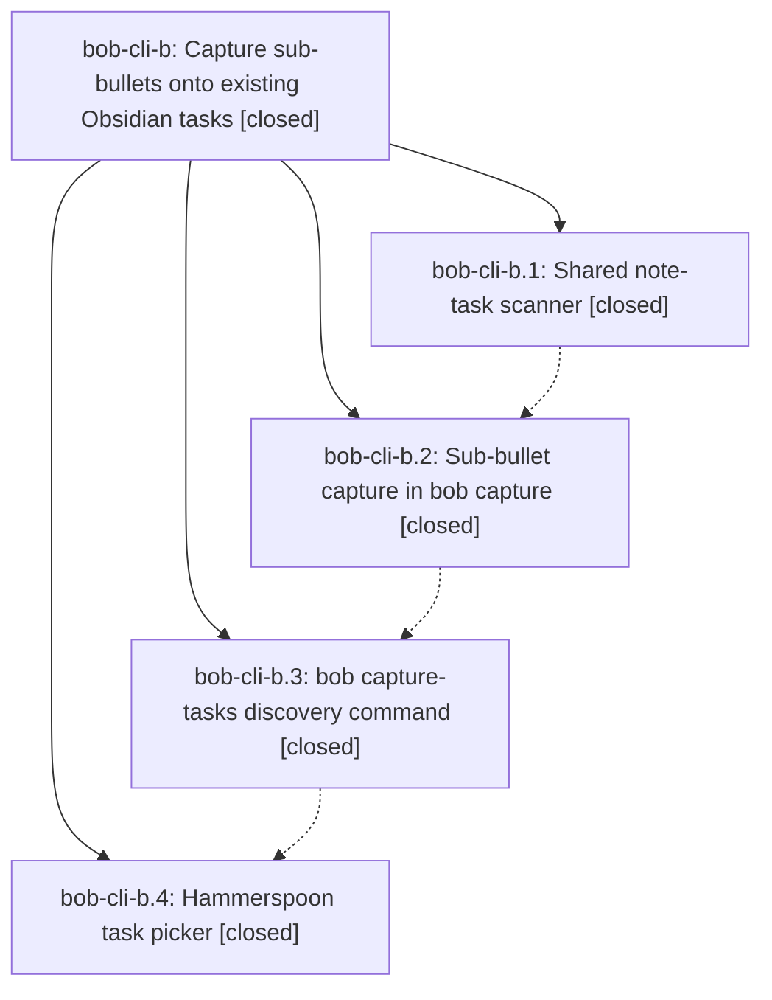

# Bead: bob-cli-b — Capture sub-bullets onto existing Obsidian tasks

[Bead Pages](../README.md) / bob-cli-b

**Status:** ✓ closed · **Resolution:** done · **Type:** ▸ plan · **Tier:** epic
**Owner:** `bryanbugyi34@gmail.com` · **Created by:** `bryanbugyi34@gmail.com` · **Assignee:** `bob-cli-b.land`
**Created:** 2026-07-31 07:55:37 EDT · **Closed:** 2026-07-31 08:40:45 EDT
**Plan:** [202607/capture\_sub\_bullets.md](https://github.com/bobs-org/bob-cli--plans/blob/main/202607/capture_sub_bullets.md)

## Description

`bob capture` can append a sub-bullet to an existing Obsidian task via a new `@<route>^<block-id>` marker, `bob capture-tasks` lists a note's open tasks with their statuses, and the Hammerspoon capture panel resolves a bare `@<route>^` into a status-annotated task picker.

## Notes

[2026-07-31T12:40:45Z · bob-cli-b.land] Children:
- bob-cli-b.1
- bob-cli-b.2
- bob-cli-b.3
- bob-cli-b.4
Implementation commits verified: 31a10c59, 0dc8d666, 851d7a16, 8831506c.
Source/acceptance coverage reviewed: tests/cli.rs capture_sub_bullet_errors_are_actionable_in_human_and_json_modes now includes invalid route-char and invalid block-ID-char cases and exercises both --human and --json modes.
Checks run: cargo test capture_sub_bullet_errors_are_actionable_in_human_and_json_modes --test cli, cargo fmt --check, git diff --check, and just all (ALL CHECKS PASSED).
Linked chezmoi checks run in commit 745988aa with clean checkout: just fmt-lua and just test-hammerspoon (14 successes / 0 failures).
Commit review after epic start: bob-cli range 31a10c59..HEAD reviewed for conflicts/duplication (31a10c59, 0dc8d666, 851d7a16, 8831506c only); chezmoi non-epic commit 0f8691c1 reviewed and judged non-conflicting; no further relevant commits landed while executing.
Created follow-up task bead: bob-cli-c to correct Pomodoro block-ID usage error wording mismatch (underscore claim).
No PROPOSED FOLLOW-UP entries were omitted because none existed on child bead histories.

## Phases

| Bead | Title | Status | Size | Agents | Commits |
|---|---|---|---|---:|---:|
| [bob-cli-b.1](bob-cli-b.1.md) | Shared note-task scanner | ✓ closed | medium | 0 | 0 |
| [bob-cli-b.2](bob-cli-b.2.md) | Sub-bullet capture in bob capture | ✓ closed | medium | 0 | 0 |
| [bob-cli-b.3](bob-cli-b.3.md) | bob capture-tasks discovery command | ✓ closed | medium | 0 | 0 |
| [bob-cli-b.4](bob-cli-b.4.md) | Hammerspoon task picker | ✓ closed | medium | 0 | 0 |

## Lineage

## Agents

| Agent | Bead | Commits |
|---|---|---:|
| [bbugyi200.athena.bob-cli-b.land](https://github.com/bobs-org/bob-cli--agents/blob/main/families/bbugyi200.athena.bob-cli-b.land.md) | [bob-cli-b](README.md) | 0 |
