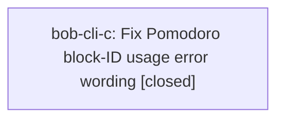

# Bead: bob-cli-c — Fix Pomodoro block-ID usage error wording

[Bead Pages](../README.md) / bob-cli-c

**Status:** ✓ closed · **Resolution:** done · **Type:** ◆ task
**Owner:** `bryanbugyi34@gmail.com` · **Created by:** `bryanbugyi34@gmail.com`
**Created:** 2026-07-31 08:40:32 EDT · **Closed:** 2026-08-01 12:15:47 EDT

## Description

Source: bob-cli-b. In collect_done::is_block_id_byte, underscore is rejected for block IDs, but the Pomodoro block-ID usage error text still claims underscore is accepted. Update the error string and related help/docs to match behavior.

## Lineage

