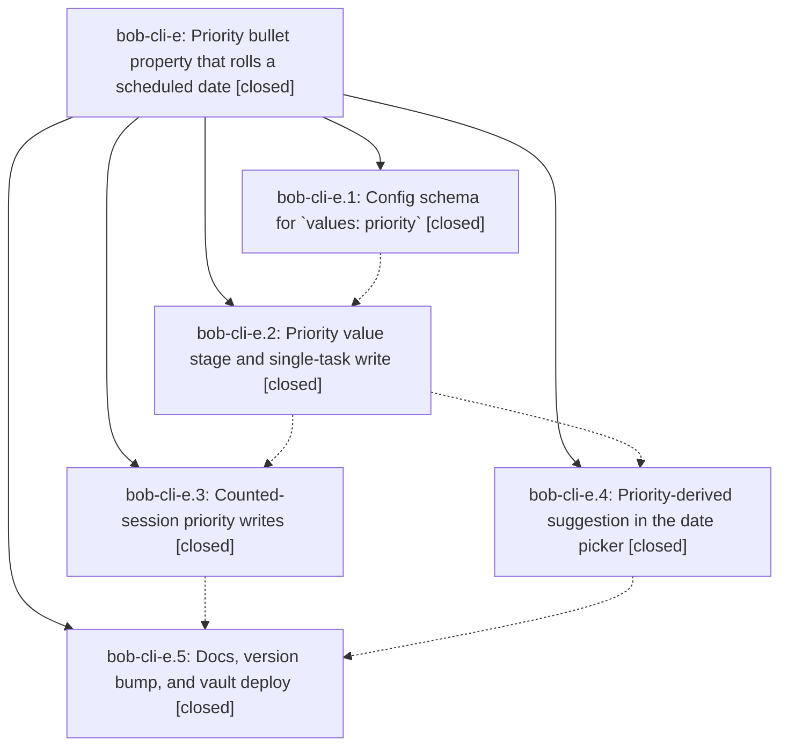

# Bead: bob-cli-e — Priority bullet property that rolls a scheduled date

[Bead Pages](../README.md) / bob-cli-e

**Status:** ✓ closed · **Resolution:** done · **Type:** ▸ plan · **Tier:** epic
**Owner:** `bryanbugyi34@gmail.com` · **Created by:** [bbugyi200.athena.s8](https://github.com/bobs-org/bob-cli--agents/blob/main/agents/bbugyi200.athena.s8/README.md) · **Assignee:** `bob-cli-e.land`
**Created:** 2026-08-03 04:08:24 EDT · **Closed:** 2026-08-03 04:57:12 EDT
**Plan:** [202608/priority\_property.md](https://github.com/bobs-org/bob-cli--plans/blob/main/202608/priority_property.md)

## Description

The Ctrl+Shift+P bullet-property picker offers a `priority` property whose P2/P3/P4 levels each write a random `scheduled` date drawn from a per-level day range configured in bob/config.yml, and the `scheduled` date picker offers a visually distinct re-rollable date suggestion whenever the current task already has a priority.

## Notes

[2026-08-03T08:58:46Z · bob-cli-e.land] Land verification. Read every child note and the epic's commits in both repos, then the source: config validation (levels label/value uniqueness, bracket/'::'/newline rejection, non-negative integer day ranges, min<=max, 'levels' rejected on non-priority entries, cross-entry 'schedules' must name another date property) in validateBulletPropertyConfig/normalizeBulletPriorityProperty; rollPriorityScheduledDate inclusive with a clamp for random()===1; priority value rows in config order with label/value/window/searchText/current; signal-high chrome, 'Filter priorities', 'priority levels', level-aware subtitles and currentLabel resolved through levelsByValue; setInlineBulletPropertyValues extracted and reused by setBulletPropertyValue with Blocked/recovery intact; ^prj routing that writes priority inline and the rolled date to frontmatter under one notice; counted 'set-priority' with a per-target roll map, per-target Blocked/recovery, project-frontmatter branch and stale-session guard; pinned dices-icon priority-roll item with Ctrl+R re-roll, footer hint only when a roll exists, and counted common-priority gating; styles, manifest 1.14.x, README row, docs/projects.md. Verified chezmoi source and deployed ~/.config/bob/config.yml carry the priority entry and match, and the vault plugin files are byte-identical to source (cmp).

Integration: no commits landed in bob-cli or bob-plugins after this epic's first commit (2026-08-03 04:15), and none landed concurrently (last non-epic commits 2026-08-01 and 2026-07-31). Both repos are on master with no other branches or PRs, so there was nothing to re-integrate. Checked adjacent pre-existing surfaces for conflict or duplication: the legacy numeric [p:: N] project/highlights field uses a distinct key and does not collide with [priority:: ...]; bob-cli's Rust Tasks parser already accepts the written values; README.md, docs/dataview.md and docs/task-status-hooks.md do not enumerate picker properties, so nothing went stale.

Defect found and fixed as epic work (bob-plugins ed6386f, navigation-hotkeys 1.14.1): the single-task writer upserted priority and then scheduled onto the live line, so a task that already carried [scheduled:: ...] had that field replaced in place and ended with [priority:: ...] rightmost - the opposite of the counted writer, which rebuilds the date after the priority. Harmless while every level value is a Tasks priority name, but the plan documents changing 'value:' in config as the supported way to store a literal P2, and under that config the old order would have hidden scheduled/id/dependsOn from every right-to-left trailing-field parse. Inline writes now accept reorderPropertyNames and drop the schedules field before writing the priority; both writers assert the exact resulting line shape. npm test 268/268, npm run validate 6/6, git diff --check clean, re-synced to the vault and re-verified byte parity.

No PROPOSED FOLLOW-UP entries were recorded on any child bead, so no task beads were proposed. 'just symvision' is not available in this project (no recipe in the justfile, no symvision binary), so no epic-symbol whitelist sweep was possible; no whitelist entries naming this epic exist in the repo. Obsidian plugin reload is still required to pick up 1.14.1.

[2026-08-03T08:58:54Z · bob-cli-e.land] Land verification complete: all five phases confirmed against source, config and vault deployment; no post-epic commits to integrate; one epic-caused field-ordering defect in the single-task priority writer fixed and released as navigation-hotkeys 1.14.1 (bob-plugins ed6386f); no PROPOSED FOLLOW-UP entries on any child bead; symvision unavailable in this project.

## Phases

| Bead | Title | Status | Size | Agents | Commits |
|---|---|---|---|---:|---:|
| [bob-cli-e.1](bob-cli-e.1.md) | Config schema for \`values: priority\` | ✓ closed | medium | 1 | 0 |
| [bob-cli-e.2](bob-cli-e.2.md) | Priority value stage and single-task write | ✓ closed | medium | 1 | 0 |
| [bob-cli-e.3](bob-cli-e.3.md) | Counted-session priority writes | ✓ closed | medium | 1 | 0 |
| [bob-cli-e.4](bob-cli-e.4.md) | Priority-derived suggestion in the date picker | ✓ closed | medium | 1 | 0 |
| [bob-cli-e.5](bob-cli-e.5.md) | Docs, version bump, and vault deploy | ✓ closed | small | 1 | 0 |

## Lineage

## Agents

| Agent | Bead | Commits |
|---|---|---:|
| [bbugyi200.athena.bob-cli-e.1](https://github.com/bobs-org/bob-cli--agents/blob/main/agents/bbugyi200.athena.bob-cli-e.1/README.md) | [bob-cli-e.1](bob-cli-e.1.md) | 0 |
| [bbugyi200.athena.bob-cli-e.2](https://github.com/bobs-org/bob-cli--agents/blob/main/agents/bbugyi200.athena.bob-cli-e.2/README.md) | [bob-cli-e.2](bob-cli-e.2.md) | 0 |
| [bbugyi200.athena.bob-cli-e.3](https://github.com/bobs-org/bob-cli--agents/blob/main/agents/bbugyi200.athena.bob-cli-e.3/README.md) | [bob-cli-e.3](bob-cli-e.3.md) | 0 |
| [bbugyi200.athena.bob-cli-e.4](https://github.com/bobs-org/bob-cli--agents/blob/main/agents/bbugyi200.athena.bob-cli-e.4/README.md) | [bob-cli-e.4](bob-cli-e.4.md) | 0 |
| [bbugyi200.athena.bob-cli-e.5](https://github.com/bobs-org/bob-cli--agents/blob/main/agents/bbugyi200.athena.bob-cli-e.5/README.md) | [bob-cli-e.5](bob-cli-e.5.md) | 0 |
| [bbugyi200.athena.bob-cli-e.land](https://github.com/bobs-org/bob-cli--agents/blob/main/agents/bbugyi200.athena.bob-cli-e.land/README.md) | [bob-cli-e](README.md) | 0 |
