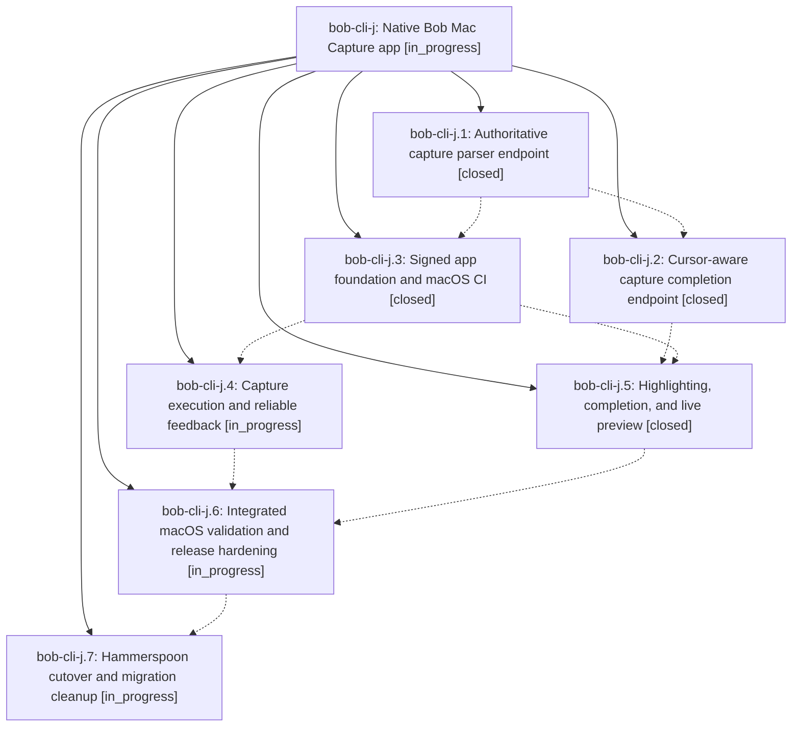

# Bead: bob-cli-j — Native Bob Mac Capture app

[Bead Pages](../README.md) / bob-cli-j

**Status:** ◐ in_progress · **Type:** ▸ plan · **Tier:** epic
**Owner:** `bryanbugyi34@gmail.com` · **Created by:** [bbugyi200.athena.005](https://github.com/bobs-org/bob-cli--agents/blob/main/families/bbugyi200.athena.005.md) · **Assignee:** `bob-cli-j.land`
**Created:** 2026-08-13 20:32:34 EDT
**Plan:** [202608/bob\_mac\_capture.md](https://github.com/bobs-org/bob-cli--plans/blob/main/202608/bob_mac_capture.md)

## Description

A signed native macOS 26 menu-bar app in bobs-org/bob-mac-capture replaces the Hammerspoon capture pop-up with a pre-warmed global-hotkey panel that supports multi-line editing, authoritative marker highlighting and completion, exact live preview, lossless failure handling, and reliable inline and system feedback, while bob-cli remains the only implementation of capture grammar and vault mutation.

## Phases

| Bead | Title | Status | Size | Created | Agents | Commits |
|---|---|---|---|---|---:|---:|
| [bob-cli-j.1](bob-cli-j.1.md) | Authoritative capture parser endpoint | ✓ closed | medium | 2026-08-13 | 1 | 1 |
| [bob-cli-j.2](bob-cli-j.2.md) | Cursor-aware capture completion endpoint | ✓ closed | medium | 2026-08-13 | 1 | 1 |
| [bob-cli-j.3](bob-cli-j.3.md) | Signed app foundation and macOS CI | ✓ closed | medium | 2026-08-13 | 1 | 0 |
| [bob-cli-j.4](bob-cli-j.4.md) | Capture execution and reliable feedback | ◐ in_progress | medium | 2026-08-13 | 1 | 0 |
| [bob-cli-j.5](bob-cli-j.5.md) | Highlighting, completion, and live preview | ✓ closed | medium | 2026-08-13 | 1 | 0 |
| [bob-cli-j.6](bob-cli-j.6.md) | Integrated macOS validation and release hardening | ◐ in_progress | medium | 2026-08-13 | 1 | 0 |
| [bob-cli-j.7](bob-cli-j.7.md) | Hammerspoon cutover and migration cleanup | ◐ in_progress | small | 2026-08-13 | 1 | 0 |

## Lineage

## Agents

| Agent | Bead | Commits |
|---|---|---:|
| [bbugyi200.athena.bob-cli-j.1](https://github.com/bobs-org/bob-cli--agents/blob/main/agents/bbugyi200.athena.bob-cli-j.1/README.md) | [bob-cli-j.1](bob-cli-j.1.md) | 1 |
| [bbugyi200.athena.bob-cli-j.2](https://github.com/bobs-org/bob-cli--agents/blob/main/agents/bbugyi200.athena.bob-cli-j.2/README.md) | [bob-cli-j.2](bob-cli-j.2.md) | 1 |
| [bbugyi200.athena.bob-cli-j.3](https://github.com/bobs-org/bob-cli--agents/blob/main/agents/bbugyi200.athena.bob-cli-j.3/README.md) | [bob-cli-j.3](bob-cli-j.3.md) | 0 |
| [bbugyi200.athena.bob-cli-j.4](https://github.com/bobs-org/bob-cli--agents/blob/main/agents/bbugyi200.athena.bob-cli-j.4/README.md) | [bob-cli-j.4](bob-cli-j.4.md) | 0 |
| [bbugyi200.athena.bob-cli-j.5](https://github.com/bobs-org/bob-cli--agents/blob/main/agents/bbugyi200.athena.bob-cli-j.5/README.md) | [bob-cli-j.5](bob-cli-j.5.md) | 0 |
| [bbugyi200.athena.bob-cli-j.6](https://github.com/bobs-org/bob-cli--agents/blob/main/agents/bbugyi200.athena.bob-cli-j.6/README.md) | [bob-cli-j.6](bob-cli-j.6.md) | 0 |
| [bbugyi200.athena.bob-cli-j.7](https://github.com/bobs-org/bob-cli--agents/blob/main/agents/bbugyi200.athena.bob-cli-j.7/README.md) | [bob-cli-j.7](bob-cli-j.7.md) | 0 |
| [bbugyi200.athena.bob-cli-j.land](https://github.com/bobs-org/bob-cli--agents/blob/main/agents/bbugyi200.athena.bob-cli-j.land/README.md) | [bob-cli-j](README.md) | 0 |

## Commits

| Repo | Commit | Subject | Bead | Committed |
|---|---|---|---|---|
| bob-cli | [`8b04200`](https://github.com/bobs-org/bob-cli/commit/8b0420004ca5ac0a57617c1d131ac04777c5c511) | feat(capture): add capture-parse command and shared capture grammar module | [bob-cli-j.1](bob-cli-j.1.md) | 2026-08-13 21:17:22 EDT |
| bob-cli | [`f548183`](https://github.com/bobs-org/bob-cli/commit/f548183568474812b5e7c28b2f7bc5c0cb092364) | feat(capture): add capture-complete cursor-aware completion command | [bob-cli-j.2](bob-cli-j.2.md) | 2026-08-13 21:42:24 EDT |
