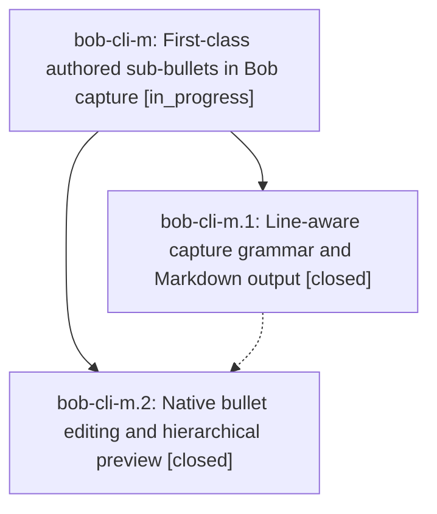

# Bead: bob-cli-m — First-class authored sub-bullets in Bob capture

[Bead Pages](../README.md) / bob-cli-m

**Status:** ◐ in_progress · **Type:** ▸ plan · **Tier:** epic
**Owner:** `bryanbugyi34@gmail.com` · **Created by:** [bbugyi200.athena.00w.f0.f0.w0](https://github.com/bobs-org/bob-cli--agents/blob/main/families/bbugyi200.athena.00w.f0.f0.w0.md) · **Assignee:** `bob-cli-m.land`
**Created:** 2026-08-14 10:54:44 EDT
**Plan:** [202608/capture\_authored\_sub\_bullets.md](https://github.com/bobs-org/bob-cli--plans/blob/main/202608/capture_authored_sub_bullets.md)

## Description

Bob capture accepts a one-line parent followed by flat authored bullets, applies capture-wide markers from the end of any input line, writes the children with native Obsidian indentation, and gives the macOS capture app polished bullet editing and exact hierarchical preview behavior.

## Notes

[2026-08-14T16:16:14Z · bob-cli-m.land] LANDING AUDIT: Verified bob-cli-m.1 commit 2d6b0afe and bob-cli-m.2 commit 727b05d0 against their notes, source, tests, and post-start integration. Bob CLI is clean and passes cargo test capture_language (77), authored-bullet plus later wikilink/clip-contract tests, just all (538 unit, 308 CLI, 27 Dataview, 31 Tasks, 1 real-vault), just install-smoke, and git diff --check. Epic remains open because bob-mac-capture PreviewPane omits decoded clip.lines and scheduleLog.lines from explicit Preview, and Shift-Backspace is incorrectly intercepted despite the plain-Backspace-only contract; native edit paths also need the original executable behavior coverage. macOS CI run 31817794155 built the app but failed compiling an unrelated pre-epic autosizing test; /sase_new_task attached that evidence to active epic bob-cli-n. PROPOSED FOLLOW-UP outcomes: bob-cli-m.1 flake -> ready task bob-cli-o; bob-cli-m.2 missing full-block preview -> retained as bob-cli-m remediation work.

## Phases

| Bead | Title | Status | Size | Created | Agents | Commits |
|---|---|---|---|---|---:|---:|
| [bob-cli-m.1](bob-cli-m.1.md) | Line-aware capture grammar and Markdown output | ✓ closed | medium | 2026-08-14 | 1 | 1 |
| [bob-cli-m.2](bob-cli-m.2.md) | Native bullet editing and hierarchical preview | ✓ closed | medium | 2026-08-14 | 1 | 1 |

## Lineage

## Agents

| Agent | Bead | Commits |
|---|---|---:|
| [bbugyi200.athena.bob-cli-m.1](https://github.com/bobs-org/bob-cli--agents/blob/main/agents/bbugyi200.athena.bob-cli-m.1/README.md) | [bob-cli-m.1](bob-cli-m.1.md) | 1 |
| [bbugyi200.athena.bob-cli-m.2](https://github.com/bobs-org/bob-cli--agents/blob/main/agents/bbugyi200.athena.bob-cli-m.2/README.md) | [bob-cli-m.2](bob-cli-m.2.md) | 1 |
| [bbugyi200.athena.bob-cli-m.land](https://github.com/bobs-org/bob-cli--agents/blob/main/agents/bbugyi200.athena.bob-cli-m.land/README.md) | [bob-cli-m](README.md) | 1 |

## Commits

| Repo | Commit | Subject | Bead | Committed |
|---|---|---|---|---|
| bob-cli | [`2d6b0af`](https://github.com/bobs-org/bob-cli/commit/2d6b0afe9053ce9ce6ccc6ccb08f73d7948286d0) | feat(capture): make capture text physical-line-aware | [bob-cli-m.1](bob-cli-m.1.md) | 2026-08-14 11:29:18 EDT |
| bob-mac-capture | [`bob-mac-capture@727b05d`](https://github.com/bobs-org/bob-mac-capture/commit/727b05d0be377490fd27b47d29a72613e449f4f9) | feat(capture): native bullet editing and hierarchical preview | [bob-cli-m.2](bob-cli-m.2.md) | 2026-08-14 12:05:40 EDT |
| bob-mac-capture | [`bob-mac-capture@3d99000`](https://github.com/bobs-org/bob-mac-capture/commit/3d99000a664d9ac091803d16641f2fc380732f6c) | fix(capture): mirror the full capture block in preview | [bob-cli-m](README.md) | 2026-08-14 12:32:45 EDT |
