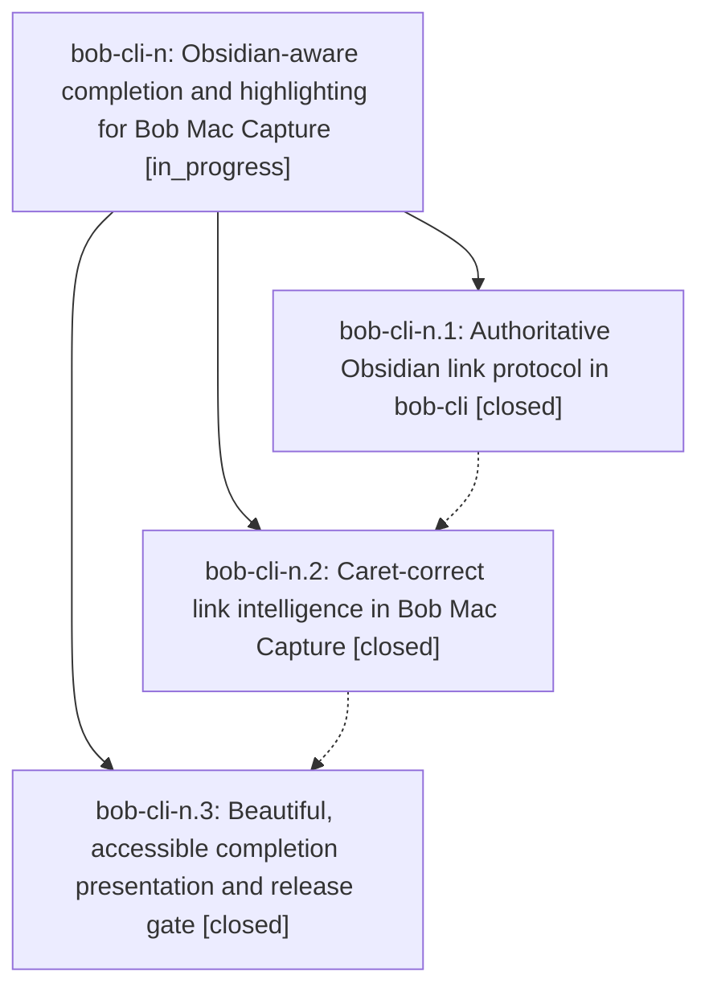

# Bead: bob-cli-n — Obsidian-aware completion and highlighting for Bob Mac Capture

[Bead Pages](../README.md) / bob-cli-n

**Status:** ◐ in_progress · **Type:** ▸ plan · **Tier:** epic
**Owner:** `bryanbugyi34@gmail.com` · **Created by:** [bbugyi200.athena.00w.f0.f0.w0.w0](https://github.com/bobs-org/bob-cli--agents/blob/main/families/bbugyi200.athena.00w.f0.f0.w0.w0.md) · **Assignee:** `bob-cli-n.land`
**Created:** 2026-08-14 11:05:26 EDT
**Plan:** [202608/obsidian\_link\_completion.md](https://github.com/bobs-org/bob-cli--plans/blob/main/202608/obsidian_link_completion.md)

## Description

Typing an Obsidian wikilink in the Bob Mac Capture popup produces fast, accurate, keyboard-first suggestions and polished semantic highlighting without moving capture grammar or vault authority into Swift.

## Notes

[2026-08-14T16:12:21Z · bob-cli-m.land] DISCOVERED ISSUE: During bob-cli-m land verification, bob-mac-capture macOS CI run 31817794155 failed at commit 727b05d0be377490fd27b47d29a72613e449f4f9 before executing tests: Tests/BobMacCaptureTests/BobMacCaptureTests.swift:211-212 uses untyped .greatestFiniteMagnitude in NSSize, which is ambiguous between CGFloat and Double under the macOS 26 toolchain. git blame traces the defect to pre-epic autosizing commit a20055e96eea268ef0c52ee02cfad1e2fff14d16, not bob-cli-m. This directly blocks bob-cli-n.3's macOS release gate; qualify the values as CGFloat.greatestFiniteMagnitude, then rerun the full workflow.

## Phases

| Bead | Title | Status | Size | Created | Agents | Commits |
|---|---|---|---|---|---:|---:|
| [bob-cli-n.1](bob-cli-n.1.md) | Authoritative Obsidian link protocol in bob-cli | ✓ closed | medium | 2026-08-14 | 1 | 1 |
| [bob-cli-n.2](bob-cli-n.2.md) | Caret-correct link intelligence in Bob Mac Capture | ✓ closed | medium | 2026-08-14 | 1 | 1 |
| [bob-cli-n.3](bob-cli-n.3.md) | Beautiful, accessible completion presentation and release gate | ✓ closed | medium | 2026-08-14 | 1 | 1 |

## Lineage

## Agents

| Agent | Bead | Commits |
|---|---|---:|
| [bbugyi200.athena.bob-cli-n.1](https://github.com/bobs-org/bob-cli--agents/blob/main/agents/bbugyi200.athena.bob-cli-n.1/README.md) | [bob-cli-n.1](bob-cli-n.1.md) | 1 |
| [bbugyi200.athena.bob-cli-n.2](https://github.com/bobs-org/bob-cli--agents/blob/main/agents/bbugyi200.athena.bob-cli-n.2/README.md) | [bob-cli-n.2](bob-cli-n.2.md) | 1 |
| [bbugyi200.athena.bob-cli-n.3](https://github.com/bobs-org/bob-cli--agents/blob/main/agents/bbugyi200.athena.bob-cli-n.3/README.md) | [bob-cli-n.3](bob-cli-n.3.md) | 1 |
| [bbugyi200.athena.bob-cli-n.land](https://github.com/bobs-org/bob-cli--agents/blob/main/families/bbugyi200.athena.bob-cli-n.land.md) | [bob-cli-n](README.md) | 1 |

## Commits

| Repo | Commit | Subject | Bead | Committed |
|---|---|---|---|---|
| bob-cli | [`d5eaf97`](https://github.com/bobs-org/bob-cli/commit/d5eaf976403f6ef5eb5afe6f788303c530fba4a2) | feat(capture): add Obsidian wikilink editor protocol | [bob-cli-n.1](bob-cli-n.1.md) | 2026-08-14 11:35:50 EDT |
| bob-mac-capture | [`bob-mac-capture@3f9b70c`](https://github.com/bobs-org/bob-mac-capture/commit/3f9b70c7c9d8fa6d51a38bd309eab1ad9b23d8c5) | feat: support caret-aware wikilink completions | [bob-cli-n.2](bob-cli-n.2.md) | 2026-08-14 12:00:40 EDT |
| bob-mac-capture | [`bob-mac-capture@2d98f19`](https://github.com/bobs-org/bob-mac-capture/commit/2d98f191a5402e00eef32dc2b3a27cf5e0c66021) | feat(capture): polish wikilink completion rows with adaptive palette | [bob-cli-n.3](bob-cli-n.3.md) | 2026-08-14 12:22:44 EDT |
| bob-mac-capture | [`bob-mac-capture@1d859d9`](https://github.com/bobs-org/bob-mac-capture/commit/1d859d909571010c90ff16e487c08bb32272328c) | fix(capture): qualify panel test size scalars | [bob-cli-n](README.md) | 2026-08-14 12:30:37 EDT |
