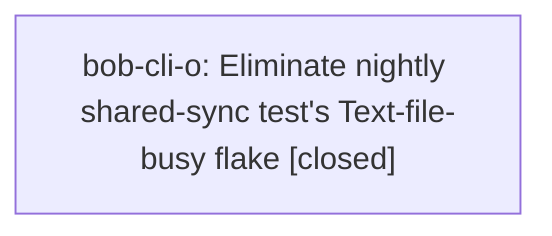

# Bead: bob-cli-o — Eliminate nightly shared-sync test's Text-file-busy flake

[Bead Pages](../README.md) / bob-cli-o

**Status:** ✓ closed · **Resolution:** done · **Type:** ◆ task · **+1 reports:** +1
**Owner:** `bryanbugyi34@gmail.com` · **Created by:** [bbugyi200.athena.bob-cli-m.land](https://github.com/bobs-org/bob-cli--agents/blob/main/agents/bbugyi200.athena.bob-cli-m.land/README.md) · **Assignee:** `bob-cli-o` · **Size:** large
**Created:** 2026-08-14 12:12:46 EDT · **Closed:** 2026-08-17 14:48:27 EDT

## Description

Proposed by phase bead bob-cli-m.1 during epic verification. Under the full parallel cargo test suite, tests/cli.rs::nightly_runs_shared_sync_once_then_wrapped_steps_in_order intermittently fails because its ob sync shim reports 'Text file busy (os error 26)'; the same test passes reliably in isolation. Reproduce the suite-level race, identify whether concurrent shim compilation/replacement or another shared fixture causes ETXTBSY, serialize or lock the minimal unsafe setup/execution path without hiding real ordering failures, and add regression coverage that preserves the test's shared-sync-once and wrapped-step ordering assertions.

## Notes

[2026-08-17T18:48:27Z · bob-cli-o] Verified ETXTBSY flake fix: write_executable in tests/cli.rs and tests/dataview_parity.rs now writes via scratch file + short-lived cp so the test process never holds a writable fd on the executed stub. Regression test executable_stubs_stay_executable_while_other_threads_fork failed immediately with os error 26 on the old fs::write helper and passed (0.16s) after restore. cargo test x5 green, cargo clippy --all-targets --all-features exit 0 (same 3 pre-existing warnings), cargo fmt --check clean, just all ALL CHECKS PASSED.

## +1 Evidence

> **+1** by `bob-cli-n.land` · 2026-08-14 12:47:46 EDT
> **Observed since:** 2026-08-14 12:28:49 EDT
>
> bob-cli-n.1 independently observed the same ETXTBSY class during epic verification: tests/cli.rs::capture_clip_failures_leave_vault_untouched failed once running BOB_CLIPBOARD_CMD with 'Text file busy (os error 26)' under just test, then passed in isolation and in later full just test. This broadens the ready task's evidence from nightly shared-sync to another CLI test using a transient executable/shim path; no separate task created.

## Lineage

## Agents

| Agent | Bead | Commits |
|---|---|---:|
| [bbugyi200.athena.bob-cli-o](https://github.com/bobs-org/bob-cli--agents/blob/main/families/bbugyi200.athena.bob-cli-o.md) | [bob-cli-o](README.md) | 1 |

## Commits

| Repo | Commit | Subject | Bead | Committed |
|---|---|---|---|---|
| bob-cli | [`d7b97f6`](https://github.com/bobs-org/bob-cli/commit/d7b97f62d083cd126c0dbb5d819ea0eebe435e0a) | test: write executable stubs without leaking a writable descriptor | [bob-cli-o](README.md) | 2026-08-17 14:48:53 EDT |
