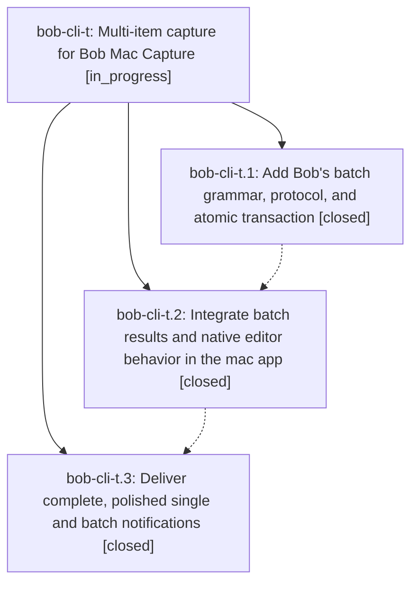

# Bead: bob-cli-t — Multi-item capture for Bob Mac Capture

[Bead Pages](../README.md) / bob-cli-t

**Status:** ◐ in_progress · **Type:** ▸ plan · **Tier:** epic
**Owner:** `bryanbugyi34@gmail.com` · **Created by:** [bbugyi200.athena.024.w1](https://github.com/bobs-org/bob-cli--agents/blob/main/families/bbugyi200.athena.024.w1.md) · **Assignee:** `bob-cli-t.land`
**Created:** 2026-08-15 09:47:49 EDT
**Plan:** [202608/multi\_capture.md](https://github.com/bobs-org/bob-cli--plans/blob/main/202608/multi_capture.md)

## Description

One Bob Mac Capture draft atomically captures every blank-line-separated task or note, with intuitive native editing, complete preview and notification feedback, and backward-compatible Bob protocols.

## Phases

| Bead | Title | Status | Size | Created | Agents | Commits |
|---|---|---|---|---|---:|---:|
| [bob-cli-t.1](bob-cli-t.1.md) | Add Bob's batch grammar, protocol, and atomic transaction | ✓ closed | medium | 2026-08-15 | 1 | 1 |
| [bob-cli-t.2](bob-cli-t.2.md) | Integrate batch results and native editor behavior in the mac app | ✓ closed | medium | 2026-08-15 | 1 | 1 |
| [bob-cli-t.3](bob-cli-t.3.md) | Deliver complete, polished single and batch notifications | ✓ closed | small | 2026-08-15 | 1 | 1 |

## Lineage

## Agents

| Agent | Bead | Commits |
|---|---|---:|
| [bbugyi200.athena.bob-cli-t.1](https://github.com/bobs-org/bob-cli--agents/blob/main/agents/bbugyi200.athena.bob-cli-t.1/README.md) | [bob-cli-t.1](bob-cli-t.1.md) | 1 |
| [bbugyi200.athena.bob-cli-t.2](https://github.com/bobs-org/bob-cli--agents/blob/main/agents/bbugyi200.athena.bob-cli-t.2/README.md) | [bob-cli-t.2](bob-cli-t.2.md) | 1 |
| [bbugyi200.athena.bob-cli-t.3](https://github.com/bobs-org/bob-cli--agents/blob/main/agents/bbugyi200.athena.bob-cli-t.3/README.md) | [bob-cli-t.3](bob-cli-t.3.md) | 1 |
| [bbugyi200.athena.bob-cli-t.land](https://github.com/bobs-org/bob-cli--agents/blob/main/agents/bbugyi200.athena.bob-cli-t.land/README.md) | [bob-cli-t](README.md) | 0 |

## Commits

| Repo | Commit | Subject | Bead | Committed |
|---|---|---|---|---|
| bob-cli | [`a8c9ad8`](https://github.com/bobs-org/bob-cli/commit/a8c9ad8e8909008a64a1929e97fb831ce7339a69) | feat(capture)!: add atomic batch capture support | [bob-cli-t.1](bob-cli-t.1.md) | 2026-08-15 10:17:05 EDT |
| bob-mac-capture | [`bob-mac-capture@4c22525`](https://github.com/bobs-org/bob-mac-capture/commit/4c2252578bc1c18b629ce369de8d71c2f32d0a5e) | feat: integrate batch capture results in mac app | [bob-cli-t.2](bob-cli-t.2.md) | 2026-08-15 10:44:23 EDT |
| bob-mac-capture | [`bob-mac-capture@c95ba0e`](https://github.com/bobs-org/bob-mac-capture/commit/c95ba0e34b4a63b8c5223f02a2d9983b8253c0ae) | feat: polish batch capture notifications | [bob-cli-t.3](bob-cli-t.3.md) | 2026-08-15 11:18:13 EDT |
