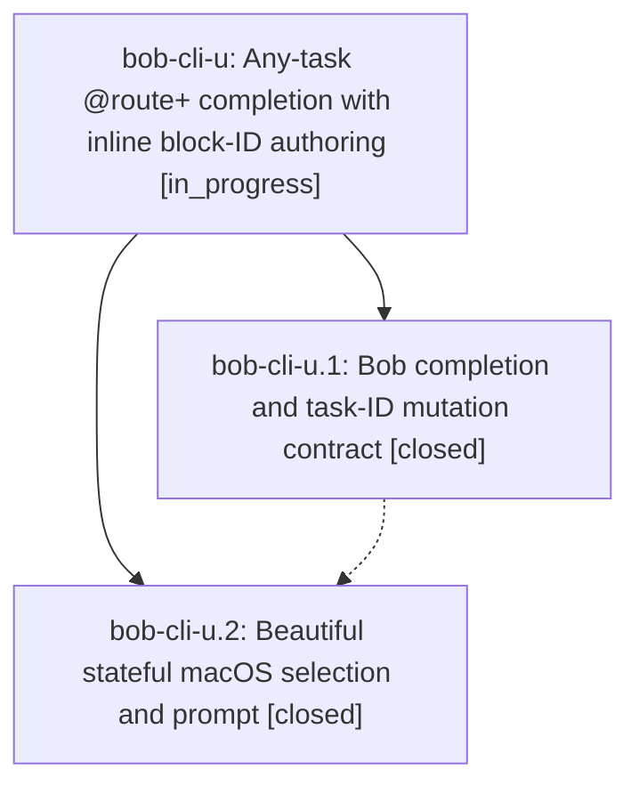

# Bead: bob-cli-u — Any-task @route+ completion with inline block-ID authoring

[Bead Pages](../README.md) / bob-cli-u

**Status:** ◐ in_progress · **Type:** ▸ plan · **Tier:** epic
**Owner:** `bryanbugyi34@gmail.com` · **Created by:** [bbugyi200.athena.02a](https://github.com/bobs-org/bob-cli--agents/blob/main/families/bbugyi200.athena.02a.md) · **Assignee:** `bob-cli-u.land`
**Created:** 2026-08-15 10:10:31 EDT
**Plan:** [202608/file\_plus\_any\_task.md](https://github.com/bobs-org/bob-cli--plans/blob/main/202608/file_plus_any_task.md)

## Description

Bob Mac Capture can select any open task from @file+ completion, safely assign a user-authored block ID through Bob when needed, and clearly distinguish ready tasks from tasks that require an ID.

## Phases

| Bead | Title | Status | Size | Created | Agents | Commits |
|---|---|---|---|---|---:|---:|
| [bob-cli-u.1](bob-cli-u.1.md) | Bob completion and task-ID mutation contract | ✓ closed | medium | 2026-08-15 | 1 | 1 |
| [bob-cli-u.2](bob-cli-u.2.md) | Beautiful stateful macOS selection and prompt | ✓ closed | medium | 2026-08-15 | 1 | 1 |

## Lineage

## Agents

| Agent | Bead | Commits |
|---|---|---:|
| [bbugyi200.athena.bob-cli-u.1](https://github.com/bobs-org/bob-cli--agents/blob/main/agents/bbugyi200.athena.bob-cli-u.1/README.md) | [bob-cli-u.1](bob-cli-u.1.md) | 1 |
| [bbugyi200.athena.bob-cli-u.2](https://github.com/bobs-org/bob-cli--agents/blob/main/agents/bbugyi200.athena.bob-cli-u.2/README.md) | [bob-cli-u.2](bob-cli-u.2.md) | 1 |
| [bbugyi200.athena.bob-cli-u.land](https://github.com/bobs-org/bob-cli--agents/blob/main/agents/bbugyi200.athena.bob-cli-u.land/README.md) | [bob-cli-u](README.md) | 0 |

## Commits

| Repo | Commit | Subject | Bead | Committed |
|---|---|---|---|---|
| bob-cli | [`2037307`](https://github.com/bobs-org/bob-cli/commit/2037307c852e7257e77d96f6e9c118ea23bacdff) | feat(capture): add any-task completion and capture-task-id | [bob-cli-u.1](bob-cli-u.1.md) | 2026-08-15 10:29:08 EDT |
| bob-mac-capture | [`bob-mac-capture@dff08a7`](https://github.com/bobs-org/bob-mac-capture/commit/dff08a7ffaa3e9ba1547566a5806ed7d75a8c471) | feat(capture): add task ID assignment prompt | [bob-cli-u.2](bob-cli-u.2.md) | 2026-08-15 11:24:13 EDT |
