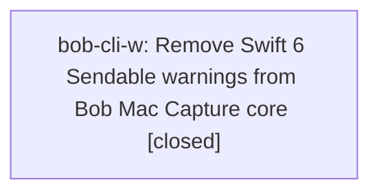

# Bead: bob-cli-w — Remove Swift 6 Sendable warnings from Bob Mac Capture core

[Bead Pages](../README.md) / bob-cli-w

**Status:** ✓ closed · **Resolution:** done · **Type:** ◆ task
**Owner:** `bryanbugyi34@gmail.com` · **Created by:** [bbugyi200.athena.bob-cli-t.land](https://github.com/bobs-org/bob-cli--agents/blob/main/families/bbugyi200.athena.bob-cli-t.land.md) · **Assignee:** `bob-cli-w` · **Size:** medium
**Created:** 2026-08-15 11:26:51 EDT · **Closed:** 2026-08-17 09:02:47 EDT

## Description

Proposed by phase bead bob-cli-t.2 during epic verification. On bob-mac-capture master dff08a7, swift build --target CaptureCore succeeds but reports two concurrency diagnostics that become Swift 6 errors: CaptureTargetsCache.swift:39 converts Date.init to an @Sendable closure, and BobProcessClient.swift:189 captures non-Sendable DispatchWorkItem in an @Sendable termination handler. Replace both with race-safe Sendable-compatible designs, add focused tests for injected time and timeout cancellation and one-shot continuation behavior, and verify the CaptureCore build no longer emits either diagnostic.

## Notes

[2026-08-17T13:02:47Z · bob-cli-w] Fixed both Swift 6 Sendable diagnostics in bob-mac-capture CaptureCore (dff08a7 baseline): CaptureTargetsCache.swift:39 now defaults now: to a { Date() } closure literal instead of the bare Date.init reference; BobProcessClient.swift's timeoutWorkItem is now nonisolated(unsafe) (DispatchWorkItem.cancel() is documented thread-safe) so it can be captured from the @Sendable process.terminationHandler. Added 3 focused regression tests in BobProcessClientTests.swift: testRefreshUsesInjectedClockAndPreservesItAcrossFailure and testRefreshDefaultsToTheSystemClockWhenNoTimeIsInjected cover the injected-time default; testRepeatedTimeoutRacesResumeTheContinuationExactlyOnce runs the timeout-vs-termination-handler race 10x to guard the one-shot continuation behavior. Verified: swift build --target CaptureCore is clean (0 warnings, previously 2); swift build --target CaptureCoreTests compiles the new/existing tests with no errors. Could not execute swift test in this Linux SASE workspace since BobMacCaptureTests transitively depends on AppKit (repo is macOS 26 + Xcode-only per README/CI); actual test execution requires the macos-26 GitHub Actions runner. Changes are uncommitted in the bob-mac-capture linked repo checkout, left for review/commit.

[2026-08-17T13:03:22Z · bob-cli-w] Fixed 2 Swift 6 sendability diagnostics in bob-mac-capture/Sources/CaptureCore: CaptureTargetsCache.swift:39 changed 'now: @Sendable () -> Date = Date.init' to a closure literal '{ Date() }' (bare initializer refs don't convert cleanly to @Sendable); BobProcessClient.swift:189 marked 'timeoutWorkItem' nonisolated(unsafe) since DispatchWorkItem.cancel() is documented thread-safe, matching the existing @unchecked Sendable pattern in that file. Added 3 regression tests to BobProcessClientTests.swift covering the injected-clock default and a 10x stress test of the timeout/termination-handler race. Verified: swift build --target CaptureCore is clean (0 warnings, down from 2); swift build --target CaptureCoreTests compiles cleanly with the new tests. Could not run swift test in this Linux workspace since BobMacCaptureTests transitively needs AppKit (macOS/Xcode-only per README/CI).

## Lineage

## Agents

| Agent | Bead | Commits |
|---|---|---:|
| [bbugyi200.athena.bob-cli-w](https://github.com/bobs-org/bob-cli--agents/blob/main/agents/bbugyi200.athena.bob-cli-w/README.md) | [bob-cli-w](README.md) | 1 |

## Commits

| Repo | Commit | Subject | Bead | Committed |
|---|---|---|---|---|
| bob-mac-capture | [`bob-mac-capture@365cefc`](https://github.com/bobs-org/bob-mac-capture/commit/365cefcf95c790429daf00b8182cbd054fcb2ee6) | fix(CaptureCore): resolve Swift 6 Sendable diagnostics in process client and cache | [bob-cli-w](README.md) | 2026-08-17 09:03:50 EDT |
