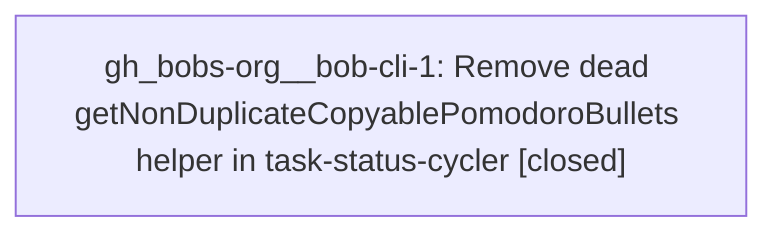

# Bead: gh\_bobs-org\_\_bob-cli-1 — Remove dead getNonDuplicateCopyablePomodoroBullets helper in task-status-cycler

[Bead Pages](../README.md) / gh\_bobs-org\_\_bob-cli-1

**Status:** ✓ closed · **Resolution:** done · **Type:** ◆ task
**Owner:** `bryanbugyi34@gmail.com` · **Assignee:** `gh_bobs-org__bob-cli-1`
**Created:** 2026-07-31 11:00:22 UTC · **Closed:** 2026-07-31 12:08:43 UTC

## Description

While planning the Pomodoro carry-forward grouping change, I found that getNonDuplicateCopyablePomodoroBullets() in the bob-plugins repo (plugins/task-status-cycler/main.js, ~line 1902) is dead code: it has no callers in main.js, is not listed in module.exports.helpers, and is not referenced by scripts/test-task-status-cycler.cjs. Pomodoro carry-forward planning in buildPomodoroCompletionPlan() does its own inline copy construction and never de-duplicates against existing target keys, so the helper (and possibly getPomodoroSubBulletTargetKeys(), which is only used by it) is leftover from an earlier design. Proposal: confirm both are unreachable, then delete them, and run npm test + npm run validate in bob-plugins.

## Notes

[2026-07-31T12:08:43Z · gh_bobs-org__bob-cli-1] Confirmed getNonDuplicateCopyablePomodoroBullets() and getPomodoroSubBulletTargetKeys() had no callers, exports, or repository references; removed both (34 lines). Verified npm test passes 251/251, npm run validate passes 6/6, and git diff --check is clean. Deployed task-status-cycler/main.js with bob plugins sync using the linked repo as the explicit source; the deployed vault file is byte-identical to the source and neither removed symbol remains.

[2026-07-31T12:09:26Z · gh_bobs-org__bob-cli-1] Finalizer verification: bead remains closed; linked bob-plugins diff contains only the intended 34-line removal, with 251/251 tests and 6/6 manifest validations previously passing and the deployed vault file verified byte-identical.

## Lineage

## Agents

| Agent | Bead | Commits |
|---|---|---:|
| [bbugyi200.athena.gh\_bobs-org\_\_bob-cli-1](https://github.com/bobs-org/bob-cli--agents/blob/main/agents/bbugyi200.athena.gh_bobs-org__bob-cli-1/README.md) | [gh\_bobs-org\_\_bob-cli-1](README.md) | 1 |

## Commits

| Repo | Commit | Subject | Bead | Committed (UTC) |
|---|---|---|---|---|
| bob-plugins | [`bob-plugins@504077e`](https://github.com/bobs-org/bob-plugins/commit/504077e66ef6059d0088bd2b57e3dca8e232bdee) | refactor(task-status-cycler): remove unused Pomodoro helpers | [gh\_bobs-org\_\_bob-cli-1](README.md) | 2026-07-31 12:09:40 |
